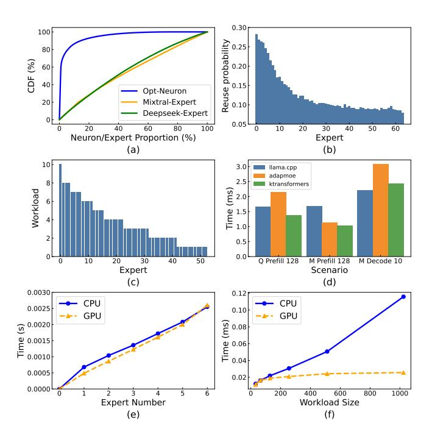
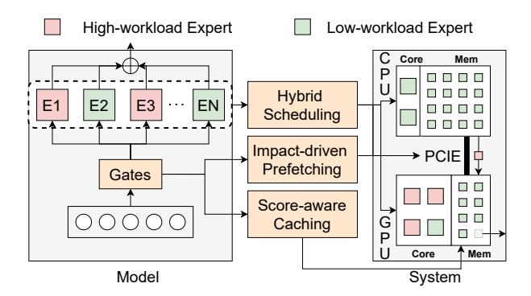
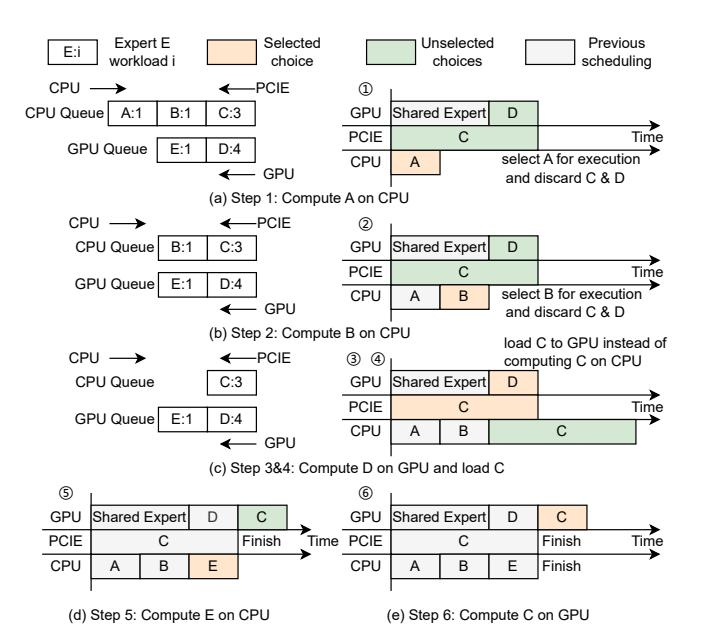
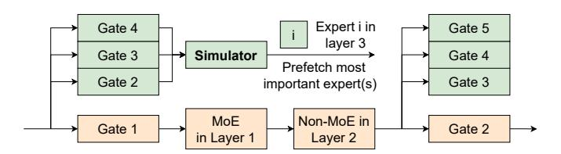

# III. MOTIVATION

The primary bottleneck in existing hybrid CPU-GPU scheduling for MoE inference is the **suboptimal resource utilization**. To address this issue, we begin by analyzing the main challenges of finding an efficient **mapping strategy**.

Challenge 1: High Instability of MoE Activation Patterns. In existing hybrid CPU-GPU scheduling research, both sparse models with highly skewed activations, like PowerInfer, and dense models (or LoRA inference) exhibit relatively stable activation patterns. In these models, activation is either concentrated on a few 'hot' neurons or remains consistent over time, making scheduling and workload balancing easier. In contrast, MoE models have unpredictable activation patterns, with experts being activated in a dynamic and frequently changing manner. As shown in figure 3(a), compared with neuron-level sparsity, the activation frequency of MoE is more evenly distributed, making it challenging to predict the future expert usage. This lack of stability makes it difficult to determine an optimal CPU-GPU scheduling strategy in advance, leading to suboptimal resource utilization and inefficiency.

**Opportunity 1: MoE-specific Cache and Prefetch Optimization.** Despite the instability of MoE activations, certain temporal and structural patterns present opportunities for optimization. The temporal correlation of expert activation provides a basis for cache

Fig. 3. (a) Cumulative activation frequency(CDF) for neurons and experts, (b) Reuse probability of experts by score, suggesting cache optimization opportunities, (c) Expert workload distribution of DeepSeek in a prefill forward, (d) Latency of prefill 128 tokens for Qwen2(Q), Mixtral(M) and decode 10 tokens for Mixtral with three existing methods, (e) CPU vs. GPU time for varying numbers of experts at fixed load, with CPU benefiting from overlapping computations. (f) CPU and GPU time across workload sizes.

optimization: experts with higher activation scores are more likely to be reused in the next iteration as shown in Figure 3(b), suggesting that retaining high-score experts in cache can reduce access latency. Additionally, MoE models often exhibit high activation similarity between adjacent layers, which can be leveraged for prefetching. These MoE-specific optimizations provide a promising approach to reducing the challenges posed by the dynamic nature of expert activation.

Challenge 2: Complexity of MoE Structure and Dynamic Scheduling. Minimizing latency in MoE inference requires maximizing hardware utilization, but existing fixed-mapping methods often lead to load imbalances and underutilized resources. The scheduling complexity is further increased by the diverse structures of MoE models, with variations in shared expert usage, expert size and number, and runtime cache behavior. Additionally, uneven load distribution and variable execution order in the prefill stage make efficient scheduling even more challenging as shown in figure 3(c). Given the need for layer-by-layer adjustments, a static optimal solution is impractical, making real-time scheduling a significant challenge. As illustrated in figure 3(d), the performance of three existing strategies vary in different stages and models.

Opportunity 2: MoE-specific scheduling rules. Despite the NP-Hard nature of the scheduling problem, in the specific context of MoE inference on CPU-GPU systems, several key observations can guide the design of efficient scheduling rules. First, expert transfer times remain relatively constant, simplifying decision-making. Additionally, GPU computation time scales linearly with the number of activated experts, while CPU computation benefits from overlapping memory access and computation due to its larger cache. As

Fig. 4. Overview of HybriMoE.

shown in Figure 3(e), the first expert computation on the CPU is slower, but subsequent tasks are processed faster with better cache utilization. Similarly, Figure 3(f) shows that GPU time remains stable with increasing workload, whereas CPU time grows linearly with workload. Leveraging these patterns, predefined scheduling rules can help achieve efficient workload balancing for MoE models.

#### IV. HYBRIMOE DESIGN

#### A. Overview

This paper introduces HybriMoE, a CPU-GPU hybrid scheduling system tailored for MoE inference on memory-limited devices. HybriMoE addresses the challenges of unbalanced hardware utilization caused by the dynamic activation patterns and structural complexity of MoE models. The system incorporates three key techniques: (i) an efficient hybrid scheduling algorithm that dynamically distributes workloads between GPUs and CPUs, (ii) a score-based expert caching strategy that prioritizes high-demand experts to minimize cache misses, and (iii) an impact-driven prefetching mechanism that predicts and preloads high-demand experts, further enhancing resource utilization and reducing latency.

Figure 4 illustrates the overview of HybriMoE. The system begins with a warmup phase to collect essential performance metrics, such as CPU and GPU processing speeds and data transfer latency. During inference, HybriMoE leverages this information to implement hybrid CPU-GPU scheduling, score-aware caching, and impact-driven prefetching, ensuring efficient task execution and optimized resource usage throughout the inference process.

## B. Hybrid Scheduling Strategy

The scheduling problem in MoE inference is inherently complex due to the dynamic nature of expert activation and the need to balance workloads across heterogeneous resources. To address these challenges, HybriMoE proposes a hybrid scheduling strategy that simplifies the task-to-hardware mapping by introducing three key priority rules:

- GPU Priority: The GPU prioritizes the computation of cached experts, executing higher-load experts first.
- CPU Priority: The CPU prioritizes the computation of uncached experts, focusing on lower-load tasks for efficient execution.
   Additionally, the CPU can process cached experts when the CPU is idle, following a low-to-high load order.
- Transfer Priority: The CPU-GPU transfer mechanism prioritizes the movement of high-load uncached experts from CPU to GPU to minimize computation delays.

These rules constrain the ordering of experts on devices, simplifying the scheduling problem into an allocation problem:

$$\underset{cpu\_expert,gpu\_expert}{\operatorname{arg \, min}} \max(CPU_{TIME}(cpu\_expert),$$

$$GPU_{TIME}(gpu\_expert)) \qquad (2)$$

This formulation does not account for the finish time of data transfers, as expert loading must be completed before GPU computation begins.

Based on these priority rules, HybriMoE divides all activated experts into a GPU queue and a CPU queue. The GPU queue contains cached experts on the GPU, sorted by load in descending order. The CPU queue contains uncached experts on the CPU, sorted by load in ascending order.

Before the actual execution, HybriMoE performs a simulation phase to evaluate scheduling strategies and identify an efficient task allocation plan tailored to the specific workload. This simulation approximates the execution process by iteratively filling the CPU computation, GPU computation, and data transferring timelines, enabling the system to determine a scheduling configuration that minimizes overall latency while balancing resource utilization across heterogeneous hardware.

During each step of the simulation, the system selects the timeline with the earliest completion time and executes the corresponding operation—either a computation task on the CPU or GPU, or a data transfer via PCIE. Task selection adheres to the scheduling priorities: the GPU prioritizes high-load cached experts, the CPU focuses on low-load uncached experts and, when its queue is empty, processes low-load cached experts from the GPU queue, while PCIE prioritizes high-load uncached experts for faster availability on the GPU.

If an expert is transferred from the CPU to the GPU, it is inserted into the GPU queue in descending order of load, ensuring high-load tasks are prioritized for GPU computation. This iterative simulation continues until all experts are computed, effectively modeling the execution process and testing different scheduling strategies.

The scheduling process is illustrated through an example in figure 5. In this scenario, the GPU computation time is assumed to be constant, the CPU computation time is proportional to the expert's load, and the transmission time is fixed at 3 units. The scheduling algorithm in HybriMoE identifies an optimal strategy where the CPU computes the cached expert E while the GPU processes the uncached expert C, effectively improving hardware utilization by balancing workloads across resources.

## C. Impact-driven prefetching

Due to the residual connections in LLMs, hidden states across consecutive layers exhibit a high degree of similarity, making expert prefetching an effective method to optimize resource utilization. While several existing works have adopted prefetching mechanisms, none of them discuss the critical trade-offs involved when multiple subsequent layers' experts can be prefetched. Specifically, these works do not explore how to strategically decide which layer's experts should be prioritized for prefetching to maximize resource efficiency.

Inspired by the scheduling algorithm in IV-B, we propose impact-driven prefetching. Before executing a prefetch, the system performs a simulation to evaluate the potential gains of prefetching specific experts. This simulation estimates the impact of preloading a given expert on overall scheduling efficiency, allowing the algorithm to prioritize experts that yield the highest resource utilization improvements. The greedy nature of this simulation ensures minimal computational overhead, making it practical for real-time inference scenarios.

Fig. 5. An example of hybrid scheduling. The CPU computes the cached expert E while the GPU computes the uncached expert C to achieve better hardware utilization.

Fig. 6. Impact-driven prefetch workflow.

Specifically, HybriMoE predicts expert activations for the next three layers by reusing the gating information from those layers as illustrated in figure 6. This prediction guides the prefetching mechanism, enabling the system to efficiently preload experts likely to be activated in subsequent computations.

