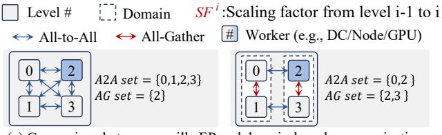
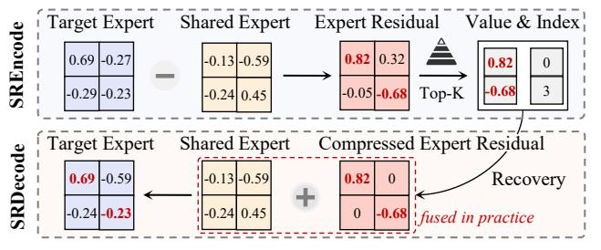
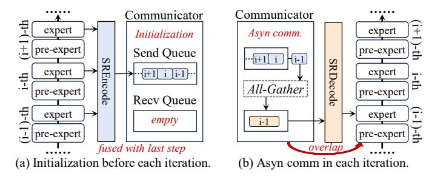
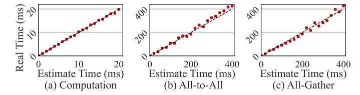
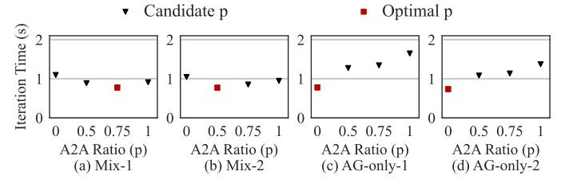

# **Expert Domain and the Domain-Based Communication.**The *Expert Domain* is a set of DCs that only uses AG

The *Expert Domain* is a set of DCs that only uses AG communication within it. The size of expert domain is defined as the number of DCs in it, denoted as  $S_{ED}$ . HybridEP assume that each domain has the same size. Figure 8(a) right side shows an example, we set  $S_{ED}=2$  and sequentially group every 2 DCs into the same domain. With the help of expert domain, we have the following domain-based communication rule: AG will only occur for intra-domain communication, and A2A will only occur for inter-domain communication. Such a simple rule can effectively separate the two communication patterns for better management.

Necessity of Scaling to Multilevel. In actual scenario, the training environment often consists of hierarchical architectures, and the basic communication granularity is GPU. Thus, although how to communicate between DCs is determined, the specific behavior of each GPU is still unclear. Aligning with the GPU granularity is a critical step for real training scenarios. To bridge this gap, HybridEP first abstracts the hierarchical structure into *Multilevel Description*, handling the complex and changeable environments in reality. Then, it renumbers the global GPU number via *Location Renumbering* to adapt to the multilevel. Finally, it performs the *Topology Construction* algorithm to determine the specific topology at GPU level. The workflow is illustrated in Figure 8(b).

**Multilevel Description.** We first define that *Worker* is a physical entity (e.g., DC, node, or GPU). Normally, we consider GPU as the smallest granularity of a worker. *Level* is a set of workers that are connected with homogeneous bandwidth. Thus, we expand the definition of expert domain size at level l as the number of workers in the domain, denoted as  $S_{ED}^l$ . To describe the relationship between different levels,



(a) Comparison between vanilla EP and domain-based communication.


<span id="page-5-2"></span>(b) Mapping multi-level partition to the specific topology via three steps.

Fig. 8. Domain-based communication and the topology construction at multilevel. (a) shows how expert domain affects communication, which splits communications into the in-domain AG and the cross-domain A2A. (b) shows the mapping between topology and multilevel partition through three key steps: Multilevel Description, Location Renumbering and Topology Construction.

we use the scaling factor  $SF^i$  to indicate that a worker at level i-1 can be expanded to level i with  $SF^i$  sub-workers. Note that we set  $SF^0$  to the total number of workers at level 0. Take Figure 8(b) as an example, given an environment with 4 DCs and each with 4 GPUs, it is split into two levels with  $SF^0=4$ ,  $SF^1=4$  and the domain size at each level is  $S^0_{ED}=2$ ,  $S^1_{ED}=4$ , respectively.

**Location Renumbering.** To clarify detailed communication rules, we first renumber the locations for each GPU for multilevel architecture. Specifically, we follow Pytorch [41] to allocate a global index m to each GPU. Then, given a L-1 level partition, we renumber the global index m into multilevel locations  $(x_0, x_1, \cdots, x_{L-1})$ . With the scaling factor list  $[SF^0, \cdots, SF^{L-1}]$ , the renumbering function  $f: m \mapsto (x_0, x_1, \cdots, x_{L-1})$  can be expressed as:

$$x_{i} = \frac{f(m) = (x_{0}, x_{1}, \cdots, x_{L-1})}{\prod_{j=i+1}^{L-1} SF^{j}} \mod SF^{i}, i \in \{0, 1, \cdots, L-2\}$$
$$x_{L-1} = m \mod SF^{L-1}$$
(13)

Therefore, GPU m's level-i worker number can be obtained by f(m)[i]. Moreover, with the expert domain size  $S^i_{ED}$ , GPU m's level-i domain can be obtained by  $\frac{f(m)[i]}{S^i_{ED}}$ .

**Topology Construction.** The related pseudocode is shown in Algorithm 1. Specifically, given two GPUs with global index m and n, we decide which type of communication is required at different levels. We first obtain their multilevel locations by f(m) and f(n). To limit the inefficiency caused by multiple communications, we limit the range of GPUs that can communicate with each other. Specifically, only when  $f(m)[l] \neq f(n)[l]$  and the indices of subsequent layers are the same, two GPUs can communicate with each other. At each level, the communications between GPUs follow the domain-based communication rule.

## **Algorithm 1 Communication Topology Construction**

```
1: Input: GPU m, GPU n, current level l, scaling factor
     S\bar{F}^l, expert domain size S^l_{ED}
 2: Output: Communication type (None or AG or A2A)
 3: Loc_m \leftarrow f(m)
 4: Loc_n \leftarrow f(n)
5: W_m, W_n \leftarrow Loc_m[l], Loc_n[l]

6: ED_m, off_m \leftarrow \frac{W_m}{S_{ED}^l}, W_m \mod S_{ED}^l

7: ED_n, off_n \leftarrow \frac{W_n^m}{S_{ED}^l}, W_n \mod S_{ED}^l

8: if Loc_D[l+1:] == Loc_E[l+1:] then
 9:
        if ED_n == ED_m and off_n \neq off_m then
            return AG
10:
11:
        if ED_D \neq ED_E and off_D == off_E then
12:
            return A2A
13:
        end if
14:
15: end if
16: return None
```


(a) Both two weight matrices of experts has redundancy.



<span id="page-6-2"></span>(b) Two phases of compressing and decompressing experts.

Fig. 9. Redundancy amoung experts and the workflow of SR-Based Expert Compression. In SRDecode, we fuse the recovery and the addition operation in practice for better efficiency.

#### <span id="page-6-0"></span>B. Parameter-Efficient Migration

How Lightweight Migration Optimizes Communication Topology. Essentially, the lightweight migration reduces the size of  $P_E$ , leading to a larger expert domain which achieves better efficiency. Specifically, as shown in Figure 9, a smaller  $P_E$  can lead to a smaller p mainly due to two aspects: 1. When  $2D < GP_E$ , the corresponding p of the optimal point (i.e., the red dot) will decrease. 2. It allows more training configurations to be converted from  $2D < GP_E$  to  $2D \ge GP_E$ . A smaller p indicates a larger domain of experts, which changes the constructed communication topology. Furthermore, the larger domain, the better efficiency can achieve. This is because Eq 11 and Eq 12 show that the overall latency decreases after p decreases theoretically. Thus, we regard parameter-efficient migration as a process of optimizing the communication



<span id="page-6-3"></span>Fig. 10. Tow stage of asynchronous communicator. (a) shows the initialization stage, which is fused with the last optimizer step. Each MoE layer sequentially sends their experts processed by SREncode to Send Queue. (b) shows the asyn comm stage, which is overlapped with pre-expert computation. The communication results of each MoE layer are stored in Recv Queue and processed by SRDecode for subsequent computation.

topology by expanding the domain of experts, which aims to further improve the efficiency.

Redundancy Among Experts In addition to the better compressibility of experts shown in Figure 4, we further explored the redundancy among experts to improve compression ratio. We find that the main differences among experts are concentrated in a small number of parameters. It suggests that different experts may learn similar knowledge from data, which is also reported in other related work [12]. As shown in Figure 9(a), after averaging expert weights and subtracting them from the original weights, the result's distribution (with suffix "res") is more concentrated than the originals. This indicates that the residuals are sparse and the key differences between experts focused on a few parameters.

**SR-Based Expert Compression.** We are motivated to divide experts into shared and residual parts, which learn redundant knowledge and specific knowledge separately. Specifically, the shared expert is shared by all GPUs and is initialized by averaging all experts. At each training iteration, it will be synchronized with asynchronous All-Reduce in the backward propagation phase. Our expert compression has two phases, as shown in Figure 9(b). In the *encode phase*, the compressor first obtains the expert residual by subtracting the target expert and the shared expert. Then, it compresses expert residual through Top-k. The compressed expert residual is saved in the valueindex format to transmit to other GPUs. In the decode phase, the compressor first recovers the compressed expert residual. Then, it restores the target expert by adding up the shared expert and the residual expert. Note that in practice, we fused the above two steps of decode phase for less overhead.

The Mechanism of Asynchronous Communicator. We use an asynchronous communicator to achieve the theoretical effect of our modeling as much as possible. To fully combine the asynchronous characteristics with SR compression without too much extra overhead, we divide the behavior of the asynchronous communicator into two stages like SR compression. As illustrated in Figure 10, the communicator considers the model as a stack of (pre-expert, expert) pair, and has a Send Queue and a Recv Queue. In *Initialization* stage, all experts in the model are sequentially processed by SREncode, and the compressed results will be delivered to the Send Queue. The

TABLE II CONFIGURATIONS OF MODELS.

<span id="page-7-1"></span>

| Model         | Dataset             | E  | Н    | $P_{E}$ | #Layers |
|---------------|---------------------|----|------|---------|---------|
| Llama-Tiny    | PennTreebank [2]    | 32 | 512  | 2.1M    | 12      |
| Mistral-Small | WikiText2 [37]      | 32 | 768  | 4.7M    | 12      |
| GPT-Medium    | OpenWebText-10k [1] | 32 | 1024 | 8.4M    | 12      |
| GPT-Large     | WikiText103 [37]    | 32 | 1024 | 8.4M    | 16      |

Recv Queue is set to be empty. Note that this process happens before each iteration begins, we fuse the SREncode with the update process (optimizer step) of the last iteration for less overhead. In *Asyn-comm* stage, the Send Queue sequentially pop expert residuals for AG communication. The Recv Queue receives the corresponding results and send to SRDecode for the subsequent expert computation. Note that this communication process is parallel to the pre-expert computation process of the model so we can overlap them. Moreover, we fused the SRDecode with expert computation for better efficiency.

#### V. EVALUATION

Our experiments aim to answer the following questions:

- Is our stream-based modeling accurately estimating computation, communication, and determining the best proportion with minimal latency? (§V-B)
- What is the end-to-end speedup of HybridEP with different data/expert size? (§V-C)
- How much does the domain-based partition and parameterefficient migration contribute to the final effect? (§V-D)
- Does efficient parameter migration affect training accuracy and what's the impact of its compression/decompression process on computation? (§V-E)
- Does HybridEP has better communication traffic and frequency characteristics compared with EP? (§V-F)
- As a more general framework, does HybridEP have better scalability than EP on larger scale? (§V-G)

## A. Experiment Setup

Testbed. We conduct experiments on three clusters consisting of different number of DCs. Due to the limitations of the actual environment, we regard a single node as a DC, which is internally connected by PCIe3.0 x16 (128 Gbps), and DCs are connected by a low bandwidth of Ethernet (10 Gbps). Specifically, we have ① Cluster-S: a cluster with 8 × NVIDIA A800 GPUs in a single DC. 2 Cluster-M: a cluster with 16 × NVIDIA A800 GPUs on 2 DCs. 3 Cluster-L: a cluster with  $32 \times NVIDIA A800$  GPUs on 4 DCs. Note that we use Cluster-S to verify the effectiveness of our modeling without considering hierarchical architecture, while using Cluster-M and Cluster-L to verify the effectiveness of HybridEP in real-world training tasks. Moreover, HybridEP is built based on Tutel [22] and Pytorch v.1.12.1, and the experiment environment is under Ubuntu-18.04, CUDA-11.3, cuDNN-7.6, and NCCL-2.10.

TABLE III CONFIGURATIONS OF MOE LAYERS.

<span id="page-7-2"></span>

| Parameter | Candidate Values                    |
|-----------|-------------------------------------|
| K         | $\{1, 2, 4\}$                       |
| B         | $\{8, 16, 32\}$                     |
| L         | {128, 256, 512}                     |
| H         | {512, 768, 1024}                    |
| M         | {768, 1024, 1536, 2048, 3072, 4096} |



<span id="page-7-3"></span>Fig. 11. Latency Verification of Comp. and Comm. Since the estimate computation, A2A, AG latency (red markers) are close to the real latency (black line), our stream-based modeling can effectively model system latency.

Configurations of Models, Datasets, and Compared Methods. We summarize tested models and datasets in Table II. Specifically, ① We use Llama-Tiny [19] for PennTreebank [2] dataset, which is one of the most known and used corpus for the evaluation of models for sequence labeling. 2 We use Mistral-Small [26] for wikitext2 [37] dataset, which is a collection of over 100 million tokens extracted from the set of verified Good and Featured articles on Wikipedia; 3 We use GPT-Medium [6] for OpenWebText-10k, which is an open-source replication of the WebText dataset from OpenAI [1]; 4 We use GPT-Large [6] for WikiText103 [37], which is similar to wikitext2 but much larger. Note that we only built a smaller version for training based on the above model structure, not the original one. We compare HybridEP with Tutel [22], FasterMoE [20] and SmartMoE [58]. These MoE-specific optimized systems focus on dimensions of data transmission, expert transmission, and pipeline, which are commonly used in HPC environment. Note that we do not compare to some training systems [42], [48] because they also make some other optimizations besides MoE, which is also adopted by many works [20], [38], [47], [57], [58].

Extra Configurations. We use Adam optimizer for all experiments with a learning rate of 1e-4 and Pytorch DDP for backward propagation, which can efficiently synchronize gradients of model parameters using ll-Reduce. Note that we do not use Zero Optimizer [43] for the non-MoE part and also the pipeline parallelism due to the potential network bandwidth conflicts, which may affect our model's accuracy. Moreover, all configurations will be adjusted within Table III to meet different experiment requirements. Specifically, K is the number of activated experts, B is the batch size, L is the sequence length, and H, M are experts' two dimensions.

#### <span id="page-7-0"></span>B. Modeling Verification

To verify modeling effectiveness, ① we first verify whether it can accurately estimate the computation and communication latency, ② we then verify whether it can find the optimal proportion of A2A and AG (p in Figure 6).

TABLE IV CONFIGURATIONS OF MODELING VERIFICATION.

<span id="page-8-3"></span>

| Case      | $\boldsymbol{p}$ | G | В        | $Lat_{comp}^{PE}$ | D    | $P_E$    |
|-----------|------------------|---|----------|-------------------|------|----------|
| Mix-1     | 0.75             | 8 | 128 Gbps | 0.049 ms          | 8 MB | 4.7 MB   |
| Mix-2     | 0.5              | 8 | 128 Gbps | 0.049 ms          | 8 MB | 2.35 MB  |
| AG-only-1 | 0                | 8 | 128 Gbps | 0.099 ms          | 3 MB | 0.094 MB |
| AG-only-2 | 0                | 8 | 128 Gbps | 0.099 ms          | 3 MB | 0.047 MB |



<span id="page-8-4"></span>Fig. 12. **Modeling Verification.** Results suggest that our modeling can find the optimal p (red marker) with the least iteration time among candidate configurations (black marker).

Verification of Estimated Computation and Communication Latency. We adjust the sizes of the data traffic and expert size to test the accuracy of our model, as shown in Figure 11. Results suggest that the estimated latency is close to the real latency. However, they are fluctuating because our experiment platform is shared by multiple users with unstable network bandwidth. Nevertheless, such small fluctuations do not affect the effectiveness of our model.

**Verification of the Optimal** p**.** We then adjust the training configurations to verify whether our modeling can find the optimal proportion p of A2A and AG in different cases, as shown in Table IV. Note that one node has 8 GPUs in our configuration. Therefore, the candidates p are 0, 0.5, 0.75, 1, which indicates that the expert domain size is 8, 4, 2, 1, respectively. The results are shown in Figure 12, where the optimal p has the lowest average iteration latency among 4 candidate p, demonstrating the effectiveness of our model. Specifically, Mix-1 and Mix-2 represent Case 2.1 in Figure 6 (i.e.,  $2D - GP_E < 0$ ), therefore HybridEP communicates through both A2A and AG, and our modeling finds the optimal proportion of A2A data (i.e., p = 0.5, 0.25). Moreover, AGonly-1 and AG-only-2 represent Case 2.2 in Figure 6 (i.e.,  $2D - GP_E \ge 0$ ), therefore HybridEP should communicate only through AG (i.e., p = 0) for the lowest iteration latency.

