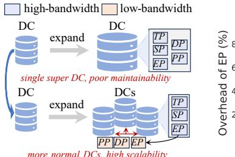
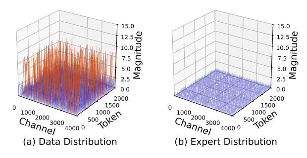

# II. BACKGROUND AND MOTIVATION

A. Parallelisms, MoE and its Communication Bottleneck

**Common Parallelisms.** There are five common parallelisms during distributed training, each with different properties:

(a) Trend of more DCs, larger EP. (b) The overhead ration of EP.

Fig. 2. Analysis of parallelisms under common settings and the scalability of EP. (a) shows the trends of more DCs and larger EP, which requires more interconnections between DCs and scaling EP across DCs (b) shows the overhead ratio of EP under different bandwidths. This trend reveals a heavy overhead caused by EP when scaling under low bandwidth.

Tensor Parallelism (TP): Splits weights of each layer across multiple GPUs, requiring extensive communication and large traffic during both forward and backward passes.

Sequence Parallelism (SP): Splits sequence across multiple GPUs [23], [34], which is typically applied at the end of pretraining for larger context window [19].

Pipeline Parallelism (PP): Divides the model layers into multiple stages, with each stage assigned to a different GPU. It uses point-to-point communication between stages to send/receive of activations and gradients.

Data Parallelism (DP): Replicates the full model on each GPU, where distinct batches are processed independently and gradients are synchronized across replicas during backward.

**Expert Parallelism (EP)**: Distributes the experts in the MoE model across multiple GPUs. Specifically, the expert is expanded from the FFN – a basic module of Transformer structure [51], as shown in Figure 1. On this basis, MoE model further uses a gate network as the router, then uses two *All-to-All* (A2A) communications to change data to the part of activated experts for computation. However, <u>large traffic and high frequency of EP makes it almost only deployed in HPC environments currently.</u>

Necessity of Scaling EP across DCs. Firstly, considering the infrastructure, LLMs are pushing existing DCs to their limits. However, scaling up a single DC faces challenges like power limitations and increased vulnerability to outages [3]–[5]. Thus, recent reports suggest a more practical and resilient solution is to deploy multiple, smaller-scale DCs [8]. Secondly, considering the model, with the widespread application of MoE, some recent representative MoE models [12], [13], [17], [26], [39], [55] have shown a rapidly unfolding trend of expanding number of experts to hundreds or even thousands, exceeding the capacity of a single DC. Thus, combining the challenges of capacity expansion and the capacity limitations of a single DC, EP will inevitably expand to multiple DCs, as shown in Figure 2(a).

**EP's Communication Bottleneck.** As illustrated in Figure 2(b), EP causes extremely serious bottlenecks at relatively low bandwidths. Existing studies have also shown that under constrained bandwidth, EP almost occupies 50%-90% of the overall iteration time [20], [38], [47], becoming the main

Fig. 3. An example of how the spatial placement of data and experts affect EP's efficiency. (a) shows the original placement of EP, where 7 low-bandwidth communications exist with slowest training speed. (b) shows the ideal case without any low-bandwidth communication through reshaping placements of data, which achieves the best efficiency. (c) shows a possible optimization in practice with only 4 low-bandwidth communications, achieved only by reshaping the placement of experts. This achieves a good compromise between ideal case and original EP.

bottleneck in improving training efficiency. Unlike bandwidth-friendly parallelisms such as DP and PP, the communication-heavy design makes EP particularly sensitive to network conditions. It relies on the data-to-expert routing pattern (i.e., sending each data to correspond experts via A2A), requiring frequent communication for synchronization across devices and the traffic expands proportionally to the number of activated experts. Therefore, EP is not designed to scale across DCs and there is an urgent need for efficient EP scaling.

#### B. Motivation and Challenges

In Figure 3, we use a simple example to show how the placement of data and experts affects EP's communication overheads and motivates HybridEP.

Case of Original EP. In Figure 3(a), the basic logic of original EP operates like sending data to the corresponding experts decided by the routing result. When experts are placed across different nodes connected by low bandwidth, this introduces multiple slow communications (e.g., 7 in our example), which becomes the main bottleneck and degrades EP's efficiency.

Case of Ideal Fully-Eliminated EP. Ideally, if we know in advance which expert the data will be routed to, we can rearrange before training and place data sent to the same expert together with high-bandwidth interconnections, avoiding the huge low-bandwidth communication latency, as shown in Figure 3(b). This essentially moves EP to the beginning of training, reducing its frequency and traffic and achieving the fastest speed. However, the problem is that the data routing results are dynamic and determined in real time, so it is almost impossible to know the routing results in advance and re-arrange the data before training. Meanwhile, since data-to-expert assignments vary across layers, it is unrealistic to assume the perfect placement before training. Thus, it is almost impossible to achieve this.

Case of Possible Patially-Eliminated EP. Considering that the basic logic of EP is to assign data with corresponding experts, we can optimize EP efficiency by changing the spatial placement of experts, as shown in the Figure 3(c). After experts process their data, we re-arange the placement of experts and then continue the computation. Although it can not achieve

Fig. 4. Compressibility analysis of data and experts. The distribution of data has large magnitude and many outliers (red part), while the distribution of expert weight is relative small and flat, leading to a higher compressibility.

the ideal case, it still reduces the number of low-bandwidth communications (e.g., 5 in our example) for better efficiency. Note that we distinguish the transmission of data and expert, because we find that the expert has two rather good advantages for lightweight transmission compared to data, which has not been fully exploited by previous works to optimize the efficiency of EP. Specifically, ① Better compressibility. Expert weights typically exhibit compact and concentrated distributions, with fewer outliers compared to data, as shown in Figure 4, which is also confirmed by prior works [21], [33], [36], [54]. This allows experts to be compressed more aggressively without degrading accuracy to reduce traffic. 2 Asynchronous communication potential. Unlike data that are tightly coupled with every computational operator, experts only participate in computation intermittently. This allows to pre-transmit experts independently ahead of EP, reducing synchronization overhead. Together, these points underscore that experts are inherently suited for lightweight, early, and stable communication. This forms the foundation for HybridEP.

Why this works? The key reason is that experts are *sparsely activated*, which is also the biggest difference between EP and the remaining parallelisms. Only in EP, data are processed by a small number of experts (part of model parameters), while in other parallel modes, all data need to be processed by all model parameters. Analogously to Figure 3(c), if EP does not have the property of sparse activation, that is assuming each data needs to be calculated with all experts, then no matter how the expert placement is changed, the number of low-bandwidth EP communications will not change. Therefore, only parallelisms with sparse activation properties like EP can improve efficiency through changing expert placement.

**Challenges.** The above analysis provides a vision of efficient EP scaling, introducing a hybrid transmission of both experts and data. However, in a real training scenario, it is still non-trivial to maximize its potential, which can be summarized into three main challenges:

- ① How to determine the best proportion of dataexpert hybrid communication patterns? Essentially, experts communicate in All-Gather (AG) pattern, as each device collects experts from others (details in §III). We need to balance this with the A2A pattern for data.
- 2 How to construct the specific communication topology

TABLE I FREQUENTLY USED NOTATIONS IN MODELING.

| Name           | Description                                            |
|----------------|--------------------------------------------------------|
| $\overline{D}$ | Data size of a GPU.                                    |
| $P_E$          | Expert size with # parameters.                         |
| C              | Computation throughput of a GPU.                       |
| B              | Communication bandwidth between GPUs.                  |
| $V^x$          | Communication volume of $x$ . $x$ is either A2A or AG. |
| $Lat_x^y$      | y's latency of operation $x$ (either comp. or comm.).  |
| G              | Number of GPUs in the cluster.                         |
| $G^x$          | GPU set $x$ . $x$ is either A2A or AG.                 |
| $ G^x $        | Number of GPUs in GPU set $G^x$ .                      |

and ensure compatibility with existing architecture? Even if the proportion of two communications is determined, the most basic communication granularity is GPU, not DC. Thus a specific topology needs to be built to align the communication granularity.

• 3 How to effectively exploit high compressibility and asynchronicity for lightweight expert migration? Although expert transmission can be lightweight, we still need to design corresponding compression and communication mechanisms to achieve theoretical efficiency.

To this end, we propose HybridEP to address the above challenges. First, we design a stream-based modeling to address the first challenge and provide a high-level guidance for the overall design. Following this, we introduce two techniques to unlock its potential. We address the second challenge by determining the hybrid communication topology and compatibility with existing hierarchical architecture through the division of expert domains. Then we address the third challenge by designing an expert compression algorithm and an asynchronous communicator for lightweight expert migration.

#### III. FOUNDATION: STREAM-BASED MODELING

The modeling process is shown in Figure 5(a). We first split MoE training into computation and communication streams (§III-A, §III-B). Then, we model the overlap between two streams (§III-C) and jointly consider computation, communication, and overlap to minimize training latency (§III-D, §III-E). We summarize frequently used notations in Table I. Our modeling assumes that each GPU has the same expert number, each expert has the same size, and the gate network activates experts evenly. For simplicity, we first assume that there is only one GPU in each DC (using GPU to represent the DC) to align the communication granularity, which does not affect the accuracy of our model.

