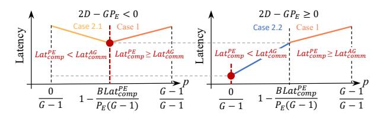

# D. Problem Formulation

To minimize the latency, we have the following definition:

**Definition 1.** Given a cluster with G GPUs (G > 1),  $p_i$  is the proportion of data chunks (which leave from  $G_i$ ) that are transmitted through A2A, while  $1-p_i$  is the proportion of data chunks (which leave from  $G_i$ ) that are transformed into expert and transmitted through AG, where  $p_i \in \{\frac{0}{G-1}, \dots, \frac{G-1}{G-1}\}$ .

and transmitted through AG, where  $p_i \in \{\frac{0}{G-1}, \cdots, \frac{G-1}{G-1}\}$ . When  $p_i = \frac{G-1}{G-1}$ , there is only A2A; when  $p_i = \frac{0}{G-1}$ , there is only AG. The training latency can be expressed as:

$$\min_{p_i} \quad Lat_{final}(p_i) = Lat_{comp} + Lat_{comm} - Lat_{ovlp} \quad (8)$$
s.t. 
$$p_i \in \{\frac{0}{G-1}, \cdots, \frac{G-1}{G-1}\}, Eq \ 2, Eq \ 5, Eq \ 7.$$

Fig. 6. **Visualization of Eq 10's solution.** Two red dots indicate the optimal p with minimal latency under two cases.

Note that each GPU has its own Eq 8, and they should be synchronized. Therefore, system latency is the maximal latency of all GPUs, which can be expressed as:

$$Lat_{all} = \max_{0 \le i \le G} \{ \min Lat_{final}(p_i) \}$$
 (9)

Finally, Eq 9 depends solely on parameter  $p_i$ , and our goal is to minimize  $Lat_{all}$  by choosing the optimal  $p_i$ .

## E. Problem Solution

For simplicity, we assume that all the  $p_i$  are the same. Thus, Eq 9 can be simplified to an easy-to-solve format:

$$Lat_{all} = \min Lat_{final}(p)$$

$$= \begin{cases} \min(Lat_{comp}^{PE} + 2Lat_{comm}^{A2A}), \text{ if } Lat_{comp}^{PE} \ge Lat_{comm}^{AG} \\ \min(Lat_{comm}^{AG} + 2Lat_{comm}^{A2A}), \text{ if } Lat_{comp}^{PE} < Lat_{comm}^{AG}. \end{cases}$$

$$(10)$$

The final solution can be organized into two cases. Case 1:when  $Lat_{comp}^{PE} \geq Lat_{comm}^{AG}$ , Eq 10 is simplified as:

$$\begin{cases} Lat_{all} = Lat_{comp}^{PE} + \frac{2D(G-1)}{GB}p \\ \frac{G-1}{G-1} \geq p \geq \frac{P_E(G-1) - BLat_{comp}^{PE}}{P_E(G-1)} \end{cases}$$
(11)

Note that  $Lat_{comp}^{PE}, D, B$  are positive constants. Thus, to minimize  $Lat_{final}$ , we need to configure the minimum p. Case 2:when  $Lat_{comp}^{PE} < Lat_{comm}^{AG}$ , Eq 10 is simplified as

$$\begin{cases}
Lat_{all} &= p \frac{(G-1)(2D - GP_E)}{BG} + \frac{(G-1)P_E}{B} \\
\frac{0}{G-1} &\leq p < \frac{P_E(G-1) - BLat_{comp}^{P_E}}{P_E(G-1)}
\end{cases}$$
(12)

Note that the sign of  $\frac{(G-1)(2D-GP_E)}{BG}$  has two cases for minimal  $Lat_{final}$ . ① When  $2D-GP_E<0$ , we configure the maximum p, denoted Case 2.1. ② When  $2D-GP_E\geq0$ , we configure the minimum p, denoted Case 2.2.

**Summary.** Our model find the best proportion for minimal latency (i.e., p), which can be summarized into two cases, as shown in Figure 6. Specifically, when  $2D-GP_E<0$ , the variation of overall latency consists of Case 1 and Case 2.1. Therefore, the optimal p is configured to  $1-\frac{BLat_{comp}^{PE}}{P_E(G-1)}$ , where we use both AG and A2A. When  $2D-GP_E\geq0$ , the variation of overall latency consists of Case 1 and Case 2.2. Therefore, the optimal p is configured to 0, where we only use AG. Note that when p=1, HybridEP degenerates into the standard EP, indicating that EP is a special case of our framework.

Fig. 7. **HybridEP overview.** After modeling decides the proportion of transmitting data and expert, HybridEP uses the domain-based partition to construct specific GPU communication topology. Moreover, the parameter-efficient migration reduces the overhead for a better partition.

#### IV. DESIGN AND IMPLEMENTATION

The overview of HybridEP is shown in Figure 7. Before training, HybridEP first takes the environmental configurations as input and uses the modeling to find the best proportion of transmitting data and experts. Oriented by this, HybridEP then introduces *domain-based partition* to partition GPUs for A2A and AG communication (§IV-A), which constructs the communication topology at GPU level. Moreover, HybridEP designs parameter-efficient migration to optimize the determined communication topology with a better partition (§IV-B).

## A. Domain-Based Partition

