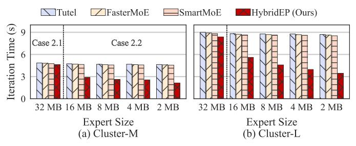

# C. End-to-end Speedup

We test HybridEP in Cluster-M and Cluster-L with different MoE configurations (Table III) in two scenarios. Specifically, ① different data traffic ranging from 6 MB to 192 MB; ② different expert size ranging from 32 MB to 2 MB.

**Different Data Traffic.** We change data traffic from 6 to 192 MB and fix expert size to 0.36 MB. The results are shown in Table V, where HybridEP achieves an average speedup of up to  $5.60 \times$ . Specifically, with larger data traffic, lower bandwidth, and more connected DCs, The communication bottleneck of EP becomes more and more obvious. However, HybridEP finds the appropriate proportion of A2A and AG (p in Figure 6), thus achieving significant speedup.

Fig. 13. Average Iteration Time under Different Expert Sizes. Results suggest that as the expert size decreases, the computation cost decreases, HybridEP's iteration latency decreases. However, iteration latency of compared methods is nearly unchanged, despite the decreased computation overhead (i.e.,  $\frac{1}{16}$ , expert size decreases from 32 MB to 2 MB).

**Different Expert Size.** We change expert size from 32 MB to 2 MB and fix the data traffic to 16 MB. Therefore, computation cost decreases as expert sizes decrease, and we do not use the SR expert compression for better observation. The results are shown in Figure 13, where HybridEP achieves a speedup ranging from  $1.18 \times$  to  $2.57 \times$ . Specifically, as the expert size decreases, HybridEP can transmit more experts with small traffic, thus enlarging the expert domain size and reducing EP's overhead. Thus, the acceleration effect of case 2.1 is not as significant as that of case 2.2. However, Case 2.1 can be transformed into Case 2.2 for higher speed with SR compression to change the condition to  $2D - GP_E \ge 0$ .

## D. Ablation Study

In this section, we evaluate how domain-based partition (baseline) and parameter-efficient migration contributes to the overall speedup with different data traffic and expert size.

Configurations and Results Analysis. In Table VI, Data&Expert represent the size of data and expert. The remaining two items correspond to the two designs of HybridEP (+Migration equals to HybridEP). For 24&8MB configuration, our modeling suggests that Cluster-S has p = 0.5 (i.e.,  $S_{ED}^0 = 4$ ), while Cluster-M and Cluster-L has two levels, denote as  $S_{ED}^0=2, S_{ED}^1=2$  and  $S_{ED}^0=4, S_{ED}^1=1.$  For 48&2MB configuration, p is 0 for all clusters. + Migration adds parameter-efficient migration (i.e., HybridEP). Table VI suggests that +Migration (i.e., HybridEP) achieves a speedup of  $1.25 \times$  to  $2.82 \times$ , compared to the baseline *Partition*. Larger data traffic and smaller expert size contribute to faster training speed. Note that the  $S_{ED}$  in our experiments includes all DCs, so the more DCs that are interconnected, the more significant the speedup. However, this may not be always true in practice, more details in §V-G.

