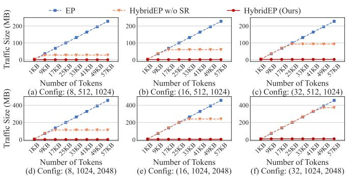
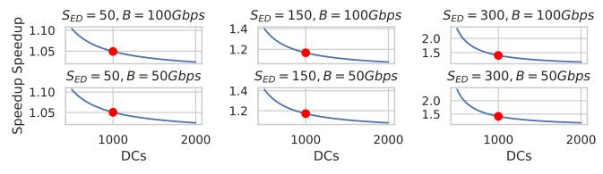

# E. Analysis on Migration

In this section, we first evaluate whether the SR expert compressor affects accuracy. Then we conduct the time breakdown experiments to demonstrate how the two phases of SR compression fused with other operations for less overhead. Our configurations are shown in Table II.

Configurations of SR-Based Expert Compression. HybridEP has a hyperparameter (compression ratio, CR) to control SR-based expert compression considering model accuracy

TABLE V AVERAGE ITERATION TIME (IN SECONDS) AND AVERAGE SPEEDUP  $(\times)$  UNDER DIFFERENT DATA TRAFFIC SIZES.

| Data            | Cluster-M |        |        |        |         |         |        | Cluster-L |         |         |         |         |
|-----------------|-----------|--------|--------|--------|---------|---------|--------|-----------|---------|---------|---------|---------|
| Method          | 6 MB      | 12 MB  | 24 MB  | 48 MB  | 96 MB   | 192 MB  | 6 MB   | 12 MB     | 24 MB   | 48 MB   | 96 MB   | 192 MB  |
| Tutel           | 2.52 s    | 4.26 s | 5.82 s | 7.62 s | 12.65 s | 20.35 s | 3.74 s | 7.30 s    | 10.69 s | 13.54 s | 18.59 s | 28.46 s |
| FasterMoE       | 2.58 s    | 4.37 s | 5.90 s | 7.81 s | 12.80 s | 20.82 s | 3.86 s | 7.50 s    | 11.09 s | 13.88 s | 19.32 s | 29.43 s |
| SmartMoE        | 2.59 s    | 4.34 s | 5.97 s | 7.80 s | 12.68 s | 20.91 s | 3.82 s | 7.46 s    | 10.94 s | 14.08 s | 19.25 s | 29.53 s |
| HybridEP (Ours) | 2.48 s    | 2.63 s | 2.74 s | 2.82 s | 3.01 s  | 3.78 s  | 3.49 s | 3.53 s    | 3.54 s  | 3.85 s  | 4.24 s  | 5.20 s  |
| Avg. Speedup    | 1.03×     | 1.64×  | 2.15×  | 2.75×  | 4.22×   | 5.47×   | 1.09×  | 2.10×     | 3.08×   | 3.59×   | 4.49×   | 5.60×   |

#### TABLE VI ABLATION STUDY.

| Cluster   | Data&Expert | Partition | + Migration |
|-----------|-------------|-----------|-------------|
| Cluster-S | 24&8 MB     | 0.76 s    | 0.61 s      |
| Cluster-M | 24&8 MB     | 3.41 s    | 2.54 s      |
| Cluster-L | 24&8 MB     | 6.12 s    | 3.48 s      |
| Cluster-S | 48&2 MB     | 1.06 s    | 0.74 s      |
| Cluster-M | 48&2 MB     | 6.21 s    | 2.81 s      |
| Cluster-L | 48&2 MB     | 10.89 s   | 3.86 s      |

Fig. 14. Loss Analysis. HybridEP's expert compression ratio is  $50 \times$ . Moreover, w/o S indicates that HybridEP directly compress experts, while w/S indicates that HybridEP compress experts with shared expert (§IV-B).

and compressibility. We use *HybridEP w/ S* to represent the compression with shared expert, and use *HybridEP w/o S* to represent the naive method that directly compresses the expert through Top-k. Our goal is to find the maximum CR without affecting model performance.

**Results of Accuracy Analysis.** Figure 14 suggests that the loss value of  $HybridEP \ w/S$  is close to that of the compared methods (i.e., Tutel, FasterMoE, and SmartMoE). Therefore, our proposed SR-based compression algorithm can retain both a high compression ratio (i.e.,  $50 \times$ , we do not display other results due to the page limit) and high accuracy. In contrast,  $HybridEP \ w/o \ S$ 's loss value is quite higher than compared methods, which indicates that the shared expert in our design plays an important role in accuracy maintenance.

**Time Breakdown Analysis.** As shown in Figure 15, as the expert size increases, the time overhead of both SREncode and SRDecode increases. When integrated with other computations, the overheads can be further reduced by up to 30% and 45%, respectively. Although they are not completely eliminated, it is not significant compared to the communication and remains within acceptable limits. However, designing more efficient expert compression is still worth exploring.

Fig. 15. Time breakdown of Parameter-Efficient Migration's Tow Phases. Under different expert sizes, (a) shows the effect of SREncode fused with the parameter update of last iteration, which can reduce overhead by 30%. (b) shows the effect of SRDecode fused with multiple expert computations, which can reduce overhead by 45%.

Fig. 16. **Traffic Scalability Analysis**. HybridEP has less communication traffic under constrained bandwidth, leading to a better scalability. The configuration is a triplet, representing the size of EP and the tow dimensions of expert weights (H & M).

#### F. EP vs. HybridEP: Characteristic Comparison

In this section, we show the comparison between HybridEP and EP in terms of communication traffic and frequency under different configurations.

Traffic Analysis. As shown in Figure 16, the traffic of original EP grows linearly with the number of tokens during each training iteration. In contrast, HybridEP introduces a more fixed and input-independent traffic with limited upper bound. When the number of tokens is small, HybridEP's traffic is almost the same as EP's. However, when the number of tokens increases significantly, EP becomes a huge communication bottleneck, while HybridEP guarantees a fixed traffic via only transmitting experts. This makes HybridEP more predictable and stable, which is especially advantageous in low-bandwidth or burst-sensitive environments.

**Frequency Analysis.** We use the sum of all GPU-to-GPU communications as frequency. The comparison is shown in Table VII. Note that  $S_{ED}=1$  represents the original EP. As the expert domain expands, the A2A communication frequency

TABLE VII
COMMUNICATION FREQUENCY WITH DIFFERENT EP SIZE.

| EP   | Comm. | Expert Domain Size $(S_{ED})$ |     |     |     |     |     |  |
|------|-------|-------------------------------|-----|-----|-----|-----|-----|--|
| Size | Type  | 1 (EP)                        | 2   | 4   | 8   | 16  | 32  |  |
| 8    | A2A   | 56                            | 24  | 8   | 0   | -   | -   |  |
| ٥    | AG    | 0                             | 8   | 24  | 56  | -   | -   |  |
| 16   | A2A   | 240                           | 112 | 48  | 16  | 0   | -   |  |
| 10   | AG    | 0                             | 16  | 48  | 112 | 240 | -   |  |
| 32   | A2A   | 992                           | 480 | 224 | 96  | 32  | 0   |  |
| 32   | AG    | 0                             | 32  | 96  | 224 | 480 | 992 |  |

(a) Fixed  $S_{ED}$  and dynamic p.

(b) Fixed p and dynamic  $S_{ED}$ .

Fig. 17. Speedup of HybridEP on Large Scale Simulation.

decreases quadratically, while the AG frequency increases accordingly. This can be seen as a gradual shift of A2A communication to AG. However, due to the more asynchronous nature of AG and its ability to significantly reduce traffic via compression, HybridEP achieves higher efficiency.

