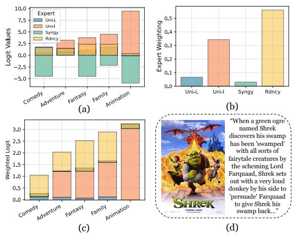
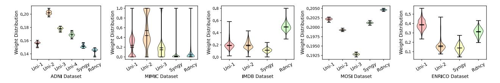

# 3. Interpretable Multimodal Interaction-aware Mixture-of-Experts

### 3.1. Preliminary and Notation

Problem Setup. Let M = {m1, m2, . . . , mn} denote a set of n input data modalities, and let y represent the target variable for a given task. For classification tasks, y is expressed as a one-hot encoded vector corresponding to the class label. For regression tasks, y is a real-valued scalar. The objective is twofold: (1) to improve the performance of predicting the ground truth target y by effectively modeling the interactions between modalities in M, and (2) to provide meaningful interpretations of these multimodal interactions.

Vanilla multimodal fusion (Figure [2\(](#page-3-0)a)) utilizes modalityspecific encoders E = {E1,E2, . . . , En} to process M and obtain latent embeddings L = {e1, e2, . . . , en}, where each embedding is computed as e<sup>i</sup> = Ei(mi) for i ∈ {1, . . . , n}. We define the fusion method as F, which operates on the set of latent embeddings L and produces a fused embedding x, expressed as: F(L) = x. A prediction head H maps the fused embedding to the final prediction, expressed as: H(x) = ˆy. However, this naive modality fusion approach does not explicitly account for the heterogeneous interactions present between M.

#### 3.2. Algorithm Overview of **I** <sup>2</sup>**MoE** Framework

I <sup>2</sup>MoE is a mixture of interaction experts, where each expert specializes in modeling a specific type of multimodal interaction. The predictions from individual interaction experts are weighted by a re-weighting model to produce the final prediction. During the training phase, we first perform a forward pass using the intact input of all modalities to estimate the multimodal prediction. Next, additional forward passes are conducted, where one modality is replaced by a random vector in each pass. These perturbed inputs serve as weak supervision signals to help train the interaction experts to specialize in different types of modality interactions. We designed a dual-objective loss, encouraging the interaction experts to specialize effectively without degrading task performance. The task loss is calculated using the re-weighted output from the interaction experts with the complete modality input, while the interaction loss is computed from the outputs generated with the perturbed

modality inputs. During inference, a single forward pass is performed using the complete modality input. The final output is a weighted sum of the interaction expert prediction with the weights produced by the re-weighting model (Equation [1\)](#page-2-0). We provide a detailed explanation of I <sup>2</sup>MoE with two input modalities in Section [3.3,](#page-2-1) describe its extension to a higher number of modalities in Section [3.4,](#page-3-1) and explain how to obtain multimodal interaction interpretation in Section [3.5.](#page-4-0)

#### <span id="page-2-1"></span>3.3. **I** <sup>2</sup>**MoE** with Two Input Modalities

#### 3.3.1. I <sup>2</sup>MOE ARCHITECTURE

Figure [2\(](#page-3-0)b) illustrates the I <sup>2</sup>MoE architecture for modeling different types of modality interactions in two input modalities. We employ a MoE comprising four fusion models, referred to as *interaction experts*: Funi1, Funi2, Fsyn, and Fred. Each interaction expert specializes in capturing a specific type of interaction: Funi1 models the unique information contained in modality m1; Funi2 models the unique information contained in modality m2; Fsyn captures the synergistic information between m<sup>1</sup> and m2; and Fred models the redundant information between m<sup>1</sup> and m2.

Each interaction expert processes the latent embeddings of the two modalities, e<sup>1</sup> and e2, and produces fused embeddings, represented as x<sup>i</sup> = Fi(e1, e2), where i ∈ {uni1, uni2,syn,red}. These fused embeddings are then passed through a prediction head within each interaction expert, generating predictions for the corresponding interaction type as yˆ<sup>i</sup> = Hi(xi), where i ∈ {uni1, uni2,syn,red}. To combine the predictions from the four interaction experts, we introduce a re-weighting model W, which assigns importance scores to the predictions of each expert. The model W takes the latent embeddings e<sup>1</sup> and e<sup>2</sup> as inputs and outputs a set of soft weights: W(e1, e2) = [wuni1, wuni2, wsyn, wred]. The final prediction is obtained by combining the predictions from all experts using these weights, expressed as:

<span id="page-2-0"></span>
$$\hat{\mathbf{y}} = \sum_{i} w_i \cdot \hat{\mathbf{y}}_i, \quad i \in \{\text{uni1}, \text{uni2}, \text{syn}, \text{red}\}.$$
 (1)

#### 3.3.2. I <sup>2</sup>MOE LEARNING OBJECTIVE

The loss function consists of two components. The first component is the *task loss*, which encourages the predictions of I <sup>2</sup>MoE, yˆ, to closely match the ground truth target y. The second component, termed the *interaction loss*, ensures that the initially identical fusion models within I <sup>2</sup>MoE specialize into interaction experts by capturing diverse interactions in the dataset.

Following [Yu et al.](#page-11-1) [\(2024\)](#page-11-1), we characterize interaction types by comparing unimodal and multimodal predictions: predictions made using only the first modality (y1), predictions


<span id="page-3-0"></span>Figure 2. Comparison between vanilla modality fusion and I <sup>2</sup>MoE in the case of movie genre classification with two input modalities. Left: Existing modality fusion approaches typically use the same parameters to model all types of interactions between the two modalities. Right: In contrast, we design a mixture-of-experts framework that employs four different interaction experts and a re-weighting model to explicitly capture heterogeneous interactions between the two input modalities.

made using only the second modality (y2), and predictions made using both modalities (y12). For interactions emphasizing the uniqueness of the first modality, the relationships are defined as y<sup>12</sup> = y<sup>1</sup> and y<sup>12</sup> ̸= y2. Similarly, for interactions emphasizing the uniqueness of the second modality, we have y<sup>12</sup> = y<sup>2</sup> and y<sup>12</sup> ̸= y1. For synergistic interactions, the condition is y<sup>12</sup> ̸= y<sup>1</sup> and y<sup>12</sup> ̸= y2. For redundant interactions, the relationship is y<sup>12</sup> = y<sup>1</sup> = y2.

To approximate the interaction loss, we simulate the unimodal scenario by replacing one of the modalities with a random vector. For each interaction expert, a unimodal prediction using only the first modality can be obtained by replacing the latent embedding of the second modality with a random vector r, represented as:

$$\hat{\mathbf{y}}_{-2,i} = \mathbf{H}_i \big( \mathbf{F}_i (\mathbf{E}_1 (\mathbf{x}_1), \mathbf{r}) \big), \tag{2}$$

where i ∈ {uni1, uni2,syn,red}. Similarly, a unimodal prediction using only the second modality can be generated by replacing the latent embedding of the first modality with r, expressed as:

$$\hat{\mathbf{y}}_{-1,i} = \mathbf{H}_i \big( \mathbf{F}_i (\mathbf{r}, \mathbf{E}_2(\mathbf{x}_2)) \big), \tag{3}$$

where i ∈ {uni1, uni2,syn,red}.

We designed a general framework to approximate different types of modality interactions. In all cases, the output using the complete multimodal input, yˆ12, serves as the anchor. For the Funi1, the output with modality 2 masked, yˆ<sup>−</sup>2, is

treated as a positive example, while the output with modality 1 masked, yˆ<sup>−</sup>1, is treated as a negative example. The objective is to encourage yˆ<sup>12</sup> to be maximally similar to yˆ<sup>−</sup><sup>2</sup> and maximally different from yˆ<sup>−</sup>1, since Funi1 models the uniqueness information presented in m1. For the Funi2, yˆ<sup>−</sup><sup>2</sup> is treated as a negative example, while yˆ<sup>−</sup><sup>1</sup> is treated as a positive example. Here, the objective is to encourage yˆ<sup>12</sup> to be maximally similar to yˆ<sup>−</sup><sup>1</sup> and maximally different from yˆ<sup>−</sup>2, since Funi2 models the uniqueness information presented in m2. For the Fsyn, yˆ<sup>−</sup><sup>1</sup> and yˆ<sup>−</sup><sup>2</sup> are both treated as negative examples. The objective is to ensure that yˆ<sup>12</sup> is maximally different from both yˆ<sup>−</sup><sup>2</sup> and yˆ<sup>−</sup>1, capturing interactions that require the combination of both modalities. For the Fred, yˆ<sup>−</sup>1, and yˆ<sup>−</sup><sup>2</sup> are treated as positive examples. The goal is to encourage yˆ12, yˆ<sup>−</sup>2, and yˆ<sup>−</sup><sup>1</sup> to be as similar as possible, modeling information shared between the modalities. We discuss the connection between the proposed interaction loss and the PID formulation in Appendix [A](#page-12-0) and present empirical evidence supporting the design choice of random vector masking,in Appendix [B.](#page-12-1)

#### <span id="page-3-1"></span>3.4. Extend **I** <sup>2</sup>**MoE** to Higher Number of Modalities

Increase Uniqueness Interaction Experts. To extend I <sup>2</sup>MoE to support more than two input modalities, we increase the number of interaction experts to the |M| + 2. Instead of a combinatorial explosion in the number of interaction experts, as the number of input modalities grows, we define m uniqueness interaction experts, one for each input

```
Algorithm 1 Training and Inference of I<sup>2</sup>MoE
```

```
Require: Modalities X_1, \ldots, X_n, label T
Require: Modality-specific Encoders \{\operatorname{Enc}_i\}_{i=1}^n
Require: Experts \{F_i\}_{i=1}^E, reweighting module W
Require: Expert loss functions {InteractionLoss<sub>i</sub>}_{i=1}^{E}
       // Training with masked modality input
  1: Encode modalities: Z_i \leftarrow \operatorname{Enc}_i(X_i) for i = 1, \ldots, n
 2: for i = 1 to E do

3: [\hat{y}_i^{(0)}, \dots, \hat{y}_i^{(n)}] \leftarrow F_i^{\text{multi}}(Z_1, \dots, Z_n)

4: L_{\text{int}}^i \leftarrow \text{InteractionLoss}_i(\hat{y}_i^{(0)}, \hat{y}_i^{(1:n)})
  6: [w_1,\ldots,w_E] \leftarrow W(Z_1,\ldots,Z_n)
 7: \hat{y} \leftarrow \sum_{i=1}^{E} w_i \cdot \hat{y}_i^{(0)}
8: L_{\text{task}} \leftarrow \ell(\hat{y}, T)
 9: L_{\text{total}} \leftarrow L_{\text{task}} + \frac{\lambda_{\text{int}}}{E} \sum_{i=1}^{E} L_{\text{int}}^{i}
10: Update model parameters to minimize L_{\text{total}}
11: procedure Inference
              Encode modalities: Z_i \leftarrow \operatorname{Enc}_i(X_i) for i = 1, \ldots, n
12:
              \hat{y}_i^{(0)} \leftarrow F_i(Z_1, \dots, Z_n) \text{ for } i = 1, \dots, E
13:
              [w_1,\ldots,w_E] \leftarrow W(Z_1,\ldots,Z_n)
14:
             \hat{y} \leftarrow \sum_{i=1}^{E} w_i \cdot \hat{y}_i^{(0)}
Store \{\hat{y}_i\}, w, and prediction \hat{y}
15:
16:
17: end procedure
```

modality, along with a single synergy expert and a single redundancy expert. Each uniqueness expert,  $\mathbf{F}_{\mathrm{uni},i}$ , is responsible for capturing the unique information specific to its corresponding modality,  $\mathbf{m}_i \in \mathcal{M}$ , where  $i \in \{1,\ldots,n\}$ . The synergy expert,  $\mathbf{F}_{\mathrm{syn}}$ , focuses on modeling global synergistic interactions across all modalities, while the redundancy expert,  $\mathbf{F}_{\mathrm{red}}$ , captures globally redundant information shared among the modalities.

**Modify Interaction loss.** For uniqueness expert i, we consider the output of the complete modality as the anchor. The masked modality i serves as a negative example, while all other perturbed inputs are treated as positive examples. This is because the unique information of modality i is lost when the modality embedding is replaced by random vectors. For the synergy interaction loss, we treat all the output of the perturbed modality as negative examples, as input modality perturbations damage the synergistic information. For the redundancy interaction loss, we consider the output of the perturbed modality as a positive example because redundant information remains available even when one modality is masked. For classification tasks, we employed Triplet Margin Loss to model uniqueness interactions. For synergy and redundancy interactions, we utilized Cosine Similarity to capture the relationships between modality outputs. For regression tasks, we used the Mean Squared Error (MSE) Loss to measure differences in predictions.

 $I^2$ MoE Algorithm and Complete Objective. We present the training and inference pipeline of  $I^2$ MoE in Algorithm 1. The complete learning objective is provided in Appendix C. We analyze computational overhead and scalability in

Appendix D.

### <span id="page-4-0"></span>3.5. Local and Global Interpretation from I<sup>2</sup>MoE

Local interpretation provides insight into the extent to which different interactions contribute to the final prediction for each individual sample, while global interpretation highlights the average trends of interaction importance across the entire dataset. For  $\mathbb{T}^2 \mathbb{M} \circ \mathbb{E}$ , decisions are made locally for each specific input sample by analyzing the prediction,  $\hat{\mathbf{y}}_i$ , from each interaction expert  $\mathbf{F}_i$ , and the importance coefficients,  $\mathbf{w}_i$ , assigned by the MLP-based re-weighting model W. Global interpretation for  $\mathbb{T}^2 \mathbb{M} \circ \mathbb{E}$  can be achieved by calculating the statistics of the importance weights  $\mathbf{w}_i$  assigned to each interaction expert across all samples in the test set, thereby capturing the overall trends in feature contributions.

## 4. Experiment Setup

Data Collection and Datasets. We evaluate our method on five multimodal datasets, using all available modalities while discarding samples with missing data. Two Medical Multimodal Datasets: ▷ ADNI (Weiner et al., 2010; 2017) consists of 2,380 samples for Alzheimer's Disease classification (Dementia, Cognitively Normal, or Mild Cognitive Impairment). It includes four modalities: Image  $(\mathcal{I})$ , Genetic  $(\mathcal{G})$ , Clinical  $(\mathcal{C})$ , and Biospecimen ( $\mathcal{B}$ ).  $\triangleright$  MIMIC-IV (Johnson et al., 2023) is a critical care dataset with 9,003 patient records for oneyear mortality prediction (binary classification), utilizing three modalities: Lab  $(\mathcal{L})$ , Notes  $(\mathcal{N})$ , and Code  $(\mathcal{C})$ . Three General Multimodal Datasets: > IMDB (Arevalo et al., 2017) includes 25,959 movies for multi-label genre classification across 23 genres, leveraging Image ( $\mathcal{I}$ ) and Language ( $\mathcal{L}$ ) modalities.  $\triangleright$  **MOSI** (Zadeh et al., 2016) comprises 2,199 annotated YouTube clips for sentiment analysis (regression with scores  $\in$  [-3,3] and then map to binary classification), incorporating Vision ( $\mathcal{V}$ ), Audio ( $\mathcal{A}$ ), and Text ( $\mathcal{T}$ ) modalities.  $\triangleright$  **ENRICO** (Leiva et al., 2020) contains 1,460 Android app screens for UI design classification into 20 categories, featuring two modalities: Screenshot (S) and Wireframe (W). Detailed dataset preprocessing is provided in Appendix E.

**Modality-Specific Encoders and Prediction Heads.** The primary objective of our experiments is to evaluate whether the proposed mixture-of-experts framework improves modality fusion. To ensure a fair comparison, we control for variations in modality-specific encoders (E) and prediction models (H) by using the same E and H for both vanilla multimodal fusion and  $\mathbb{I}^2\text{MoE}$ . For further details on the encoder and classification head configurations, please refer to Appendix F.

Baseline Fusion Methods. To validate the effectiveness of I<sup>2</sup>MoE in enhancing multimodal learning, we compare it to various widely used fusion techniques. We begin with fundamental approaches, including early fusion (EF) (Baltrušaitis et al., 2019), late fusion (LF) (Baltrušaitis et al., 2019), low-rank multimodal fusion (LRMF) (Liu et al., 2018), and multimodal transformers (MulT) (Tsai et al., 2019). We then implement more advanced fusion methods, including interpretable conditional computation (InterpretCC) (Swamy et al., 2024a), the Switch Transformer (SwitchGate) (Fedus et al., 2022), and sparse mixture-of-experts (MoE++) (Jin et al., 2024). In both SwitchGate and MoE++, the MLP layer in MulT is replaced with a sparse MoE layer that incorporates the respective routing function.

Implementations. The dataset is partitioned into training, validation, and testing sets, with 70% allocated for training, 15% for validation, and the remaining 15% for testing. Each experiment is run three times with different random seeds and the results are averaged. To ensure a fair comparison with other baselines, we utilize the optimal hyperparameter settings provided in the original studies. If a dataset does not have reported optimal parameters, we perform a grid search over the key hyperparameters of the baseline methods. The re-weighting model (W) is implemented as a multilayer perceptron (MLP). For a detailed description of the hyperparameter settings, we refer the reader to Appendix G.

## 5. Performance and Interpretability of I<sup>2</sup>MoE

### **5.1.** I<sup>2</sup>MoE Demonstrates Superior Task Performance

In Table 1, we compared the performance of  $\mathbb{I}^2 M \circ \mathbb{E}$  combining with MulT ( $\mathbb{I}^2 M \circ \mathbb{E} - M u \mathbb{I} \mathbb{T}$ ) with other vanilla fusion methods across five datasets: ① Compared to vanilla MulT,  $\mathbb{I}^2 M \circ \mathbb{E}$  yields a significant accuracy improvement of 5.5% for ADNI and 3% for MOSI, demonstrating its ability to enhance the performance of existing transformers. ② Across all datasets,  $\mathbb{I}^2 M \circ \mathbb{E}$  outperforms advanced baselines such as SwitchGate and MoE++, with a notable gain of 2.5% accuracy, 1.5% AUROC on ADNI, and 1.4% improvement in Macro F1 for IMDB.  $\triangleright$  These results illustrate the benefit of  $\mathbb{I}^2 M \circ \mathbb{E}$  in tackling the challenges of modality interaction to achieve superior task performance.

#### 5.2. Generalization Across Different Fusion Methods

To evaluate the generalizability of I²MoE across various fusion backbones, we integrate it with three fusion architectures, including MoE++, SwitchGate, and Interpret-CC, and assess the combined models on all datasets (Table 2):

● For the ADNI dataset, I²MoE yields significant performance gains, with up to 5.23% improvement in accuracy and 2.12% in AUROC when combined with SwitchGate. ②

On the MIMIC dataset, I<sup>2</sup>MoE achieves notable AUROC improvements of 4.43% when combined with Interpret-CC, highlighting its ability to capture complex interaction in multimodal patient data. However, accuracy decreases (-0.56% to -11.82%) are observed, which can be attributed to dataset imbalance. In such cases, the model becomes less overfitted to the majority class, leading to a decrease in accuracy but a corresponding increase in AUROC, reflecting improved performance in distinguishing between classes overall. **3** I<sup>2</sup>MoE consistently enhances multimodal learning, achieving improvements in Micro F1 on IMDB (2.45%), sentiment analysis accuracy on MOSI (4.76%), and design classification accuracy on ENRICO (5.14%) when integrated with MoE++ and SwitchGate. ▷ Results with different fusion backbones emphasize the generalizability and effectiveness of  $I^2MoE$ .

### **5.3.** I<sup>2</sup>MoE Offers Local Interpretation

To illustrate the interpretability provided by I<sup>2</sup>MoE on the individual sample level, we present a qualitative example from the IMDB test set where I<sup>2</sup>MoE-MulT makes a correct prediction (Figure 3). This example showcases how different interaction experts contribute to the final prediction through visualized logits and assigned weights, offering a clear decomposition of the decision-making process. The ground truth genres of this movie include Animation. In Figure 3(a), the logits produced by each interaction expert are shown. Notably, the uniqueness expert for the image modality and the redundancy expert generate positive logits, while the synergy expert yields a negative logit. This aligns with the visual content of the image, which features cartoon characters uniquely contributing to the prediction in Figure 3(d). Figure 3(b) depicts the weights assigned by the reweighting mechanism. Higher weights are given to the uniqueness expert for the image modality and the redundancy expert. As shown in Figure 3(c), the final weighted logits for the Animation genre become positive, enabling the correct prediction. This example demonstrates how I<sup>2</sup>MoE leverages different interaction patterns to make accurate predictions. We provide human evaluation of local interpretation in Appendix H and additional qualitative examples in Appendix I.

#### **5.4.** I<sup>2</sup>MoE Enables Global Interpretation

We analyze the weight assigned by the reweighting model to each interaction expert across all test samples. Figure 4 illustrates the weight variation across datasets, offering insights into dataset-level interaction patterns. The reweighting model demonstrates the ability to adaptively assign distinct weights to interaction experts, reflecting its capacity to capture dataset-specific nuances. In the **ADNI dataset**, weights are relatively uniform, with a subtle bias toward certain experts, indicating balanced contributions from all inter-

| Dataset        |            | ADNI       | MIMIC      |            | IMDB       |            | MOSI       | ENRICO     |
|----------------|------------|------------|------------|------------|------------|------------|------------|------------|
| Metrics        | Accuracy   | AUROC      | Accuracy   | AUROC      | Micro F1   | Macro F1   | Accuracy   | Accuracy   |
| EF             | 52.01±0.92 | 65.69±1.81 | 67.63±1.66 | 67.75±0.93 | 56.10±0.27 | 41.12±1.08 | 72.16±0.66 | 42.35±0.81 |
| LF             | 50.79±3.11 | 68.60±3.77 | 67.11±1.06 | 67.58±0.88 | 56.22±0.03 | 45.27±0.64 | 70.51±1.14 | 44.20±1.64 |
| LRMF           | 50.79±2.20 | 69.37±3.13 | 70.17±1.79 | 65.45±6.31 | 56.22±0.03 | 45.27±0.64 | 76.63±0.18 | 46.12±1.06 |
| InterpretCC    | 54.53±3.43 | 72.18±1.70 | 72.34±4.48 | 61.93±2.53 | 58.00±0.23 | 48.68±0.11 | 75.85±0.07 | 47.60±1.56 |
| SwitchGate     | 62.28±1.17 | 79.70±0.20 | 70.98±0.83 | 68.26±3.25 | 55.92±0.07 | 47.33±0.47 | 72.35±0.27 | 43.95±2.83 |
| MoE++          | 58.08±2.52 | 75.18±1.95 | 72.51±2.09 | 68.50±2.13 | 58.15±0.32 | 50.49±0.25 | 70.85±0.83 | 47.83±1.86 |
| MulT           | 59.57±0.66 | 77.21±0.51 | 72.42±2.53 | 68.79±3.34 | 59.68±0.19 | 51.41±0.04 | 68.80±0.78 | 47.37±1.82 |
| 2MoE-MulT<br>I | 65.08±1.52 | 81.09±0.02 | 69.78±0.91 | 68.81±0.99 | 61.00±0.44 | 52.38±0.48 | 71.91±2.20 | 48.22±1.61 |

<span id="page-6-0"></span>Table 1. Comparison of Accuracy, AUROC, and F1 scores across different fusion methods and datasets. The upper panel lists vanilla fusion methods, while the last row presents the proposed I <sup>2</sup>MoE framework combined with MulT fusion method.

<span id="page-6-1"></span>Table 2. Comparison of metrics across datasets using different fusion methods for I <sup>2</sup>MoE. Performance improvements are indicated in blue, and decreases are indicated in red.

| Dataset | 2MoE-<br>i | SwitchGate    | InterpretCC   | MoE++          |
|---------|------------|---------------|---------------|----------------|
| ADNI    | Accuracy   | 67.51 (5.23)  | 56.02 (1.49)  | 59.01 (0.93)   |
|         | AUROC      | 81.82 (2.12)  | 73.36 (1.18)  | 75.69 (0.51)   |
| MIMIC   | Accuracy   | 70.42 (-0.56) | 69.85 (-2.49) | 60.69 (-11.82) |
|         | AUROC      | 69.08 (0.82)  | 66.36 (4.43)  | 69.15 (0.65)   |
| IMDB    | Micro F1   | 57.43 (1.51)  | 58.32 (0.32)  | 60.60 (2.45)   |
|         | Macro F1   | 47.77 (0.44)  | 49.21 (0.53)  | 50.73 (0.24)   |
| MOSI    | Accuracy   | 73.86 (1.51)  | 76.14 (0.29)  | 75.61 (4.76)   |
| ENRICO  | Accuracy   | 49.09 (5.14)  | 49.09 (1.49)  | 47.83 (0)      |



<span id="page-6-2"></span>Figure 3. Qualitative example of local interpretation on the IMDB dataset provided by I <sup>2</sup>MoE-MulT. Ground truth labels are Comedy, Adventure, Fantasy, Family, and Animation. (a) Logits output by different interaction experts. (b) Weighting assigned by the reweighting model. (c) Contribution of each interaction expert to the final weighted logit. (d) Raw image and language modalities used for prediction.

action experts to the model's performance. Conversely, the MIMIC dataset displays pronounced variability in weight assignments, emphasizing I <sup>2</sup>MoE 's reliance on reweighting model to address variance among individual patients. For the IMDB dataset, the weight variation is less pronounced compared to MIMIC, aligning with its more homogeneous characteristics. The MOSI dataset shows evenly distributed weights, reflecting equal contributions from all interaction experts. Finally, the ENRICO dataset demonstrates a concentrated weight distribution with dominant experts for the screenshot modality.

#### 6. In-depth Analysis of **I** <sup>2</sup>**MoE**

### 6.1. Accuracy of Individual Experts

To further analyze the effectiveness of I <sup>2</sup>MoE, we compare its task performance against individual interaction experts across different datasets, as shown in Figure [5.](#page-7-1) The results highlight the following insights: ❶ Across all datasets, the overall performance of I <sup>2</sup>MoE-MulT (red horizontal line) consistently surpasses that of any individual interaction expert expert, with performance gains of 2.2%, 1.3%, 7.1%, 0.6%, and 2.6% for ADNI, MIMIC, IMDB, MOSI, and ENRICO, respectively. ▷ This underscores the advantage of leveraging a mixture-of-experts approach over single-expert methods. ❷ The proposed method exhibits the largest performance gains in datasets with high interaction importance distribution variability, such as MIMIC and ENRICO. While for more uniform datasets like MOSI, the performance of individual experts is closer to that of the overall model, indicating that the ensemble effect may be less pronounced in these cases. ▷ This suggests that the fusion of multiple experts becomes particularly beneficial in datasets with complex and heterogeneous multimodal interactions.

### 6.2. Interaction Expert Diversification

To analyze the diversification of different interaction experts, we evaluate the ratio of expert agreement to disagreement and assess the corresponding accuracy of I <sup>2</sup>MoE. A



<span id="page-7-0"></span>Figure 4. Visualization of interaction weight distributions across all test samples for five datasets. Black bars indicate the median, mean, and extreme values.


<span id="page-7-1"></span>Figure 5. Comparison between the task performance of  $I^2MoE-MulT$  (red horizontal line) and each individual interaction expert across different datasets.

high proportion of disagreement among experts indicates greater diversity, which is essential for capturing distinct interaction patterns. Furthermore, when experts disagree, we expect  $\mathbb{I}^2 \mathbb{M} \circ \mathbb{E}$  to still maintain a high level of accuracy, demonstrating its ability to leverage diverse expert opinions effectively.

Table 3 presents the proportion of cases where experts disagree or agree, along with the corresponding accuracy of I<sup>2</sup>MoE across five datasets: **●** For **ADNI** and MIMIC datasets, the proportion of disagreement among experts is relatively high (81% and 85%, respectively), while I<sup>2</sup>MoE achieves correct predictions in a substantial portion of these cases. **②** On the **IMDB** and **EN-RICO** datasets, the proportion of disagreement is very high (99.99% and 98%), yet  $I^2M \circ E$  achieves significantly fewer correct predictions when experts disagree (15.85% Correct, 84.14% Wrong and 46.85% Correct, 51.44% Wrong). **3** For the **MOSI** dataset, the disagreement proportions (59%) highlight moderate diversity among experts. Notably, I<sup>2</sup>MoE maintains relatively high accuracy when experts disagree (37.80% Correct for MOSI. ▷ These results indicate a potential need for better handling of disagreement in complex datasets, and how dataset characteristics influence the diversification and effectiveness of interaction experts.

#### <span id="page-7-3"></span>7. Ablation Studies

To validate the effectiveness of  $I^2MoE$ , we perform extensive ablation studies by systematically removing or modifying key components of the model. Each variant is designed to assess the contribution of specific design choices to the overall performance: (1) No-Interaction: The

<span id="page-7-2"></span>Table 3. Interaction experts agreement analysis on test set for all datasets. "Disagree" or "Agree" indicates whether all expert prediction is the same.  $\checkmark$  ("Correct") or  $\checkmark$  ("Incorrect") refers to the correctness of  $\mathbb{I}^2 \mathbb{M} \circ \mathbb{E}$ 's prediction.

| % of Data   | ADNI  | MIMIC | IMDB  | MOSI  | ENRICO |
|-------------|-------|-------|-------|-------|--------|
| Disagree, 🗸 | 48.74 | 63.51 | 15.85 | 37.80 | 46.85  |
| Disagree, X | 32.40 | 21.39 | 84.14 | 21.97 | 51.44  |
| Agree, 🗸    | 16.34 | 6.37  | 0.00  | 34.11 | 1.37   |
| Agree, X    | 2.52  | 8.73  | 0.01  | 6.12  | 0.34   |

interaction loss is removed, resulting in a simple mixture-of-experts model without explicit encouragement for learning diverse multimodal interaction among experts. (2) Latent-Contrastive: The interaction loss is applied directly to the latent embeddings produced by each interaction expert instead of their outputs. (3) Simple-Weight: The MLP-based reweighting model is replaced by a shared, learnable global weight that does not adapt to individual samples. (4) Less-Forward: Perturbation is reduced by randomly masking only two modalities per sample instead of perturbing all modalities. (5) Synergy-Redundancy: Only synergy and redundancy experts are included, omitting uniqueness experts.

From Table 7: **O No-Interaction:** Removing the interaction loss results in significant performance degradation across all datasets (e.g., -6.35% accuracy on ADNI and -3.99% AUROC), confirming that explicitly encouraging diversity among experts is crucial for capturing complementary modality interactions. **O Latent-Contrastive:** Applying the interaction loss to latent embeddings instead of expert outputs causes a noticeable performance drop (e.g., -6.91% accuracy on ADNI). This highlights the importance of applying the interaction loss at the output level to di-

Table 4. Ablation study results on three datasets (ADNI, MOSI, ENRICO), showing the impact of removing or modifying key components of I <sup>2</sup>MoE. Each row corresponds to a variant of the model with a specific component ablated. Performance drops (in red) are reported relative to the full model.

| Dataset  |                   | ADNI          |               | ENRICO        |
|----------|-------------------|---------------|---------------|---------------|
| Ablation | AUROC<br>Accuracy |               | Accuracy      | Accuracy      |
| (1)      | 58.73 (-6.35)     | 77.10 (-3.99) | 69.49 (-2.42) | 47.63 (-0.59) |
| (2)      | 58.17 (-6.91)     | 75.40 (-5.69) | 69.68 (-2.23) | 47.50 (-0.72) |
| (3)      | 59.29 (-5.79)     | 74.55 (-6.54) | 68.46 (-3.45) | 47.49 (-0.73) |
| (4)      | 59.76 (-5.32)     | 76.81 (-4.28) | 69.89 (-2.02) | 46.92 (-1.30) |
| (5)      | 56.77 (-8.31)     | 74.30 (-6.79) | 70.12 (-1.79) | 47.49 (-0.73) |

rectly guide expert specialization. ❸ **Simple-Weight**: Replacing the sample-specific reweighting model with a global weight reduces performance (e.g., -5.32% accuracy on ADNI and -1.30% on ENRICO), demonstrating the value of adaptive reweighting for leveraging diverse expert outputs effectively. ❹ **Less-Forward**: Reducing modality perturbations leads to reduced accuracy (e.g., -5.79% on ADNI and -3.45% on MOSI). This suggests that generating sufficient negative examples through extensive perturbation is essential for capturing diverse interactions. ❺ **Synergy-Redundancy**: Limiting the experts to only synergy and redundancy results in the largest performance drop (e.g., -8.31% accuracy on ADNI). This emphasizes the importance of uniqueness experts in modeling comprehensive modality interactions. ▷ The ablation study demonstrates that each component of I <sup>2</sup>MoE is vital for its success.

## 8. Conclusion

We introduced I <sup>2</sup>MoE, a novel MoE framework designed to enhance multimodal task performance and interpretability by explicitly capturing heterogeneous modality interactions. Extensive experiments on five real-world datasets demonstrated the superiority of I <sup>2</sup>MoE in improving performance across diverse multimodal scenarios. By leveraging a mixture-of-experts design with adaptive reweighting and specialized interaction losses, our approach systematically models and quantifies modality interactions. Additionally, we analyzed the distribution of interaction weights, providing meaningful insights at both the sample and dataset levels, which enhances the interpretability of the model's predictions. We also conducted ablation studies to evaluate the impact of each design component and demonstrated the flexibility of I <sup>2</sup>MoE to generalize across various fusion methods. For future work, alternative forms of interaction loss could be explored to further improve performance. Additionally, integrating feature attribution methods to analyze the contributions of individual features within interaction experts can offer deeper interpretable insights.

## Acknowledgements

This work was supported in part by NIH grants, RF1AG063481, R01AG071174, and U01CA274576. The content is solely the responsibility of the authors and does not necessarily represent the official views of the NIH. We would like to thank the anonymous reviewers for their insightful feedback.

## Impact Statement

This paper presents work whose goal is to advance the field of Machine Learning. There are many potential societal consequences of our work, none of which we feel must be specifically highlighted here.

