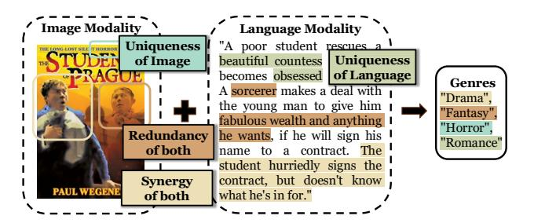

# Abstract

Modality fusion is a cornerstone of multimodal learning, enabling information integration from diverse data sources. However, vanilla fusion methods are limited by (1) inability to account for heterogeneous interactions between modalities and (2) lack of interpretability in uncovering the multimodal interactions inherent in the data. To this end, we propose I 2MoE (Interpretable Multimodal Interaction-aware Mixture of Experts), an end-to-end MoE framework designed to enhance modality fusion by explicitly modeling diverse multimodal interactions, as well as providing interpretation on a local and global level. First, I 2MoE utilizes different interaction experts with weakly supervised interaction losses to learn multimodal interactions in a data-driven way. Second, I 2MoE deploys a reweighting model that assigns importance scores for the output of each interaction expert, which offers sample-level and dataset-level interpretation. Extensive evaluation of medical and general multimodal datasets shows that I 2MoE is flexible enough to be combined with different fusion techniques, consistently improves task performance, and provides interpretation across various real-world scenarios. Code is available at [https://github.](https://github.com/Raina-Xin/I2MoE) [com/Raina-Xin/I2MoE](https://github.com/Raina-Xin/I2MoE).

## 1. Introduction

A core challenge in multimodal learning is modality fusion—the integration of information from multiple modalities to improve predictive performance [\(Baltrusaitis et al.](#page-8-0) ˇ , [2019;](#page-8-0) [Barnum et al.,](#page-8-1) [2020;](#page-8-1) [Lv et al.,](#page-10-0) [2021\)](#page-10-0). By leverag-

*Proceedings of the* 42 nd *International Conference on Machine Learning*, Vancouver, Canada. PMLR 267, 2025. Copyright 2025 by the author(s).

Figure 1. An illustrative example of modality interaction. The poster and plot are taken from the IMDB dataset.

ing diverse data sources such as text, images, audio, and sensor data, modality fusion enables the capture of intricate relationships across modalities, which is especially crucial in fields like healthcare, where accurate decisionmaking relies on multimodal insights [\(Liang et al.,](#page-9-0) [2022b;](#page-9-0) [Kline et al.,](#page-9-1) [2022;](#page-9-1) [Teoh et al.,](#page-10-1) [2024\)](#page-10-1). Although recent advancements in neural architectures, such as transformers [\(Vaswani et al.,](#page-10-2) [2017;](#page-10-2) [Tsai et al.,](#page-10-3) [2019\)](#page-10-3) and sparse mixtureof-experts [\(Shazeer et al.,](#page-10-4) [2017;](#page-10-4) [Fedus et al.,](#page-9-2) [2022;](#page-9-2) [Jin](#page-9-3) [et al.,](#page-9-3) [2024\)](#page-9-3), have significantly improved the modeling of modality interactions, an important yet underexplored area is the systematic understanding of how modalities influence one another—whether they provide complementary, supplementary, or even conflicting information [\(Baltrusaitis et al.](#page-8-0) ˇ , [2019;](#page-8-0) [Liang et al.,](#page-9-0) [2022b;](#page-9-0) [2023\)](#page-9-4).

Understanding modality interaction is essential for advancing multimodal machine learning [\(Baltrusaitis et al.](#page-8-0) ˇ , [2019;](#page-8-0) [Liang et al.,](#page-9-0) [2022b\)](#page-9-0). An information-theoretic framework called Partial Information Decomposition (PID) [\(Wollstadt](#page-10-5) [et al.,](#page-10-5) [2023;](#page-10-5) [Liang et al.,](#page-9-4) [2023\)](#page-9-4) offers a theoretical foundation for understanding modality interactions. PID decomposes information into four distinct types: *uniqueness for the first modality* (information specific to modality 1), *uniqueness for the second modality* (information specific to modality 2), *synergy* (emergent information arising from the combination of two modalities), and *redundancy* (shared information across two modalities).

Figure [1](#page-0-0) illustrates the importance of carefully modeling different types of multimodal interactions. For instance, the unique information provided by the image modality

1University of Pennsylvania, PA, USA 2University of North Carolina at Chapel Hill, NC, USA 3University of Science and Technology of China, Anhui, China. Correspondence to: Qi Long <qlong@upenn.edu>, Tianlong Chen <tianlong@cs.unc.edu>, Jiayi Xin <jiayixin@seas.upenn.edu>.

(mimg) contributes to predicting the Horror genre through distinct visual cues absent in the language modality (mlang) while the unique information from the language modality offers critical textual context for identifying the Romance genre. Redundant information refers to shared information present in both modalities, such as recognizing the Fantasy genre through the blurry figure in the poster and mentioning a "sorcerer" in the plot. Accurately classifying the movie as Drama, however, requires modeling synergistic information between the two modalities: visual elements such as clothing and facial expressions in mimg, complement the narrative details from mlang. From this example, systematic modeling of multimodal interactions is needed to make accurate predictions.

While the PID framework provides valuable theoretical insights into the proportions of different modality interactions within a dataset, its practical application is limited, lacking integration into end-to-end and interpretable deep learning frameworks. Most existing multimodal fusion methods do not *explicitly* model multimodal interactions [\(Liu et al.,](#page-9-5) [2018;](#page-9-5) [Tsai et al.,](#page-10-3) [2019;](#page-10-3) [Xue & Marculescu,](#page-11-0) [2023\)](#page-11-0). Notable efforts to address this gap, such as [\(Wortwein et al.](#page-10-6) ¨ , [2022;](#page-10-6) [Yu et al.,](#page-11-1) [2024;](#page-11-1) [Dufumier et al.,](#page-9-6) [2024\)](#page-9-6), exhibit key limitations: they either focus exclusively on pairwise modality interactions [\(Wortwein et al.](#page-10-6) ¨ , [2022\)](#page-10-6), require separate estimates for each interaction type [\(Yu et al.,](#page-11-1) [2024\)](#page-11-1), or lack sufficient interpretability [\(Dufumier et al.,](#page-9-6) [2024\)](#page-9-6). The opportunity to directly leverage PID for improving both task performance and model interpretability within multimodal fusion frameworks remains largely unexplored.

In contrast to earlier works, we propose I 2MoE, an endto-end mixture-of-experts (MoE) framework designed to enhance task performance while improving interpretability. Our approach incorporates separate parameters and weaklysupervised interaction losses, enabling the mixture of interaction experts to effectively model diverse interactions between modalities. To further enhance interpretability, we introduce a re-weighting model that assigns importance scores to each interaction expert, providing insights into decision-making at both local (sample-level) and global (dataset-level) scales. I 2MoE is backbone-agnostic and can be seamlessly integrated with any modality fusion approach. We evaluate the effectiveness of I 2MoE on two medical datasets and three real-world multimodal datasets, demonstrating its ability to consistently improve performance while offering interpretable insights into the model's decision-making process for individual samples.

Our contributions are summarized as follows:

⋆ We introduce I 2MoE, a novel mixture-of-experts framework designed to explicitly model diverse modality interactions through specialized parameters and weakly-supervised interaction losses, enabling a more

nuanced understanding of multimodal data.

- ⋆ We enhance interpretability by providing both samplelevel and dataset-level insights into model decisions, offering a deeper understanding of how interaction experts contribute to predictions.
- ⋆ I 2MoE is highly flexible and can be seamlessly integrated with existing modality fusion methods, demonstrating its versatility in improving vanilla multimodal fusion backbones.
- ⋆ Extensive experiments on five diverse real-world multimodal datasets validate the efficacy of I 2MoE, showcasing significant performance improvements (up to 5.5% in accuracy) and interpretability benefits over vanilla modality fusion methods.

## 2. Related Work

Modality Interaction is theoretically grounded in the Partial Information Decomposition (PID) framework [\(Liang](#page-9-4) [et al.,](#page-9-4) [2023\)](#page-9-4), which analyzes heterogeneous interactions but lacks an end-to-end learning framework. Prior works attempt to model interactions but are either restricted to specific interaction types [\(Zhang et al.,](#page-11-2) [2023;](#page-11-2) [Kim et al.\)](#page-9-7), fail to quantify interactions in the data [\(Wortwein et al.](#page-10-7) ¨ , [2024;](#page-10-7) [Liang et al.,](#page-9-8) [2024;](#page-9-8) [Long et al.,](#page-9-9) [2024;](#page-9-9) [Dufumier et al.,](#page-9-6) [2024\)](#page-9-6), or are limited to only two modalities [\(Wortwein et al.](#page-10-6) ¨ , [2022;](#page-10-6) [Fan et al.,](#page-9-10) [2024\)](#page-9-10). Our approach bridges this gap by directly modeling and quantifying modality interactions within a unified MoE-based fusion architecture, enabling effective and interpretable multimodal learning.

Multimodal Fusion integrates data from multiple sources to enhance prediction tasks. Existing methods often rely on concatenating input modalities using off-the-shelf architectures [\(Liu et al.,](#page-9-5) [2018;](#page-9-5) [Tsai et al.,](#page-10-3) [2019;](#page-10-3) [Xue & Mar](#page-11-0)[culescu,](#page-11-0) [2023;](#page-11-0) [Shazeer et al.,](#page-10-4) [2017;](#page-10-4) [Fedus et al.,](#page-9-2) [2022\)](#page-9-2). Mixture-of-Experts (MoE) offers a natural architecture for modeling interactions via expert specialization [\(Jacobs et al.,](#page-9-11) [1991;](#page-9-11) [Chen et al.,](#page-8-2) [1999;](#page-8-2) [Yuksel et al.,](#page-11-3) [2012\)](#page-11-3). Several recent works [\(Mustafa et al.,](#page-10-8) [2022;](#page-10-8) [Lin et al.,](#page-9-12) [2024;](#page-9-12) [Yu et al.,](#page-11-1) [2024\)](#page-11-1) explore MoE for multimodal learning. Among them, only MMoE [\(Yu et al.,](#page-11-1) [2024\)](#page-11-1) explicitly models different types of modality interactions by using a mixture of interaction experts on sentiment analysis. However, MMoE treats modality interaction modeling as a preprocessing step rather than integrating it into an end-to-end learning framework, limiting flexibility and interpretability.

Multimodal Interpretation has gained traction as researchers seek to explain decision-making in multimodal AI systems. Prior studies either focus on isolating the effect of individual modalities while overlooking inter-modal interactions [\(Ismail et al.,](#page-9-13) [2022;](#page-9-13) [Ghosh et al.,](#page-9-14) [2023;](#page-9-14) [Swamy](#page-10-9) [et al.,](#page-10-9) [2024b\)](#page-10-9), provide human-interpretable rationales but

fail to quantify interaction contributions [\(Park et al.,](#page-10-10) [2018;](#page-10-10) [Zadeh et al.,](#page-11-4) [2018;](#page-11-4) [Dominici et al.,](#page-8-3) [2023\)](#page-8-3), or lack explicit categorization of interaction types [\(Tsai et al.,](#page-10-11) [2020;](#page-10-11) [Chefer](#page-8-4) [et al.,](#page-8-4) [2021;](#page-8-4) [Lyu et al.,](#page-10-12) [2022;](#page-10-12) [Liang et al.,](#page-9-15) [2022a;](#page-9-15) [Wenderoth](#page-10-13) [et al.,](#page-10-13) [2024\)](#page-10-13). As no prior work has explored interpretation from a modality interaction perspective, our contribution is to systematically quantify multimodal interactions while maintaining interpretability.

