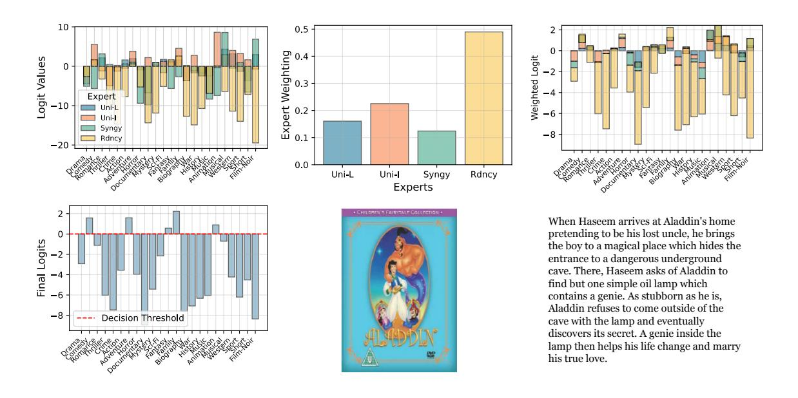

# E. Details for Dataset Preprocessing

We followed the same preprocessing procedure of the ADNI dataset and MIMIC dataset, as described in Flex-MoE [\(Yun](#page-11-6) [et al.,](#page-11-6) [2024\)](#page-11-6).

### E.1. Detailed Data Preprocessing in ADNI

Imaging, Genetic, Biospecimen, Clinical Modalities. The Alzheimer's Disease Initiative (ADNI) is a longitudinal multicenter observational study containing multi-modal data from subjects diagnosed as cognitively normal (CN), mild cognitive impairment (MCI), and Alzheimer's dementia (AD) [\(Weiner et al.,](#page-10-14) [2010;](#page-10-14) [2017\)](#page-10-15). In our experiments, we utilized imaging, genetic, biospecimen, and clinical modalities. The imaging data consisted of magnetic resonance images (MRIs) which were preprocessed using field intensity inhomogeneity correction, gray tissue matter segmentation via MUSE (Multiatlas Region Segmentation Utilizing Ensembles of Registration Algorithms and Parameters) [\(Doshi et al.,](#page-8-7) [2016\)](#page-8-7), and voxel-wise volumetric mapping of tissue regions. The genetic data consisted of SNP (single nucleotide polymorphisms) data from the ADNI 1, GO/2, and 3 studies. These were preprocessed via alignment to a unified reference, followed by aligning strands based on the 1000 Genome Project phase 3, linkage disequilibrium (LD) pruning, and imputation. The resulting data consisted of 144, 746 SNPs. The biospecimen modality included CSF Aβ1-42 and Aβ1-40, Total Tau and Phosphorylated Tau, Plasma Neurofilament Light Chain, and ApoE genotype. Clinical data included medical history, neurological exams, patient demographics, medications, and vital signs. Data columns directly containing Alzheimer's Disease diagnosis information were excluded. For both biospecimen and clinical data, numerical data was scaled using a MinMax scaler to a range of -1 to 1, while categorical data was one-hot encoded. Missing values, were imputed using the mean for numerical fields and the mode for categorical fields.

## E.2. Detailed Data Preprocessing in MIMIC

Lab, Notes, Codes Modalities. The MIMIC dataset was extracted from the Medical Information Mart for Intensive Care IV (MIMIC-IV) database, which contains de-identified health data for patients who were admitted to either the emergency department or stayed in critical care units of the Beth Israel Deaconess Medical Center in Boston, Massachusetts (Johnson et al., 2024; 2023; Goldberger et al., 2000). MIMIC-IV excludes patients under 18 years of age. We take a subset of the MIMIC-IV data, where each patient has at least more than 1 visit in the dataset as this subset corresponds to patients who likely have more serious health conditions. For each datapoint, we extract ICD-9 codes, clinical text, and labs and vital values. Using this data, we perform binary classification on one-year mortality. We drop visits that occur at the same time as the patient's death.

## F. Details for Modality-specific Encoder and Classification Head

- **• ADNI Dataset**: For the image modality, we employed a customized 3D-CNN (Esmaeilzadeh et al., 2018) with a hidden dimension of 256 as the encoder. For the genomics, clinical, and biospecimen modalities, we used a one-hidden-layer MLP with a hidden dimension of 256 as the encoder.
- **MIMIC Dataset**: For all lab, note, and code modalities, we utilized an LSTM with a hidden dimension of 256 as the encoder.
- **MOSI Dataset**: A Gated Recurrent Unit (GRU) with a hidden dimension of 256 was used as the encoder for the vision, audio, and text modalities.
- **©** ENRICO Dataset: For both the screenshot image and wireframe image modalities, we used VGG11 from the torchvision library with a hidden dimension size of 16 as the encoder.
- **6** IMDB Dataset: For the image modality, a VGG-16 model was applied as the feature extractor. For the language modality, features were extracted using the pretrained Google Word2vec model. Additionally, we employed VGG11 from the torchvision library with a hidden dimension size of 16 as the encoder and used MaxoutLinear unimodal encoders, following current work (Liang et al., 2021).
- ▶ **Classification Head**: For all models and all datasets, we use a linear classification head to output the corresponding prediction.

## G. Details for Hyperparameter Setting

To improve reproducibility, the tables below provide a summary of the hyperparameters used in our experiments. For hyperparameters of other baseline fusion methods, please refer to the scripts in the GitHub repository at https://github.com/Raina-Xin/I2MoE/tree/main/scripts/train\_scripts.

*Table 7.* Hyperparameter Configuration for I2MoE-MulT on Different Datasets

| Hyperparameter                                               | ADNI   | MIMIC  | IMDB   | MOSI   | ENRICO |
|--------------------------------------------------------------|--------|--------|--------|--------|--------|
| Learning Rate (1r)                                           | 0.0001 | 0.0001 | 0.0001 | 0.0001 | 0.0001 |
| Temperature for Reweighting (temperature_rw)                 | 1      | 2      | 2.0    | 2.0    | 2.0    |
| Hidden Dimension for Reweighting (hidden_dim_rw)             | 256    | 128    | 256    | 256    | 256    |
| Number of Layers in Reweighting (num_layer_rw)               | 2      | 2      | 3      | 3      | 3      |
| <pre>Interaction Loss Weight (interaction_loss_weight)</pre> | 0.5    | 0.01   | 0.5    | 0.005  | 0.5    |
| Modality (modality)                                          | IGCB   | LNC    | LI     | TVA    | SW     |
| Training Epochs (train_epochs)                               | 50     | 30     | 40     | 30     | 50     |
| Batch Size (batch_size)                                      | 32     | 32     | 32     | 32     | 32     |
| Number of Experts (num_experts)                              | 8      | 4      | 4      | 4      | 4      |
| Number of Layers in Encoder (num_layers_enc)                 | 1      | 1      | 1      | 1      | 2      |
| Number of Layers in Fusion (num_layers_fus)                  | 2      | 2      | 2      | 1      | 2      |
| Number of Layers in Prediction (num_layers_pred)             | 2      | 2      | 2      | 1      | 2      |
| Number of Attention Heads (num_heads)                        | 4      | 1      | 4      | 1      | 4      |
| Hidden Dimension (hidden_dim)                                | 256    | 128    | 256    | 256    | 256    |
| Number of Patches (num_patches)                              | 16     | 8      | 4      | 4      | 8      |

Table 8. Hyperparameter Configuration for I2MoE-SwitchGate on Different Datasets

| Hyperparameter                                               | ADNI   | MIMIC  | IMDB   | MOSI   | ENRICO |
|--------------------------------------------------------------|--------|--------|--------|--------|--------|
| Learning Rate (1r)                                           | 0.0001 | 0.0001 | 0.0001 | 0.0001 | 0.0001 |
| Temperature for Reweighting (temperature_rw)                 | 2      | 2      | 2.0    | 2.0    | 1      |
| Hidden Dimension for Reweighting (hidden_dim_rw)             | 256    | 256    | 256    | 128    | 128    |
| Number of Layers in Reweighting (num_layer_rw)               | 2      | 2      | 2      | 1      | 3      |
| <pre>Interaction Loss Weight (interaction_loss_weight)</pre> | 0.01   | 0.5    | 0.5    | 0.001  | 0.01   |
| Modality (modality)                                          | IGCB   | LNC    | LI     | TVA    | SW     |
| Training Epochs (train_epochs)                               | 30     | 30     | 40     | 50     | 30     |
| Batch Size (batch_size)                                      | 8      | 64     | 64     | 32     | 8      |
| Number of Experts (num_experts)                              | 16     | 16     | 16     | 4      | 4      |
| Number of Layers in Encoder (num_layers_enc)                 | 2      | 2      | 2      | 1      | 1      |
| Number of Layers in Fusion (num_layers_fus)                  | 2      | 2      | 2      | 1      | 1      |
| Number of Layers in Prediction (num_layers_pred)             | 2      | 2      | 2      | 1      | 1      |
| Number of Attention Heads (num_heads)                        | 4      | 4      | 4      | 4      | 2      |
| Hidden Dimension (hidden_dim)                                | 128    | 256    | 128    | 128    | 128    |
| Number of Patches (num_patches)                              | 8      | 16     | 4      | 16     | 4      |

Table 9. Hyperparameter Configuration for  $I^2MoE$ -InterpretCC on Different Datasets

| Hyperparameter                                               | ADNI   | MIMIC  | IMDB   | MOSI   | ENRICO |
|--------------------------------------------------------------|--------|--------|--------|--------|--------|
| Learning Rate (1r)                                           | 0.0001 | 0.0001 | 0.0001 | 0.0001 | 0.0001 |
| Temperature for Reweighting (temperature_rw)                 | 2      | 2      | 2.0    | 1.5    | 4.0    |
| Hidden Dimension for Reweighting (hidden_dim_rw)             | 128    | 128    | 256    | 256    | 256    |
| Number of Layers in Reweighting (num_layer_rw)               | 2      | 2      | 3      | 2      | 2      |
| <pre>Interaction Loss Weight (interaction_loss_weight)</pre> | 0.5    | 0.1    | 0.01   | 0.001  | 0.5    |
| Modality (modality)                                          | IGCB   | LNC    | LI     | TVA    | SW     |
| Tau $(\tau)$                                                 | 1.0    | 0.7    | 1.0    | 1.0    | 0.5    |
| Threshold (threshold)                                        | 0.5    | 0.5    | 0.6    | 0.6    | 0.4    |
| Train Epochs (train_epochs)                                  | 30     | 50     | 40     | 50     | 60     |
| Batch Size (batch_size)                                      | 32     | 128    | 32     | 32     | 64     |
| Hidden Dimension (hidden_dim)                                | 128    | 256    | 256    | 128    | 256    |
| Hard (hard)                                                  | True   | True   | True   | True   | True   |

*Table 10.* Hyperparameter Configuration for I2MoE-MoE++ on Different Datasets

| Hyperparameter                                               | ADNI   | MIMIC  | IMDB   | MOSI   | ENRICO |
|--------------------------------------------------------------|--------|--------|--------|--------|--------|
| Learning Rate (1r)                                           | 0.0001 | 0.0001 | 0.0001 | 0.0001 | 0.0001 |
| Temperature for Reweighting (temperature_rw)                 | 2      | 1      | 1.0    | 2      | 1      |
| Hidden Dimension for Reweighting (hidden_dim_rw)             | 256    | 256    | 256    | 128    | 256    |
| Number of Layers in Reweighting (num_layer_rw)               | 3      | 2      | 2      | 2      | 2      |
| <pre>Interaction Loss Weight (interaction_loss_weight)</pre> | 0.5    | 0.5    | 0.5    | 0.001  | 0.5    |
| Modality (modality)                                          | IGCB   | LNC    | LI     | TVA    | SW     |
| Training Epochs (train_epochs)                               | 50     | 30     | 40     | 50     | 50     |
| Batch Size (batch_size)                                      | 64     | 32     | 32     | 32     | 32     |
| Number of Experts (num_experts)                              | 8      | 4      | 4      | 8      | 8      |
| Number of Layers in Encoder (num_layers_enc)                 | 2      | 2      | 2      | 2      | 2      |
| Number of Layers in Fusion (num_layers_fus)                  | 2      | 2      | 2      | 1      | 2      |
| Number of Layers in Prediction (num_layers_pred)             | 2      | 2      | 2      | 2      | 2      |
| Number of Attention Heads (num_heads)                        | 4      | 4      | 4      | 4      | 4      |
| Hidden Dimension (hidden_dim)                                | 256    | 128    | 256    | 64     | 64     |
| Number of Patches (num_patches)                              | 8      | 4      | 8      | 4      | 4      |

## H. Human Evaluation for Local Interpretation

To strengthen evidence for the local interpretability of our model, we conducted a human evaluation study involving 15 participants. Each participant was shown 20 movie examples, resulting in a total of 300 interaction expert weight evaluations. Participants were asked to assess how reasonable the model's assigned expert weights were, choosing from a 5-point Likert scale: "Completely makes sense," "Mostly makes sense," "Neutral," "Makes little sense," and "Makes no sense at all."

Overall, 70.4% of responses were positive (i.e., "Mostly makes sense" or "Completely makes sense"), while only 9% were negative. Notably, just 0.7% of ratings selected the lowest option. These results suggest that the model's expert weight assignments are broadly viewed as reasonable and interpretable by human evaluators.

The questionnaire and de-identified responses are available at [https://github.com/Raina-Xin/I2MoE/tree/main/](https://github.com/Raina-Xin/I2MoE/tree/main/assets/human_eval) [assets/human\\_eval](https://github.com/Raina-Xin/I2MoE/tree/main/assets/human_eval)

| Response Option        | Percentage of Responses |
|------------------------|-------------------------|
| Completely makes sense | 19.4%                   |
| Mostly makes sense     | 51.0%                   |
| Neutral                | 19.7%                   |

Makes little sense 9.0% Makes no sense at all 0.7%

Table 11. Distribution of human ratings for local interaction expert weights (*n* = 300).

## I. More Qualitative Examples for Local Interpretation

We present a comprehensive visualization of all 23 classes in the IMDB dataset, illustrating local interpretability for individual examples. All examples are correctly predicted by I 2MoE.

Figure 6. IMDB example (ID: 0088885).

Figure 7. IMDB example (ID: 0245276).

Figure 8. IMDB example (ID: 0827990).