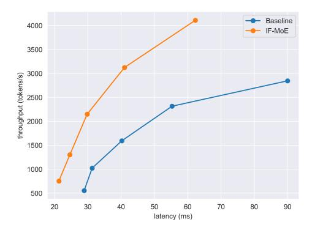

# 4 Experiment

We select the Qwen2-57B-A14B-Instruct model and the Deepseek-Lite-Chat model for downstream performance evaluation and benchmark experiments.

## 4.1 Downstream Performance

While IFMoE is not entirely lossless compared to Speculative Decoding, downstream performance demonstrates that IFMoE can achieve comparable functionality across various applications and scenarios.

For evaluation, we selected the XSum[\[13\]](#page-4-8), GSM8K[\[2\]](#page-4-9), TruthfulQA[\[12\]](#page-4-10) and IFEval[\[19\]](#page-5-4) tasks, which are representative generation tasks covering Summarization, Mathematics, and Alignment. These tasks are well-suited for assessing an LLM's in-context learning and reasoning capabilities. The table [1](#page-2-1) presents the downstream performance results for both the full model and IFMoE. The minimal difference between the performance of the full model and IFMoE indicates that our approximation achieves near-lossless performance in LLM tasks.

#### 4.2 Benchmark Performance

Figure [2](#page-3-0) presents the benchmark performance of the Qwen2-57B-A14B-Instruct model and the Deepseek-Lite-Chat model during the decoding stage. The benchmark experiment of the Qwen2- 57B-A14B-Instruct model was conducted using 4 A6000 GPUs, while the Deepseek-Lite-Chat model was conducted using 2 A6000 GPUs.

- (a) Qwen2-57B-A14B-Instruct model benchmark (b) Deepseek-Lite-Chat model benchmark

Figure 2: The benchmark experiment of IFMoE and Full model inference. For the hyperparameter settings, we apply α = 10, encode topk Ek = 6, and decode topk Dk = 2. The maximum batch size for the Qwen2-57B-A14B-Instruct model is 256 while the maximum batch size for the Deepseek-Lite-Chat model is 200.

The figure [2](#page-3-0) demonstrates that IFMoE significantly improves the inference speed across various fine-grained MoE architectures. By reducing the amount of computation and limiting the number of active experts, IFMoE achieves over 30% speedup in inference and more than 30% increase in throughput, resulting in a faster and more efficient MoE service system.

