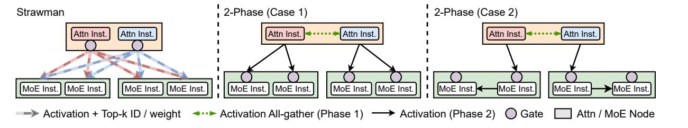

# 3.2 Design Overview

Fig. 5 shows the architectural overview of JANUS. The cluster consists of two sub-clusters of GPU nodes, attention nodes and MoE nodes. These nodes are independently managed and scaled within the two sub-clusters. JANUS supports low-latency data transfers between sub-clusters with our adaptive two-phase communication mechanism (§3.3).

On the attention side, each attention node hosts multiple attention instances. Each instance runs on one GPU and keeps a full replica of the attention layers.2 There is a request con-

&lt;sup>2JANUS primarily targets state-of-the-art MoE models with many small-

Figure 6: Comparison between a strawman solution (left) and adaptive two-phase communication (middle and right).

troller which assigns incoming requests to attention instances.

On the MoE side, each MoE node hosts multiple MoE instances, each running on one GPU and storing a subset of expert replicas. To achieve the activated-expert balancing, each MoE instance runs a lightweight activation scheduler that maps the expert activation requests to expert replicas for minimizing the maximum number of activated experts across GPUs. The scheduler is implemented as a GPU kernel and runs in a distributed, synchronization-free manner ([§3.4\)](#page-5-1). MoE instances also collect activation statistics and report them to the associated MoE controller on the MoE node. Together with the attention controller, they periodically adjust attention resources, MoE resources, and expert placement to improve per-GPU throughput under token-level SLOs ([§3.5\)](#page-7-0).

