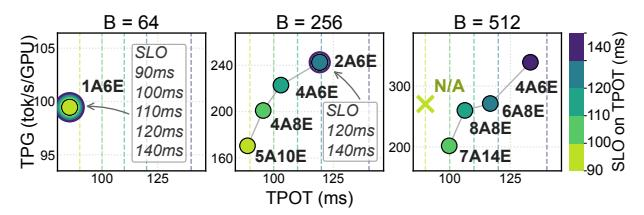
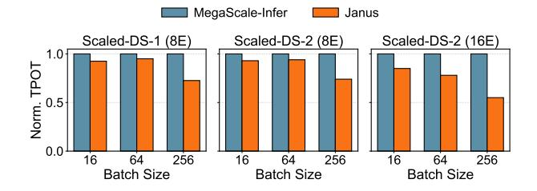
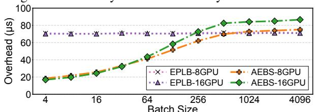

# 5.1 Experimental Setup

**Testbed.** We deploy JANUS on a GPU cluster of up to 4 nodes. Each node has 128 CPU cores, 2 TB of host memory, and 8 NVIDIA H100 GPUs, each with 80 GB memory. Each GPU is connected with a 400 Gbps InfiniBand NIC. GPUs within a node are interconnected via 900 GB/s NVLink.

**Models and workloads.** We evaluate JANUS on representative large MoE models, including DeepSeek-V2 [12], Qwen3-MoE [38], and Scaled-DS, a family of scaled DeepSeek-style variants that stress different routing and expert configurations. We consider two Scaled-DS variants. Scaled-DS-1 uses top-k = 8 routing over 160 experts per layer, with each expert having intermediate size 1024. Scaled-DS-2 also uses top-k = 8, but expands the expert pool to 200 experts and increases the per-expert size to 1536. All model parameters and KV caches are stored in BF16 format. We use two representative workloads. First, we replay requests derived from the ShareGPT dataset [28], with an average input length of 16 tokens and an average output length of 256 tokens. Second, we use BurstGPT [32] to synthesize realistic dynamic arrivals that mimic production LLM services.

**Baselines.** We compare JANUS against three baselines.

- (1) SGLang: We use vanilla SGLang as our monolithic baseline. It deploys the entire MoE model as a single instance under a fixed parallelism configuration, forcing attention and MoE components to share the same parallelism degree. Therefore, SGLang scales only at a coarse granularity, such as deploying the full model on 8, 16, 32, 64 GPUs.
- (2) MegaScale-Infer: MegaScale-Infer is a state-of-the-art disaggregated MoE inference system [44]. We implement it on top of JANUS's codebase as it is not publicly available. Specifically, we replace JANUS's AEBS with random expert

Figure 8: TPOT and normalized per-GPU throughput across batch sizes. (a) DeepSeek-V2, SLO =  $200 \,\text{ms}$ . (b) DeepSeek-V2, SLO =  $150 \,\text{ms}$ . (c) Qwen3-MoE, SLO =  $200 \,\text{ms}$ . Annotations (e.g., 1A6E) denote the configurations selected by disaggregated systems, while XG (X total GPUs) denotes the configuration used by SGLang. The red dashed line marks the SLO threshold, and the whisker marker shows the P99 TPOT.

Figure 9: Performance of JANUS under various SLOs.

scheduling, a common strategy used in existing systems including EPLB [5]. Unlike JANUS's two-phase communication design, MegaScale-Infer performs gating on the attention side, requiring each attention instance to send activations and metadata to all MoE instances that host activated experts. Compared with JANUS, MegaScale-Infer also adopts coarsergrained resource scaling: it restricts the resource configuration space to plans that balance attention-side and MoE-side times for pipelined execution.

(3) xDeepServe: We also implement xDeepServe [36], an NPU-superpod-based disaggregated inference system, on top of JANUS, as another baseline. xDeepServe uses EPLB-like expert scheduling. For communication, it targets superpodscale deployments and incurs more extensive cross-node traffic than JANUS, including all-to-all transfers between attention and MoE nodes. It also performs gating on the attention side. Since xDeepServe does not provide a resource-scaling policy, we simply scales it in units of 4 GPUs.

**Metrics.** To evaluate JANUS in decode-centric serving scenarios, we use two primary metrics: time per output token (TPOT) and throughput per GPU (TPG). TPOT captures token-level latency during decoding and is the SLO metric used throughout our evaluation. TPG measures resource efficiency, computed as the total output-token throughput divided by the number of GPUs used.

## 5.2 End-to-End Performance

**Per-GPU** throughput and SLO attainment. We compare the end-to-end performance of JANUS against *SGLang*, *MegaScale-Infer*, and *xDeepServe*. Fig. 8 reports TPOT

and normalized per-GPU throughput across batch sizes using DeepSeek-V2 and Qwen3-MoE under 200 ms and 150 ms TPOT SLOs. JANUS consistently satisfies the target SLOs across all evaluated batch sizes and models. In contrast, *MegaScale-Infer* and *xDeepServe* violate the SLO on DeepSeek-V2 as the batch size increases, with violations appearing at batch size 512 under the 150 ms SLO and at batch size 1024 under the 200 ms SLO. *SGLang* also fails to satisfy the SLO on Owen3-MoE at batch size 1024.

Fig. 8 further shows that JANUS achieves substantially higher resource efficiency through fine-grained, modulespecific scaling. By independently selecting the numbers of attention and expert instances, JANUS improves per-GPU throughput by up to  $4.7 \times$ ,  $2.2 \times$ , and  $3.3 \times$  over SGLang, MegaScale-Infer, and xDeepServe, respectively. These gains come from avoiding the coarse provisioning decisions made by existing systems. Under light load, SGLang and *xDeepServe* over-provision attention capacity because they scale only in coarse units, whereas JANUS uses compact asymmetric configurations such as 1A6E and allocates most resources to the MoE side. As load increases, JANUS incrementally adds attention capacity to avoid attention-side bottlenecks; under tighter SLOs, it also expands the MoE side to reduce the maximum activated-expert count  $a_{\text{max}}$ . In contrast, MegaScale-Infer and xDeepServe are limited by coarser configuration spaces and less effective expert scheduling. Overall, JANUS improves both SLO attainment and per-GPU throughput by matching the resource allocation to the distinct scaling behavior of attention and MoE layers.

**Performance under various SLOs.** Fig. 9 stress-tests JANUS under different TPOT SLOs and batch sizes. The selected configuration changes substantially with the latency target, demonstrating the need for SLO-aware resource scaling. At a small batch size of B = 64, 1A6E already satisfies all evaluated SLOs and achieves about 99 tok/s/GPU, indicating that additional resources would provide little benefit in this regime. At B = 256, relaxing the SLO allows JANUS to move from more heavily provisioned configurations such as 5A10E to more resource-efficient ones such as 2A6E, increasing TPG from roughly 170 to 240 tok/s/GPU. At B = 512, the strictest SLO

Figure 10: Normalized TPOT under various model variants.

Figure 11: Scaling behaviors over a 24-hour production trace with a 15-minute decision interval. JANUS tracks load changes with fine-grained scaling, while SGLang over-provisions by snapping to 16/32/64-GPU tiers and MegaScale-Infer uses more GPUs due to its coarser scaling policy.

is infeasible, while looser SLOs enable progressively higherthroughput configurations; in particular, 4A6E achieves about 340 tok/s/GPU under the most relaxed SLO. These results expose a clear latency-throughput trade-off: tighter SLOs require more conservative resource allocations to reduce TPOT, whereas relaxed SLOs allow JANUS to use fewer GPUs and maximize per-GPU throughput.

**Performance on model variants.** Fig. 10 compares JANUS with MegaScale-Infer on Scaled-DS variants. For Scaled-DS-1 with 8 MoE instances, JANUS reduces TPOT more at larger batch sizes, where its adaptive two-phase communication better amortizes cross-node transfer overhead. For Scaled-DS-2, 8 MoE instances leave little replica redundancy and limit scheduling gains. Scaling to 16 MoE instances restores redundancy, enabling JANUS to combine communication efficiency with AEBS and reduce TPOT by 41-50%.

Scaling under real-world workloads. Fig. 11 evaluates JANUS under a 24-hour production trace with a 15-minute scaling interval, and compares it with SGLang and MegaScale-Infer. Since continuously running all systems over the full trace would require substantial cluster time, we evaluate scaling behavior through trace-driven simulation using the measured performance of various systems. JANUS closely tracks the diurnal load by continuously adjusting the numbers of attention and MoE instances, scaling between 7 and 56 GPUs. In contrast, SGLang can only snap to coarse 16/32/64-GPU tiers, leading to over-provisioning during low-load periods. MegaScale-Infer also allocates more GPUs than JANUS because its coarser-grained scaling policy can skip configurations that are more resource-efficient. As a result, JANUS

Figure 12: Performance breakdown of JANUS's designs. • F=8 - AFRS E=12 -->-- EPLB E=16

64 Batch Size

256

512

Figure 13: Maximum activated-expert count  $a_{\text{max}}$  under different batch sizes and MoE-side scales (E).

16

reduces GPU-hour consumption by 39% compared with SGLang and by 16% compared with MegaScale-Infer, while maintaining the target latency requirements.

#### 5.3 **Microbenchmarks**

Performance breakdown. We ablate three mechanisms in JANUS: cross-sub-cluster communication, gating location, and activated-expert-balanced scheduling (AEBS). Here, 1PC and 2PC denote one-phase and two-phase communication, while AGate and EGate denote attention-side and MoE-side gating, respectively. The full JANUS uses 2PC+EGate+AEBS. Fig. 12 reports TPOT and normalized throughput across batch sizes. The results show that MoE-side gating must be paired with two-phase communication. Without intra-node aggregation, *1PC+EGate* sends ungated activations directly across nodes, increasing TPOT to 185 ms and 350 ms at batch sizes 256 and 512, with throughput dropping to 44% and 30% of the full JANUS. With 2PC, intra-node aggregation reduces crossnode transfers and makes *EGate* consistently effective. As a result, 2PC+EGate improves throughput over 2PC+AGate by 4–34%, since it also avoids sending top-k routing metadata on each attention-to-MoE link. Finally, adding AEBS further improves throughput by 11-15% by reducing MoE stragglers. Effects of JANUS's AEBS. Figs. 13 and 14 evaluate the effectiveness of JANUS's activated-expert-balanced scheduling (AEBS). Fig. 13 reports the maximum number of activated experts assigned to any MoE instance under different batch sizes and MoE-side scales. This metric captures the straggler effect in MoE execution, since each layer must wait for the instance with the largest activated-expert count. Compared with EPLB, a common expert-parallel scheduling scheme,

Figure 14: MoE-layer inference latency for three cases.

Figure 15: Overhead of JANUS's AEBS.

AEBS consistently reduces the maximum activated-expert count across all batch sizes. The reduction becomes larger as the number of MoE instances increases from 8 to 16, because higher expert redundancy gives AEBS more choices when distributing activations across instances.

Fig. 14 shows the resulting MoE-layer latency. Across batch sizes 64, 256 and 512, JANUS outperforms EPLB in most configurations, with larger gains when more MoE instances are available. For example, at larger batch sizes, increasing the MoE-side scale from E8 to E16 allows JANUS to substantially reduce latency, while EPLB remains close to the baseline latency because it does not explicitly minimize the maximum activated-expert count. These results confirm that JANUS's scheduling reduces MoE stragglers by balancing activated experts, effectively leading to latency improvements. Overhead of JANUS's AEBS. Fig. 15 reports the scheduling overhead of AEBS and EPLB under different batch sizes and MoE sub-cluster scales. AEBS incurs low overhead across all settings: it starts below 20 us at small batch sizes and remains below 90 us even at batch size 4096. Its cost increases with batch size because larger batches activate more distinct experts, but gradually plateaus once most experts have been activated. Increasing the MoE sub-cluster from 8 to 16 GPUs adds only a small overhead, showing that AEBS scales well with the number of MoE instances. Overall, AEBS introduces negligible scheduling cost and meets the latency requirements of layer-wise MoE execution.

**Effects of Janus's scaling quality.** Fig. 16 visualizes the  $(n_a, n_e)$  search space explored by Janus across three representative batch-size/SLO settings. Each marker denotes a candidate resource configuration, plotted by TPG and total GPU count  $n_a + n_e$ ; SLO-feasible configurations are shown as circles and colored by their TPOT/SLO ratio. The results show that efficient scaling requires searching asymmetric attention/MoE allocations rather than simply adding GPUs or scaling both sides proportionally. In all cases, Janus selects

Figure 16: Scaling-policy search space under three representative cases. Each marker denotes a resource configuration  $(n_a, n_e)$ , plotted by TPG (higher is better) and total GPU count  $n_a + n_e$  (lower is better). Circles are SLO-feasible configurations, crosses violate the SLO, and the red ring marks JANUS's selected configuration.

1A6E, 2A6E, and 4A6E, which satisfy the SLO while achieving high TPG with only 7–10 GPUs. This confirms that the scaling policy can identify resource-efficient configurations.

#### 6 Discussion and Other Related Work

Heterogeneous hardware. Modern data centers increasingly mix different GPU generations and specialized AI accelerators [16, 18]. Recent inference hardware follows the same trend: for example, NVIDIA's Vera Rubin platform pairs Rubin GPUs for compute-intensive prefill with LPX accelerators optimized for bandwidth-intensive FFN/MoE decode execution. JANUS can naturally support such environments by mapping attention and MoE instances to separate hardware pools, and its core mechanisms remain applicable.

Pipelining across attention and MoE. Pipelining attention and MoE execution can improve resource utilization by overlapping the two modules across micro-batches [44]. However, its benefit is limited without careful design. Our measurements show that, for typical online batch sizes (often below 100), splitting a batch into multiple micro-batches provides little per-micro-batch latency benefit, while introducing extra synchronization overhead, implementation complexity, and resource interference, consistent with observations from other work [14,21]. Effective pipelining therefore requires careful coordination of micro-batch sizing and task scheduling, which is complementary to JANUS.

#### 7 Conclusion

We presented Janus, a scalable MoE inference system that disaggregates attention and MoE layers into separate GPU sub-clusters and scales them independently. Through adaptive two-phase communication, activated-expert-balanced scheduling, and fine-grained resource scaling, Janus delivers low-latency, resource-efficient MoE inference under dynamic workloads. Evaluation shows that Janus satisfies TPOT SLOs and improves per-GPU throughput by up to  $4.7\times$  over state-of-the-art systems.

