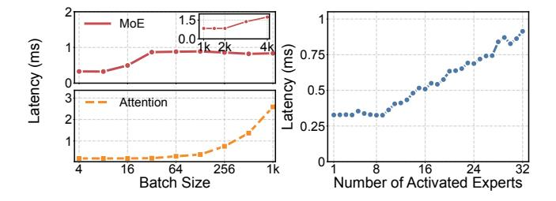
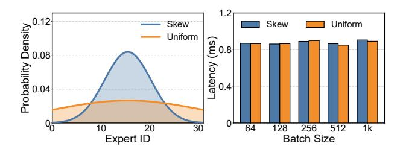
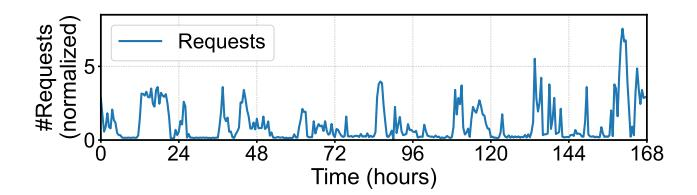
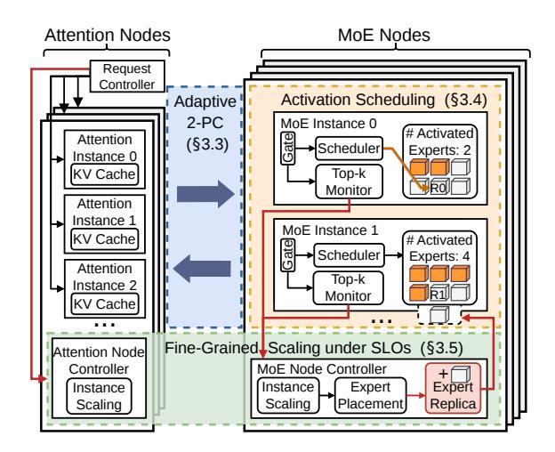

# 2.2 Characteristics and Requirements of MoE Inference

In this section, we characterize the decode-phase MoE inference and derive three key requirements (*R1–R3*).

**Distinct patterns of attention and MoE layers.** We first study the scaling behavior of attention and MoE layers. Fig. 1 reports the normalized latency of DeepSeek-V2 attention and MoE layers as we vary the parallelism degree under different batch sizes. The two layer types exhibit markedly different scaling patterns. For attention layers, increasing the parallelism degree provides little latency benefit at small and moderate batch sizes (B=16 and B=64); latency only decreases noticeably at a large batch size (B=512). In contrast, MoE layers benefit more consistently from larger MoE-side parallelism across all evaluated batch sizes, although the speedup

Figure 2: Performance of attention and MoE layers of DeepSeek-V2. Left: latency comparison between attention and MoE layers under different batch sizes. Right: latency of an MoE layer under different numbers of activated experts.

still remains sublinear. These results show that a single shared parallelism degree is inefficient for MoE inference.

We further analyze the latency patterns of attention and MoE layers, and highlight their differences. Using DeepSeek-V2 [12] as a representative MoE model, we measure both layers' latency on a single H100 GPU while varying the batch size. For the attention layer, we fix the input sequence length to 512, following prior work [31]. For the MoE layer, the GPU hosts 32 experts, and each token activates one expert under the balanced top-1 routing. Fig. 2 (left) shows that attention and MoE layers scale differently with batch size. Attention latency remains low at small and moderate batch sizes, but rises sharply once the batch size exceeds 256. MoE latency, in contrast, increases at small batch sizes and then remains nearly flat until the batch size reaches thousands, a regime rarely seen in online decode serving. This difference illustrates that these two layer types do not benefit from the same scaling strategy, as observed in Fig. 1.

**R1.** Independent provisioning: Attention and MoE layers have distinct demands and latency patterns, requiring independent resource provisioning for each layer type.

Performance bottleneck of MoE Layers. We next examine the performance bottleneck of MoE layers, which dominate the model resource footprint with expert parameters accounting for over 90% of memory usage in modern MoE models (Table 1). We begin with a roofline analysis [3, 33, 40]. In an MoE layer, each expert is dominated by two General Matrix Multiplication (GEMM) operations. Let  $d_h, d_e$  denote the hidden and expert intermediate dimensions, respectively. For an expert with batch size b, its arithmetic intensity is approximately  $I_e \approx 2bd_hd_e/2d_ed_h = b$ . To operate in the compute-bound regime,  $I_e$  must exceed  $\pi/\beta$ , where  $\pi$  is the peak FLOPs and  $\beta$  is the memory bandwidth of the target hardware.

Consider an MoE layer with n experts under top-k uniform routing. The expected per-expert batch size is  $b = B \cdot k/n$ , where B is the layer-wise batch size. Therefore, the minimum B required to reach the compute-bound regime is  $B \ge \pi n/\beta k$ . For example, H100 and A100 GPUs provide 989 and 312 TFLOPs/s of peak compute, and 3.35 and 2.0 TB/s of memory bandwidth, respectively. Under this roofline, DeepSeek-V3

&lt;sup>1Our work is complementary to a broader prefill/decode disaggregation, which we discuss in §6.

Figure 3: Two distributions of expert activation (left) and latency of an MoE layer under the activation patterns (right).

would require a layer-wise batch size of about 18k tokens on H100 and 5k tokens on A100 GPUs to become compute-bound, far above typical online inference settings where permodel-instance batch sizes are often below 100 [22, 29, 43].

We validate this analysis using a 32-expert MoE layer from DeepSeek-V2 [12] on one H100 GPU, emulating the expert density of full-model serving. Fig. 2 (right) isolates the effect of activated expert count by fixing the batch size to 64 and varying the number of activated experts. The latency increases approximately linearly with the number of activated experts; only when very few experts are activated does the near-constant kernel-launch overhead dominate. This result shows that, in the online decoding regime, MoE latency is primarily determined by the number of distinct activated experts. We further examine whether the token volume or activation skew changes this conclusion. Fig. 3 reports the latency of the same 32-expert MoE layer under different batch sizes and activation distributions. For each batch size, all 32 experts are activated at least once, while the activation distribution varies from uniform to skewed. The results show that increasing the batch size has only a marginal impact on latency, and that the uniform and skewed activation patterns lead to nearly identical latency. Together, our roofline analysis and measurements show that MoE layers are memory-bound and their latency depends strongly on the number of distinct experts to activate.

This property becomes more significant in disaggregated MoE inference when experts are distributed across a larger number of GPUs. Let  $a_i$  denote the number of activated experts on MoE instance i for a layer, and  $a_{\max} = \max_i a_i$ . Since the layer cannot finish until the slowest instance completes, MoE latency is determined by the instance with the largest activated-expert count. Therefore, balancing token counts or routing probabilities alone is insufficient; the system should instead balance the activated-expert counts across GPUs.

**R2.** Activated-expert balancing: In typical online workloads, MoE layers are largely memory-bound and their latency is dominated by the number of distinct activated experts. Thus, the system should balance the activated-expert counts across GPUs to minimize the MoE execution latency.

**Dynamic workloads and scaling requirements.** Online LLM serving workloads are highly dynamic. Fig. 4 shows a one-week production trace whose request arrival rate exhibits

Figure 4: One-week production LLM serving trace (normalized to the trace-wide mean). Request arrival rate is highly bursty, with peaks reaching  $\sim 7.5 \times$  the mean.

Table 2: Comparison of existing MoE inference systems.

| System                  | Independent Provisioning | Activated-Expert Balancing | Fine-grained Elasticity |
|-------------------------|-----------------------------|-------------------------------|----------------------------|
| Monolithic [10, 26, 30] | ×                           | ×                             | ×                          |
| MegaScale-Infer [44]    | ✓                           | ×                             | *                          |
| xDeepServe [36]         | ✓                           | ×                             | ×                          |
| EaaS [15]               | ✓                           | ×                             | ×                          |
| JANUS                   | ✓                           | ✓                             | ✓                          |

clear diurnal patterns and reaches around 7.5× of the trace-wide mean. Such burstiness makes static provisioning inefficient: provisioning for the average load risks token-level SLO violations during bursts, whereas provisioning for the peak keeps expensive GPUs under-utilized during low-demand periods. More importantly, workload changes also shift the optimal resource configurations of MoE inference. As shown in Fig. 1, different batch sizes favor different parallelism degrees and lead to different latency patterns across attention and MoE execution. Therefore, the system should resize attention- and MoE-side resources adaptively as workload changes, ensuring that token-level SLOs are satisfied at low resource cost.

R3. Fine-grained elasticity under SLOs: No single resource configuration remains efficient under dynamic workloads. The system should therefore adjust attention- and MoEside resources in a fine-grained and incremental manner to satisfy token-level SLOs at low resource cost.

#### 2.3 Limitations of Existing Solutions

Existing MoE inference systems can be broadly categorized into two classes, *monolithic* and *disaggregated systems*, as summarized in Table 2. However, neither of them satisfies the three key requirements outlined in §2.2.

Monolithic MoE inference. Most MoE inference systems adopt a monolithic design. Systems such as SGLang [26], vLLM [30], and LINA [10] co-locate attention and MoE layers on the same GPUs, use a shared parallelism configuration, and scale by replicating or reconfiguring full model instances. This design falls short of all three requirements. First, monolothic configurations cannot match the distinct latency patterns and demands of attention and MoE layers. It also couples their memory requirements: MoE expert parameters and attention-side KV caches share the same GPU memory budget, forcing the system to over-provision for the combined peak footprint (*RI*). Second, monolithic systems expose little

control over layer-wise expert activation scheduling, and thus cannot balance activated-expert counts across GPUs to reduce MoE latency (R2). Third, their elasticity is inherently coarsegrained: the smallest scaling unit is a full model replica—for example, at least 16 H100 GPUs for DeepSeek-V3 (Table 1) and scaling requires loading all parameters and rebuilding parallelism groups. Such coarse reconfiguration cannot efficiently track dynamic workloads under SLO constraints (R3). **Disaggregated MoE inference.** Beyond monolithic designs, recent systems separate attention and MoE execution onto distinct nodes [15, 36, 44]. By decoupling the two layer types, these systems partially address independent provisioning (RI). However, this architectural separation alone is insufficient, and existing solutions still fall short of the remaining requirements. First, they generally overlook the need to balance activated-expert counts across GPUs (R2). Their MoE-side mechanisms mainly focus on hot-expert replication or token balancing, such as evenly distributing tokens across expert replicas. While such strategies can reduce token imbalance, they do not directly minimize  $a_{\text{max}}$ , the maximum number of distinct activated experts across GPUs, which determines MoE latency as discussed in §2.2. As a result, even a tokenbalanced configuration can leave one GPU activating more distinct experts than others, making it the straggler that limits latency improvement (see §5 and Fig. 14).

Second, their elasticity remains limited under dynamic workloads (*R3*). EaaS [15] enables flexible reconstruction of communication channels between attention and MoE instances, and xDeepServe [36] provides specialized support for attention—expert disaggregation on NPU superpods. These mechanisms improve the data plane for disaggregated execution, but they do not target resource configurations of the attention and MoE sides under changing workloads. MegaScale-Infer [44] provides partial support by tuning the attention-to-MoE resource ratio to balance the execution times of the two sides; however, this design restricts the feasible configuration space and leads to suboptimal performance or even SLO violations (see §5.2 and Fig. 8). Consequently, existing disaggregated systems still lack the fine-grained elasticity needed to track workload changes at low resource cost.

### 3 JANUS Design

In this section, we present JANUS, a scalable and resourceefficient MoE inference system.

## 3.1 Design Principles and Challenges

Guided by the three requirements in §2.2, JANUS adopts three design principles, each introducing a key challenge.

First, JANUS needs to disaggregate attention and MoE layers onto separate sub-clusters to enable module-specific resource allocation and scaling (R1). This design creates the flexibility needed to provision the two sides independently,

Figure 5: Architecture overview of JANUS.

but it also moves layer-wise activation transfer across subclusters. At every MoE layer, *m* attention instances must exchange activations with *n* MoE instances. Naively issuing these *m*-to-*n* transfers creates many small messages on the inference's critical path, making communication overhead the first challenge.

Second, JANUS needs to balance the activated-expert counts across GPUs through layer-wise activation scheduling (R2). To reduce MoE latency, the scheduler must route activation requests to experts to minimize the maximum number of distinct activated experts across GPUs,  $a_{\rm max}$ . However, this decision is made at every MoE layer and every decoding step, where MoE computation may finish within only hundreds of microseconds. The second challenge is therefore to achieve activated-expert balancing with a microsecond-level scheduling overhead and without expensive global coordination.

Third, JANUS needs to optimize resource efficiency, measured by per-GPU throughput, while satisfying token-level SLOs (R3). This requires jointly determining resource allocations for attention and MoE instances, and the placement of expert replicas. The third challenge is to find and apply the SLO-feasible configurations dynamically as workloads change, while keeping resource cost low.

