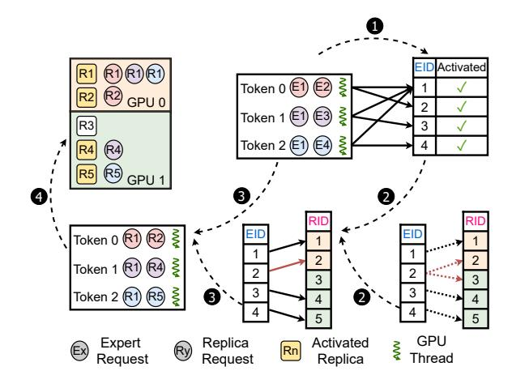

# <span id="page-5-1"></span>3.4 Activated-Expert-Balanced Scheduling

As established in [§2.2,](#page-2-3) the MoE layer latency is determined by the number of activated experts on the bottlenecked MoE instance. JANUS therefore needs to schedule the expert activation requests across expert replicas so as to balance the activated-expert counts at every MoE layer. This scheduling

<span id="page-6-0"></span>

Figure 7: Scheduling workflow of JANUS.

is challenging for two reasons. First, finding the optimal assignment is a combinatorial load-balancing problem over all possible mappings from activated experts to replicas, making it prohibitively expensive to solve online for every layer. Second, making such decisions requires fine-grained activation information, such as top-*k* routing results, and therefore introduces frequent CPU-GPU synchronization or cross-GPU coordination. The resulting overhead can be substantial and may easily exceed the MoE execution time itself, which is often only a few hundred microseconds.

Scheduling workflow. JANUS introduces a lightweight activation scheduling workflow, as shown in Fig. 7. For each MoE layer, MoE-side gating first produces the top-k logical expert IDs (EIDs) for all tokens in the current decode batch. JANUS then scans these routing results and collects the union of selected EIDs, i.e., the set of activated logical experts in this batch (Step 1). This step is implemented as a GPU kernel, with tokens processed in parallel by GPU threads. Given the activated logical experts and the expert-replica mapping, JANUS selects one physical replica ID (RID) for each activated EID (Step 2). For replicated experts, JANUS chooses the replica on the currently least-loaded MoE instance, where load is measured by the number of activated experts assigned to that instance in the current layer. After replica selection, JANUS rewrites each token's routing result from logical EIDs to the selected RIDs (Step 3), and dispatches token activations to the MoE instances that host those replicas (Step 4). In the example in Fig. 7, JANUS selects replicas that balance activated-expert counts across GPUs, rather than merely balancing token counts.

Scheduling algorithm. JANUS implements the aforementioned workflow with an Activated-Expert-Balanced Scheduling (AEBS) algorithm. AEBS greedily reduces the maximum number of activated experts on any MoE instance (Algorithm 1). It first collects the set of experts activated by the current batch (line 1). It then assigns single-replica experts to their unique hosting instances and schedules multi-replica

### <span id="page-6-1"></span>Algorithm 1 Activated-Expert-Balanced Scheduling

#### Input:

- -T: number of tokens,  $n_e$ : number of MoE instances
- -k: number of activated experts per token
- -L(i, j): logical expert ID of the j-th activated expert for token i
- -R(e): number of replicas for expert e
- -G(e): set of instances hosting replicas of expert e
- -P(e,g): physical replica ID of expert e on instance g

#### Output

```
-O(i, j): physical replica ID of the j-th activated expert for token i
```

```
1: \mathcal{E} \leftarrow \bigcup_{i=1}^{T} \bigcup_{j=1}^{k} \{L(i,j)\} \triangleright Collect all activated experts
```

2: Initialize act $Rep[e] \leftarrow -1$  for all  $e \in \mathcal{E}$ 

3: Initialize load[g]  $\leftarrow$  0 for all  $g \in \{1, 2, \dots, n_e\}$ 

