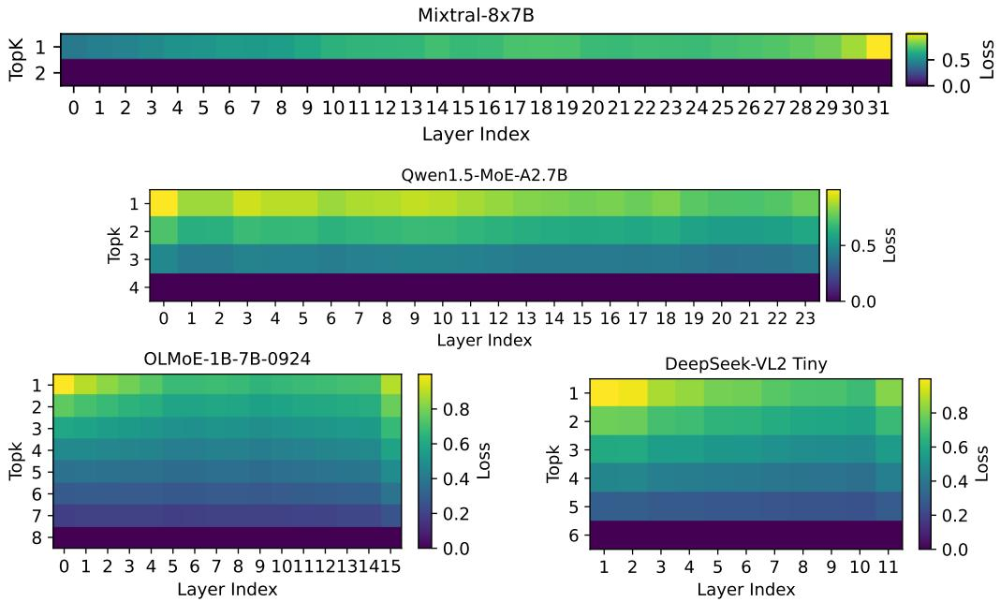
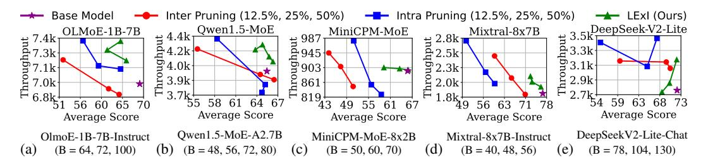
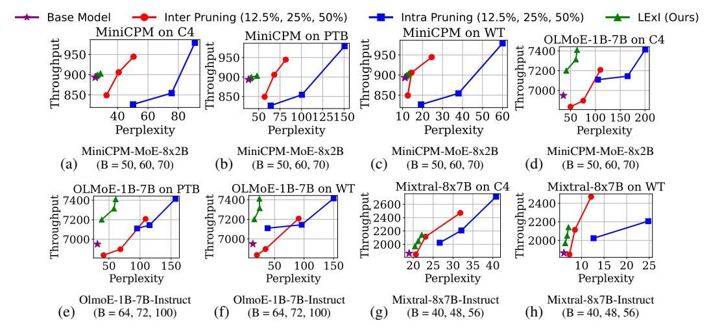
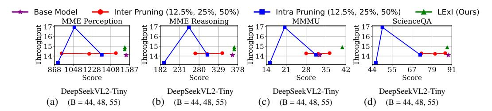

# 2 Background and Related Work

Mixture of Experts. Mixture-of-Experts (MoE) architectures improve the scalability and efficiency of LLMs/VLMs by introducing sub networks or experts. For a given input x, the output y of an MoE module is computed as a weighted sum over all the active top-k experts:  $y = \sum_{i=1}^{top-k} G(x)_i \cdot E_i(x)$ , where  $G(x) := \operatorname{Softmax}(\operatorname{TopK}[x \cdot W_g])$ . The  $\operatorname{TopK}[\cdot]$  function selects the top-k experts with the highest gating scores, and Softmax normalizes their scores into a probability distribution.  $G(x) \in \mathbb{R}^N$  is the gating vector representing the importance weights assigned to each expert in the top-k selected ones, and  $E_i(x)$  denotes the output of the i-th expert given input x. Each expert  $E_i$  is typically an FFN and constitutes the dominant portion of the parameters model (e.g., up to 96% in Mixtral).

**Pruning Large Language Models.** Model pruning is a well-established technique to reduce inference costs by removing less important parameters. Recent works such as SparseGPT (Frantar and Alistarh [2023]) and Wanda (Sun et al. [2023]) demonstrated one-shot pruning methods that introduce unstructured or semi-structured sparsity in weight matrices, cutting up to 50% of parameters in GPT-scale models with minimal perplexity loss. These approaches solve layer-wise reconstruction or use weight magnitude heuristics to remove weights, and have been applied to models as large as GPT-175B. However, the irregular weight sparsity pattern they induce often requires specialized hardware support to realize actual runtime speedups (Zhou et al. [2021]), and may suffer degraded efficiency on general-purpose accelerators.

Expert Pruning and Compression in MoE Models. Since MoE models typically allocate the vast majority of their parameters to the expert sub-networks, pruning even a subset of experts can lead to substantial memory savings. NAEE (Lu et al. [2024]) is a post-training expert pruning framework to permanently remove unimportant experts without needing to re-train the model. By evaluating each expert's contribution to the model's output on a small calibration set, NAEE identifies and permanently prunes the least significant experts. Furthermore, NAEE also introduced an inferencetime policy to dynamically skip experts for certain tokens on the fly, effectively adjusting the active expert count based on the input token. Another recent approach is MoE-I2 (Yang et al. [2024]), which introduces a two-stage compression pipeline tailored for MoEs. In the inter-expert pruning stage, MoE-I2 performs a layer-wise analysis to prune a fraction of experts to prune. The authors also introduce intra-expert compression to reduce the inner dimensionality of an expert's FFN. These advances in MoE-specific pruning highlight the growing interest in expert-level model trimming. Our proposed LExI method shares the overarching goal of exploiting expert redundancy to improve efficiency. However, rather than relying on static pruning, it focuses on adaptive expert utilization at inference time, offering a flexible and data-free alternative that preserves task performance while reducing computational cost.

### 3 Experimental Setup and MoE Expert latency Profiling

In this section, we evaluate the hardware performance of the MoE benchmarks to motivate our varying top-k solution. We first provide a detailed experimental setup used in all our evaluations. **Mixture-of-Experts Benchmarks.** We evaluate our method across a diverse set of MoE models spanning both language and vision-language domains. For LLMs, we consider *Mixtral-8x7B-Instruct* (Jiang et al. [2024]), *Qwen1.5-MoE-A2.7B-Chat* (Team [2024]), *OLMoE-1B-7B-0924-Instruct* (Muennighoff et al. [2024]), *MiniCPM-MoE-8x2B* (Hu et al. [2024]), and *DeepSeek-V2-Lite-Chat* (Liu et al. [2024a]). For VLMs, we use *DeepSeekVL2-Tiny* model (Wu et al. [2024]). These models exhibit a wide range of MoE architectures, varying number of experts and active experts per token, enabling a robust evaluation of our proposed method across heterogeneous settings.

**Evaluation Benchmarks.** We benchmark LLMs on nine widely adopted language understanding tasks from the lm-eval (Gao et al. [2024]) suite: *ARC-c* (Clark et al. [2018]), *ARC-e* (Clark et al.

<span id="page-3-0"></span>

Figure 2: Throughput vs. Active Experts under Inter and Intra Expert Pruning

[2018]), BoolQ (Clark et al. [2019]), HellaSwag (Zellers et al. [2019]), MMLU (Hendrycks et al. [2021]), OpenBookQA (Mihaylov et al. [2018]), RTE (Wang et al. [2018]), WinoGrande (Sakaguchi et al. [2019]). We report average accuracy across all these tasks to assess general-purpose language reasoning. For long content understanding, we employ Qasper dataset (Dasigi et al. [2021]) from the LongBench suite (Bai et al. [2024]) and report the F1 score as the evaluation metric. Additionally, we include a passkey retrieval task (Peng et al. [2023]), where the accuracy is measured as the percentage of instances (over 100 iterations and varying depths) in which the model correctly identifies a passkey from the garbage context. To evaluate language modeling quality, we compute perplexity on the C4 (Dodge et al. [2021]), PTB (Marcus et al. [1993]), and WikiText-103 (Merity et al. [2016]) datasets. For vision-language models, we use three benchmarks from the VLMEvalKit (Duan et al. [2024]) suite: MME (Yin et al. [2023]), MMMU Yue et al. [2024], and ScienceQA (Lu et al. [2022]). These datasets span a broad spectrum of multimodal reasoning tasks and allow us to evaluate our method's effectiveness in VLM setting.

Hardware and Software Setup. All inference performance evaluations are conducted on *NVIDIA H100 GPUs* with 80GB of HBM memory per GPU, supporting Tensor Cores for optimized matrix operations. We use vLLM (Kwon et al. [2023]) as our inference engine which is a high-performance framework with native support for MoE models via *FusedMoE*, which fuses expert computation and routing to improve efficiency. Unless otherwise specified, all LLMs are deployed on 4 GPUs, while DeepSeek-V2-Lite-Chat and DeepSeekVL2-Tiny use 2 GPUs. We employ tensor parallelism across devices for all models. During inference, we use a batch size of 16, with input and output sequence lengths varied across models to comply with each model's maximum context length constraints. We report *throughput* as our primary hardware performance metric, defined as the total number of tokens (input + output) processed per second. To calculate this, we first measure the *end-to-end latency*, defined as the time elapsed from input prompt submission to the generation of the final output token, and then convert this latency into throughput. The metric for VLMs is the number of input (image + text) samples process per second.

Inter and Intra Expert Pruning. Inter-pruning (Lu et al. [2024]) removes entire experts and their routing weights, reducing memory footprint while maintaining the same number of active experts per token during inference. Intra-pruning (Yang et al. [2024]) targets the inner dimensions (FFN intermediate size) within each expert, preserving the expert count while reducing individual expert complexity. In our evaluation, we consider the following percentages of these pruning:  $\{12.5\%, 25\%, 50\%\}$ . 12.5% inter pruning removes 1/8th of the experts in each layer, whereas 25% intra pruning prunes 1/4th of the FFN dimension in each expert of each layer. The top-k search space in our paper includes every integer from 1 up to the baseline pretrained top-k:  $1, 2, \ldots$ , top-k<sub>baseline</sub>.

Figure 2 illustrates the throughput of the six benchmark MoEs under varying degrees of pruning and top-k. Models with fewer active experts (e.g., MiniCPM, Mixtral) show marginal gains with

aggressive pruning, while models with more active experts (e.g., Qwen, OLMoE) exhibit complex interactions where pruning can improve or degrade throughput depending on token-to-expert routing balance and compute saturation. Notably, DeepSeek-VL2-Tiny shows throughput instability under pruning, suggesting higher sensitivity to expert load balance. The performance degradation stems from load imbalance across experts, leading to an increased number of tokens processed by each active expert.

### 4 LExI

LExI implements a two-stage pipeline to determine the optimal number of active experts per layer. In the first stage, it performs a one-time profiling to assess each layer's sensitivity to different top-k values. The sensitivity profiling methodology extends beyond expert allocation, serving as a foundation for diverse optimization problems such as layer-specific mixed-precision quantization or layer-wise pruning. The second stage employs a low-cost evolutionary search algorithm leveraging these sensitivity values as efficient proxies to identify the best performing top-k for each layer.

Stage 1: Per Layer MoE Top-K Perturbation Profiling: Algorithm 1 outlines our Monte Carlobased method to evaluate the sensitivity of each MoE layer under varying top-k configurations. For each layer, we sample a random synthetic input tensor  $\mathbf{X} \sim \mathcal{N}(0,1)^{B \times L \times H}$  from the standard normal distribution. We first compute the baseline output using the default top-k configuration, followed by computing outputs for each top-k in the target search space. The perturbation induced by each top-k is quantified using the Frobenius norm between the baseline output and the corresponding perturbed output. This process is repeated over millions of random input samples to obtain a statistically robust estimate of the average deviation for each candidate top-k. The Frobenius norm serves as a precise metric for capturing output magnitude shifts in high-dimensional space, while Monte Carlo sampling ensures diverse inputs. This sensitivity analysis provides a principled estimate of how active expert selection affects per-layer behavior.

**Algorithm 1:** LExI Stage 1: Per Layer Top-k Perturbation Loss Computation

```
Input:
                     \mathcal{M}_{\text{moe}}: Mixture of Experts module (Gate \mathcal{G} and Experts \mathcal{E}) T: List of target top-k values
                     k_{\text{base}}: Baseline Pretrained top-k
                                                                                                                                                                     B: Batch size
                     H: Hidden Size
                                                                                                                                                                     L: Sequence length
                     N_{\text{iter}}: Number of iterations
Output: Average Frobenius Norm per top-k
\mathcal{D} \leftarrow \{k : \emptyset \ \forall k \in T\};
for i \leftarrow 1 to N_{iter} do
        Sample a input tensor from Normal Distribution: \mathbf{X} \sim \mathcal{N}(0,1)^{B \times L \times H};
        \mathtt{UpdateTopk}(\mathcal{M}_{moe}, \mathit{k}_{base});
        \mathbf{Y}_{\text{base}} \leftarrow f_{\text{moe}}(\mathbf{X})

foreach k \in T do
           \left| \begin{array}{l} \mathsf{UpdateTopk}(\mathcal{M}_{\mathsf{moe}}, k); \\ \mathbf{Y}^{j}_{\mathsf{perturbed}} \leftarrow f_{\mathsf{moe}}(\mathbf{X}); \\ \Delta \leftarrow \|\mathbf{Y}^{j}_{\mathsf{perturbed}} - \mathbf{Y}_{\mathsf{base}}\|_{F}; \\ \mathcal{D}[k] \leftarrow \mathcal{D}[k] \cup \{\Delta\} \end{array} \right|
foreach k \in T do
   \begin{bmatrix} \bar{\Delta}_k \leftarrow \frac{1}{N_{\text{iter}}} \sum_{\delta \in \mathcal{D}[k]} \delta; \\ \mathcal{D}[k] \leftarrow \bar{\Delta}_k \end{bmatrix} 
return \mathcal{D}
```

Top-k Perturbation Sensitivity Analysis: Figure 3 visualizes the normalized sensitivity of different MoEs under various top-ks in the search space, measured using the Perturbation Loss ( $\Delta_k$ ). Higher values of  $\Delta_k$  indicate greater deviation from the baseline behavior, suggesting stronger sensitivity to changes in top-k. The sensitivity profiles vary notably across MoEs. For Mixtral-8x7B, early layers demonstrate greater sensitivity to reductions in the number of active experts, as indicated by lower perturbation loss, while later layers are more sensitive under top-k perturbation. Interestingly, this finding diverges from prior works (Dong et al. [2019]), which suggests that early layers are typically more susceptible to architectural or precision perturbations. In contrast, Qwen1.5-MoE-A2.7B exhibits a reversed pattern where early layers are particularly sensitive to top-k perturbations. DeepSeek

<span id="page-5-0"></span>

Figure 3: Top-k sensitivity analysis. The heatmap plots depict the layer-wise output deviation with respect to changing the top-k. The initial layers in Mixtral model are less sensitive to top-k perturbation than deeper layers, while OLMoE exhibits a bell curve pattern where initial and last layers are more sensitive. Heatmaps for MiniCPM and DeepSeekV2 are shown in Appendix A.2.

model displays a bell-shaped sensitivity profile, with both initial and final layers demonstrating higher perturbation loss, while intermediate layers remain relatively stable. These findings have practical implications for adaptive expert selection strategies suggesting that latency can be can be optimized by reducing the number of active experts in more robust (low-sensitivity) layers.

```
Algorithm 2: LExI Stage 2: Evolutionary Top-k Allocation Optimization with Proxy
              D: TopK Perturbed Frobenius Norm Loss
                                                                                B: Total Active Expert budget
              k_{\min}: Minimum topk per layer
                                                                                k_{\text{max}}: Maximum topk per layer
Input:
              N_{\text{pop}}: Population size
                                                                                G_{\text{max}}: Maximum generations
              \eta_{\text{mut}}: Mutation rate
                                                                                 L: Number of Layers
Output: Optimal topk allocation \mathbf{k}^* = (k_1, ..., k_L)
Initialize population \mathcal{P} \leftarrow \{\mathbf{k}_i\} where \mathbf{k}_i satisfies:
   \sum_{j=1}^{L} k_j = B (Model budget constraint) and k_{\min}^j \le k_j \le k_{\max}^j \ \forall j (layer constraints)
for g \leftarrow 1 to G_{max} do
     Evaluate fitness: \phi(\mathbf{k}) = \sum_{j=1}^{L} \mathcal{D}_{j}(k_{j})
     Select parents via tournament: \mathbf{p}_1, \mathbf{p}_2 \leftarrow \arg\min_{\mathbf{k} \in \mathcal{P}} \phi(\mathbf{k})
     Generate offspring via CROSSOVER:
     k_j' \leftarrow \alpha_j p_{1,j} + (1-\alpha_j) p_{2,j} \quad \  \alpha_j \sim \text{Bernoulli}(0.5) Apply MUTATION:
         k_j'' \leftarrow k_j' + \Delta_j \Delta_j \in \{-1, 0, +1\} with \sum_j \Delta_j = 0
     Project to feasible space:
         \mathbf{k}''' \leftarrow \text{Proj}(\mathbf{k}'') s.t. constraints hold
     Update population:
         \mathcal{P} \leftarrow \mathcal{P} \cup \{\mathbf{k}'''\}
return \mathbf{k}^* = \arg\min_{\mathbf{k} \in \mathcal{P}} \phi(\mathbf{k})
```

Stage 2: Evolutionary Search with Proxy: LExI utilizes the proxies generated in the previous step to guide the evolutionary algorithm to allocate layer-wise top-k as described in Algorithm 2. We define the total active expert budget (i.e. total number of active experts across all layers) B, minimum  $(k_{\min})$  and maximum  $(k_{\max})$  number of top-k per layer. The objective is to find a feasible allocation  $k^* = (k_1^* \dots, k_L)$  which minimizes the total layer-wise loss  $\sum_{j=1}^L \mathcal{D}j(k_j)$  (the

<span id="page-6-0"></span>

Figure 4: Average Accuracy ( $\uparrow$ ) vs Throughput ( $\uparrow$ ) on 9 LM-Eval Tasks (ARC-c, ARC-e, BoolQ, HellaSwag, MMLU, OBQA, RTE, WinoGrande). *B*: Active Expert Budget

sum of TopK Perturbed Frobenius Norm losses) across L layers, subject to the budget constraint  $\sum j = 1^L k_j = B$  and per-layer limits  $k_{\min} \leq k_j \leq k_{\max}$  for all j. We initialize a population of  $N_{\text{pop}}$  allocations (each satisfying the constraints) and then evolve this population over  $G_{\max}$  generations. In each generation, every candidate solution is evaluated by its fitness  $\phi(k) = \sum_{j=1}^L \mathcal{D}j(k_j)$ , and parent solutions are chosen (e.g. via tournament selection) to produce offspring. A pair of parents is recombined using uniform crossover, wherein each layer's allocation  $k_j$  in the offspring is inherited from one of the two parents. The offspring is then mutated and ensured that the total budget B remains unchanged (any increment in one layer's  $k_j$  is balanced by a decrement in another). After mutation, the new solution is added to the population. This evolutionary loop of selection, crossover, mutation, and repair is repeated for up to  $G_{\max}$  generations, after which the best found allocation  $k^*$  (the one minimizing  $\phi(k)$ ) is returned. By maintaining the proxies, our LExI algorithm effectively navigates the combinatorial search space of discrete allocations and finds solutions fast without needing to load the actual model, making it well-suited for optimizing top-k selection under various global active expert budgets where gradient-based methods require tremendous computational resources.

#### 5 Results and Evaluation

This section presents our evaluation results and key insights from these runs. We compare our results with the baseline model, Inter Pruning (Lu et al. [2024]) and Intra Pruning (Yang et al. [2024]).

LM-Eval Results. Figure 4 presents a comprehensive comparison of average accuracy versus throughput across five MoE models on nine LM-Eval benchmarks. Traditional pruning methods, inter-expert (red) and intra-expert (blue), consistently demonstrate a trade-off: reducing the number of parameters improves throughput but significantly degrades accuracy. In contrast, our proposed method, LExI (green), achieves a more favorable accuracy-throughput balance across all models. On OLMoE-1B-7B (Figure 4a), LExI with the active expert budget (B) = 100 achieves the same throughput as 50% intra-pruning while delivering +10% higher accuracy, and outperforms the 50%inter-pruning baseline by +15% higher accuracy. On Qwen1.5-MoE, LExI offers at least +5.1%higher throughput compared to both inter and intra pruning, with a consistent +0.5 % accuracy gain. For MiniCPM-MoE, LExI achieves +15% higher accuracy than 25% inter-pruned models at equivalent throughput, demonstrating superior accuracy-throughput tradeoffs. For Mixtral-8x7B, LExI surpasses the inter-pruned baseline by +10% accuracy at nearly identical throughput. Finally, on DeepSeekV2-Lite, LExI outperforms inter pruning with +6.5% higher throughput at equal accuracy, and recovers +6 accuracy points over intra pruning with only a minor throughput compromise. Notably, in Qwen1.5-MoE and MiniCPM-MoE, LExI not only avoids accuracy degradation but also achieves throughput comparable to or better than 50% inter- or intra-expert pruning. In summary, LEXI preserves accuracy close to the base model while delivering substantial throughput gains, often surpassing both pruning approaches. These results highlight the robustness and effectiveness of LExI's expert budget reallocation in preserving model performance while improving inference efficiency, demonstrating its superiority over uniform pruning.

Long context Evaluation. Figure 5 presents an accuracy-throughput comparison on the Qasper dataset for three different MoE models. Inter and intra pruning methods consistently reduce throughput but often come at a sharp cost in F1 score, particularly under higher pruning ratios. In contrast, our LExI method achieves a more favorable trade-off by dynamically reducing the number of active experts per layer based on sensitivity, leading to Pareto improvements (F1 score and throughput) in multiple cases. For example, in Qwen1.5 and DeepSeek models, LExI achieves higher throughput than the base model while maintaining competitive or superior F1 scores, demonstrating its efficacy in preserving task accuracy while enhancing inference efficiency. On Qwen1.5-MoE-A2.7B, LExI

<span id="page-7-0"></span>

<span id="page-7-1"></span>Figure 5: F1 Score ( $\uparrow$ ) vs Throughput ( $\uparrow$ ) on Qasper Dataset in LongBench. B: Active Expert Budget


Figure 6: Passkey Retrieval Average (†) vs Throughput (†) Comparison. B: Active Expert Budget

achieves a score of 35.5 at  $\sim 4.1$ k throughput, outperforming inter pruning (F1 34 at  $\sim 3.9$ k) and intra pruning (F1 30 at  $\sim 3.75$ k) with a +0.5–5.5 F1 gain and +5.1%–9.3% higher throughput.

**Passkey Retrieval Task.** Figure 6 illustrates the trade-off between throughput and average accuracy for the Passkey Retrieval task across five MoE models. This task evaluates a model's ability to extract precise key information embedded in distractive or noisy contexts, demanding both precision and robustness. Traditional inter- and intra-pruning approaches generally degrade performance, with noticeable accuracy drops even at moderate pruning levels. In contrast, our proposed LExI method consistently outperforms these baselines by achieving higher or comparable accuracy while significantly improving throughput. Notably, in models like OLMoE-1B-7B and Owen1.5-MoE, LEXI nearly restores or surpasses the base model's accuracy while offering improved efficiency. These results highlight LExI's strength in preserving critical retrieval capabilities under expert budget constraints, making it a superior choice for precision-sensitive tasks like passkey extraction.

**Perplexity Evaluation.** Figure 7 presents a comparison of perplexity vs. throughput across multiple MoE models and datasets, highlighting the limitations of traditional pruning techniques. Across models, LExI consistently offers a better accuracy-efficiency benefit, outperforming both the pruning baselines. Notably, pruning methods often yield modest throughput gains but at the cost of substantial perplexity degradation, especially evident in the OLMoE and Mixtral cases. In contrast, LExI achieves throughput improvements close to aggressive pruning levels while almost preserving the perplexity of the base model. For example, on Mixtral-8x7B, LExI achieves  $\sim 2.4$ k throughput at  $\sim 23$ perplexity on C4 dataset and  $\sim$ 2.2k throughput at  $\sim$ 10 perplexity on WikiText, whereas interpruning attains the same speedup with double the perplexity. This indicates that static expert reduction via LExI enables smarter compute allocation, unlike pruning, which disrupts the expert-token mapping and leads to suboptimal routing and load imbalance.

Ablation Study on Vision Language Domain. Figure 8 evaluates the LExI method on DeepSeekVL2-Tiny across four vision-language tasks. While intra-pruning peaks at 25% intra pruning at the cost of sharp accuracy drops, its performance is highly unstable and inconsistent across tasks. Inter-pruning, on the other hand, exhibits a flat trade-off curve that fails to provide significant speedups. In contrast, LExI consistently achieves superior accuracy and throughput balance, yielding improvements without compromising performance. Unlike pruning, which disrupts expert specialization and introduces fragility, LExI leverages structured top-k expert budget selection that preserves model capacity while enabling efficient routing, making it a more robust alternative for optimizing sparse VLMs.

#### Limitations

Our approach has two primary limitations. First, it does not reduce the memory footprint of the MoE model. Unlike prior expert pruning methods that explicitly target improving memory efficiency by removing parameters, our method focuses solely on optimizing computational performance during

<span id="page-8-0"></span>

Figure 7: Perplexity (↓) vs Throughput (↑) on C4, PTB & WikiText(WT) B: Active Expert Budget

<span id="page-8-1"></span>

Figure 8: DeepSeekVL2-Tiny: Average Accuracy (†) vs Throughput (†) on MME, MMMU, ScienceQA Tasks in VLMEvalKit. B: Active Expert Budget

inference. This means that while our approach can significantly speed up inference by reducing the number of expert computations, it does not reduce model size. As a result, it is less effective in memory-constrained deployment scenarios. Nevertheless, our method can be effectively combined with existing MoE pruning methods, enabling a joint optimization of both computational efficiency and model memory. Second, our method may underperform in settings where the top-\$k\$ expert search space is inherently limited. Our approach relies on selectively reducing the number of active experts during inference to gain computational efficiency. However, in architectures such as Llama-4, where each MoE layer is pretrained with only a single active expert, there is no flexibility to reduce active experts further. In such scenarios, our method becomes inapplicable.

#### 7 Conclusion

In this paper, we propose LExI, a framework designed to determine the optimal number of active experts per layer of a pretrained MoE model. LExI achieves better throughput than both inter and intra expert pruning baseline methods across six different MoE models. Unlike uniform expert pruning, which can yield speedups only at the cost of substantial accuracy loss, our method delivers substantial throughput gains while preserving model accuracy/perplexity close to the original baseline. For example, on OLMoE-1B-7B, Mixtral-8x7B, and DeepSeek, LExI maintains accuracy nearly identical to the unpruned model yet attains notably higher throughput, often surpassing the accuracy of pruned models. In certain scenarios, this layer-adaptive approach achieves higher throughput than the base model with the same task performance, highlighting the robustness of the proposed approach. For example, on OLMoE-1B-7B model, our approach matches the throughput of 50% Intra pruned model with 10% better accuracy. Also, LExI's benefits come with no retraining or calibration dataset requirements. It is a data-free post-training method that optimizes without any calibration dataset or fine-tuning. This makes LExI a practical inference-time optimization technique that reduces latency, inter-GPU communication overhead, and memory bandwidth usage by determining the optimal number of active experts per layer, all while incurring negligible accuracy loss.

