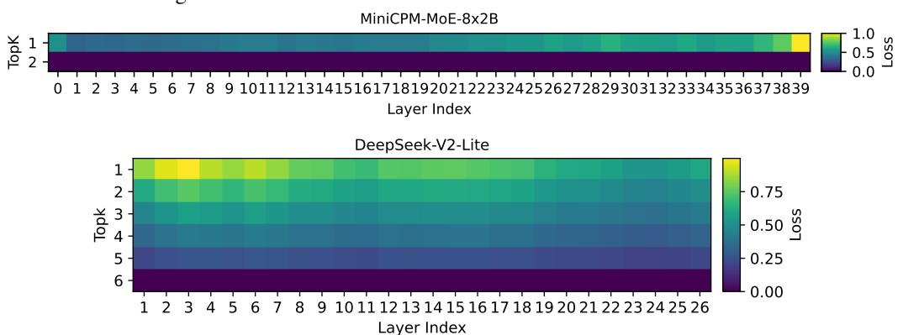

# A Appendix

### A.1 Mixture of Experts Model Setup

Table 1 illustrates the hyperparamters of each MoE model we utilized in our evaluation.

| Table 1. LEW and VEW MOE Models |        |         |          |      |         |
|---------------------------------|--------|---------|----------|------|---------|
| Model                           | #P (B) | #Layers | #Experts | TopK | FFN Dim |
| DeepSeek VL2-Tiny               | 3      | 12      | 64       | 6    | 896     |
| OLMoE-1B-7B-0125-Instruct       | 6.92   | 16      | 64       | 8    | 1024    |
| Qwen1.5-MoE-A2.7B-Chat          | 14.3   | 24      | 60       | 4    | 1408    |
| DeepSeek-V2-Lite-Chat           | 15.7   | 27      | 64       | 6    | 1408    |
| MiniCPM-MoE-8x2B                | 17     | 40      | 8        | 2    | 5760    |
| Mixtral-8x7B-Instruct-v0.1      | 46.7   | 32      | 8        | 2    | 14336   |

Table 1: LLM and VLM MoE Models

### A.2 Additional Heatmaps for top-K sensitivity

Figure 9 illustrates the topk sensitivity heatmaps for MiniCPM-MoE and DeepSeekV2 Lite Chat model based on Algorithm 1.

Figure 9: Top-k sensitivity analysis across MiniCPM-MoE-8x2B and DeepSeekV2-Lite. The plots depict the layer-wise output deviation with respect to changing the top-k. The initial layers in MiniCPM model are less sensitive to topk perturbation than deeper layers, while DeepSeekV2 exhibits a bell curve pattern where initial and last layers are more sensitive.