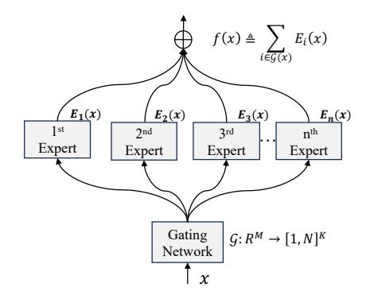
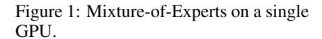
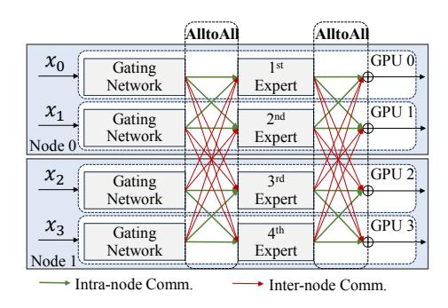
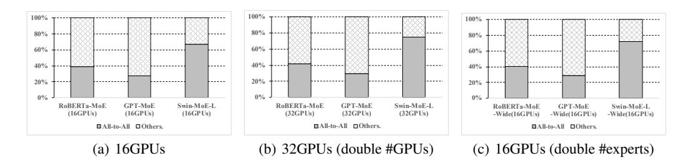
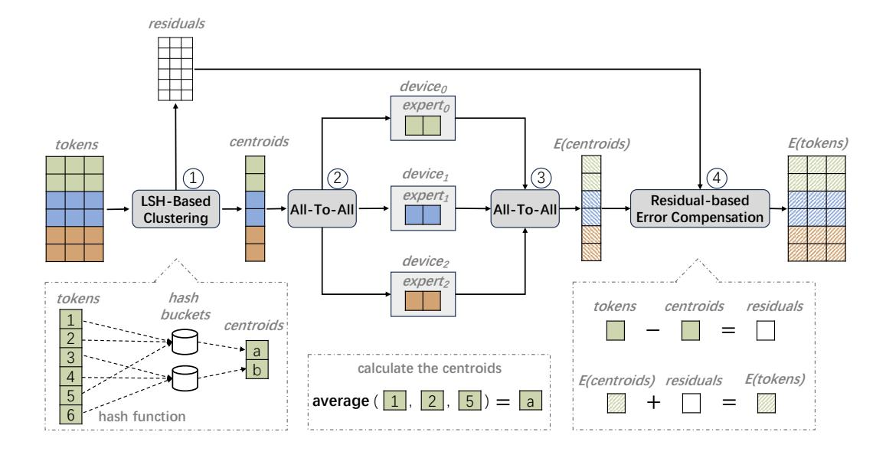

# 2.1 Mixtures-of-Expert Architecture

To enhance the training efficiency of Transformer models, William et al. (2022) [\[9\]](#page-10-3) introduced an innovative paradigm, the sparse mixture-of-eexperts (MoE) architecture, illustrated in Figure [1.](#page-2-0)

Figure 2: Training Mixture-of-Experts on multiple GPUs as expert parallelism.

This architecture effectively balances parameter capacity and training costs, and comprises two key components: an *expert network* ( $\mathcal{E}$ ) and a *sparse gate network* ( $\mathcal{G}$ ). It is evident that MoE models, with an equal number of active parameters per input, can significantly surpass the performance of dense models. This breakthrough has also catalyzed further research and their application across various industries, as highlighted by numerous subsequent studies [5, 14, 22, 23, 25, 30, 39].

The expert network  $\mathcal E$  is composed of multiple specialized and separate networks, commonly referred to as experts, denoted as  $\{E_i\}_{i=1}^N$ , where N represents the number of experts. Additionally,  $E_i(x)$  denotes the output produced when the input x is processed by the i-th expert. Each expert is trained to excel in a specific sub-task, such as in multi-task learning, or to handle specific segments of data, as seen in language modeling and multi-modal learning, thereby increasing the overall model capacity. In foundational models, the MoE layer often serves as a substitute for the traditional feed-forward network (FFN) layer. Within each MoE layer, each FFN function works as an individual expert, significantly enhancing the model's capability to process diverse and complex data inputs.

The gating network  $\mathcal{G}$  plays a crucial role in the sparse MoE architecture. For example, in a K-way gated MoE system, the gating network outputs a set of integers as Equation 1 to determine which experts should be activated. This decision is based on the characteristics of the input itself, allowing for a dynamic and efficient allocation of computational resources. By only processing each input token with a selected subset of the expert network, the MoE model achieves computation sparsity, effectively decoupling parameter capacity from training costs.

$$\mathcal{G}: \mathbb{R}^M \to [1, N]^K \tag{1}$$

Through the integration of multiple specialized experts, as described by Equation 2, the sparse MoE model is capable of delivering more accurate and efficient predictions as f(x). This is achieved by leveraging the specialized knowledge embedded within each expert, combined with the strategic input allocation managed by the gating network.

$$f(x) \triangleq \sum_{i \in \mathcal{G}(x)} E_i(x) \tag{2}$$

While MoE's primary advantage is decoupling parameter capacity from network cost, a key challenge lies in learning the gating parameters effectively, as the output's sparsity makes it non-differentiable. Consequently, much of the research in the MoE field has centered on developing methods for learning gating functions. These methods fall into three main categories, as outlined in [6]: routing via learnable weighting [9, 24, 30], deterministic hash routing [31], and reinforcement learning-based routing [2, 32, 33]. These approaches primarily differ in the design of the gating network  $\mathcal G$  rather than the expert network  $\mathcal E$ , and therefore all encounter similar scaling challenges.

### 2.2 Challenges of Scaling MoE Model Training

While MoE models were initially developed to facilitate efficient scaling during training, deploying these large-scale models in practical GPU-intensive environments poses significant challenges in

Figure 3: Proportion of all-to-all communication time relative to total training duration across different configurations: scaling the number of training servers (Figure [3\(b\)\)](#page-3-1) and scaling the parameter size of models (Figure [3\(c\)\)](#page-3-2).

distributed computing. Specifically, the MoE layer harbors a considerably higher number of parameters and requires additional memory, yet it maintains almost the same computational demands as the dense layer. This leads to a unique *compute density* — defined as the ratio of the layer's FLOPs (Floating Point Operations) to its number of parameters. Therefore, traditional parallelism methods such as *tensor parallelism* and *pipeline parallelism* are insufficient for achieving effective parallelism in the scenarios of MoE training.

To improve the efficiency and scalability of training large-scale MoE models, *expert parallelism* [\[17\]](#page-11-5) has been introduced as a specialized model parallelism strategy. This approach distributes experts within an MoE layer across multiple GPUs, while leveraging data parallelism for replicating non-MoE layers, thus efficiently managing the training workload of MoE models. The workflow of distributed training for an MoE layer is depicted in Figure [2.](#page-2-3) Once the target expert for each token is determined, an all-to-all communication process is triggered to distribute tokens to their corresponding target experts for computations, denoted as Ei(x). Subsequently, another round of all-to-all communication is executed to gather the outputs from all experts, which produces the MoE layer's output (represented as f(x), Equation [2\)](#page-2-2). Subsequent operations involve executing the data-parallel non-MoE layers.

We first profiled the training process of three popular MoE models employing expert parallelism (detailed in Table [1\)](#page-6-0) on a cluster comprised of four A100 machines, each equipped with an interconnect RDMA bandwidth of 200Gb/s. The proportion of all-to-all communication time relative to the total training duration is illustrated in Figure [3\(a\).](#page-3-3) We then double the number of machines, and the number of experts to increase the model scale. The results are shown in Figure [3\(b\)](#page-3-1) and [3\(c\),](#page-3-2) respectively. Our findings reveal that all-to-all communication accounted for a substantial portion of the total time: approximately 30% in GPT-MoE (15B), 40% in RoBERTa-MoE, and 70% in Swin-MoE-L. And this overhead remains nearly constant in larger models and at larger machine scales. These results highlight a significant bottleneck that hampers the scalability of the training process. Consequently, the duration of all-to-all communication substantially constrains training with expert parallelism, leading to reduced overall throughput and limiting the potential to scale up the number of experts effectively.

#### 2.3 Locality-Sensitive Hashing Algorithms

Locality-Sensitive Hashing (LSH) is a probabilistic method primarily used to approximate nearest neighbor search in high-dimensional spaces, which reduces the dimensionality of data by mapping similar data to the same "buckets" with high probability using hash functions. This approach offers a substantial reduction in computational complexity, particularly beneficial for large-scale data applications. The key operations in LSH including:

Mapping Data into Buckets: The core of LSH is a family of hash functions that maximize the probability of nearby points in the original space staying close in the hashed space, while distant points are likely to end up in different buckets. Each hash function h is characterized by the property: P[h(x) = h(y)] = 1 − d(x, y)/D, where d(x, y) is the distance between points x and y, and D denotes the diameter of the space. To map similar data into the same bucket, multiple hash functions from this family are selected based on the specific attributes of the data (e.g., Euclidean distance, cosine similarity) and the desired granularity of the buckets. Data points are then hashed by these

Figure 5: Schematic of MoE training with Locality-Sensitive Hashing (LSH-MoE).

functions, and each point is assigned to buckets according to its hash values, effectively categorizing similar items together for clustering.

**Calculating Cluster Centroids:** By grouping data points into buckets as determined by their hash values, data points are effectively clustered. Each bucket represents a cluster of data points and the centroid of each cluster is then calculated as the mean of all points within that cluster, formulated as  $C_j = \frac{1}{n} \sum_{i=1}^{n_j} x_i$ , where  $C_j$  is the centroid of the j-th bucket,  $n_j$  is the number of points in the j-th bucket, and  $x_i$  are the data points in the bucket.

