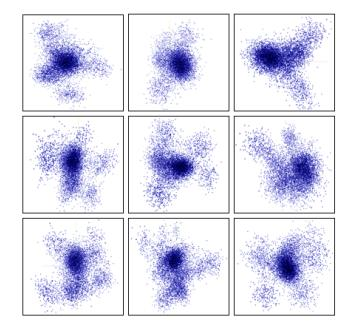

# 3 Methodology

### 3.1 The Motivation of Token Similarity

To explore the potential optimization for all-to-all communications in MoE training, we conducted an in-depth analysis of the data involved in these all-to-all communications, identifying a high degree of similarity, termed *token similarity*. Specifically, we applied *Principal Component Analysis* (PCA) to reduce the dimensionality of the input tokens of all-to-all communications and observed a distinct clustering phenomenon, as illustrated in the Figure 4. Our analysis suggests that the observed similarity among tokens may stem from two primary factors:

- Data Related Influences: The similarity is partially due to the nature of real-world data, which often adheres to Zipf's Law [18]. This results in a skewed distribution, with certain data elements appear more frequently than others.
- Model Structure Related Influences: The design of Transformer architecture [34], especially its attention mechanisms, significantly impacts token similarity. In models like BERT [7], attention layers are designed to capture and integrate context information across tokens, thus homogenizing token representations and emphasizing their shared semantic relationships at the sentence level.

Figure 4: Principal Component Analysis (PCA) Visualization of input tokens involved in all-to-all communication.

