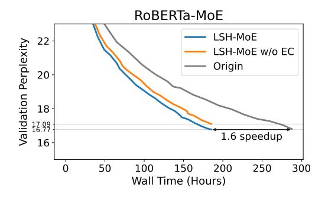
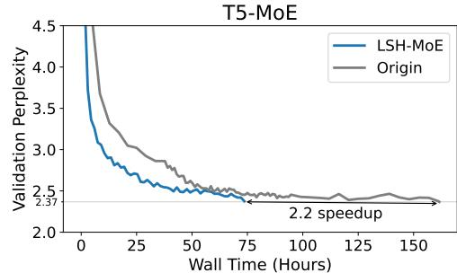

# 4.3 Software and Hardware Environments

To thoroughly evaluate the effectiveness of our method, we conducted experiments on two clusters, V100 cluster and A100 cluster. Additionally, to ensure consistency in software versions, we performed experiments on both machines using the same docker image.

Software Environment. Our experiments were conducted using a docker image built upon the official NVIDIA GPU containers, which includes Ubuntu 20.04, CUDA 11.3, cuDNN 8.2.0, and NCCL 2.12.7, accessible at NVIDIA GPU Containers [3](#page-7-0) .

V100 Cluster. The first hardware environment includes two servers, each outfitted with eight NVIDIA V100 (32GB) GPUs. Within each server, GPUs are interconnected using NVLink 2.0 technology. The servers are interconnected via an RDMA NIC, providing a network bandwidth of 100 Gbps.

A100 Cluster. The second hardware environment consists of four servers, each equipped with eight NVIDIA A100 (40GB) GPUs. Within these servers, GPUs utilize NVLink 3.0 technology for interconnection. The servers are linked through two RDMA NICs, enhancing the network bandwidth to 200 Gbps.

We allocated the experiments involving RoBERTa-MoE and GPT-MoE to the V100 cluster, while T5-MoE and Swin-MoE were tested on the A100 cluster. This setup allowed us to effectively compare the performance impacts across different hardware configurations.

#### 4.4 Overall Performance

In general, to evaluate our LSH-MoE training approach, which compresses communication data, there are two crucial questions:

- 1. Does the LSH-MoE method enable normal model convergence, and is there a risk of increased loss variability during this process, potentially leading to instability in training?
- 2. Might the implementation of the LSH-MoE method adversely affect the model's performance on downstream benchmarks?

Therefore, we conducted experiments focusing on both Convergence Performance and Benchmark Performance to validate the effectiveness of our method. In this section, due to the necessity of selecting several hyperparameters for LSH, such as the type of hash function and the quantity of hash functions, we have opted for the cross-polytope hash function based on empirical evaluation, setting the number of hash functions at 6. A detailed examination of the effects stemming from variations in these parameters will be methodically addressed in the upcoming ablation study (Section [4.5\)](#page-8-0).

Convergence Performance. We pre-trained the RoBERTa-MoE and T5-MoE using open-source datasets and industrial datasets, respectively. In our approach, we substitute the FFN (Feed-Forward Network) layer with an MoE (Mixture of Experts) layer in alternating layers, as detailed in Section [4.2.](#page-6-4) We meticulously tracked the time required to achieve equivalent model performance levels (perplexity) during training, as depicted in Figure [6.](#page-8-1) The results indicate a significant acceleration in training convergence when employing the LSH-MoE method: 1.6× faster for RoBERTa-MoE and 2.2× faster for T5-MoE, compared to the original models' convergence rates. Furthermore, we investigated the role of error compensation in this process. Our findings reveal that omitting error compensation in the LSH-MoE model led to a 0.3 point increase in perplexity, given the same training duration. This observation underscores the efficacy of the error compensation algorithm.

3 <https://catalog.ngc.nvidia.com/orgs/nvidia/containers/pytorch>

Figure 6: Comparative analysis of convergence performance. This includes a comparison between the original models, LSH-MoE without Error Compensation, and LSH-MoE implementations. The perplexity curves are applied 1D Gaussian smoothing with  $\sigma=0.5$ .

Table 2: Evaluation of LSH-MoE on the GLUE benchmark.

GPT-MoE (15B) GPT-MoE (52B) T5-MoE (10B) Dataset Origin Ours Origin Speed Ours Speed Origin Ours SST-2 93.8% 93.8% 94.3% 51.6% 50.9% 1.3× 94.5% 1.4× MNLI 82.8% 82.7%  $1.4 \times$ 84.1% 84.3%  $1.4 \times$ 52.6% 52.1% QNLI 90.2% 90.0%  $1.5 \times$ 49.5% 50.0% 86.6% 86.7%  $1.3 \times$ QQP 88.8% 88.7%  $1.3 \times$ 88.9% 88.9%  $1.2 \times$ **MRPC** 71.3% 71.1%  $1.3 \times$ 76.3% 76.1%  $1.3 \times$ **COLA** 72.3% 72.4%  $1.4 \times$ 73.5% 73.8%  $1.5 \times$ 

Table 3: Results of finetuning Swin-MoE on the ImageNet-1K dataset.

|                           | Origin | Ours  |
|---------------------------|--------|-------|
| Top-1 Acc. ↑ Top-5 Acc. ↑ | 84.7%  | 84.5% |
| Top-5 Acc. ↑              | 97.0%  | 97.1% |
| Compression Rate       | _      | 11.7% |
| Sample/s                  | 184.3  | 236.6 |

**Benchmark Performance.** To better validate the performance of LSH-MoE on downstream tasks, we fine-tuned the GPT-MoE and Swin-MoE on different datasets using open-source model checkpoints, and evaluated zero-shot performance of our internal pre-trained T5-MoE model, adhering to their original architectural designs that incorporate Top-2 gating, as detailed in [1, 12, 17].

We first utilized the LSH-MoE method for fine-tuning the GPT-MoE of two model scales (i.e. 15B and 52B) on the GLUE benchmark, yielding impressive outcomes. As detailed in Table 2, the implementation of the LSH-MoE method substantially reduced communication overhead while maintaining nearly the same level of accuracy. This strategy resulted in a significant performance boost, achieving an acceleration rate ranging from  $1.2\times$  to  $1.5\times$ . The results also demonstrate that as the parameter size of MoE models increases, LSH-MoE continues to achieve significant improvements without compromising model accuracy. Additionally, we report the zero-shot accuracy of the pre-trained T5-MoE, showing that the T5-MoE models trained with LSH-MoE achieved accuracy comparable to standard T5 models, confirming LSH-MoE's efficacy in pretraining. Because the limited number of tokens in the pre-trained dataset and its out-of-domain nature compared to the GLUE evaluation data, the zero-shot performance metrics are relatively low.

Furthermore, our evaluation of the LSH-MoE method in fine-tuning the Swin-MoE on the ImageNet-1K dataset demonstrated noteworthy efficiency. We achieved a communication compression rate of 11.7%, which led to a  $1.28\times$  increase in acceleration, as reported in Table 3. Notably, this was accomplished while preserving almost the same level of accuracy.

