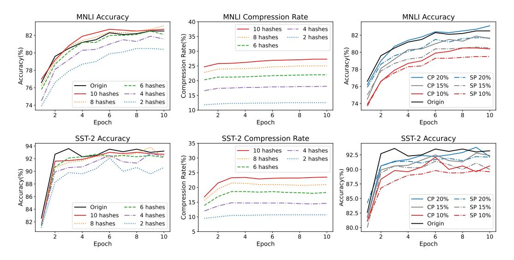

# 4.5 Ablation Study

To study the impact of the quantity and types of hash functions, we conducted ablation experiments by fine-tuning the GPT-MoE (15B) model on the MNLI and SST-2 datasets in the GLUE benchmark.

**Impact of the Quantity of Hash Functions.** We controlled the number of hash functions to indirectly adjust the LSH compression rate, exploring its effect on model performance. Specifically, we utilized 2, 4, 6, 8, and 10 hash functions. As shown in the middle sub-figure in Figure 7, we observe that an increase in the number of hash functions enlarges the number of buckets, enhances data distinction and, consequently, the compression rate. Besides, we indicate from the left sub-figure in Figure 7, that more hash functions leads to improved model convergence quality and worse compression rate.

Figure 7: An in-depth analysis of the compression rate and the model performance by adjusting the **quantity** and **types** of hash functions. The left and middle sub-figures are results for diverse quantities of hash functions. The right sub-figure is the result for diverse types of hash functions (CP for cross-polytope and SP for spherical) with different compression rates (20%, 15%, 10%).

Importantly, our results indicate that a compression rate of approximately 20% (achieved with about 6 hash functions) is optimal for maintaining nearly identical convergence as uncompressed models. Therefore, we choose 6 as the default number of hash functions in Section 4.4.

Impact of the Types of Hash Functions. We further explored the impact of the types of hash functions with Cross-Polytope Hashing (CP) and Spherical-Plane Hashing (SP). The outcomes are illustrated in the right sub-figure in Figure 7. CP generally achieves better convergence than SP at the same compression rate. This is attributable to CP's ability to more effectively handle a variety of complex data patterns. CP encodes data based on an n-dimensional cross-polytope, while SP relies on the geometric relationships between spheres and planes. Thus, CP is more generalizable across a variety of complex data patterns while SP performs better with data that has spherical distribution characteristics. Other works (e.g. Reformer [16]) also use CP to leverage the sparsity of attention mechanisms. Therefore, we finally choose **cross-polytope hashing** as the default type of hash functions in Section 4.4.

#### 5 Conclusion

Our study tackled the latency challenges inherent in training sparse-gated Mixture-of-Experts (MoE) models with our innovative LSH-MoE framework. Utilizing locality-sensitive hashing to harness token similarities, our approach significantly reduces communication overhead. The integration of a residual-based error compensation scheme further preserves model integrity under compression. Empirical tests across various models, including RoBERTa, GPT, T5, and Swin, showcase LSH-MoE's capability to accelerate both pre-training and fine-tuning phases by up to  $2.2\times$ , paving the way for efficient and scalable MoE applications in real-world settings.

