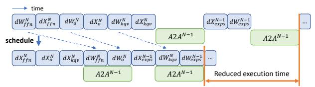
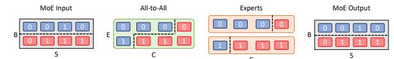
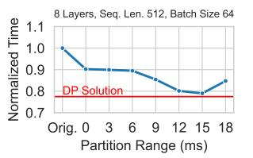

# 2 BACKGROUND AND MOTIVATION

#### 2.1 Mixture of Experts (MoE)

Most MoE models [\(Shazeer et al.,](#page-12-0) [2017;](#page-12-0) [Lepikhin et al.,](#page-11-0) [2020\)](#page-11-0) replace the feed-forward module in every two Transformer layers with multiple independent sub-networks (experts), each activated by a subset of input data. Different experts are usually placed on distinct devices for efficient parallelization. In this work, we assume non-MoE parts of the model are replicated across the devices while receiving different partitions of the training data (i.e., data parallelism). The assignment (routing) of inputs to experts is decided by a gating function at runtime.

Expert-parallelism Once the gating function determines expert assignments, all-to-all communication transmits inputs to the respective devices. After expert processing, another all-to-all operation sends their output back to the original devices. Due to dynamic expert assignment at runtime, token distribution among experts varies. To maintain static tensor shapes (essential for certain frameworks/hardware like XLA/TPU [\(Lepikhin et al.,](#page-11-0) [2020\)](#page-11-0)) and ensure balanced computation across experts, a common approach is to restrict the maximum tokens assigned to each expert (expert capacity, C) on each device [\(Lepikhin et al.,](#page-11-0) [2020;](#page-11-0) [Fedus](#page-11-0) [et al.,](#page-11-0) [2022\)](#page-11-0). Any excess tokens assigned to an expert are

Figure 2. Breakdown of execution time when running a GPT-2 model with MoE layers using Tutel and DeepSpeed on Amazon EC2 p3dn instances. *Orig*.: unoptimized execution time. *Curr*.: performance upper-bound when optimized using current overlapping methods (expert computation completely hidden by all-to-all). *Opt*.: ideal execution time (all-to-all fully overlapped by computation).

discarded, while experts receiving fewer than  ${\cal C}$  tokens are zero padded.

Routing algorithms Routing is often computed by assigning a gating score for each expert using a trainable linear layer, and choosing k experts with highest scores (top-k routing) (Lepikhin et al., 2020; Fedus et al., 2022). Recent works also propose other routing methods, such as hash-based (Roller et al., 2021) or random expert assignment (Zuo et al., 2022; Chen et al., 2023) and expert-choice routing (Zhou et al., 2022) (experts choose top-k tokens with highest scores). Routing algorithms significantly influence MoE model training, impacting expert balance (Zhou et al., 2022), communication costs (He et al., 2022) and more. The upcoming sections also demonstrate how routing algorithms affect feasible optimizations.

#### 2.2 Overlapping all-to-all and experts

Existing techniques aim to mitigate long latency all-to-all impacts on training by overlapping it with expert computation (Hwang et al., 2023; He et al., 2022). This involves partitioning all-to-all and experts along the capacity dimension and forming a communication-computation pipeline with (only) all-to-all and experts (Fig. 4b). As shown in Fig. 2, we often observe the all-to-all time significantly surpasses that of the experts (up to 3.36x). Therefore, these techniques can only conceal the execution time of experts, while the bottleneck execution time for all-to-all communication remains unaffected.

#### 2.3 Opportunities and Challenges

By extending the focus region to the whole training graph, we identify more opportunities that can overlap with all-to-all communications.

**Opportunity 1: Weight gradient computation.** Computation of the weight gradient in layer N, which is essential

(a) Forward and backward pass of Z=ReLU(X); Y=ZW. dX: activation gradient computation; dW: weight gradient computation. Gray block: tensors; Blue block: operators. Note that dReLU (and further back-propagation of  $\frac{\partial L}{\partial Z}$ , if needed) does not depend on dW.

(b) Overlapping all-to-all communication by scheduling weight gradient computation (dW). Superscripts on operators indicate the layer number, with the first layer after the MoE layer (during forward) numbered layer N. Subscripts indicates the type of operators: ffn: non-expert feed-forward;  $\circ$ : output projection in self-attention; kqv: key, query and value projection; exps: experts. Other operators are ignored. While the figure shows overlapping all-to-all in layer N-1 with dWs in layer N, in general the all-to-all can be overlapped with any dWs in layer  $N+k,k\geq 0$ .

Figure 3. Scheduling weight gradient computation to overlap with all-to-all.

for updating model parameters, is independent of all-to-all communication of previous layers  $N-1,N-2,\ldots,1$  in the backward pass. Consequently, it can be scheduled to overlap with all-to-all, allowing for flexibility in optimizing the training time (Fig. 3).

**Opportunity 2: Non-MoE computation.** In existing systems (e.g., (Hwang et al., 2023; He et al., 2022)), computation before (e.g., self-attention) and after (e.g., the following Transformer layer) the MoE layer does not overlap with all-to-all communication since their limited focus region. Nevertheless, if we partition non-MoE computations and integrate them into the computation-communication pipeline, we can create additional opportunities to overlap operations with the all-to-all communication (Fig. 4c, 4d).

Challenge 1: How to perform mathematically equivalent partition. Consider feeding a tensor with dimension  $B \times S$  (B as batch size, S as sequence length) into an MoE layer (in Fig. 5). The tokens are re-arranged according to their target experts, undergoing an all-to-all with shape  $E \times C$  (E as the total number of experts, C as the expert capacity) for distributing to the corresponding device. Each expert processes the C received tokens, followed by a reciprocal all-to-all (not shown in the figure). Reverting tokens to their original order yields the MoE layer's output. The existing

(c) Overlap all-to-all, experts and the non-MoE computation after the current MoE layer.

(d) Also overlap non-MoE computation before the current MoE layer.

Figure 4. Performance gain of different overlapping types.

methods all partition the all-to-all and experts at the capacity dimension (C), and thus the tokens in same partition appear in irregular locations in the re-arranged MoE output, e.g., belong to different sequences across the batch (Fig. 5a). Therefore, the following computation must wait until all partitions finish execution, interrupting the pipeline.

In order to overlap forward pass non-MoE computation with all-to-all, the MoE input and output must be partitioned along the batch dimension. However, directly partitioning the input (micro-batching) may result in extra token dropping since the expert capacity also drops accordingly. For example, consider a input batch (with corresponding expert capacity C) partitioned into two micro-batches, each processed with expert capacity  $\frac{1}{2}C$ . Assume the first microbatch contains  $\frac{3}{4}C$  tokens for an expert, and the second contains  $\frac{1}{4}C$  tokens for that expert. If not partitioned, then all tokens can fit into expert capacity C thus no token will be dropped. When directly partitioned,  $\frac{1}{4}C$  tokens will be dropped from the first micro-batch since it now only has expert capacity  $\frac{1}{2}C(\text{Fig. 5b})$ . Such change in mathematical equivalency is undesirable as it may affect model performance.

To avoid this effect, we implement special gating operators that pass capacity information between partitions (e.g., when the first partition (micro-batch) uses  $\frac{3}{4}C$  capacity, the second partition will adjust its remaining capacity to  $\frac{1}{4}C$ ), preserving the exact token-to-expert mapping and token dropping as the un-partitioned case. This however implies that any partition can send any amount of token (ranging from 0 to C) to an expert (while tokens sent from all partitions add up to C) (Fig. 5c). We implement irregular-shaped all-to-all to efficiently handle such a dynamic communication pattern (details discussed in Sec. 6).

(a) Operator partition dimensions of Tutel. All-to-all and experts are partitioned at capacity dimension; tokens belong to different partitions appear at irregular locations in the output of MoE layer.

(b) Direct micro-batching. All-to-all and experts capacity also drops proportionally, causing extra token dropping.

(c) Micro-batching with irregular expert capacity. All-to-all and experts are irregularly partitioned, while MoE inputs and outputs are partitioned at batch dimension (facilitating further pipelining).

Figure 5. Operator partitioning scheme in an MoE layer. Number in each token shows their assigned expert. Tokens of the same color belong to the same sequence.

Challenge 2: How to determine the optimal partition range for non-MoE operators. GPU kernel launches involve startup overhead (Rotem et al., 2018), which occurs with each launch. Partitioned computation operators deal with smaller input tensors, potentially leading to GPU core under-utilization. Similarly, smaller communication operators might not fully utilize network bandwidth. So it is not always optimal to partition the entire Transformer layer before and after MoE layer, which may increase training time due to partition overheads. Fig. 6 shows this phenomena. The optimal partition range (a set of computation ops around all-to-all) depends on model specification, input size, the underlying computation power and also network bandwidth. Our extension of the focus region to whole training graph makes the decision more challenging.

Furthermore, the gating methods limit the partitioning opportunities. Some gating methods assign target experts based on the information calculated over the entire batch of tokens. For example, Batch-prioritized Routing (Riquelme et al., 2021) sorts tokens in a batch first by their "importance score" (the sum of top-k largest gating scores) and then assigns tokens to experts. So tokens with lower scores would be dropped first. Splitting along batch dimension would thus cause differences in token dropping. For such gating methods, we can only extend partitioning after the MoE layer (Fig. 4c). For other gating methods whose expert assignment can be decided from partial batches (e.g., Switch (Fedus et al., 2022) or Random (Zuo et al., 2022; Chen et al., 2023) gating), we can extend partitioning to both after and before the MoE layer (Fig. 4d).

(a) Less layers, large batch size (b) More layers, small batch size

Figure 6. Effect of partition range on GPT-2 MoE model forward time on 16 A100 GPUs (32 experts). X axis shows how many ops (measured in their execution time) before and after the MoE layer is included in the partition. *Orig.*: no partitioning. 0: only partition all-to-all and experts (as in Tutel).

Figure 7. Overview of Lancet modules.

#### 3 LANCET OVERVIEW

To address the opportunities and challenges mentioned above, we devised Lancet, a compiler-based solution designed to optimize MoE model training. The key advantage of this approach is the explicit extraction of a model's computation and communication through compilers' intermediate representation (IR), granting precise control over operator execution and simplifying the implementation of weight gradient computation scheduling and the partition of operators.

Lancet adopts compiler passes to enhance MoE model training and resolve associated issues. At a higher level, it encompasses two primary optimization passes: weight gradient computation scheduling and operator partitioning, modifying the backward and forward pass of the model, respectively. Fig. 7 gives an overview of Lancet.

1) Weight Gradient Computation Schedule Pass (§4) takes the model IR as input, which is a sequence of instructions, and re-orders the instructions corresponding to weight gradient computation operators to overlap with all-to-alls during backward propagation. Dependency analysis is first performed to identify the weight gradient computation instructions that can be overlapped with each all-to-all (§4.1). Then for each all-to-all op, we employ a best-fit greedy algorithm to choose a set of weight gradient computation ops with comparable total execution time to maximize overlap

(§4.2).

2) **Operator Partition Pass** (§5) receives the IR with weight gradient computation scheduled and further optimizes the all-to-alls in the forward pass through partitioning and pipelining. A dynamic programming algorithm is employed to find the optimal partition range for non-MoE ops (§5.1). During this process, a partition axis inferencer (§5.2) employs a constraint programming algorithm to deduce the partition axis for each instruction, facilitating partitioning of IR. Then, a pipeline scheduler (§5.3) estimates the cost of the resulting computation-communication pipeline, guiding the dynamic programming algorithm.

These optimizations are supported by a Caching Op Profiler, which profiles and caches the execution time of all ops in the model IR. Profiling is done once for each (partitioned) operation with the same shape; the cached execution time can be subsequently reused. Communication costs (e.g., partitioned all-to-all) are estimated by a Communication Cost Model. The communication cost model is built by profiling communication operations across various input sizes (e.g., 1KB, 2KB, 4KB, ..., up to the maximum possible communication used in models), and the cost is linearly interpolated among these points. Since Lancet uses irregular-shaped all-to-alls (Fig. 10), their execution time depend on the combination of actual amount of data to be communicated, which is not known at compilation time. Therefore, we resort to a static-shape approximation: the cost of an n-partitioned all-to-all with original capacity C is obtained by querying the profiled (uniform-shaped) cost model at capacity C/n. We observe that such approximation suffices to produce a good prediction of overall iteration time during our experiments (Fig. 14).

