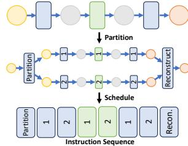

# 4 WEIGHT GRADIENT COMPUTATION SCHEDULE PASS

The weight gradient computation schedule pass takes the model IR describing the training iteration as input and reorders the instructions to overlap weight gradient computation with all-to-alls. The IR is represented as a sequence of instructions  $\mathcal{I} = [I_1, I_2, \cdots, I_N]$ ; each instruction is characterized by its input tensors  $\mathbf{x}$ , output tensors  $\mathbf{y}$ , and operator  $f \colon I_n = (\mathbf{x^n}, \mathbf{y^n}, f^n)$ , representing the operation  $y_1^n, y_2^n, \cdots, y_{|\mathbf{y^n}|}^n = f^n(x_1^n, x_2^n, \cdots, x_{|\mathbf{x^n}|}^n)$ .

## 4.1 Weight Gradient Computation Labelling

Due to the fine-grained nature of instructions, identifying weight gradient computation instructions becomes challenging. While there is no direct dependency between weight gradient computation and all-to-alls, the weight gradient computations must adhere to the constraints imposed by the chain rule, which imposes scheduling restrictions. There-

<span id="page-5-0"></span>fore, we first identify the set of weight gradient computation instructions that can be overlapped with each all-to-all by analyzing instruction dependencies. Consider a dependency graph  $G = (\mathcal{I}, \mathcal{E})$ , where each directed edge  $E_{i,j}$  asserts that  $I_i$  depends on  $I_i$ , i.e.,  $I_i$  consumes the output of  $I_i$ thus must be executed after it. Then, a weight gradient computation instruction  $I_i$  can be overlapped with an all-to-all instruction  $I_a$  if and only if there is no directed path between  $I_i$  and  $I_a$  in G. Such paths can be discovered by a simple Depth- or Breadth-first Search algorithm. For each all-to-all instruction  $I_a$ , we compute the set of instructions that can overlap with it as  $\mathbf{W}^{I_a}$ , which is used in the scheduling algorithm.

#### Weight Gradient Computation Scheduling

We then optimize the scheduling of labelled weight gradient computation operations to minimize the overall training time. Determining the schedule of weight gradient computation is equivalent to deciding an assignment of each weight gradient computation operator to an all-to-all with which it will overlap. Let  $\mathcal{I}^W$  be the sub-sequence of  $\mathcal{I}$  containing all weight gradient computation instructions, and  $\mathcal{I}^a$  be the sub-sequence containing all all-to-alls. Let variable  $x_{i,j} = 1$ if  $I_i^W$  (the *i*th weight gradient computation instruction) is assigned to  $I_i^a$  (the jth all-to-all), and otherwise  $x_{i,j} = 0$ . The execution time of  $I_i^W(I_i^a)$  is  $t_i^W(t_i^a)$ . Then maximization of total overlapped all-to-all execution time can be formulated as the following integer program:

$$\max_{\mathbf{x}} \quad \sum_{j=1}^{|\mathcal{I}^a|} \min\{t_j^a, \sum_{i=1}^{|\mathcal{I}^W|} t_i^W \cdot x_{i,j}\}$$
s.t. 
$$\sum_{j=1}^{|\mathcal{I}^a|} x_{i,j} \le 1, \quad \forall \ i \in [1, |\mathcal{I}^W|]$$

$$x_{i,j} = 0, \qquad \forall \ I_i^W \notin \mathbf{W}^{I_j^a}$$
(2)

$$x_{i,j} = 0, \qquad \forall I_i^W \notin \mathbf{W}^{I_j^a}$$
 (2)

The  $\min\{t_j^a, \sum_{i=1}^{|\mathcal{I}^W|} t_i^W \cdot x_{i,j}\}$  gives the amount of overlapped time in each all-to-all. Constraint (1) states that each weight gradient computation instruction can only be used to overlap with at most one all-to-all. (2) restricts the assignment based on instruction dependency calculated during weight gradient computation labelling.

Such a problem is a generalized assignment problem (GAP) with non-linear objective and additional constraints (2). Since GAP is already known to be NP-hard (Martello & Toth, 1990), we resort to a greedy heuristic. We sequentially iterate through  $\mathcal{I}^a$ : for each  $I_i^a$ , weight gradient computation instructions are greedily chosen from  $\mathbf{W}^{I_i^a}$ , that are not already used to overlap with other all-to-alls and minimize the absolute difference between the all-to-all execution time and sum of all weight gradient computation to be overlapped with it. We proceed to the next all-to-all when the current

Algorithm 1 Weight Gradient Computation Schedule Pass

```
Input: \mathcal{I} - a sequence of instructions
Output: \mathcal{I}' - scheduled instructions
  1: \mathbf{G} \leftarrow \text{CreateDependencyGraph}(\mathcal{I})
  2: /* Weight gradient computation labelling */
  3: \mathcal{I}^a \leftarrow [I_i \in \mathcal{I}|f^i \text{ is all-to-all}]
  4: \mathbf{W}^{I_i} \leftarrow \{\} for each I_i \in \mathcal{I}^a
5: for I_i \in \mathcal{I}^a, I_j \in \mathcal{I}, I_i \neq I_j do
  6:
              if no directed path between I_i and I_j then
  7:
                     \mathbf{W}^{I_i}.insert(I_i)
  8:
              end if
  9: end for
10: /* Weight gradient computation scheduling */ 11: \mathbf{t}^a, \mathbf{t}^W \leftarrow \text{GetInstrExecTime}(\mathcal{I})
12: \mathbf{W}^{used} \leftarrow \{\}
13: \mathbf{Asg} \leftarrow \{\} /* map recording the assignment results */
14: for i \in |\mathcal{I}^a| do
              t_u \leftarrow \mathbf{t}_i^a /* unoverlapped time of all-to-all i */
               while t_u > 0 and \mathbf{W}^{I_i^a} \cap (\mathcal{I} - \mathbf{W}^{used}) \neq \emptyset do
                   /* Find available instr that best matches t_u */
j_{\min} \leftarrow \operatorname{argmin}_j\{|t_u - t_j^W| \big| I_j^W \in \mathbf{W}^{T_i^2}, I_j^W \notin \mathbf{W}^{\text{used}}\}
17:
18:
                   \begin{aligned} & t_u \leftarrow t_u - t^W_{j_{\min}} \\ & \mathbf{W}^{\text{used.insert}}(I^W_{j_{\min}}) \\ & \mathbf{Asg.insert}(\{I^W_{j_{\min}}: I^a_i\}) \end{aligned}
19:
20:
22:
23: end for
24: \mathcal{I}' \leftarrow \text{ReorderInstrs}(\mathbf{Asg})
```

one is fully overlapped.

After deciding the assignment of weight gradient computation, we reorder the instructions, placing them right after their overlapping all-to-all instructions. This ensures the weight gradient computation start execution immediately following the launch of all-to-all communication. Alg. 1 presents the entire weight gradient computation scheduling process.

#### **OPERATOR PARTITION PASS**

With the scheduled instructions from the weight gradient computation scheduling pass, we next hide all-to-alls in the forward pass through extensive operator partitioning.

#### 5.1 Partition Range Selection

Selecting a proper range of non-MoE computation to partition is crucial to maximize overlap and minimize overheads. Different gating functions affect the type of non-MoE operators we can partition (only ops after the MoE layer, or both before and after the MoE layer). The number of partitions (how many parts each operator is partitioned into) also affects model performance. We introduce a dynamic programming-based algorithm to optimize the aforementioned decisions.

<span id="page-6-0"></span>Given an instruction sequence (for forward pass)  $\mathcal{I}$  =  $[I_1, I_2, \cdots, I_N]$ , let T(n) denote the end-to-end execution time (after considering overlapping) of instructions 1 to n when we have optimally partitioned these instructions. Then, we have

$$T(n) = \min_{1 < i < n-1} \{T(i) + \min_{1 < k < K} P(i,n,k)\}$$

where P(i, n, k) is the end-to-end execution time of instructions i to n if they are partitioned into k parts and their computation and communication components (all-to-all) arranged to overlap with each other. K is the maximum allowed number of partitions which is a hyper-parameter. If there is no valid way to partition instructions i to n(e.g., if unsupported gating function is included), we let  $P(i,n,k) = \infty$ . The partition axes (dimensions through which the input and output tensors will be split) of each instruction  $i, \ldots, n$  is determined by our partition axis inferencer. Then the partitioned instructions are scheduled to overlap each other (form a computation-communication pipeline) by our *pipeline scheduler*, which reports the end-toend execution time after partition as P(i, n, k). The optimal end-to-end execution of the entire forward pass of the model is thus T(N).

The dynamic programming algorithm requires  $O(N^2K)$ evaluations of cost P(i, n, k) in total, since there are N T(n)s to evaluate and each T(n) requires K(n-1) evaluations of P(i, n, k). In practice, the number of partitions k is limited by the size of the partitioned dimension (e.g., if we are partitioning along the batch dimension and the batch size is 4, we can have at most 4 partitions). Partition overhead also limits very fine-grained partitioning (in our experiments, we never observed the optimal number of partitions exceeding 4). Therefore, K can be safely set to a relatively small value (e.g., 8). To further reduce optimization time, we group several consecutive instructions together based on execution time (e.g., total execution time sum up to 2ms) and perform dynamic programming on these groups instead. Due to partition overhead, an optimal communication-computation pipeline would likely be not very long. Therefore we can also limit the range of i (i.e., set a maximum length limit on the partition ranges). Suppose there are N' instruction groups in total and the maximum partition range is G groups. Then the algorithm requires an O(N'GK) number of P(i, n, k) evaluations in total.

#### **Partition Axis Inference**

To identify the partition axis of each instruction's input and output, we formulate a constraint satisfaction problem. For the *n*th instruction in the input sequence, let  $a_{x_i}^n$  represent the partition axis of its *i*th input, and  $a_{u_i}^n$  for its *i*th output. For each different operator (f in the instructions), we define function  $F_{\mathcal{Z}}^f: \mathbf{a_x} \times \mathbf{a_y} \mapsto \mathcal{Z}$  which takes the input and out-


(a) Partition axis of data tensors in different partition types. Orange arrow indicates pipeline input (output) tensors. Blue begin and end locations, where rectangle: computation instrucextra partition/reconstruction in- tion; Green rectangle: commustructions are needed.



(b) Transforming an instruction sequence to form a pipeline. Yellow (orange) circles denote

Figure 8. Operator partitioning.

put axes of an instruction I as input and returns a constraint  $\mathcal{Z}^{\mathcal{I}}$  (a boolean expression). Such a constraint specifies how the input and output axes of the instruction should relate for a valid partition (i.e., the original output can be reconstructed from the partitioned ones). Take matrix multiplication  $Y = X \cdot W$  as an example: we can split X along the row (1st) dimension and not change W, resulting in Y partitioned in the row axis  $\left( \begin{bmatrix} X_1 \\ X_2 \end{bmatrix} W = \begin{bmatrix} X_1 W \\ X_2 W \end{bmatrix} \right)$ ; or we can keep X and split W along the column (2nd) axis, partitioning Y in the column axis  $(X[W_1, W_2] = [XW_1, XW_2])$ . To capture the above possible partition axes combinations, we have the following constraint:

$$(a_{x_1} = 0 \land a_{x_2} = -1 \land a_{y_1} = 0) \lor (a_{x_1} = -1 \land a_{x_2} = 1 \land a_{y_1} = 1)$$

 $a_{x_1}, a_{x_2}, a_{y_1}$  are partition axes for X (the 1st input), W (the 2nd input) and Y (the 1st output) respectively (dimension index starting from 0; -1 means not partitioned). We also introduce a special partition axis  $A_{irr}$  for each MoE-related operator, to represent the irregular partition of all-to-all and experts in our extended computation-communication pipeline (Fig. 5c). The constraints for all-to-alls and experts are written to accept partition at capacity axis if the partition range (i, n) only covers the all-to-all and experts, and  $A_{irr}$ , otherwise. Correspondingly, we write  $F_{\mathcal{Z}}$  of the MoE gather operator to only allow its input to be partitioned at  $A_{irr}$  but not the capacity axis, and  $F_{\mathcal{Z}}$  of the gating function (if it can be partitioned) to allow batch-partitioned inputs and generate  $A_{irr}$  partitioned outputs (Fig. 8a).

If the constraints of all instructions are satisfied, every original tensor can be reconstructed from the partitioned ones, asserting correctness of the partition. We also require that the partition axes of the same tensor cannot be changed, since switching the partition axes requires data from other partitions thus interrupting the computation-communication pipeline. Putting the above together, we have the following constraint satisfaction problem:

<span id="page-7-0"></span>

Figure 9. Pipeline schedule by stages. Blue rectangle: computation instructions; Green: communication. Numbers indicate partition index (i.e., the nth partition).

$$\begin{split} & \text{find} \quad \mathbf{a} \\ & \text{s.t.} \quad F_{\mathcal{Z}}^{f^i}(\mathbf{a}_{\mathbf{x}}^{\mathbf{i}}, \mathbf{a}_{\mathbf{y}}^{\mathbf{i}}) = 1, \quad \forall \ i \in [1, N] \\ & \quad a_{y_j}^i = a_{x_l}^k, \qquad \quad \forall \ (i, j, k, l) \in \mathcal{D} \end{split}$$

where D describes tensor dependency between operators: indices (i, j, k, l) ∈ D if the jth output of instruction i is fed to the lth input of instruction k.

Solving the problem (e.g., using an off-the-shelf solver like OR-Tools [\(Perron & Furnon,](#page-11-0) [2019\)](#page-11-0)) gives the partition axes of all input/output tensors of the partitioned operators. The corresponding partitioned instructions are generated and sent to the pipeline scheduler (Fig. [8b\)](#page-6-0).

#### 5.3 Pipeline Scheduling

To organize the partitioned instructions into a computationcommunication pipeline, the instructions in each partition are divided into stages. Each stage contains all computation or communication that can be consecutively executed. Instructions in each stage of a partition are always scheduled together. Within each stage, instructions from the different partition are ordered by partition index (e.g., the first partition always gets scheduled first, and then the second and so on). The resulting schedule is demonstrated in Fig. 9.

To obtain the end-to-end (pipelined) execution time of partitioned operators P(i, n, k), we simulate the execution timeline by calculating the start and end time of each instruction relative to pipeline start. Specifically, each instruction's start time is the maximum over (i) the end time of all instructions that it depends on and (ii) the end time of the previous computation/communication instruction (of the same type) in the scheduled order. P(i, n, k) is thus the end time of the last instruction, which is reported back to guide the dynamic programming procedure.

