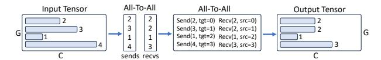

# 6 IMPLEMENTATION

Lancet is generally applicable to any deep learning compiler for training. We adopt RAF [\(Yu et al.,](#page-12-0) [2023\)](#page-12-0), an open-source compiler extended from Apache TVM [\(Chen et al.,](#page-11-0) [2018\)](#page-11-0), as our underlying compiler, which provides a comprehensive compilation of DL models. We implement Lancet with

Figure 10. Implementation of irregular all-to-all. G: number of GPUs participating in the all-to-all, G = E/El (El: the number of experts per GPU). On each device, an input and output buffer of fixed shape (G × C) is allocated. Number in the Input/Output Tensors indicate the actual size of the data to be sent/received on the GPU. The first All-to-All communicates the data sizes to be exchanged; the second All-to-All communicates the actual data. Send/Recv(x, tgt/src=y) indicates an NCCL send/recv primitive that sends/receives a data chunk of size x to/from y.

13K LoC in C++. Communication primitives such as allto-all are implemented based on NCCL [\(NVIDIA,](#page-11-0) [2021\)](#page-11-0). Lancet also implements partition constraints (FZ ) for all computation operators in common Transformer-based models. The MoE dispatching ops are implemented based on Tutel's [\(Hwang et al.,](#page-11-0) [2023\)](#page-11-0) kernel.

Since Lancet is fully implemented in two optimization passes as IR transformations, users only need to enable them in RAF's optimization pass manager, without any modification to the existing code-base. The three hyper-parameters for speeding up the optimization process (i.e., ρ, the maximum number of partitions; γ, the group size; ι, maximum partition range in dynamic programming) can be set through environment variables.

Irregular all-to-all (all-to-allv in MPI [\(Message Passing In](#page-11-0)[terface Forum,](#page-11-0) [2021\)](#page-11-0) terminology) sends different amounts of data to different target devices. In MoE layers, the amount of data to send to each device depends on the gating function and is only known at runtime (Fig. [5c\)](#page-3-0). To implement such dynamic communication scheme in a static-shaped system like Lancet, we allocate the input and output tensors based on the maximum amount of data to be sent (i.e., capacity of each expert). As shown in Fig. 10, at runtime, the input buffer is only partially filled based on the result of the gating function. A first all-to-all is performed to exchange the amount of data to be sent and received across devices, followed by a second all-to-all only sending and receiving the required amount of data. The all-to-alls are implemented via a grouped NCCL communication consisting of NCCLSends and NCCLRecvs.

