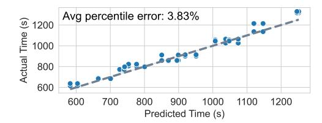
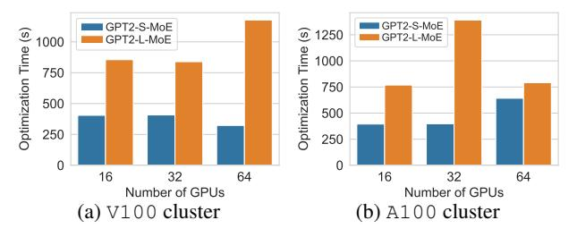
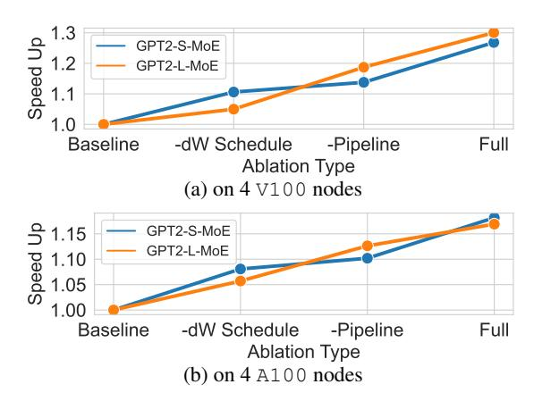

# 7 EVALUATION

Experiment Setup We evaluate Lancet on an Amazon EC2 p4de.24xlarge cluster and a p3dn.24xlarge cluster, each with 8 nodes. Each p4de node has 8 NVIDIA A100 80GB GPUs and 4x100 Gbps NICs. Each p3dn node has 8 NVIDIA V100 GPUs and one 100 Gbps NIC. We refer to the cluster of p4de.24xlarge and p3dn.24xlarge nodes as A100 and V100 respectively, for the rest of the paper. All nodes run in the same docker environment where we used Ubuntu 20.06 with CUDA 11.3 and NCCL 2.12.12 with PXN enabled.

Benchmark Models and Datasets We conduct our evaluations on MoE versions of the GPT-2 [\(Radford et al.,](#page-11-0) [2019\)](#page-11-0) model (from Huggingface transformers [\(Wolf et al.,](#page-12-0) [2020\)](#page-12-0) version 4.18.0). The base models are enhanced by replacing every other Transformer block's feed-forward layer with an MoE layer. Two variants of the model are used: the smaller model (GPT2-S-MoE) has 12 layers with hidden dimension size 768; the larger one (GPT2-L-MoE) has 24 layers with hidden size 1024. In all experiments, we scale the number of experts along with the number of GPUs: each GPU always hosts two experts. The SGD optimizer (with momentum) is used for training the model.

For all experiments, we use the WikiText [\(Merity et al.,](#page-11-0) [2016\)](#page-11-0) dataset as model inputs. We fix the input sequence length to 512 and use the largest batch size that can fit into the GPU memory for each model: on A100, we use batch size 24 per GPU for GPT2-S-MoE and 48 for GPT2-L-MoE. On V100, we use batch size 16 for GPT2-S-MoE and 8 for GPT2-L-MoE.

Baselines We compare Lancet's training performance with DeepSpeed (version 0.5.8, without Tutel's kernels) [\(Rasley et al.,](#page-12-0) [2020\)](#page-12-0) and Tutel (version 0.3) [\(Hwang](#page-11-0) [et al.,](#page-11-0) [2023\)](#page-11-0). Tutel implements overlapping between all-toall and expert computation. For each experiment with Tutel, we search through the overlapping degree (the number of partitions) of 1, 2, 4 and 8 and report the best result.Tutel and DeepSpeed are both built on PyTorch [\(Paszke et al.,](#page-11-0) [2019\)](#page-11-0), whose performance on computation ops may be different from RAF [\(Yu et al.,](#page-12-0) [2023\)](#page-12-0). Therefore, we also include results of RAF without Lancet's modifications for comparison.

Hyper Parameters We set the maximum number of partitions ρ to 8, except when excessive partitions cause outof-memory (OOM) errors. In that case, we reduce it to 4 (and 2 if still OOMs). We set the group size γ according to the model execution time so that there are 5 groups between each MoE layer. The maximum partition range ι is set to be the execution time between two MoE layers, so one pipeline will be formed per MoE layer.

#### 7.1 Throughput

We compare Lancet's training throughput against baselines using different numbers of GPUs. We do weak scaling, i.e., keep the local batch size fixed at each GPU while the effective total batch size of the model scales linearly. Since gating method constraints the available pipeline range, we run the

experiments with two different gating methods: Switch [\(Fe](#page-11-0)[dus et al.,](#page-11-0) [2022\)](#page-11-0) gate which allows overlapping with computation both before and after the MoE layer (Fig. [4d\)](#page-3-0) and Batch Prioritized [\(Riquelme et al.,](#page-12-0) [2021\)](#page-12-0) gate which only allows overlapping with computation after the MoE layer (Fig. [4c\)](#page-3-0).

Fig. [11](#page-9-0) shows that Lancet achieves up to 1.21x (1.17x on average) speed up compared to the baselines on the A100 cluster, and up to 1.3x (1.22x on average) on V100 cluster when using Switch gate. We find DeepSpeed exhibits slightly higher memory requirements than other frameworks, leading to OOM on A100 when running the GPT2-S-MoE model (OOM does not happen on V100 since a smaller batch size is used, i.e., 24 v.s. 16). When using Batch Prioritized gate (Fig. [12\)](#page-9-0), we observed up to 1.24x (1.17x on average) speed up on the A100 cluster, and up to 1.24x (1.21x on average) on V100 cluster. Despite more constraint pipeline range, the achieved speed up for Batch Prioritized gate is overall similar to that of the Switch gate. This is because despite only pipelining with computation after the MoE layer, significant amount of overlapping can still happen. Our dW scheduling is also unaffected by the gating methods. The maximum achieved speed up on V100 is lower when using Batch Prioritized gate though, indicating that partitioning may have a larger impact on V100.

As shown in Fig. [13,](#page-9-0) Lancet achieves a higher level of computation-communication overlapping than baselines, reducing non-overlapped communication time by up to 69% (A100) and 83% (V100) compared to RAF, 66% (A100) and 77% (V100) compared to Tutel. The trade-off of applying partition-pipeline is also clearly shown in Fig. [13.](#page-9-0) While Lancet's optimizations decrease the end-to-end execution time, the total execution time of computation (Nonoverlapped Computation + Overlapped) ops can be higher than that of RAF, due to partition overheads. Since Lancet implements irregular all-to-alls and do not transmit any padding tokens between experts, the overall communication time (Non-overlapped Communication + Overlapped) can be lower than baselines.

#### 7.2 Accuracy of cost model

Fig. [14](#page-9-0) shows the accuracy of Lancet's cost model, used to predict the iteration time after applying each optimization. The prediction error is very small (3.83%). Such an accurate cost model provides useful information to guide our weight gradient computation scheduling and DP-based operator partitioning algorithms.

#### 7.3 Optimization Time

Fig. [15](#page-9-0) shows the time taken to optimize the models in our experiments. Optimization time is dominated by the operator partition pass (Sec. [5\)](#page-5-0) since weight gradient computation

Figure 11. Training iteration time when using Switch gate. Red cross indicates out-of-memory.

Figure 12. Training iteration time when using Batch Prioritized gate.

GPT2-L-MoE

GPT2-S-MoE

Figure 13. Iteration time decomposition. DS: DeepSpeed.

Figure 14. Prediction accuracy of Lancet's cost model. Data aggregated from all models bench-marked on all clusters during our experiments.

Figure 15. Lancet's optimization time when using Switch gate.

schedule (Sec. 4) uses a fast greedy algorithm. Since every device shares the same computation graph, the optimization time is less affected by the number of GPUs used and more by the number of layers in the model. The optimization time of most models bench-marked is below 20 minutes. Our optimization also only requires one GPU to run (for bench-marking execution time of partitioned computation ops).

#### 7.4 Ablation Study

To show the effects of weight gradient computation scheduling and pipelining separately, we conduct an ablation study

on 4 A100 and V100 nodes. In Fig. 16, the relative speedup is computed by dividing the training throughput under each scheme by that of RAF without any Lancet optimizations. For both models, applying only scheduling or only pipelining yields a lower speedup compared to using them together. On both clusters, GPT2-L-MoE is affected more by disabling weight gradient computation scheduling, while the two optimizations have more similar performance gain on GPT2-S-MoE. This is because GPT2-L-MoE has more parameters and layers while using a smaller batch size, thus having higher partition overheads, rendering weight gradient computation scheduling more effective compared to operator partition.

Figure 16. Ablation study on 4 A100 and V100 nodes. dW: weight gradient computation.

## 8 DISCUSSION AND RELATED WORKS

#### Compatibility with other large-scale training techniques

While Lancet is evaluated with data and expert parallelism, the techniques are in principle compatible with most other commonly used training optimizations. Weight gradient scheduling only utilizes operator dependency during backward propagation, thus unaffected by most distributed training sharding techniques. Some techniques introduce extra communication which may interfere with partition-based all-to-all overlapping. FSDP/ZeRO3 (Rajbhandari et al., 2020) inserts additional all-gather communication in the forward passes, which may require additional scheduling to avoid interference with overlapped all-to-all. Tensor parallelism (Shoeybi et al., 2019) requires all-reduce communication after self-attention; Ring-attention (sequence parallelism) (Liu et al., 2023) communicates the key-value blocks during the attention process. If different devices or communication channels are used for expert and tensor/sequence parallelism (e.g., inter-node vs. intra-node), the overlapped all-to-all communication can be arranged to execute concurrently with tensor/sequence parallelism traffic. Investigating the efficient orchestration and overlapping of communication arising from various sharding techniques, particularly the intricate patterns generated by automatic sharding (Zheng et al., 2022), remains future work.

**Optimizing irregular communication and expert computation** Lancet's partition produces irregular-shaped all-to-alls and expert computation. While we use a simple NCCL based implementation (Fig. 10), better communication implementations targeting such dynamic workload may further improve the performance. Similarly, the shape irregularity in expert computation may cause extra computation due to padding. Block-sparse expert kernels (e.g., MegaBlocks (Gale et al., 2023)) can be further applied to accelerate the computation.

MoE architectures that facilitate overlapping PR-MoE (Rajbhandari et al., 2022) and DeepSeek-MoE (Dai et al., 2024) use a shared expert which all tokens are routed to. The all-to-all communication (for non-shared experts) can also be overlapped with the computation of such shared expert. Lancet's approach can be applied to a wider-range of MoE models that use traditional architectures, e.g., (Jiang et al., 2024).

Other MoE training optimization techniques Tutel (Hwang et al., 2023) and FasterMoE (He et al., 2022) are two popular frameworks optimizing for MoE models. Both frameworks support overlapping all-to-all and expert computation. Tutel (Hwang et al., 2023) also implements fast dispatching kernels, better all-to-all algorithm, and adaptive parallelism switching for dynamic workloads. Faster-MoE (He et al., 2022) proposes techniques to handle imbalanced expert selection and to select experts based on network topology. These optimizations are orthogonal to ours and can potentially be used in conjunction. (Zhang et al., 2022) proposes to run two copies of the model on the same device, overlapping computation and communication between different model replicas. However, splitting the input among the two model replicas may result in mathematical in-equivalence (e.g., due to extra token dropping). (Li et al., 2023a) optimizes MoE training by prioritizing all-to-all traffic over all-reduce traffic, avoiding bandwidth contention and improving all-to-all latency. This method can also be used in conjunction with Lancet.

#### 9 CONCLUSION

This paper presents Lancet, a system to automatically optimize MoE model training. We extend the optimization space of current methods and seek whole-training-graphlevel opportunities to overlap all-to-all communication. In the forward pass, we overlap all-to-all with both expert and non-MoE computation through proper partitioning and pipelining. The optimal partition range is determined by a dynamic programming algorithm. In the backward pass, we schedule weight gradient computation to overlap all-to-all using an best-fit greedy algorithm. Experimental evaluation shows that Lancet reduces non-overlapped communication time by up to 77%, and achieves up to 1.3x end-to-end speed up compared to state-of-the-art solutions.

#### 10 ACKNOWLEDGEMENTS

We would like to thank the anonymous reviewers for their valuable feedback. This work was supported by an Amazon Research Award (ARA) on AWS AI and grants from Hong Kong RGC under the contracts HKU 17208920, 17204423 and C7004-22G (CRF).

