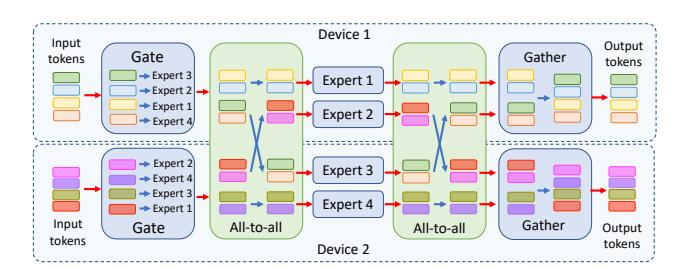

# LANCET: ACCELERATING MIXTURE-OF-EXPERTS TRAINING VIA WHOLE GRAPH COMPUTATION-COMMUNICATION OVERLAPPING

Chenyu Jiang  $^{1*}$  Ye Tian  $^{1*}$  Zhen Jia  $^{2}$  Shuai Zheng  $^{3\dagger}$  Chuan Wu  $^{1}$  Yida Wang  $^{2}$ 

#### **ABSTRACT**

The Mixture-of-Expert (MoE) technique plays a crucial role in expanding the size of DNN model parameters. However, it faces the challenge of extended all-to-all communication latency during the training process. Existing methods attempt to mitigate this issue by overlapping all-to-all with expert computation. Yet, these methods frequently fall short of achieving sufficient overlap, consequently restricting the potential for performance enhancements. In our study, we extend the scope of this challenge by considering overlap at the broader training graph level. During the forward pass, we enable non-MoE computations to overlap with all-to-all through careful partitioning and pipelining. In the backward pass, we achieve overlap with all-to-all by scheduling gradient weight computations. We implement these techniques in Lancet, a system using compiler-based optimization to automatically enhance MoE model training. Our extensive evaluation reveals that Lancet significantly reduces the time devoted to non-overlapping communication, by as much as 77%. Moreover, it achieves a notable end-to-end speedup of up to 1.3 times when compared to the state-of-the-art solutions.

#### 1 Introduction

Recent research has prompted a continuous trend of constructing larger DNN models across application domains. However, directly adopting wider or deeper network architecture typically leads to a proportional increase in computation. In contrast, Mixture of Experts (MoE) (Shazeer et al., 2017; Lepikhin et al., 2020) has the ability to increase the parameter size without escalating the total computation. It has enabled scaling model parameters to the trillion-level (Yang et al., 2021; Lin et al., 2021; Fedus et al., 2022; Nie et al., 2022), showcasing the superior performance compared to dense counterparts (Fedus et al., 2022; Hwang et al., 2023; Rasley et al., 2020).

Efficient parallelization of MoE models requires assigning distinct experts to separate accelerator devices (Lepikhin et al., 2020). Yet, distributing input samples to these scattered experts demands resource-intensive all-to-all communication (Fig. 1). High communication volume in all-to-all operations significantly hampers the training speed of MoE models (up to 40% of training time).

For non-MoE models, communication scheduling (Jayarajan et al., 2019; Peng et al., 2019) is an effective way to

Proceedings of the  $7^{th}$  MLSys Conference, Santa Clara, CA, USA, 2024. Copyright 2024 by the author(s).

Figure 1. An example MoE layer with 4 experts scattered on 2 devices. Assume top-1 gating is used. Blue (green) boxes represent computation (communication) operators. Data dependency between operators are highlighted by red arrows. The *Gate* assigns each input token to an expert. All-to-alls fetch expert input/output from other devices. Gather restores the received tokens back to their original order, matching the input sequence.

overlap the communication (for synchronizing model parameters) and backward propagation. However, they are inapplicable for MoE models, which have a direct data dependency between all-to-all and other computations (experts and non-MoE computation like self-attention), as in Fig. 1. For MoE models, existing studies (Hwang et al., 2023; He et al., 2022; Wang et al., 2022; Li et al., 2023b) focused on alleviating this problem by partitioning operators into finer-grained ones and overlapping communication with computation between different partitions. Nonetheless, their focus region is limited to encompass only the all-to-all communication and expert computation. In this paper, we define the focus region as the subset of operators within the training graph responsible for concurrent (overlapping)

\*Work done during internship at AWS. †Work done while at AWS. 1The University of Hong Kong, Hong Kong 2Amazon Web Services, USA 3Boson AI, USA. Correspondence to: Chenyu Jiang <jchenyu@connect.hku.hk>.

computation and communication. We have observed that the all-to-all communication time is usually much longer than expert computation time, thus the overall execution time is still bounded by the all-to-all communication despite overlapping (Fig. [2\)](#page-2-0). The small focus region considered in existing works limits the overlapping possibilities and thus results in the sub-optimal performance.

In this paper, we extend the focus region to the whole training graph and identify two more types of operators to overlap: 1) weight gradient computation in backward pass, which does not depend on all-to-all communication and thus is able to overlap with it directly. 2) non-MoE model computation in forward pass, which has dependency with all-to-all but can perform overlapping by properly partitioning. However, extending the focus region also raises new challenges: 1) Extending overlapping to non-MoE computation requires partitioning along batch dimension. A direct partition may cause mathematical in-equivalency since the routing decision of many gating methods can be affected by batch size. 2) Partitioning introduces more smaller operators, thereby incurring GPU kernel launching overhead and under-utilization of streaming multiprocessors. Overpartitioning computations can lead to excessive overhead, negating the benefits of overlapping. Conversely, insufficient partitioning hinders the full utilization of potential overlap with all-to-all communication. Additionally, gating methods limit the types of operators that can be partitioned. Hence, extending the focus region introduces complexity in establishing the best partitioning range, which refers to the number of computation operators preceding and succeeding an all-to-all communication operator that need to be partitioned (and overlapped with the all-to-all communication).

To overcome those challenges, we propose Lancet, a system designed to enhance the throughput of MoE model training by considering the entire training graph as focus region. Lancet leverages a compiler-based approach, providing us with increased flexibility for controlling operator partitioning and scheduling. Distinct mechanisms are applied for the forward and backward passes during training. In the forward pass, where nearly all computations rely on all-to-all dependencies, it becomes necessary to partition both computation and all-to-all operators to achieve efficient overlaps. In the backward pass, we employ scheduling to ensure the weight gradient computation overlaps with allto-all operations. The rationale behind this approach lies in the backward pass, where there are an ample number of weight gradient computation operators that can be scheduled to enable near-complete overlap with all-to-all operations. As a result, there is no need to explore partitioning solutions, as is required in the forward pass. The method we designed to overlap all-to-all with entire training graph does not conflict with non-MoE model communication scheduling strategies [\(Jayarajan et al.,](#page-11-0) [2019;](#page-11-0) [Peng et al.,](#page-11-0) [2019\)](#page-11-0). And

all transformations (scheduling and partitioning) maintain mathematical equivalence (i.e., the model accuracy remains unaffected by the optimizations) and can be kept transparent to users.

In summary, our contributions include:

- ▷ For the first time, we expand the focus region to encompass the entire training graph, mitigating the prolonged allto-all communication's impact on MoE model training. This extension enables us to discover new operators that can be overlapped with all-to-all communication.
- ▷ We adopt a greedy algorithm to schedule each weight gradient computation operator to overlap with the appropriate all-to-all.
- ▷ We devise a partitioning scheme for MoE layers that allows for the extension of partitioning to non-MoE computations while maintaining mathematical equivalency.
- ▷ We apply a dynamic programming based algorithm to identify the optimal range of non-MoE computation for partitioning and overlapping.

Comprehensive evaluations demonstrate that Lancet can decrease non-overlapping communication time by as much as 77% and deliver an up to 1.3x end-to-end speedup when compared to state-of-the-art solutions, including Deep-Speed [\(Rasley et al.,](#page-12-0) [2020\)](#page-12-0) and Tutel [\(Hwang et al.,](#page-11-0) [2023\)](#page-11-0).

