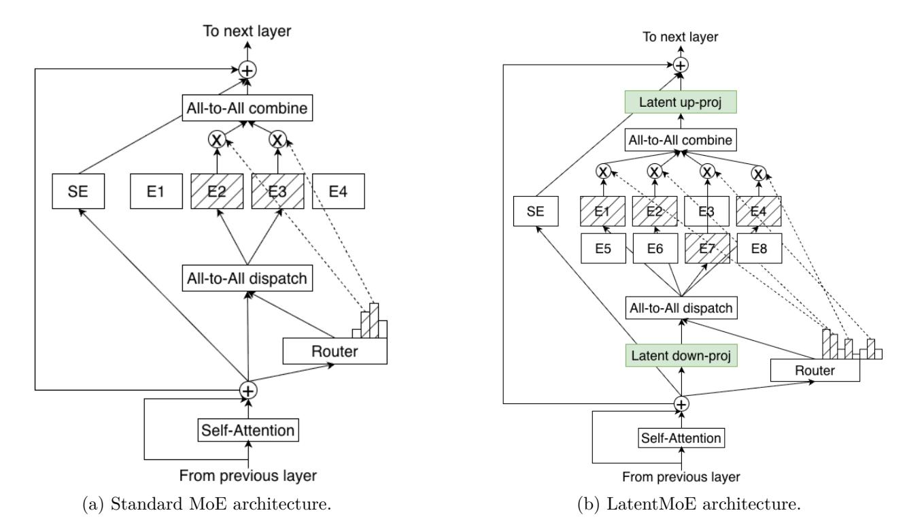
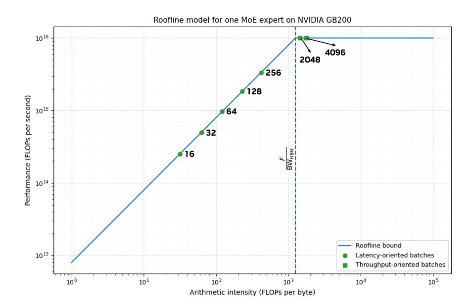

# **1. Introduction**

Transformer-based large language models underpin a wide range of modern AI systems, from conversational agents to code generation and scientific reasoning. As these models continue to scale, practical deployment is increasingly constrained by inference cost, encompassing both computation and memory. As a result, a central objective in modern model design is to maximize achievable accuracy under fixed inference cost constraints.

Mixture-of-Experts (MoE) architectures have emerged as a promising approach towards this goal, enabling models to scale parameter count while keeping the number of Floating-point Operations (FLOPs) per token fixed. Despite their empirical success, the MoE design space remains poorly understood. Existing MoE architectures are largely motivated by high-level sparsity arguments and are optimized primarily for offline, throughput-oriented settings, with limited consideration of online deployments that impose strict latency, memory bandwidth, and communication constraints.

We argue that effective MoE design must be evaluated along two complementary dimensions: accuracy per FLOP and accuracy per parameter. While accuracy per FLOP captures computational efficiency, accuracy per parameter reflects memory footprint, memory bandwidth demands, routinginduced communication, and sharding overheads (factors that are often the dominant bottlenecks in interactive, low-latency inference). Neglecting these factors can lead to architectures that appear efficient in aggregate compute, yet incur substantial inefficiencies in practical deployment.

Figure 1 | Standard MoE vs. LatentMoE architectures. In LatentMoE, tokens are projected from the model hidden dimension into a smaller latent dimension *ℓ* for expert routing and computation, which reduces routed parameter loads and all-to-all traffic by a factor of */ℓ*. We use this efficiency to increase the total number of experts and the top-k active experts per token by the same factor */ℓ*, which improves the accuracy of the model while keeping overall inference cost approximately constant.

In this work, we revisit MoE architecture design from a hardware–software co-design perspective. Through a systematic analysis of existing MoE systems across the throughput–latency Pareto frontier, we identify key structural bottlenecks arising from expert parameterization, routing-induced all-to-all communication, and memory access patterns. Combined with detailed accuracy measurements and theoretical analysis, our study identifies structural inefficiencies in prevailing MoE designs that limit achievable accuracy per unit of inference cost.

Guided by these insights, we introduce LatentMoE, a new mixture-of-experts architecture explicitly optimized for both accuracy per FLOP and accuracy per parameter. LatentMoE decouples expert routing and computation from the model hidden dimension by projecting incoming activations into a shared low-dimensional latent space prior to expert processing (Figure [1\)](#page-1-0). The latent dimension serves as a direct control knob for computational cost, communication volume, and expert parameter size. At iso-FLOP and iso-parameter count, projecting incoming activations into a lower-dimensional latent space enables a proportional increase in both the number of experts and the routing top-k, while maintaining constant inference cost.

As we show both theoretically and empirically, simultaneously increasing expert count and combinatorial sparsity diversity improves the effective expressivity of the model, leading to higher achievable accuracy. Crucially, these gains arise without increasing memory bandwidth demands or communication overheads, making LatentMoE well suited for both latency-critical and throughput-oriented deployments. We validate the LatentMoE concept through pretraining experiments at scales of up to 95B parameters and over 1T tokens. Across all evaluated regimes, LatentMoE consistently improves

upon standard MoE architectures, achieving higher accuracy at fixed inference cost or substantially lower inference cost at fixed accuracy. Given its strong performance, the LatentMoE architecture has been adopted by the flagship Nemotron-3 Super and Ultra models and scaled to substantially larger regimes, including longer token horizons and larger model sizes (NVIDIA et al., 2025).

## 2. LatentMoE Core Design Principles

Before delving into the specifics of LatentMoE, we first take a systems-level view of what is required to deploy an MoE model that is both accurate and cost-efficient.

Throughout this section, we use Qwen3-235B-A22B as a running example for our modeling, with N=128 experts, K=8 active experts per token, a hidden dimension d=4096, and an intermediate feed-forward dimension m=1536. For concreteness, we consider deployment on NVIDIA GB200 GPUs interconnected by a high-bandwidth NVLink fabric, which provides approximately 1800 GB/s of bidirectional bandwidth per GPU (i.e.,  $BW_{NVL}=900$  GB/s per direction). To ensure that expert communication remains within a single NVLink domain, experts are distributed via expert parallelism across EP = 64 GPUs. Attention layers are executed using data parallelism over the same group of GPUs. Each GB200 GPU delivers a peak FP4 Tensor Core throughput of F=10 PFLOPs and an HBM memory bandwidth of  $BW_{HBM}=8$  TB/s (NVIDIA Corporation, 2024).

## 2.1. Memory Bandwidth Bottleneck

In highly interactive (*i.e.*, low-latency) settings that typically use small batch sizes, MoE computation is primarily bottlenecked by memory bandwidth. Figure 2 provides a high-level roof-line analysis of performance versus arithmetic intensity.

For a GB200 system, a computation becomes compute-bound only if its arithmetic intensity (i.e., FLOPs per byte) exceeds:

$$\frac{F}{\text{BW}_{\text{HBM}}} = \frac{10 \times 10^{15}}{8 \times 10^{12}} = 1250 \text{ FLOPs/byte.}$$

Let  $t_{\text{total}}$  be the total number of tokens across the EP GPUs prior to MoE routing. Assuming a uniform distribution of tokens across experts, the number of tokens assigned to a single expert is:  $t_{\text{exp}} := \frac{t_{\text{total}} \cdot K}{N}$ . In the Qwen3-235B-A22B example, with N = 128 and EP = 64, each GPU hosts N/EP = 2 experts; thus each GPU processes approximately  $2 \cdot t_{\text{exp}}$  expert tokens per MoE layer.

The FP4 compute cost for a single expert is  $C_{\text{exp}} = 2 \cdot t_{\text{exp}} \cdot d \cdot m$ , and the corresponding memory traffic in FP4 precision—accounting for weights, inputs, and intermediate activations—is given by  $M_{\text{exp}} = d \cdot m + t_{\text{exp}} \cdot (d+m)$ . Since each GPU processes two experts in our example, the arithmetic intensity I is given by the ratio of the total compute to the total memory traffic:

$$I = \frac{2 \cdot C_{\text{exp}}}{2 \cdot M_{\text{exp}}} = \frac{2 \cdot t_{\text{exp}} \cdot d \cdot m}{d \cdot m + t_{\text{exp}} \cdot (d + m)}.$$

To operate in the compute-bound regime, we require  $I \ge 1250$ . Substituting the Qwen3-235B-A22B parameters yields the condition:

$$\frac{2 \cdot t_{\exp} \cdot d \cdot m}{d \cdot m + t_{\exp} \cdot (d+m)} \ge 1250 \quad \Longrightarrow \quad t_{\exp} \ge 1418.$$

In typical latency-critical deployments, effective batch sizes are small, resulting in  $t_{\text{exp}}$  being on the order of a few hundred tokens—well below the threshold of 1418. Consequently, MoE experts

Figure 2 | **Roofline Analysis for serving Qwen3-235B-A22B.** Operating points correspond to different per-expert token counts exp (i.e., effective expert batch sizes after MoE routing), mapped to arithmetic intensity = 2·exp·· ·+exp·(+) . At latency-critical batch sizes (low ), MoE expert computation is constrained by HBM bandwidth rather than compute, and the operating points lie in the bandwidth-bound regime.

operate in the memory-bound region of the roofline curve (Figure [2\)](#page-3-0), where performance is limited by weight loading rather than compute capacity.

#### **Design Principle I**

In low-latency serving scenarios, MoE inference is typically dominated by the memorybandwidth cost of loading model weights. Consequently, maximizing accuracy per parameter is critical for applications with high interactivity requirements.

#### **2.2. Communication Bottleneck**

In throughput-oriented settings, once experts become compute-bound, communication emerges as a significant contributor to end-to-end execution time in distributed settings. Expert parallelism mandates all-to-all token routing across devices, imposing an overhead that can control end-to-end execution time. Recall that in our example configuration, each GPU hosts two experts. Since exp denotes the tokens processed per expert, each GPU processes a total of 2exp tokens across its local experts per MoE layer.

Assuming a uniform distribution of tokens, the all-to-all communication volume per GPU per MoE layer is given by:

$$M_{\text{comm}} = 2.5 \cdot \left(\frac{N}{\text{EP}} \cdot t_{\text{exp}} \cdot d\right) = 5 \cdot t_{\text{exp}} \cdot d.$$

Here, the factor 2.5 accounts for the mixed-precision traffic (0.5 bytes for FP4 dispatch, 2 bytes for

BF16 aggregation). On the compute side, the total FLOP count for the two local experts is:

$$C_{\text{comp}} = 2 \cdot \left(\frac{N}{\text{EP}} \cdot t_{\text{exp}} \cdot d \cdot m\right) = 4 \cdot t_{\text{exp}} \cdot d \cdot m.$$

The corresponding compute time is:  $t_{\text{comp}} = \frac{C_{\text{comp}}}{F} = \frac{4 \cdot t_{\text{exp}} \cdot d \cdot m}{F}$ . Similarly, the all-to-all communication time is:  $t_{\text{comm}} = \frac{M_{\text{comm}}}{BW_{\text{NVL}}} = \frac{5 \cdot t_{\text{exp}} \cdot d}{BW_{\text{NVL}}}$ , where  $BW_{\text{NVL}} = 900$  GB/s is the effective unidirectional NVLink bandwidth. Consequently, the ratio of communication time to compute time is:

$$\frac{t_{\text{comm}}}{t_{\text{comp}}} = \frac{5 \cdot t_{\text{exp}} \cdot d/\text{BW}_{\text{NVL}}}{4 \cdot t_{\text{exp}} \cdot d \cdot m/F} = \frac{5 \cdot F}{4 \cdot m \cdot \text{BW}_{\text{NVL}}}.$$

Substituting the parameters for the GB200 NVL72 and Qwen3-235B-A22B yields a ratio of approximately 9. This indicates that in the throughput-oriented regime, MoE layers are heavily dominated by all-to-all communication overhead.

