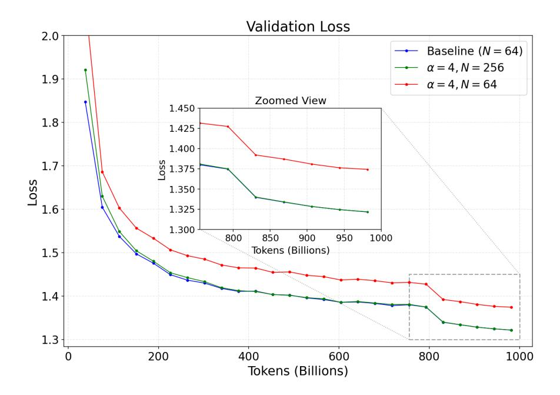
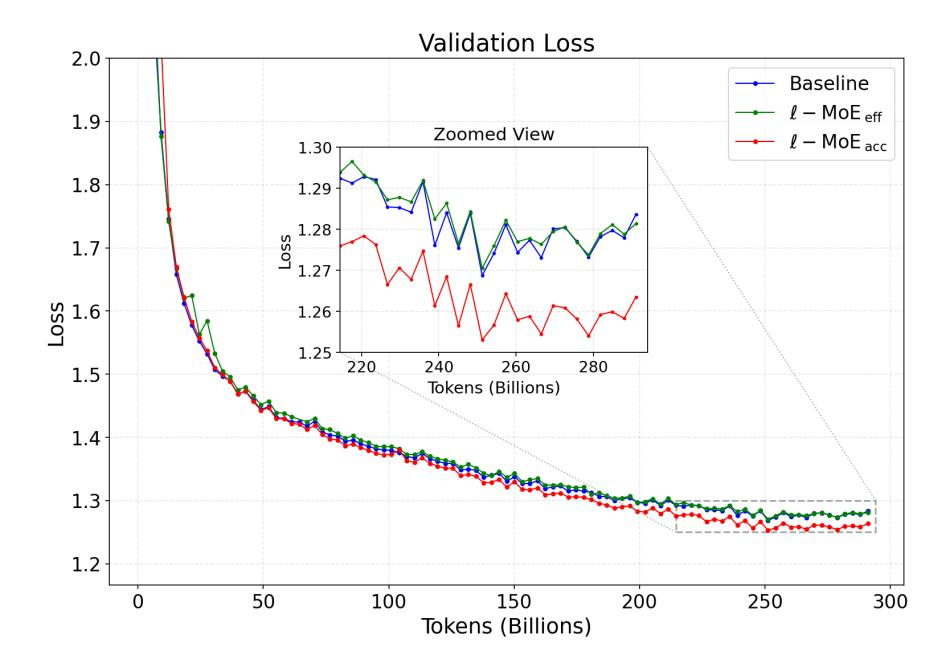
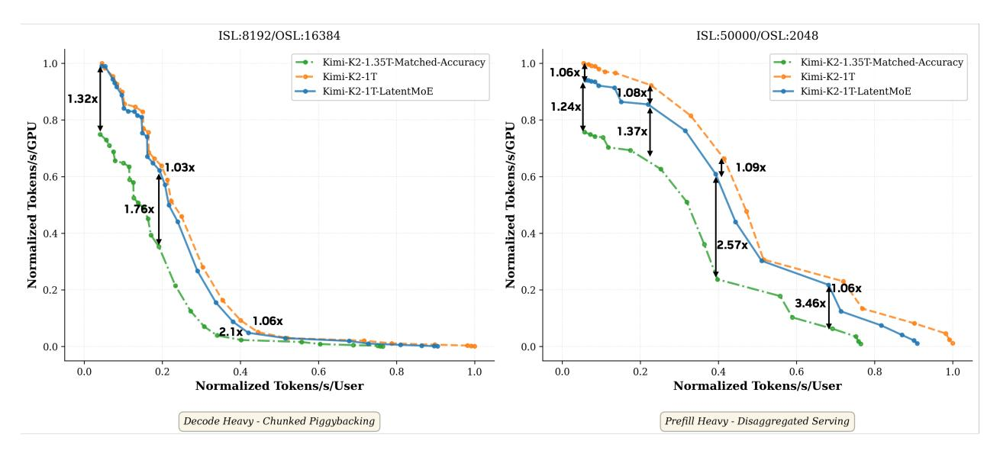

# Design Principle II

Improving performance in throughput-oriented MoE deployments requires minimizing the data volume of all-to-all operations. This volume is proportional to:

$$M_{\text{comm}} \propto \frac{N}{\text{EP}} \cdot t_{\text{exp}} \cdot d = \frac{t_{\text{total}} \cdot K \cdot d}{\text{EP}}.$$

Consequently, communication overhead can be mitigated by reducing the routed hidden dimension d or the number of active experts K. Note that modifying the intermediate dimension m does not affect the token size and thus yields no direct improvement.

#### 2.3. Model Quality

Beyond optimizing inference speed, preserving model quality is paramount. To this end, we draw on theoretical insights into neural network expressivity and combinatorial sparsity. Classical results on Barron functions (Barron, 1993) state that a one-hidden-layer network with u nonlinear units achieves a mean-squared error of  $\mathcal{O}(1/u)$ , independent of the input dimension d. In an MoE layer, this effective nonlinear budget per token is proportional to the total width of the selected experts:

$$U_{\rm eff} \propto K \cdot m$$
.

This implies that reducing the active experts K or the intermediate dimension m directly penalizes the effective capacity ( $U_{\text{eff}}$ ), risking model quality degradation.

#### Design Principle III

Maintaining model quality requires preserving the effective nonlinear budget,  $K \cdot m$ . Consequently, to alleviate memory and communication bottlenecks without sacrificing model quality, we should keep both the number of active experts and the intermediate dimension unchanged.

Every inference task is characterized by an intrinsic feature rank,  $r_{\rm eff}$ , corresponding to the minimum number of degrees of freedom required to preserve task-relevant information. Reducing the hidden dimension d below this threshold necessarily discards such information, leading to accuracy degradation. Thus,  $r_{\rm eff}$  serves as a task-dependent lower bound on d.

## Design Principle IV

There exists a task-specific feature rank  $r_{\text{eff}}$  that imposes a lower limit on the reduction of d. Reducing d below this limit precipitates a collapse in model quality.

Additionally, the MoE architecture benefits from combinatorial sparsity, offering  $\binom{N}{K}$  possible expert combinations per token (Dai et al., 2024). Increasing the total number of experts N expands this specialization space. Furthermore, scaling both N and K by a factor  $\alpha$  exponentially increases the diversity of expert mixtures:

$$\begin{pmatrix} \alpha N \\ \alpha K \end{pmatrix} \ge \left( \begin{pmatrix} N \\ K \end{pmatrix} \right)^{\alpha}.$$

## Design Principle V

Scaling both the number of experts N and top-k per token K enhances model quality by exponentially expanding the space of expert combinations.

Putting it all together. Design Principles I and II indicate that improving inference speed requires reducing both memory bandwidth and communication costs. Memory bandwidth cost scales with d and m, while communication cost scales with K and d. However, Principle III cautions against reducing either K or m, as doing so would likely degrade model quality. This leaves d as the most promising dimension to reduce, enabling performance improvements in both throughput- and latency-oriented regimes without significant loss in accuracy. Principle IV further establishes a lower bound,  $(r_{\text{eff}})$ , on d to prevent quality collapse. Moreover, Principle V suggests that increasing N and K improves model quality. Since memory bandwidth and communication costs scale linearly with K, we can simultaneously increase K by a factor  $\alpha$  and reduce d by the same factor  $\alpha$  (provided  $d/\alpha \ge r_{\text{eff}}$ ). We hypothesize, and empirically validate in subsequent sections, that this transformation (also depicted in Figure 1b) preserves memory bandwidth and communication costs while improving network expressivity and combinatorial sparsity, yielding higher accuracy per FLOP and per parameter.

#### 3. LatentMoE Architecture

Guided by the design principles outlined in Section 2, we introduce LatentMoE, a new MoE architecture designed for efficient scaling. LatentMoE first projects each input token  $x \in \mathbb{R}^d$  into a lower-dimensional latent space  $\mathbb{R}^\ell$  using a learnable down-projection matrix  $W_{\downarrow} \in \mathbb{R}^{\ell \times d}$ . The resulting compressed representation is then routed to the selected experts. Each expert  $E_i(\cdot;\ell)$  operates entirely within the latent space and is parameterized by weights  $W_{\text{FC1}}^{(i)}, W_{\text{gate}}^{(i)} \in \mathbb{R}^{m \times \ell}$  and  $W_{\text{FC2}}^{(i)} \in \mathbb{R}^{\ell \times m}$ . After expert computation, the outputs are aggregated and projected back to the original input dimension using a learnable up-projection matrix  $W_{\uparrow} \in \mathbb{R}^{d \times \ell}$ .

Since we compress only the input dimension d to  $\ell$  while keeping the intermediate dimension m constant, the effective nonlinear budget  $U_{\rm eff}$  remains unchanged. While Design Principle III suggests this should theoretically preserve accuracy, in practice, larger models are often easier to train and more robust to hyperparameter variations (Frankle & Carbin, 2019; Novak et al., 2018; Taylor et al., 2021). To avoid extensive hyperparameter tuning for the compressed model, we leverage Design Principle V by scaling the total number of experts N by a factor  $\alpha = d/\ell$ , thereby expanding

the combinatorial specialization space. Crucially, since neither the memory bandwidth cost (in latency-oriented scenarios) nor the communication cost (in throughput-oriented scenarios) depends on N, this scaling adheres to Design Principles I and II, incurring no additional inference overhead. Hereafter, we refer to this architecture modification as  $\ell$ -MoEeff, formally defined as follows:

$$\ell\text{-MoE}_{\text{eff}}(x) := W_{\uparrow} \cdot \left( \sum_{i \in \mathcal{T}_{K,N'}} p_i' E_i(W_{\downarrow} \cdot x; \ell) \right) + \sum_{j=N'+1}^{N'+S} E_j(x; d). \tag{1}$$

Here,  $N' = \alpha \cdot N$  denotes the expanded set of routed experts. The routed experts  $E_i(\cdot; \ell)$  function within the latent space, while the shared experts  $E_j(\cdot; d)$  operate in the original input space. The routing weights  $p' = \operatorname{Softmax}(W'_r \cdot x)$  are computed from the original token  $x \in \mathbb{R}^d$  using a learnable weight matrix  $W'_r \in \mathbb{R}^{N' \times d}$ , and  $\mathcal{T}_{K,N'}$  denotes the indices of the top-K experts (out of N' total) selected based on their routing scores. For simplicity, all operations outside the routed experts—including the MoE routing mechanism and shared experts—continue to operate in the original hidden dimension d, as they do not significantly contribute to the identified memory and communication bottlenecks.

Following the down-projection  $W_{\downarrow}$ , token dispatch and aggregation occur in the latent space  $\mathbb{R}^{\ell}$ . This reduces the communication volume by a factor of  $\alpha$  relative to a standard MoE. Similarly, because the expert weights lie in the latent space ( $\mathbb{R}^{m \times \ell}$  and  $\mathbb{R}^{\ell \times m}$ ), the memory bandwidth cost for weight loading is also reduced by a factor of  $\alpha$ .

Design Principle V further suggests that scaling both N and K by a factor  $\alpha$  exponentially increases expert diversity, thereby enhancing model quality. Following this principle, the default LatentMoE configuration (a.k.a.,  $\ell$ -MoEacc) is defined as follows:

$$\ell\text{-MoE}_{acc}(x) := W_{\uparrow} \cdot \left( \sum_{i \in \mathcal{T}_{K',N'}} p'_i E_i(W_{\downarrow} \cdot x; \ell) \right) + \sum_{j=N'+1}^{N'+S} E_j(x; d), \tag{2}$$

where  $K' = \alpha \cdot K$ . This formulation differs from  $\ell$ -MoEeff solely in the number of active experts, utilizing the top-k selection function  $\mathcal{T}_{K',N'}$ .

Since K is increased by a factor of  $\alpha = d/\ell$ , this variant keeps communication cost and memory bandwidth requirements constant relative to a standard MoE. The increased expert diversity and non-linearity budget per token, however, lead to superior model accuracy at iso-inference cost, thereby pushing the Pareto frontier of models to a new level. Table 1 summarizes the costs and benefits of the two configurations,  $\ell$ -MoEeff and  $\ell$ -MoEacc. For completeness, we evaluate both setups in Section 4.

### 4. Evaluation

In this section, we conduct a thorough design space exploration to verify the effectiveness of the proposed LatentMoE architecture. We start by pretraining Transformer MoE models at two different scales: (1) 16B total parameters with 2B active, which we use for conducting ablation studies, and (2) 95B total parameters with 8B active, which we use as a scaling test of the 16B results. To demonstrate the generalizability of LatentMoE architectures, we further extend our study by training hybrid Mamba-Attention MoE models at scale.

We use the architecture and hyperparameters from DeepSeek-v2-lite (DeepSeek-AI et al., 2024) for our 2B active model ablations. For the 8B active Transformer model, we use a cosine learning rate schedule with a max learning rate of  $1.2 \times 10^{-3}$  decayed to a minimum of  $3 \times 10^{-6}$ . The 8B active

Table 1 | Comparison of asymptotic communication and memory bandwidth costs per GPU. Costs are normalized by hardware constants. exp denotes the average number of tokens per expert, and EP is the expert-parallel level. Arrows indicate improvement (↑), maintenance (→), or baseline (–).

| Architecture              | Communication Cost         | Weight Loading Memory Cost per Expert | Model Accuracy | Inference Efficiency |
|---------------------------|-------------------------------|---------------------------------------------|-------------------|-------------------------|
| Standard MoE              | (𝑁/EP) · 𝑡exp · 𝑑 | 𝑑 · 𝑚                                 | –                 | –                       |
| ℓ-MoEeff                  | · · (𝑁/EP) 𝑡exp ℓ | · ℓ 𝑚                                 | →                 | ↑                       |
| ℓ-MoEacc (recommended) | (𝑁/EP) · 𝑡exp · 𝑑 | 𝑑 · 𝑚                                 | ↑                 | →                       |

Hybrid model is trained with a WSD schedule with a max learning rate of 8 × 10−4 decayed to 8 × 10−6 in the last 15% of training. Both the 8B active Transformer and hybrid models are trained with a sequence length of 8192, a batch size of 768 (∼ 6 million tokens), and a learning rate warmup of 8*.*4 billion tokens. The 8B active models use a load balancing loss coefficient of 10−4 along with DeepSeek's aux-loss-free load balancing strategy [\(Wang et al.,](#page-17-1) [2024\)](#page-17-1) to ensure balanced token load throughout training. Table [2](#page-7-1) summarizes the model architecture under study in this paper.

Table 2 | Architectural specifications of the baseline models used for design space exploration. For the Hybrid model's Mamba layers, we use Mamba-2 blocks with 128 heads, 64 head dimension, 128 state dimension, and 8 groups.

| Configuration                  | 16BT-2BA | 95BT-8BA     | Hybrid-73BT-8BA            |
|--------------------------------|----------|--------------|----------------------------|
| Layers (𝐿)                     | 27       | 32           | 52 (24 Mamba/MoE, 4 Attn.) |
| Hidden Dimension (𝑑)           | 2048     | 4096         | 4096                       |
| Total Routed Experts (𝑁)       | 64       | 128          | 128                        |
| Active Experts (𝐾)             | 6        | 6            | 6                          |
| Shared Experts (𝑆)             | 2        | 2            | 2                          |
| Intermediate FFN Dimension (𝑚) | 1408     | 2688         | 2688                       |
| Activation Function            | SwiGLU   | Squared-ReLU | Squared-ReLU               |
| Attention Heads                | 16       | 32           | 32                         |
| Query Groups (GQA)             | 16       | 8            | 8                          |
| Total Parameters               | 16B      | 95B          | 73B                        |
| Active Parameters              | 2B       | 8B           | 8B                         |

## **4.1. LatentMoE Ablations**

**Impact of compression ratio.** Design Principle IV (Section [2\)](#page-2-0) hypothesizes that there exists an intrinsic rank eff such that compressing the latent dimension to *ℓ* ≥ eff results in negligible information loss. To empirically validate this and estimate eff, we pretrain and sweep different compression ratios on top of the *ℓ*-MoEeff configuration, holding all other hyperparameters constant. Results in Figure [3](#page-8-0) indicate that model quality is preserved for compression ratios ≤ 4. Consequently, we adopt = 4 for all subsequent experiments. We empirically verified that this setting remains effective at larger scales as well (i.e., 95B total and 8B active).

**Impact of number of experts.** In Section [3,](#page-5-0) we noted that parameter reduction via compression can impede training stability. To quantify this, we pretrain the *ℓ*-MoEeff LatentMoE variant of

Figure 3 | **Effect of compression ratio on model quality.** Validation loss for the 16BT-2BA model using the *ℓ*-MoEeff configuration across varying compression ratios = */ℓ*. The total number of experts is scaled by , while the base model configuration follows Table [2.](#page-7-1)

Figure 4 | **Impact of expert scaling on model quality.** Comparison of validation loss for the 16BT-2BA model using the *ℓ*-MoEeff configuration when the hidden dimension is compressed by 4×. The green curve utilizes the proposed expert scaling (′ = ), while the red curve does not. Scaling the expert count effectively mitigates the accuracy loss caused by compression, eliminating the need for extensive hyperparameter retuning.

the 16B total and 2B active parameter model with the hidden dimension compressed by a factor of 4, both with and without a compensatory increase in the total number of experts, using the baseline hyperparameters. As shown in Figure [4,](#page-8-1) reducing without scaling the expert count leads

to significant quality degradation, validating the expert scaling strategy employed by LatentMoE.

**Comparison between the two variants of LatentMoE.** In Section [3,](#page-5-0) we introduced two LatentMoE variants: *ℓ*-MoEeff, designed to improve inference efficiency while maintaining baseline accuracy, and *ℓ*-MoEacc, designed to enhance accuracy at a comparable inference cost. Figure [5](#page-9-0) compares the validation loss of these configurations against the baseline for the 16B total and 2B active parameter model using a latent dimension of *ℓ* = 512 ( = 4). Consistent with our expectations, *ℓ*-MoEeff matches the baseline accuracy, whereas *ℓ*-MoEacc achieves a noticeably lower validation loss. *We recommend ℓ*-MoEacc *for Pareto-optimal accuracy versus inference cost.*

Figure 5 | **Comparison between LatentMoE variants.** Training trajectories for the baseline 16BT-2BA model versus the *ℓ*-MoEeff and *ℓ*-MoEacc (*ℓ* = 512). *ℓ*-MoEeff matches baseline convergence, while *ℓ*-MoEacc outperforms the baseline.

## **4.2. LatentMoE Scaling Studies**

Leveraging the insights from the 16B model ablations, we train a 95B parameter Transformer using a LatentMoE configuration with a 4× compression ratio. Figure [6](#page-10-0) presents the validation loss trajectories for *ℓ*-MoEeff and *ℓ*-MoEacc relative to the baseline. Consistent with the 16BT-2BA results, *ℓ*-MoEeff matches the baseline, while *ℓ*-MoEacc demonstrates superior results. Table [3](#page-10-1) shows the downstream task accuracy at the 300B token horizon. We report Code as the average over HumanEval, HumanEval+, MBPP, and MBPP+, Math as the average of GSM8K CoT and MATH-500, and Commonsense understanding as the average of RACE, ARC-Challenge, HellaSwag, and Winogrande. For simplicity, we used the exact same hyperparameters optimized for the baseline Transformer for LatentMoE. Further hyperparameter tuning might lead to even better accuracy.

To further validate the effectiveness of the LatentMoE architecture, we also pretrain a series of hybrid Mamba-Attention MoE models. Specifically, we first train a baseline 8B active (73B total) parameter model. As described in Table [2,](#page-7-1) each MoE layer in the hybrid architecture contains 128 experts, 6 activated experts, 2 shared experts, and uses an intermediate FFN dimension of 2688. We use Squared-ReLU activation and a model dimension of 4096. We then train the *ℓ*-MoEeff and

Figure 6 | **95B Model Training Convergence.** Validation loss curves for the 95BT-8BA baseline, *ℓ*-MoEeff, and *ℓ*-MoEacc configurations (*ℓ* = 1024*,*  = 4). *ℓ*-MoEeff matches baseline convergence, while *ℓ*-MoEacc outperforms the baseline.

Table 3 | Accuracy comparisons of the 95BT-8BA model with and without LatentMoE. Compared to the baseline, with equivalent parameters, *ℓ*-MoEacc provides higher accuracy across all downstream tasks, while *ℓ*-MoEeff provides comparable to or better accuracy with much fewer FLOPs.

| Model    | Active Params | Total Params | MMLU Pro | MMLU  | Code  | Math  | Commonsense |
|----------|---------------|--------------|----------|-------|-------|-------|-------------|
| Baseline | 8.47B         | 94.4B        | 29.26    | 58.95 | 40.33 | 64.39 | 74.32       |
| ℓ-MoEacc | 8.44B         | 94.8B        | 34.91    | 62.23 | 41.50 | 64.88 | 75.18       |
| ℓ-MoEeff | 5.62B         | 94.8B        | 34.75    | 61.06 | 40.68 | 63.61 | 73.72       |

*ℓ*-MoEacc LatentMoE variants of the baseline model, using a 4× compression ratio.

Results after training the above models on 1T tokens are shown in Table [4.](#page-11-0) All models are trained with identical hyperparameters. As shown, the LatentMoE *ℓ*-MoEacc variant achieves significantly higher accuracy than the baseline across all tasks, while the *ℓ*-MoEeff variant achieves accuracy comparable to or better than the standard granular MoE baseline.

Overall, the LatentMoE architecture provides a clear advantage in terms of accuracy per FLOP and per parameter compared to granular MoEs, paving the way for higher accuracy at fixed inference cost or lower inference cost at fixed accuracy.

#### **4.3. Inference Performance**

As discussed in Section [3,](#page-5-0) *ℓ*-MoEacc is expected to achieve similar inference speed to the standard MoE baseline while attaining higher accuracy. Our evaluations in Section [4.2](#page-9-1) confirmed that *ℓ*-MoEacc indeed achieves higher accuracy compared to standard MoE. Here, we evaluate *ℓ*-MoEacc from the perspective of inference efficiency. Table [5](#page-11-1) presents the measured performance of *ℓ*-MoEacc compared to standard MoE for the Hybrid-73BT-8BA model (see Table [2\)](#page-7-1) on two Hopper H100 GPUs using vLLM with FP8 per-tensor quantization. We focus our measurements on the hybrid

Table 4 | Accuracy comparisons of hybrid Mamba-Attention MoEs with and without LatentMoE. Compared to the baseline, with equivalent parameters, *ℓ*-MoEacc provides higher accuracy across all downstream tasks, while *ℓ*-MoEeff provides comparable or better accuracy with much fewer FLOPs.

| Model    | Active Params | Total Params | MMLU Pro | MMLU  | Code  | Math  | Commonsense |
|----------|---------------|--------------|----------|-------|-------|-------|-------------|
| Baseline | 8.09B         | 72.6B        | 48.30    | 70.10 | 51.95 | 78.32 | 81.73       |
| ℓ-MoEacc | 8.02B         | 72.8B        | 52.87    | 72.11 | 55.14 | 80.19 | 82.10       |
| ℓ-MoEeff | 5.91B         | 72.8B        | 51.29    | 71.34 | 53.13 | 77.01 | 80.78       |

Mamba-Attention baseline, as it represents the most efficient inference architecture.

| Concurrency | LatentMoE (Tokens/s/GPU) | Standard MoE (Tokens/s/GPU) |
|-------------|--------------------------|-----------------------------|
| 1           | 181.6                    | 206.6                       |
| 4           | 528.5                    | 509.8                       |
| 16          | 1130.8                   | 1204.6                      |
| 64          | 1569.6                   | 1549.3                      |
| 128         | 1625.8                   | 1725.9                      |

Table 5 | Comparison of LatentMoE and Standard MoE performance metrics.

The measurements show that at higher concurrencies, per-GPU throughput drops by only up to 6%. It is important to note that further software optimizations could be performed to mitigate even these small throughput differences between LatentMoE and standard MoE. One proposed optimization is to utilize separate CUDA streams for routed and shared experts, which could reduce end-to-end latency when performing inference with smaller batches or when model dimensions do not saturate the GPU's compute. A second optimization targets the MoE kernels from the CUTLASS library. Since LatentMoEs decrease the size of the GEMMs for routed experts, it is important to ensure that inner dimensions remain large enough to fully utilize the GPU and avoid SM-bound workloads. When inner dimensions are small, specialized smaller-matrix GEMM kernels should be used.

#### *4.3.1. Projected Serving Impact at Trillion-Parameter Scale*

Inference efficiency can be characterized as a three-dimensional trade-off surface, with accuracy along one axis, throughput per GPU along a second axis, and latency (user interactivity) along the third axis. Thus far, we have discussed the accuracy of LatentMoE and presented measured performance at the 95B-parameter scale. In the following section, we examine a two-dimensional slice of this trade-off at the trillion-parameter scale by projecting throughput per GPU and latency Pareto frontiers for accuracy-matched models.

**Performance evaluation methodology.** We use a high-fidelity proprietary performance simulator to project end-to-end serving performance for a trillion-parameter class model and its LatentMoE variant. We simulate over 200K operating points to estimate the throughput per GPU and latency Pareto frontiers shown in Figure [7.](#page-12-0) We consider two traffic patterns. The first is a decode-heavy setting modeled with chunked piggybacking serving. The second is a prefill-heavy setting modeled with disaggregated serving, where prefill and decode are separated to reflect long-context traffic. The serving strategy (for example, whether to use disaggregation) is selected following the guidance in [Mitra et al.](#page-15-2) [\(2025\)](#page-15-2).

**Effective Parameter Multiplier (EPM).** We use the effective parameter multiplier to construct an iso-accuracy baseline for inference comparisons. We benchmark the native Kimi-K2-1T against our proposed variant, Kimi-K2-1T-LatentMoE. Following the "Effective Parameter Count" framework established by [Frantar et al.](#page-14-4) [\(2025\)](#page-14-4), we posit that a treated model with physical parameters

Figure 7 | **Projected throughput-latency Pareto frontiers at trillion-parameter scale.** *Left:* Decode-heavy traffic modeled with chunked piggybacking serving. *Right:* Prefill-heavy traffic modeled with disaggregated serving. Kimi-K2-1T-LatentMoE attains accuracy-efficient operating points. Matching its accuracy under standard MoE scaling requires an additional ∼350B parameters in our construction and yields a 1*.*24×–3*.*46× projected slowdown across the frontier.

 behaves like a standard dense baseline with effective parameters  . We assume baseline performance follows a scaling law (). For a treated model achieving score , the effective capacity is obtained by inverting the baseline scaling law:

$$N_{eff} = f^{-1}(S_{treat}) (3)$$

The EPM is defined as the ratio of effective capacity to physical parameters:

$$\lambda = \frac{N_{eff}}{N_{treat}} \tag{4}$$

We use to construct an iso-accuracy baseline with parameter count iso = · . For our evaluations, we derive () by fitting a log-linear function to the MMLU accuracy scores of the Qwen-3-Dense model family (0.6B, 1.7B, 4B, 8B, 14B, and 32B):

$$f(N) = a \cdot \log N + b \tag{5}$$

where and are fitted parameters.

**Iso-accuracy baseline construction.** We estimate an Effective Parameter Multiplier of ≈ 1*.*35× for Kimi-K2-1T-LatentMoE. For a 1T-parameter base model, this implies an iso-accuracy scale of iso ≈ 1*.*35T, corresponding to an increase of (1*.*35 − 1*.*0)T ≈ 0*.*35T ≈ 350B parameters. Guided by this target, we construct a physical **iso-accuracy baseline**, denoted Kimi-K2-1.35T, by scaling the native architecture depth from 61 to 80 layers. This construction matches the projected effective capacity implied by LatentMoE and enables a direct inference-efficiency comparison against a standard model of comparable predictive power.

**Accuracy matching with standard MoE scaling is more expensive.** *ℓ*-MoEacc achieves an accuracy gain at fixed parameter and FLOP budget. When we enforce an accuracy-matched comparison using the standard MoE architecture, the required scaling incurs a marked serving penalty. Across the projected Pareto frontier (Figure [7\)](#page-12-0), Kimi-K2-1.35T is approximately 1*.*24×– 3*.*46× slower than Kimi-K2-1T-LatentMoE, indicating that *ℓ*-MoEacc provides a more favorable accuracy-latency trade-off than increasing model size through the standard MoE architecture to reach the same accuracy target.

**Latent projection overhead is modest.** Relative to native Kimi-K2-1T, Kimi-K2-1T-LatentMoE introduces additional computation due to latent projection operators. In our projections, native Kimi-K2-1T remains close, within up to ∼9% of Kimi-K2-1T-LatentMoE, indicating that projection overhead is small compared to the cost of achieving the same accuracy gain via standard scaling to Kimi-K2-1.35T.

