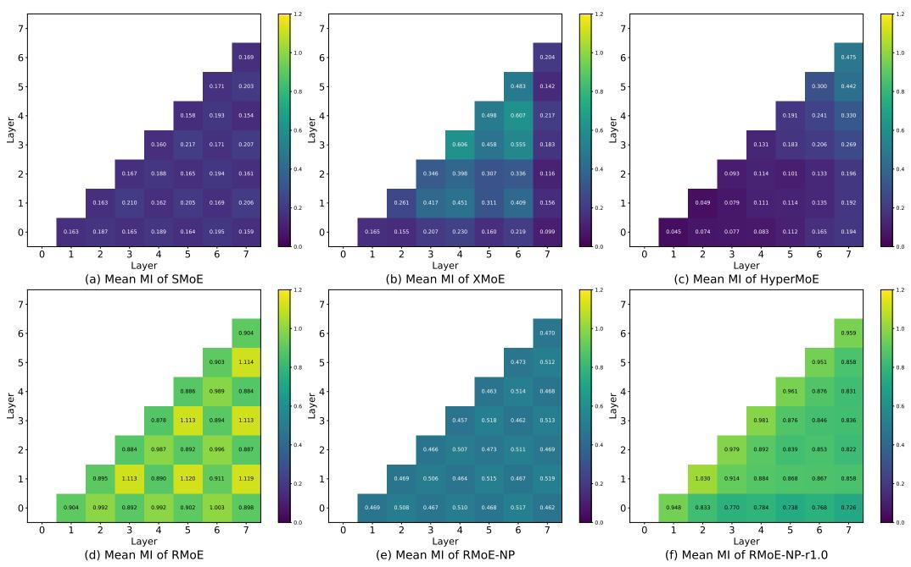
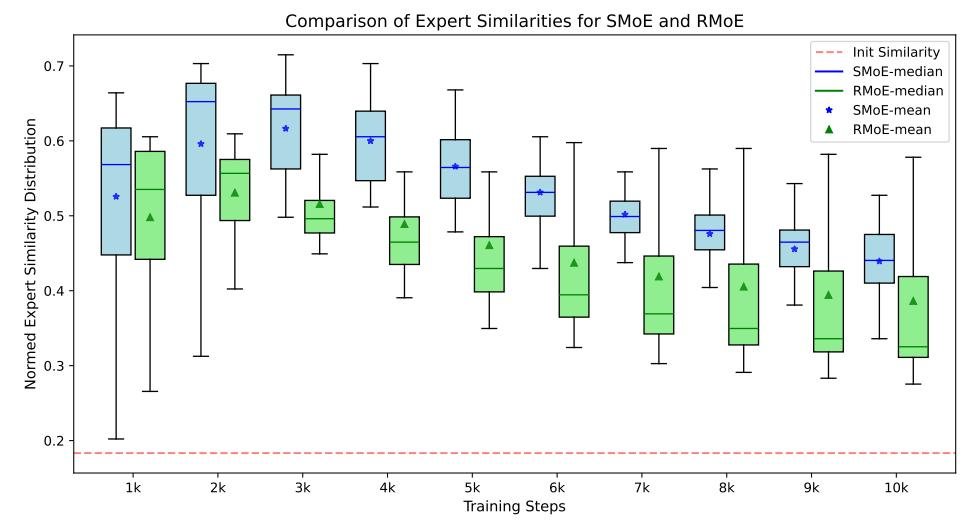

# 4.1 EXPERIMENTAL SETTINGS

Langauge Modeling Tasks and Metrics Following [\(Pham et al.,](#page-12-7) [2024\)](#page-12-7), we first test on two common language modeling tasks: enwiki8 (character-level language modeling, with Bits-Per-Character (BPC) as the evaluation metrics) and WikiText-103 (word-level language modeling, with Perplexity (PPL) as the evaluation metrics). We employ default train-validation-test splits for each dataset. We report test performances of the best validation checkpoints. More details can be found in App. [A.2.](#page-14-1)

Configurations and Baselines We compare RMoE with other existing router designs. All methods are based on the decoder-only standard switch-transformer architecture with post-norm. Following [\(Pham et al.,](#page-12-7) [2024\)](#page-12-7), all routers select top-2 experts from 16 experts. Each task is trained on 2 NVIDIA A100 GPUs for about 20 hours. More training configurations can be found in App. [A.2.](#page-14-1) Our baselines include (1) SMoE: standard switch-transformers with a standard linear router. (2) HyperMoE [\(Do et al.,](#page-10-7) [2023\)](#page-10-7): the method employs a fixed, randomly initialized hypernetwork [\(Ha](#page-11-4) [et al.,](#page-11-4) [2016\)](#page-11-4) to produce the weights for the linear router, subsequently allowing the generated linear layer to perform the routing. (3) SMoE-MLP [\(Shen et al.,](#page-12-5) [2023\)](#page-12-5): it replaces the linear router with a two-layer MLP using the GELU activation function. (4) RandomMoE: inspired by SMoE-Dropout [\(Chen et al.,](#page-10-5) [2023\)](#page-10-5) and HyperMoE, we propose to compare with a fixed randomly initialized linear router; this could be a naive baseline for all learnable routers. (5) XMoE [\(Chi et al.,](#page-10-6) [2022\)](#page-10-6): it first down-projects the token embeddings to a lower dimension (default 16) and computes its cosine-similarity with the low-dimension expert embeddings. It also uses a learnable temperature in softmax. (5) CosineSMoE, similar to XMoE except without down-projection.

Pre-Training and SFT paradigm As pre-training-then-supervised-fine-tuning has become the standard paradigm, we also evaluate the RMoE in this setting. We conduct preliminary scale-up experiment on a setting of training 0.91B models with 40B tokens. Our pre-training corpus is a multilingual data collection that spans common and specialized domains, including Wikipedia, finance,

Table 1: Performance of RMoE and baselines on two language modeling tasks, Enwiki8 and WikiText-103. **Params** means the non-embedding model parameters and (router parameters). Notice we don't separate unlearnable parameters in HyperMoE and RandomSMoE. **Mem** means the peak GPU memory usage with the same batch-size configurations. **Speed** is the average time for 1k training steps. Results demonstrate that the RMoE outperforms baseline models and achieves comparable memory usage and speed as the standard SMoE.

| Algorithm  | erithm   Enwiki8 (BPC) |       | WikiText (PPL)↓ |        | Params       | Mem   | Speed        |
|------------|------------------------|-------|-----------------|--------|--------------|-------|--------------|
|            | val                    | test  | val             | test   | (M)          | (GB)  | (s/1k steps) |
| SMoE       | 1.152                  | 1.128 | 31.279          | 33.061 | 36.08 (0.04) | 47.92 | 960.2        |
| HyperMoE   | 1.162                  | 1.139 | 31.918          | 33.374 | 48.41 (12.4) | 49.69 | 962.0        |
| SMoE-MLP   | 1.164                  | 1.137 | 31.430          | 33.142 | 36.79 (0.75) | 48.70 | 964.1        |
| RandomSMoE | 1.163                  | 1.135 | 31.938          | 33.410 | 36.08 (0.04) | 47.72 | 961.4        |
| CosineMoE  | 1.148                  | 1.122 | 31.367          | 33.047 | 36.08 (0.04) | 48.68 | 962.4        |
| XMoE       | 1.150                  | 1.125 | 31.265          | 32.926 | 36.13 (0.09) | 48.70 | 967.5        |
| RMoE       | 1.141                  | 1.116 | 30.939          | 32.867 | 36.51 (0.47) | 49.46 | 972.9        |

and legal texts. Our model architecture is modified based on Llama family (Touvron et al., 2023). Specifically, we use a 24-layer model and top-4 gating from 16 experts per layer following (Dai et al., 2024). This yields a model with approximately 0.53B activated / 0.91B total parameters. All different routers use the same training configurations. To ensure expert load balance, we employ balance loss with weights 0.01 during training. These experiments are conducted using the Megablocks (Gale et al., 2023) on 8 NVIDIA A100 GPUs for about 5 days. More details can be found in App. A.2. After pertaining, we perform supervised fine-tuning (sft). All models are trained on Alpaca (Taori et al., 2023) with the same configuration. We use Im-evaluation-harness1 to evaluate the fine-tuned model. To simulate the real LLMs application scenario, we don't perform task-specific fine-tuning and evaluation. Since the models are largely under-trained, they give almost random-guessing results on challenging tasks like MMLU (Hendrycks et al., 2020). Therefore, we only test on tasks (ARC-easy, Hellaswag, PIQA, SciQ, LAMBADA) in lm-evaluation-harness. More details about sft configurations and tasks can be found in App. A.2. We further justify the scalability of RMoE on the setting of training 15B activate 2.7B models with 120B / 400B tokens. Given our utilization of a high-quality pre-training corpus, pre-training on 400B tokens yields better results compared to experimental MoE like OpenMoE (Xue et al., 2024). We find RMoE consistently provides over a one-point improvement in performance on benchmarks such as MMLU, GSM8K, and HumanEval. More details can be found in App. A.3.

## 4.2 MAIN RESULTS

Tab. 1 shows the performance of RMoE and selected baselines on two language modelling tasks. Our observations are as follows: (1) RMoE performs best on validation and test sets of two tasks, and the recurrent routing mechanism and the introduction of extra GRU block do not severely impact the training speed and memory usage, making RMoE more practical. (2) Comparing SMoE-MLP and SMoE, we find that replacing the original simple linear layer with a more capable MLP does not improve perfor-

Table 2: Performance of combining layer-wise recurrent routing mechanism with XMoE.

| Algorithm    | Enwiki   | 8 (BPC)↓ | WikiText (PPL)↓ |       |  |
|--------------|----------|----------|-----------------|-------|--|
|              | Val test |          | val             | test  |  |
| XMoE (8)     | 1.160    | 1.132    | 31.74           | 33.55 |  |
| + GRU router | 1.150    | 1.124    | 31.34           | 32.99 |  |
| XMoE (16)    | 1.150    | 1.125    | 31.27           | 32.93 |  |
| + GRU router | 1.144    | 1.119    | 31.15           | 32.47 |  |
| XMoE (32)    | 1.140    | 1.114    | 31.30           | 32.71 |  |
| + GRU router | 1.136    | 1.112    | 31.25           | 32.55 |  |

mance. It even underperforms the fixed random routing (RandomMoE) on Enwikik8, suggesting that naively increasing model capacity can't result in a more powerful router. Furthermore, *since RMoE introduces novel computation stages in routing and is orthogonal to most existing router designs, it can easily be combined with them.* Tab. 2 showcases the performance of the original XMoE and XMoE with GRU router in different XMoE lower dimensions (8, 16, and 32). We observe that the GRU router benefits all of the 3 configurations of XMoE.

While previous work on improving routers has not mostly been evaluated on large-scale pretraining (Dai et al., 2022; Chi et al., 2022; Do et al., 2023), we scale up RMoE to billion-level parameters and training tokens. We report SMoE and RMoE's evaluation results (both directly evaluated and evaluated after supervised fine-tuning (sft)) in Tab. 3. Existing works suggest freezing the router during SMoE tuning Zoph et al. (2022); we report SMoE's results under freeze and unfreeze settings. Correspondingly, for RMoE, we freeze the GRU and the linear layer under the freeze setting. From Tab. 3, we can observe that (1) Even in large-scale pre-training that requires more

&lt;sup>1https://github.com/EleutherAI/Im-evaluation-harness

Table 3: SMoE and RMoE's pre-training costs and evaluation results in selected informative lm-evaluation-harness tasks. 'sft' means supervised fine-tuning on the Alpaca dataset. The task names and metrics for short names in the table are: 'ARC-e' for ARC-Easy, acc; 'Hella' is for Hellaswag, acc-norm; 'Piqa' for PIQA, acc-norm; 'Lamb' for LAMBADA, acc. Each model has approximately 0.53B activated parameters out-of 0.91B parameters. RMoE introduces about 3.5M additional parameters relative to SMoE.

| Algorithm                            | Training             | ARC-e | Hella | Piqa  | Sciq | Lamb  | Avg↑  |
|--------------------------------------|----------------------|-------|-------|-------|------|-------|-------|
|                                      | pre-train 20B tokens | 47.14 | 35.51 | 64.69 | 76.2 | 14.61 | 47.63 |
| SMoE                                 | +sft                 | 50.93 | 35.82 | 65.61 | 74.7 | 17.81 | 48.97 |
| 51,102                               | +sft (freeze router) | 50.59 | 35.78 | 66.32 | 74.7 | 18.18 | 49.11 |
| Speed: 48.87 s/step Mem: 48.00 GB | pre-train 40B tokens | 52.57 | 40.85 | 67.74 | 83.4 | 26.74 | 54.26 |
| WCIII. 40.00 GB                      | +sft                 | 53.70 | 42.07 | 68.61 | 83.5 | 32.80 | 56.13 |
|                                      | +sft (freeze router) | 53.45 | 41.94 | 68.88 | 83.1 | 32.06 | 55.88 |
|                                      | pre-train 20B tokens | 47.01 | 35.91 | 65.23 | 78.7 | 19.13 | 49.20 |
|                                      | +sft                 | 48.53 | 36.90 | 66.21 | 79.6 | 24.74 | 51.20 |
| RMoE                                 | +sft (freeze router) | 49.24 | 36.79 | 66.16 | 79.7 | 24.32 | 51.24 |
| 0 1 10 07 1                          | pre-train 40B tokens | 51.18 | 41.38 | 67.79 | 83.6 | 32.58 | 55.31 |
| Speed: 49.07 s/step Mem: 48.69 GB | +sft                 | 53.20 | 43.05 | 68.55 | 83.8 | 37.16 | 57.15 |
| Wiciii. 46.09 OB                     | +sft (freeze router) | 53.11 | 43.16 | 68.77 | 82.8 | 37.57 | 57.08 |

complex parallel training strategies, RMoE brings negligible wall time and memory cost compared with vanilla SMoE. (2) In comparable settings (e.g., the same number of tokens and with/without sft), RMoE outperforms SMoE, and even the best results of SMoE are lower than those of RMoE.

#### 5 ABLATION STUDIES

Which contributes more? More Router parameters or layerwise recurrence. A straightforward reason for RMoE improvement could be that RMoE introduces additional computation and parameters. To disentangle the effect of introducing more router parameters and layerwise recurrence, we consider the fol-

Table 4: Enwiki8 validation and test BPC for different routing designs. 'NP' stands for not passing recurrent states cross-layer. 'RMoE+NP' has the same parameters and FLOPs as 'RMoE'.

| Algorithm         | Val↓           | Test↓          | Paras (M)      | Val↓           | Test↓          | Paras (M)      |
|-------------------|----------------|----------------|----------------|----------------|----------------|----------------|
| Small             |                |                |                | Mediu          | ım             |                |
| SMoE              | 1.214          | 1.184          | 15.32          | 1.152          | 1.128          | 36.08          |
| SMoE + MLP        | 1.214          | 1.183          | 15.73          | 1.164          | 1.137          | 36.79          |
| RMoE + NP RMoE | 1.227 1.213 | 1.196 1.183 | 15.61 15.61 | 1.150 1.141 | 1.123 1.116 | 36.51 36.51 |

lowing two extra settings: (1) SMoE+MLP: we naively increase the router parameters by replacing the original linear layer with a larger MLP layer; (2) RMoE + NP: we change Eq. 5 to  $GRU(\mathbf{r}_i, \mathbf{h}_0)$  to cancel the layerwise recurrence of RMoE, rendering a stateless GRU. The setting has the same parameters and computation as RMoE. From Tab. 4, we can observe that (1) in our setting, introducing larger routers in SMoE doesn't bring improvement (SMoE v.s. SMoE + MLP). (2) When ablated on the layerwise recurrence in RMoE, the performance largely drops, even worse than SMoE. Both results suggest that the layerwise recurrence is the main contributor.

Recurrent Gradient is important to RMoE Following the aforementioned analysis, we try to further disentangle the effect of the layerwise recurrence. When removing the layerwise recurrence as in the RMoE + NP setting, we remove two information flows across layers: (1) the forward information about previous routers' decisions and (2) the backward gradient propagation through GRU hidden states in different layers. To compare the two information flows, we investigate the following settings: (1) RMoE + detach  $h_{i-1}$ : in intermediate stage between RMoE and RMoE-NP. By detaching  $h_{i-1}$  to stop its gradient computation in Eq. 5, each GRU cell can only use previous information during feed-forward. (2) RMoE + NP + r- $\alpha$ : inspired by Realformer (He et al.,

Table 5: Enwiki8 validation and test BPC. 'detach  $h_{i-1}$ ' means detaching the recurrent hidden states before passing it to the next block. 'r-0.5/1.0' means passing the routing logits of the previous block to the current block. 'detach-r' means detaching the gradient computation of passed logits.

| Algorithm                                                                                   | Val                              | Test                             |
|---------------------------------------------------------------------------------------------|----------------------------------|----------------------------------|
| SMoE                                                                                        | 1.152                            | 1.128                            |
| $\begin{array}{c} \textbf{RMoE} \\ \textbf{+ NP} \\ \textbf{+ detach } h_{i-1} \end{array}$ | 1.141 1.150 1.159          | 1.116 1.123 1.133          |
| + NP + r-0.5 + NP + r-1.0 + NP + r-0.5 + detach-r + NP + r-1.0 + detach-r          | 1.149 1.150 1.157 1.152 | 1.124 1.124 1.133 1.126 |

2020) that introduces residual attention score to facilitate attention gradient back-propagation, we investigate an intermediate stage between RMoE and RMoE-NP by adding gating logits residual for the RMoE + NP settings. Concretely, the gating score of i-th layer for expert n is

 $g_n(\mathbf{h}_i; \mathbf{G}_i, k) + \alpha g_n(\mathbf{h}_{i-1}; \mathbf{G}_{i-1}, k)$ . It is a straightforward way to supplement router information across layers based on the NP setting. In our experiments, we set  $\alpha$  as 0.5 and 1.0. (3) Moreover, we also test detaching the gradient computation of passed logits  $(\mathbf{h}_{i-1} \times \mathbf{G}_{i-1})$ , denoted as 'detach-r'. From Tab. 5, RMoE + detach  $h_{i-1}$  performs even worse than RMoE-NP, showing that the *Recurrent Gradient* is important. Similarly, 'NP+r0.5' and 'NP+r1.0' are comparable with 'NP', showing that the naive gating score residual can't provide effective cross-layer information. The performance of their detached version largely drops, demonstrating the importance of extra gradient passing.

To further validate the gradient passing hypothesis, we test 'NP' and 'NP-r0.5/1.0' on deeper models. The results are summarized in Fig. 2. As the layer increases, we can observe that (1) RMoE consistently outperforms other settings, and RMoE-NP even lags behind SMoE. The possible reason is, without passing recurrent states, RMoE-NP is similar to SMoE-MLP which simply increases router complexity but doesn't refine the router training. (2) RMoE-NP-r0.5 surpasses RMoE-NP, further emphasizing that SMoE's optimization benefits from the added additional gradient flow for routers. The spirit echoes the principles behind residual network, where residual connection are used to create direct paths for gradient propagation, thereby mitigating gradient vanishing as lerys deepen. Similarly, the GRU and the direct logits p

Figure 2: Test BPC on Enwiki8 with different model sizes (6, 12, 18, 24, 32). Similar validation results are in App. A.5 Fig. 14

as lerys deepen. Similarly, the GRU and the direct logits passing help for gradient flow of routers in deep layers. Ad shown in the Fig. 2, as the layer increases. the performance gaps between them may becomes more significant (3) While providing additional gradient across layers, RMoE-NP-r0.5 underperforms RMoE. This may because the indexes of experts in layer i are not aligned with those in other layers, directly adding logits can lead to improper constraints and hurt the model performance, further highlighting that RMoE adds flexible while informative pathways in the SMoE framework.

Table 6: Ablation of RMoE design. 'L-proj' means the layerwise projector in Equ 4, 'S-proj' is the standard RNN projector. 'SMoE + L-proj + GRU router' is our proposed used RMoE method.

| Algorithm                   | Enwiki8 (BPC)↓ |       | WikiTe | Params |       |
|-----------------------------|----------------|-------|--------|--------|-------|
|                             | Val            | test  | val    | test   |       |
| SMoE                        | 1.152          | 1.128 | 31.28  | 33.06  | 36.08 |
| SMoE + L-proj + GRU router  | 1.141          | 1.116 | 30.93  | 32.86  | 36.50 |
| SMoE + S-proj + GRU router  | 1.148          | 1.123 | 31.15  | 33.02  | 36.23 |
| SMoE + L-proj + RNN router  | 1.145          | 1.119 | 31.18  | 32.72  | 36.44 |
| SMoE + L-proj + LSTM router | 1.148          | 1.122 | 31.19  | 33.04  | 36.54 |

Layerwise projector and suitable recurrent net bring the best results. This part tests the other components in RMoE, such as recurrent hidden state dimension, layerwise projector, and GRU cell. As shown in Tab. 6: (1) All methods with recurrent routers outperform SMoE. (2) Layerwise projector in Eq. 5 performs better than standard RNNs using a single shared projector. One possible reason is that the weights and hidden states norm in different layers vary greatly (as shown in App. A.4.5 Fig. 11), and it would be hard for a single shared projector to process them. This approach aligns with the design principle of not sharing LayerNorm parameters when employing shared MoE transformer blocks, as discussed by Xue

Table 7: Ablation of the recurrent design on large scale per-training setting. p is the dimension of the recurrent state  $\mathbf{r}_i$  in Eq. 4. We report averaged tasks (the same as Tab. 3) results for pre-trained and stf models. All models are trained with 20B tokens.

| Algorithm              | Pretrain | +sft  |
|------------------------|----------|-------|
| SMoE                   | 47.63    | 49.11 |
| RMoE (GRU, $p = 128$ ) | 49.20    | 51.32 |
| RMoE (GRU, $p = 256$ ) | 49.08    | 50.04 |
| RMoE (GRU, $p = 512$ ) | 49.19    | 50.02 |
| RMoE (RNN, $p = 256$ ) | 47.92    | 50.44 |

et al. (2022). (3) The GRU router performs best. Moreover, we further compare RMoE variants in the larger scale settings. We compare pre-trained models with different structures and recurrent hidden dimensions in Tab. 7 (Averaged results, full results in App. A.5 Tab. 12). We can find similar results: (1) All RMoE variants outperform SMoE; (2) Simple router (RNN) and complex routers (GRU with p=256,512) perform worse. In short, layerwise projector and moderate recurrent cell (e.g. GRU with p=128) effectively introduce layerwise recurrent.

Figure 3: Heat maps of cross-layer mutual information (MI) for different methods. The (i-th row, j-th column) value represents MI between layers i and j. The **First Row** ((a) SMoE, (b) XMoE, (c) HyperMoE): All three methods have low cross-layer MI. **Second Row**((d) RMoE, (e) RMoE-NP, (f) RMoE-NP-r1.0): While RMoE has high cross-layer MI when disabled layerwise recurrent states passing, MI largely drops.

#### 6 Observations

Layerwise recurrence increases cross-layer mutual information. The intuition of the proposed RMoE is that current routers in different layers are isolated, and the layerwise GRU is incorporated to provide routers with global information for coordination. Therefore, we measure the Mutual Information (MI) between routing distributions in different layers for each router in Fig. 3. The code can be found in App. A.4.2. We can observe: (1) Besides RMoE, all existing methods show low cross-layer MI, indicating that the routers of different layers work relatively independently. (2) RMoE shows higher MI than three baselines (d v.s. a, b, and c) and RMoE-NP (d v.s. e), showing the recurrent router can facilitate cross-layer information sharing. (3) While RMoE-NP's MI is largely smaller than RMoE, it still surpasses the three baseline methods. The reason can be the shared GRU in Eq. 5. (4) Intuitively, passing routing logits can directly improve MI (f v.s. e). However, directly passing logits can't ensure long-range information sharing, as the values in the right part of (f), which indicate the MI between non-neighbor layers, are smaller than those in (d).

**RMoE** enables moderate flat gating scores. The router's gating score is a noteworthy feature for MoE-based models. It showcases the models' training dynamics and how they ultimately exploit their experts. Ideally, the training paradigm of MoE models may have two stages: exploration and then exploitation. i.e., the router should actively explore more new expert combinations at the early stage of learning. But if the gating score converges to a sharp distribution too early, the router will learn very shallow routing mechanisms and fail to find optimal routing decisions. So We record gate entropy for each token( $-(\sum_n g_n \ln g_n)$ ,  $g_n$  is the gating score for expert n) and plot the entropy distribution in Fig. 4 (left). Generally, the higher the entropy, the more evenly the router activates different experts rather than allowing one expert to dominate the layer. Thus, large density in highentropy parts means many recorded tokens have flat gating score distributions. We can observe that (1) RandomMoE, with a fixed random-initialized router, shows the largest gate entropy. Moreover, most tokens have high entropy, as there is only one peak in the large entropy location. This indicates while RandomRMoE can highly encourage exploration, the router may be under-trained and lack exploitation. (2) SMoE and HyperMoE show low routing entropy, with many tokens having nearly zero entropy. Such low entropy means the softmax operation gives nearly one-hot results, which means the Top-k experts degrade to Top-1 and the router's gradient are very sparse. This can hurt the exploration of expert selection and lead to inefficient Top-k experts usage. (3) XMoE and

CosineMoE, using cosine similarity, which normalized the input and weights G before computing logits, show relatively high entropy. They also perform better than SMoE in Tab. 1, indicating the benefits of suitable exploration. (4) RMoE, with unique cross-layer information sharing, has high entropy for many tokens while low entropy for a few tokens. These moderate gating scores can achieve a better balance between exploration and exploitation.

One may argue that such high entropy may come from the under-trained recurrent router in RMoE instead of capturing the dependency across layers, as the unlearnable RandomMoE also gives high entropy. Therefore, we further visualize the scores of 'RMoE-NP' and 'RMoE-NP-r0.5/1.0' in Fig. 4 (right). The observations are: (1) RMoE-NP's entropy is slightly larger than SMoE's but largely smaller than RMoE's. , indicating that the larger entropy in RMoE is not from under-training but from cross-layer information sharing. (2) While 'RMoE-NP-r0.5' is larger than SMoE and smaller than RMoE, 'RMoE-NP-r1.0' is the largest. From Tab. 5 and Fig. 2, the small and large one both under-perform RMoE, These further demonstrate that the recurrent network can achieve a moderate flat gating score distribution, leading to a better trade-off between exploration and exploitation.

Figure 4: Gate score entropy distribution over Enwiki8 test set for different router configurations. More similar results can be found in App. A.4.4 Fig. 8 and Fig. 9.

We also look into the statistics of selected experts' scores. Here we calculate the (1) **Inner Balance (IB)**: defined as the ratio Top-1 score/Top-2 score, large IB means the first expert dominates all selected experts; and (2) Outer Balance (OB), defined as  $\sum_{k \in \text{Top-k}} g_k$ , indicating the selected scores' ratio in the score distribution, large OB means selected expert scores dominate the gate score distribution. Because such a ratio could have some extreme values, we report the median number for all tokens in Tab. 8. We can observe: (1) RandomMoE, with a fixed router, shows the lowest IB and OB. (2) Low-entropy models in the previous section (Sec. 6) have high IB and OB. (3) RMoE gives suitable IB and OB. While simply using a complex router ('RMoE-NP') shows relatively low IB and OB, RMoE is even lower. Moreover, passing logits can reduce IB and OB ('RMoE+NP+r-0.5/1.0'). All these experiments show sharing cross-layer router information can lead to more balanced routing decision and thus facilitate expert usage.

Table 8: Expert scores balance on Enwiki8. Inner Balance (IB) represents the (top-1 score / top-2 score) ratio, and Outer Balance (OB) represents summed selected gate scores.

| Algorithm    | IB    | OB    |
|--------------|-------|-------|
| SMoE         | 34.68 | 0.915 |
| HyperMoE     | 34.60 | 0.920 |
| CosineMoE    | 7.611 | 0.794 |
| XMoE         | 19.93 | 0.861 |
| RandomMoE    | 2.000 | 0.414 |
| RMoE         | 2.021 | 0.573 |
| + NP         | 16.58 | 0.842 |
| + NP + r-0.5 | 2.792 | 0.661 |
| + NP + r-1.0 | 1.147 | 0.212 |

Layerwise recurrence reduces the negative effect of load balance constraint. To provide a more direct analysis of the router gradient, we investigate how the gradient norm of the router varies throughout the entire training process. When training a MoE model, the gradient of the router has

Figure 5: Experts similarity distribution across layers during large-scale pre-training. We plot box plots of expert similarity from checkpoints taken every 1k training steps (approximately 4B tokens), showing the expert similarity across the 24 layers of the model (with maximum, minimum, first quartile, median, and mean).

two separate sources: (1) the language modeling (LM) loss, and (2) the load balancing (LB) loss that pushes the router to assign tokens to different experts in a balanced manner. We empirically find (1) LB loss dominates the training of the linear router at the early training stage. This could hurt model's general performance, as Wang et al. (2024) find, a high LB loss can cause balance token distribution but reduce performance. (2) On the contrary, the gradient of the RNN router from LB loss stabilises in the early stage, and the gradient from the LM loss keeps decreasing, suggesting that the RNN router is more optimised towards the LM loss. These observations suggest the recurrent router can effectively controls the influence of the LB loss. More details can be found in App. A.4.1

Layerwise recurrence encourages expert diversity One intriguing feature of MoE is that experts could modularly specialize on different inputs. Therefore, following recent works that analyze the FFNs (Geva et al., 2021; Qiu et al., 2024a;b) and expert weights similarity (Wu et al., 2022; Lo et al., 2024), we use the cosine-similarity of expert's parameters to measure the expert diversity. We calculate for SMoE and RMoE in the large-scale pre-training settings, and the results are shown inFig. 5. To better understand the scale of similarity score, we also plot one dash line showing the similarity of random initialized experts. More details about similarity calculation and explanation can be found in App. A.4.3. We can observe that: (1) At the beginning of the training, the lowest expert similarities are similar to the random initialized one. (2) The expert similarity increases in the early training stages, then decreases later. This may be due to the randomly initialized router in the early stages, which essentially assigns tokens randomly to different experts, leading to increased expert similarity. As the router continues to learn, it gradually assigns specific tokens to the corresponding experts, resulting in decreased expert similarity as training progresses. (3) During the entire training stages, the average similarity score between experts in RMoE is lower than those in SMoE, indicating that RMoE encourages more diverse experts. This expert diversity also reasonably corresponds to the moderate flat gate scores in Sec 6.

## 7 Conclusion

This work introduces a layer-wise recurrent router for existing MoE-based language models. We validate the effectiveness of this layer-wise recurrence across various settings, tasks, and model sizes. By adding a new yet efficient computation stage in the routing, RMoE stands orthogonal to most existing methods and can be flexibly integrated with them. Ablation studies reveal that this recurrent mechanism offers additional *Recurrent Gradients*, aiding router optimization. Further analysis validates our intuition that GRU facilitates inter-layer information sharing. We also systematically compare RMoE's model behavior with various baseline models, demonstrating that RMoE can enhance existing SMoE methods and providing insights for future research.

