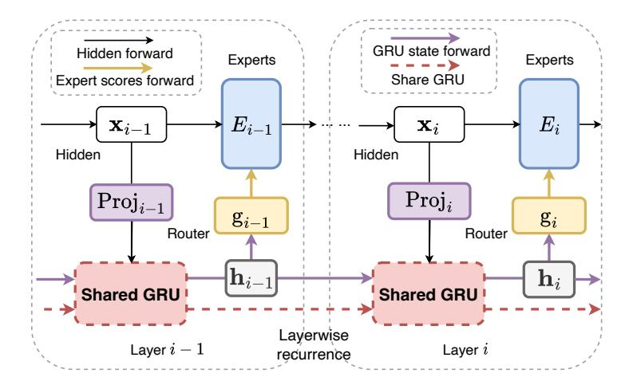

# LAYERWISE RECURRENT ROUTER FOR MIXTURE-OF-EXPERTS

 $^1$  Zihan Qiu\*  $^2$  Zeyu Huang\*  $^3$  Shuang Cheng  $^4$  Yizhi Zhou  $^5$  Zili Wang  $^{2,6}$  Ivan Titov  $^7$  Jie Fu $^\dagger$ 

#### **ABSTRACT**

The scaling of large language models (LLMs) has revolutionized their capabilities in various tasks, yet this growth must be matched with efficient computational strategies. The Mixture-of-Experts (MoE) architecture stands out for its ability to scale model size without significantly increasing training costs. Despite their advantages, current MoE models often display parameter inefficiency. For instance, a pre-trained MoE-based LLM with 52 billion parameters might perform comparably to a standard model with 6.7 billion parameters (Rajbhandari et al., 2022). Being a crucial part of MoE, current routers in different layers independently assign tokens without leveraging historical routing information, potentially leading to suboptimal token-expert combinations and the parameter inefficiency problem. To alleviate this issue, we introduce the Layerwise Recurrent Router for Mixture-of-Experts (RMoE). RMoE leverages a Gated Recurrent Unit (GRU) to establish dependencies between routing decisions across consecutive layers. Such layerwise recurrence can be efficiently parallelly computed for input tokens and introduces negotiable costs. Our extensive empirical evaluations demonstrate that RMoE-based language models consistently outperform a spectrum of baseline models. Furthermore, RMoE integrates a novel computation stage orthogonal to existing methods, allowing seamless compatibility with other MoE architectures. Our analyses attribute RMoE's gains to its effective cross-layer information sharing, which also improves expert selection and diversity. Our code is at https://github.com/qiuzh20/RMoE.

## 1 Introduction

In the era of large language models (LLMs), scaling the model parameters and training data up has unlocked remarkable model capabilities, such as in-context learning (Brown et al., 2020; Dong et al., 2022), nuanced conversations (Ouyang et al., 2022), and even complex code (Guo et al., 2024) and math (Imani et al., 2023) tasks. These advancements showcase the profound impact of increasing model size. The quest to enhance neural networks' capacity while ensuring training and inference efficiency spurred the development of computation-efficient transformer architectures. The Mixture-of-Experts (MoE) framework is one of such efficient architectural recipes (Shazeer et al., 2017; Lepikhin et al., 2021; Fedus et al., 2022; Zhang et al., 2022; Dai et al., 2024). Most MoE modules comprise one *router* and a group of *expert* networks. The router, usually parametrized as one linear layer, conditionally and sparsely assigns each input token to its corresponding experts, *i.e.*, the FeedForward Network (FFN) in the transformer layer. Therefore, MoE can significantly scale the model size and keep computational costs nearly unchanged (Smith et al., 2022).

Despite efficiently increasing the model size, most current pre-trained MoE models are not on par with standard models of the same size, demonstrating their parameter inefficiency. For example, Rajbhandari et al. (2022) shows that with the same training data, an MoE with 52B parameters and 1.3B activated ones for each token performs similarly to a 6.7B standard model. Komatsuzaki

&lt;sup>1Alibaba Group, 2University of Edinburgh, 3ICT, Chinese Academy of Sciences, 4Nanjing University, 5INF Technology 6University of Amsterdam 7Shanghai AI Lab qzh11628@gmail.com, zeyu.huang@ed.ac.uk, fujie@pjlab.org.cn

\* Equal contribution

&lt;sup>†Corresponding author

Figure 1: Recurrent router for Mixture-of-Experts. In the i-th layer, the hidden state  $\mathbf{x}_i$  is  $\mathbf{I}$ . projected to  $\mathbf{x}'$  with alower hidden dimension (Eq. 4),  $\mathbf{II}$ . combined with previous layer's GRU output  $\mathbf{h}_{i-1}$ , and processed through the cross-layer-shared GRU to produce the current layer's GRU output,  $\mathbf{h}_i$  (Eq. 5). III. layer i's router uses this output to select experts and executes standard MoE computation (Eq. 6). Such operation doesn't introduce sequence-level recurrence and can be efficiently implemented, as shown in Tab. 1 and Tab. 3.

et al. (2023) demonstrates that upcycling a standard T5-base (248M) into its MoE counterpart (2B) by copying existing FFN can bring some improvements, but it still lags behind the T5-large with 783M parameters. Similarly, Dai et al. (2024) use fine-grained and shared experts to improve the effectiveness, but the 16B MoE performs comparably with the 7B standard model (Bi et al., 2024).

One potential bottleneck for the current MoE could be the router. Typically, the router is parameterized as one lightweight linear layers, which may limit its capacity to explore the optimal token-expert combination. Previous works also reveal such limitations. For instance, Xue et al. (2024) finds the routing results converge to the token-id-based routing very quickly during the early phase of pre-training, which means the token-expert combination is far from well-explored. Some works even show hash functions (Roller et al., 2021), stochastic routing policy (Zuo et al., 2021), and fixed-random router (Chen et al., 2023) achieves competitive performance with the learnable router, illustrating that the learnable router component in MoE needs further enhancement.

Despite some enhancements for router (Chi et al., 2022; Shen et al., 2023; Do et al., 2023; Chen et al., 2023), current routers in different MoE layers still operate independently without comprehensive investigations into the decisions of other layers. This isolation may lead to suboptimal expert utilization, as each layer manages its routing based solely on local information, potentially leading to inefficiency of model parameters. Though vanilla MoE models could technically share the routing information via hidden states residual, this information may be overshadowed by the language modelling loss, requiring routing-relevant information to "compete" for its representation.

To this end, we introduce a dedicated component to capture and pass routing information for each layer. The proposed architecture, **R**ecurrent Router for **M**ixture-**o**f-**E**xperts (RMoE), is shown in the Fig. 1. Concretely, we regard routing decisions in consecutive layers as a sequence in which the routing results of the *i*-th layer should be conditioned on previous layers' decisions. We thus introduce a lightweight Gated Recurrent Unit (GRU) (Dey & Salem, 2017) to capture this dependence and simulate the information flow between routers across layers. Intuitively, GRU has a reset and an update gate to control the information flow across time steps. Hence, such layerwise recurrence will inform the router to which experts the current token was assigned in previous layers, potentially supporting cross-layer collaborations. Furthermore, the introduced GRU is especially for routing. It thus helps to disentangle the states relevant to model prediction and routing decisions.

We validate RMoE's performance with various model sizes, architectures, datasets, and training settings (per-training and supervised fine-tuning), demonstrating that RMoE outperforms a range of baselines. Moreover, RMoE's introduction of a novel computation stage during routing makes it orthogonal to and compatible with most existing methods. We further analyze RMoE and elucidate the primary contributors to its improvement. Our findings indicate that while the GRU in RMoE shares essential cross-layer information, it also enables additional gradient propagation for the router. Our analysis shows that layerwise recurrence provides cross-layer information, fostering router exploration and optimizing expert utilization. Consequently, the selected experts are leveraged more effectively, leading to increased diversity of experts. We believe that our innovative router design and massive analysis can offer insights into the development of future MoE models.

## 2 RELATED WORKS: VARIOUS ROUTERS FOR MOE

In this section, we review previous approaches to improve router design in SMoE. For example, XMoE (Chi et al., 2022) first projects hidden states into a lower-dimension space and computes their cosine-similarity to low-dimension expert embeddings, which can prevent the hidden states from collapsing to a linear combination of expert embeddings. Moduleformer (Shen et al., 2023) uses an MLP router with ReLU activation to increase router capacity. SMoE-dropout (Chen et al., 2023) utilizes a fixed random-initialized linear router and gradually increases Top-k during training. HyperMoE (Do et al., 2023) introduces a fixed random-initialized hypernet (Ha et al., 2016) at each layer to generate router weights condition on input and one learnable router embedding. One concurrent work (Gong et al., 2024) also introduces GRU in sequential routing stages. However, it does not view such a recurrent mechanism as a general and composable method with broad MoE fields or provide relative ablation or analysis. Extra discussion of related work to improve MoE from routing and training strategies, and utilize recurrent controllers can be found in App. A.1.

## 3 METHODOLOGY

#### 3.1 PRELIMINARIES

**Mixture-of-Experts** MoEs are typically implemented by replacing transformer models' original feed-forward networks (FFNs) with a group of parallel FFNs and incorporating a router. Suppose there are N experts, denoted as  $E_n, n \in [1, N]$ . The router  $g(\cdot; \mathbf{G}, k)$ , defined by its parameters  $\mathbf{G} \in \mathbb{R}^{(h,N)}$  and an integer k, maps the input  $\mathbf{x}$  to a score distribution over the experts,  $g(\mathbf{x}; \mathbf{G}, k) \in \mathbb{R}^N$ . Given  $\mathbf{x} \in \mathbb{R}^h$ , the output  $\mathbf{y} \in \mathbb{R}^h$  is the weighted sum of the outputs from all experts:

$$\mathbf{y} = \sum_{n \in N} g_n(\mathbf{x}; \mathbf{G}, k) E_n(\mathbf{x}) \tag{1}$$

Typically, g is a simple linear layer followed by a softmax and a Top-k function. The n th element of  $\mathbf{x} \times \mathbf{G} \in \mathbb{R}^N$  represents the gating score of expert  $E_n$ , and the n th column of  $\mathbf{G}$  can be regarded as the *expert embedding* for expert  $E_n$ . When k for Top-k is smaller than N, only a subset of experts is involved in the computation, which is known as Sparse Mixture-of-Experts (SMoE) (Shazeer et al., 2017; Fedus et al., 2022).

**Recurrent Neural Networks** RNNs (Medsker et al., 2001) are designed to handle sequential data by maintaining a hidden state h that holds the information from previous time steps. This hidden state is updated at each time step i based on the current input  $\mathbf{x}'_i$  and the hidden state at the last time step  $\mathbf{h}_{i-1}$ , formulated as  $\mathbf{h}_i = f(\mathbf{h}_{i-1}, \mathbf{x}'_i)$ .

The Gated Recurrent Units (GRU) Dey & Salem (2017) module is an advanced variant of RNNs that addresses traditional RNNs' limitations, such as difficulty capturing long-term dependencies and gradient vanishing issues. Given an input  $\mathbf{x}_i'$  at time step i, GRU first calculates the reset gate  $\mathbf{s}_i$  and the update gate  $\mathbf{z}_i$  to determine how much of the previous memory to keep and to forget,

$$\mathbf{s}_i = \sigma(\mathbf{W}_s \mathbf{x}_i' + \mathbf{U}_s \mathbf{h}_{i-1}), \quad \mathbf{z}_i = \sigma(\mathbf{W}_z \mathbf{x}_i' + \mathbf{U}_z \mathbf{h}_{i-1})$$
(2)

where  $\sigma$  represented the sigmoid activation function and all **W** and **U** are tranable parameters. And then, the hidden state  $h_t$  is updated by

$$\tilde{\mathbf{h}}_i = \tanh(\mathbf{W}_h \mathbf{x}_i' + \mathbf{s}_i \odot (\mathbf{W}_h \mathbf{h}_{i-1})), \quad \mathbf{h}_i = (1 - \mathbf{z}_i) \odot \tilde{\mathbf{h}}_i + \mathbf{z}_i \odot \mathbf{h}_{i-1}$$
(3)

## 3.2 Layerwise Recurrent Router

Existing routers work independently, this lack of global information may prevent routers from discovering more effective token-expert combinations. Therefore, we integrate a GRU into the routing process, explicitly incorporating historical routing information into the current expert selection for each token. Formally, at the i th layer, we first use a linear layer to project the hidden state  $\mathbf{x}_i$  to the dimension of the GRU state  $\mathbf{x}_i' \in \mathbb{R}^p$  (usually smaller than the dimension h of  $\mathbf{x}_i$ . We choose 128 for most of the settings provide further analysis in Tab. 6 and Tab. 7):

$$\mathbf{x}_i' = \operatorname{Proj}_i(\mathbf{x}_i) \tag{4}$$

Importantly, we use separate projectors for each layer since the hidden states x of different layers vary greatly (more discussion in Sec. [5\)](#page-6-2). This projection output x ′ , along with the GRU result from the previous layer, hi−1, is then fed into a GRU unit to obtain the current GRU output hi .

$$\mathbf{h}_i = \mathrm{GRU}(\mathbf{x}_i', \mathbf{h}_{i-1}). \tag{5}$$

Next, hi is input into the router and then expert outputs are aggregated based on the router output:

$$\mathbf{y_i} = \sum_{n \in N} g_n(\mathbf{h}_i; \mathbf{G}_i, k) E_n(\mathbf{x}_i). \tag{6}$$

Here, yi represents the output of the i-th layer, hi is the GRU output, gn(hi ; Gi , k) is the router output computed with routing parameter Gi in layer i. Notice that, unlike traditional RNNs, which use a shared projector together for sequential inputs when the input dimension isn't equal to the RNN's hidden dimension, we use different projectors Proji in Eq. [4](#page-2-0) for different layers since hidden states and model weights in different layers usually various a lot (Fig. [11](#page-24-0) and Tab. [6\)](#page-6-0).

Despite capturing inter-layer dependencies between routers in different layers, RMoE potentially has other advantages: (1) *Prevent representation collapse*: [Chi et al.](#page-10-6) [\(2022\)](#page-10-6) identified that the single linear layer routers encourage token embeddings clustering around *expert embedding*, implying a trend toward representation collapse issue. And they propose XMoE to first project hidden states into a low-dimension and then calculate the gating score. Similarly, the projector (Eq. [4\)](#page-2-0) and GRU (Eq. [6\)](#page-3-1) in RMoE also separate hidden states from expert embeddings and can reduce this issue. (2) *Additional Gradient Flow*: Before the inclusion of GRU, the router's gradient mainly derive from the expert weight score gn in Eq. [1.](#page-2-1) The introduction of GRU not only provides enriched information about historical routing but also an extra gradient propagation through GRU hidden states. We denote this extra gradient flow as *Recurrent Gradient*, and we empirically demonstrated that this *Recurrent Gradient* is important to RMoE. (3) *Applicable with other MoE design*: the proposed method introduces an additional computation stage into SMoE, it is orthogonal to most existing attempts to improve MoE and is seamlessly compatible with them.

