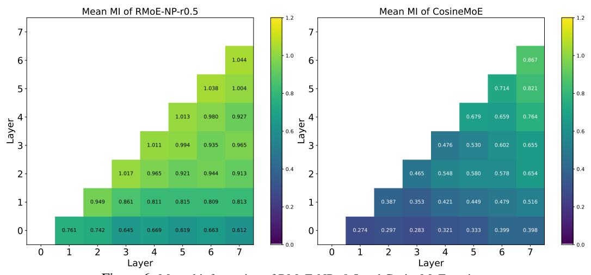
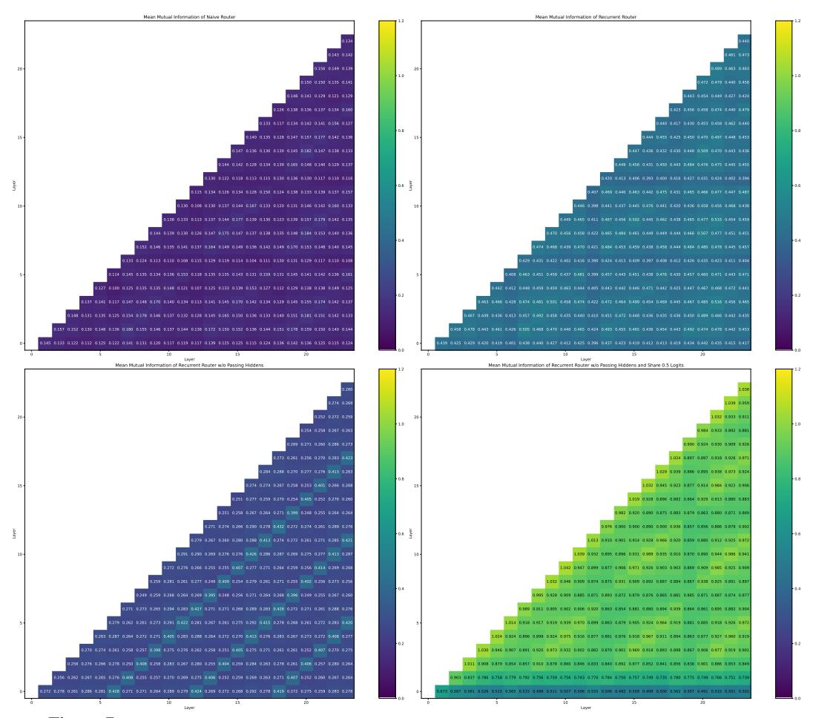
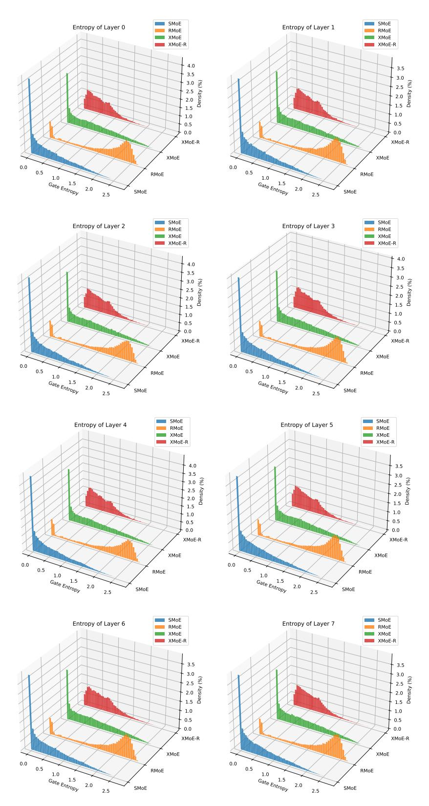
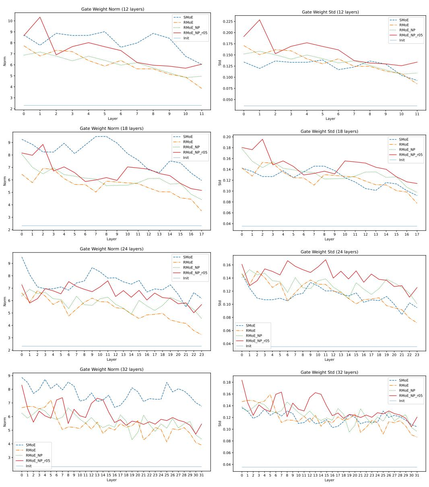
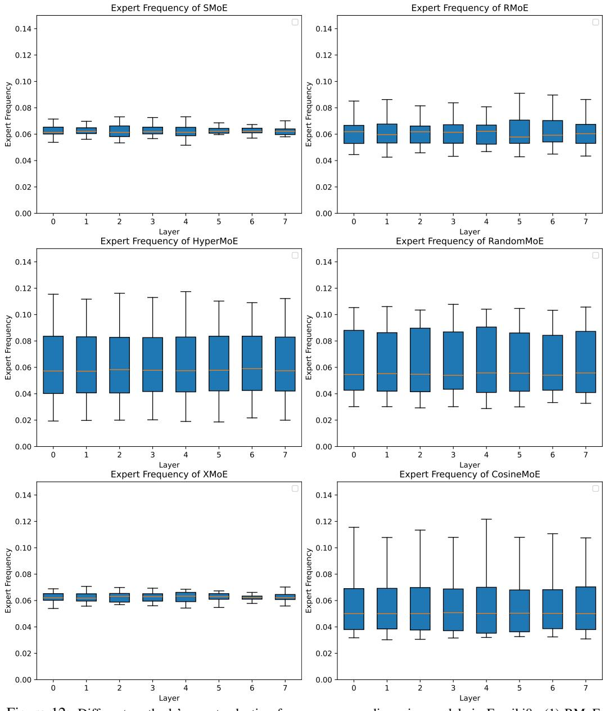
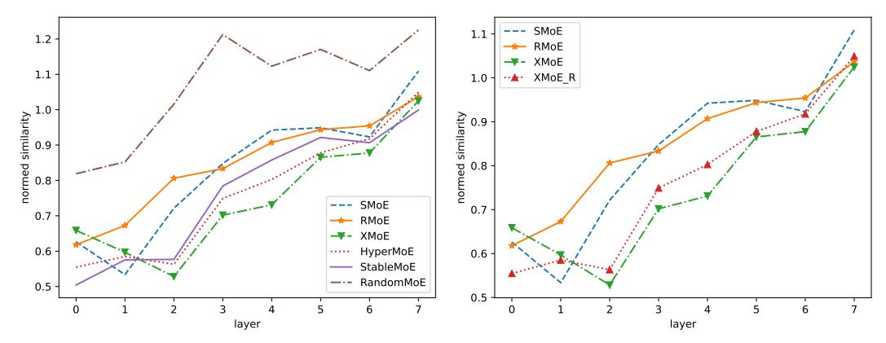
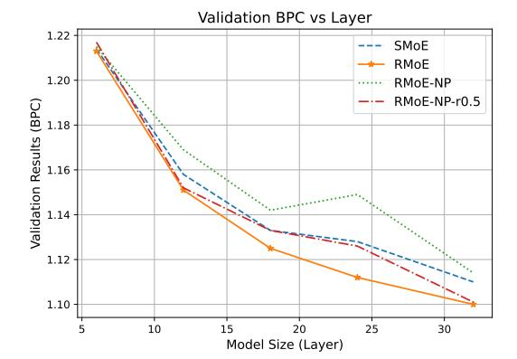

# A.4.4 MORE ROUTER ENTROPY DISTRIBUTIONS

Figure 6: Mutual information of RMoE-NP-r0.5 and CosineMoE settings

Figure 7: Mutual information of SMoE, RMoE, RMoE-NP, and RMoE-NP-r0.5 in 24-layer models.

Figure 8: Gate score entropy distribution over Enwiki test set for different routers in 8-layer models.

#### A.4.5 ROUTER WEIGHTS INFORMATION

## A.4.6 EXPERT SELECTION FREQUENCY

#### A.5 ADDITIONAL RESULTS

Table 12: More SMoE and RMoE variants pre-training costs and evaluation results in selected informative lm-evaluation-harness tasks. 'sft' means supervised fine-tuning on the Alpaca dataset. The task names and metrics for short names in the table are: 'ARC-e' for ARC-Easy, acc; 'Hella' is for Hellaswag, acc-norm; 'Piqa' for PIQA, acc-norm; 'Lamb' for LAMBADA, acc.

| Algorithm      | Training                     | ARC-e | Hella | Piqa  | Sciq | Lamb  | Avg↑  |
|----------------|------------------------------|-------|-------|-------|------|-------|-------|
|                | 20B (5k steps)               | 47.14 | 35.51 | 64.69 | 76.2 | 14.61 | 47.63 |
|                | +sft                         | 50.93 | 35.82 | 65.61 | 74.7 | 17.81 | 48.97 |
| SMoE           | +sft (freeze gate)           | 50.59 | 35.78 | 66.32 | 74.7 | 18.18 | 49.11 |
|                | 40B (10k steps)              | 52.57 | 40.85 | 67.74 | 83.4 | 26.74 | 54.26 |
|                | +sft                         | 53.7  | 42.07 | 68.61 | 83.5 | 32.8  | 56.13 |
|                | +sft (freeze gate)           | 53.45 | 41.94 | 68.88 | 83.1 | 32.06 | 55.89 |
|                | 20B                          | 47.01 | 35.91 | 65.23 | 78.7 | 19.13 | 49.20 |
|                | +sft                         | 48.53 | 36.9  | 66.21 | 79.6 | 24.74 | 51.20 |
| RMoE           | +sft (freeze router)         | 48.65 | 36.88 | 66.43 | 80.1 | 24.55 | 51.32 |
|                | +sft (freeze router and GRU) | 49.24 | 36.79 | 66.16 | 79.7 | 24.32 | 51.24 |
| GRU p = 128 | 40B                          | 51.18 | 41.38 | 67.79 | 83.6 | 32.58 | 55.31 |
|                | +sft                         | 53.20 | 43.05 | 68.55 | 83.8 | 37.16 | 57.15 |
|                | +sft (freeze router)         | 53.03 | 42.96 | 68.34 | 83.6 | 36.68 | 56.92 |
|                | +sft (freeze router and GRU) | 53.11 | 43.16 | 68.77 | 82.8 | 37.57 | 57.08 |
|                | 20B                          | 47.47 | 35.91 | 65.78 | 76.2 | 20.03 | 49.08 |
|                | +sft                         | 48.36 | 36.49 | 65.07 | 77.4 | 22.86 | 50.04 |
| RMoE           | +sft (freeze router)         | 48.27 | 36.42 | 65.23 | 76.9 | 22.88 | 49.94 |
|                | +sft (freeze router and GRU) | 48.23 | 36.46 | 64.94 | 77.3 | 22.61 | 49.91 |
| GRU p = 256 | 40B                          | 53.07 | 41.15 | 68.52 | 84.0 | 19.17 | 53.18 |
|                | +sft                         | 54.46 | 43.06 | 67.46 | 84.9 | 24.57 | 54.89 |
|                | +sft (freeze router)         | 54.45 | 43.10 | 67.19 | 84.1 | 23.93 | 54.55 |
|                | +sft (freeze router and GRU) | 54.50 | 43.13 | 67.36 | 83.8 | 23.62 | 54.48 |
|                | 20B                          | 47.77 | 35.39 | 64.80 | 79.5 | 25.00 | 50.49 |
|                | +sft                         | 48.27 | 36.47 | 65.51 | 76.6 | 22.18 | 49.81 |
| RMoE           | +sft (freeze router)         | 47.73 | 36.41 | 65.78 | 76.6 | 22.88 | 49.88 |
|                | +sft (freeze router and GRU) | 48.19 | 36.22 | 65.29 | 76.8 | 23.5  | 50.00 |
| GRU p = 512 | 40B                          | 51.64 | 41.37 | 66.81 | 86.0 | 22.76 | 53.72 |
|                | +sft                         | 52.82 | 42.68 | 68.55 | 86.0 | 26.88 | 55.39 |
|                | +sft (freeze router)         | 52.48 | 42.61 | 68.44 | 86.0 | 27.23 | 55.35 |
|                | +sft (freeze router and GRU) | 52.74 | 42.44 | 68.77 | 86.3 | 27.13 | 55.48 |
| RMoE           | 20B                          | 46.63 | 35.7  | 64.91 | 76.1 | 16.24 | 47.92 |
|                | +sft                         | 48.40 | 36.45 | 65.51 | 77.3 | 22.65 | 50.06 |
| RNN            | +sft (freeze router)         | 48.70 | 36.29 | 65.45 | 77.3 | 22.60 | 50.07 |
| p = 256        | +sft (freeze router and RNN) | 49.24 | 36.48 | 65.56 | 77.7 | 23.20 | 50.44 |

Figure 9: Gate score entropy distribution over Enwiki test set for different information passing settings in 8-layer models.

Figure 10: Gate score entropy distribution over Enwiki test set for different routers. RMoE can be combined with XMoE to encourage the exploration of XMoE.

Figure 11: Different layers' router weight statistics (left column: norm and right column: standard deviation) in Enwiki8 setting. (1) different layers have different norms and STDs, which inspires us to introduce layerwise projector in Equ [4](#page-2-0) and explains using the shared projector can hurt RMoE's performance (Tab. [6\)](#page-6-0). (2) While SMoE routers show larger weight norms than RMoE settings, their standard deviations are not the highest. The large router norms can potentially explain the larger IB and OB in Tab. [8.](#page-8-1)

Figure 12: Different methods' expert selection frequency on medium size models in Enwiki8. (1) RMoE slightly increases expert imbalance than SMoE. (2) Methods using a frozen-random-initialize router (Hyper-MoE and RandomMoE) show more imbalance problems.

Figure 13: Expert similarity in Enwiki8 training experiments. RandomMoE shows the highest expert similarity. XMoE, which introduces down-projected cosine routing to resolve representation collapse in SMoE, shows the lowest expert similarity. While RMoE doesn't significantly diversify experts as in the large-scale training settings (left), it can be further combined with XMoE, which largely increases expert diversity and brings improvement (right).

Figure 14: Validation BPC on Enwiki8 with different model sizes (6, 12, 18, 24, 32 layers).