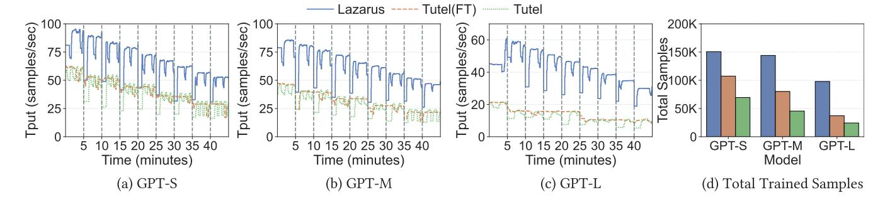

# A.2 Proof of Optimality of the MRO Placement Plan

Recall the setting of our placement problem, we have N nodes, E experts, each node can hold c expert replicas. The i-th expert has  $r_i$  replicas. Assume there are R nodes alive simultaneously, we want to find a placement plan that maximizes the probability of recovering all the experts when the R alive nodes are sampled uniformly. We denote [k] as the set of  $\{1,2,\cdots,k\}$ . We use integer matrix  $T\in\mathbb{N}^{c\times N}$  to denote the placement plan,  $T_{ij}$  represents the expert placed at node j's i-th slot. T satisfies the following properties:

$$T_{ij} \in [E], \forall i \in [c], j \in [N]$$

$$r_k = \sum_{i=1}^c \sum_{j=1}^N \mathbb{1}_{T_{ij} = k}, \forall k \in [E]$$
(2)

Without loss of generality, we assume r is sorted in the ascending order,  $r_1 \le r_2 \le \cdots \le r_m$ . Let  $Col_j$  denote the set composed of elements in the j-th column of T(removing duplicates),  $j = 1, \cdots, N$ . Let A be the set of R random columns that are alive, A is uniformly sampled. Our goal is:

$$\max \Pr(\bigcup_{a \in A} Col_a = [E])$$
 (3)

Theorem 1. The **maximum rank** overlap placement plan (MRO plan) is defined as follows: [N] could be partitioned into  $\lceil \frac{E}{c} \rceil$  disjoint subsets:  $|S_i| = r_{1+(i-1)*c}, i \in \lceil \frac{E}{c} \rceil - 1 \rceil, |S_{\lceil \frac{E}{c} \rceil}| = \min\{N - \sum_{j=1}^{\lceil \frac{E}{c} \rceil - 1} r_{1+(\lceil \frac{E}{c} \rceil - 1)*c}, r_{1+(\lceil \frac{E}{c} \rceil - 1)*c}\}$ , such that, for  $\forall i \in \lceil \frac{E}{c} \rceil \rceil, j \in S_i, \{1+(i-1)*c, \cdots, \min\{i*c, E\}\} \subseteq Col_j$ . We prove that any MRO plan T maximizes  $\Pr(\bigcup_{a \in A} Col_a = \lfloor E \rfloor)$ .

PROOF. We first consider the simple case of  $E \le c$ .

Under this case, if  $N \le r_1 + R - 1$ , by Pigeonhole principle, apparently we have  $\Pr(\bigcup_{a \in A} Col_a = [E]) = 1$  for any MRO plan.

Otherwise  $N \le r_1 + R - 1$ , then  $|S_1| = r_1$ . For any placement plan T, the probability of recovering all experts is upper bounded by the probability of recovering expert 1:

$$\Pr(\bigcup_{a \in A} Col_a = [E]) \le \Pr(1 \in \bigcup_{a \in A} Col_a) \tag{4}$$

For any placement plan T, the probability of recovering expert 1 satisfies:

$$\Pr(1 \in \bigcup_{a \in A} Col_a) \le 1 - \frac{\binom{N - r_1}{R}}{\binom{N}{R}} \tag{5}$$

For any MRO plan, by definition, we have:

$$\{1, \cdots, E\} \subseteq Col_j, j \in S_1$$
 (6)

Therefore,

$$\Pr(1 \in \bigcup_{a \in A} Col_a) \ge \Pr(\bigcup_{a \in A} Col_a = [E]) \ge 1 - \frac{\binom{N - r_1}{R}}{\binom{N}{R}}$$
 (7)

Combining Inequality 5 and Inequality 7, we have: for  $E \le c$ , any MRO plan maximizes  $\Pr(\bigcup_{a \in A} Col_a = [E])$  and thus is optimal.

To prove the case of E > c, we first define two functions  $P_T(\cdot,\cdot,\cdot)$  and  $P_s(\cdot,\cdot,\cdot)$ .  $P_T$  is defined as:

$$P_T(M, n, r) = \Pr(\bigcup_{a \in A} Col_a \supseteq M)$$
(8)

where matrix  $T \in \mathbb{N}^{c \times n}$ , A is r columns randomly sampled from n columns , M is a subset of [E].  $P_T$  is used to illustrate the probability of recovering the subset M from a sub-matrix T.

For set M, we define M[j] as j-th smallest element in set M.  $P_s$  is defined as:

$$P_s(M, n, r) = \Pr(r \text{ samples cover the first } \lceil \frac{|M|}{c} \rceil \text{ segments of vector } v)$$
(9)

where vector v has length n, with consecutively  $\lceil \frac{|M|}{c} \rceil$  segments, the i-th segment has length  $L_{M,i} = r_{M[1+(i-1)*c]}$ ,  $i=1,\cdots,\lceil \frac{|M|}{c} \rceil -1, L_{M,\lceil \frac{|M|}{c} \rceil} = \min\{n-\sum_{j=1}^{\lceil \frac{|M|}{c} \rceil -1} L_{M,j}, r_{\lceil \frac{|M|}{c} \rceil}\}$ .  $P_s$  is defined to illustrate the recover probability of MRO plans.

We prove the optimality of MRO plan when E > c by mathematical induction. We first have the following assumption:

Figure 14: [Comparison with Tutel]: Throughput and total trained samples with a single node fails every 5 minutes, where subsequent failed nodes are unused nodes for Tutel and Tutel(FT).

Assumption 1.  $\forall m' < E, \forall n', r', \forall \text{ set } M', |M'| = m',$ 

$$\max_{T} P_{T}(M', n', r') = P_{s}(M', n', r')$$
 (10)

We want to prove that for  $\forall |M| = E, \forall N, R$ ,

$$\max_{T} P_T(M, N, R) = P_s(M, N, R)$$
(11)

Proving Equation 11 indicates that any MRO plan achieves optimal recover probability across all different T.

We first consider the case of |M| > c. First if R = 1, |M| > c, for  $\forall T$ ,  $P_T(M, N, R) = 0$ ,  $P_s(M, N, R) = 0$ , the claim trivially satisfies.

When R > 1, |M| > c, for  $\forall T$ , we can transform T to T' by reordering the columns to let the columns containing 1 be the first consecutive columns. And  $\forall T$  we have:

$$P_T(M, N, R) = P_{T'}(M, N, R)$$
 (12)

Let A' as the set of R columns randomly sampled on T',  $S_t$  be the set of different values of column t of matrix T', C is the largest column ID of T' that contains 1. By conditioning on t, we have:

$$P_{T'}(M, N, R) = \sum_{t=1}^{C} \Pr(\min A' = t) \Pr(\bigcup_{a \in A' \setminus \{t\}} Col_a \supseteq M \setminus S_t | \min A' = t)$$
(13)

If we consider T'' as the sub-table of T' composed of its last N-t rows, we have:

$$\Pr(\bigcup_{a \in A' \setminus \{t\}} Col_a \supseteq M \setminus S_t | \min A' = t) \le \max_{T''} P_{T''}(M \setminus S_t, N - t, R - 1)$$
(14)

By Assumption 1, due to  $S_t \neq \emptyset$ , we have:

$$\max_{T''} P_{T''}(M \setminus S_t, N - t, R - 1) = P_s(M \setminus S_t, N - t, R - 1)$$
(15)

Recall Equation 13, we have:

$$P_{T'}(M, N, R) \le \sum_{t=1}^{r_{M[1]}} \Pr(\min A' = t) P_s(M \setminus S_t, N - t, R - 1)$$
(16)

To upper bound  $P_{T'}(M, N, R)$ , we have to upper bound  $P_s(M \setminus S_t, N - t, R - 1)$ . We first prove the following proposition:

PROPOSITION 1. Denote  $Min_cM$  as the smallest c elements of M. For  $\forall M$ , we have:

$$Min_c M = \arg\max_{S_t} P_s(M \setminus S_t, N - t, R - 1)$$
 (17)

It is apparent that removing elements from the recover target set results in an increase of  $P_s$ . Therefore, if  $|S_t| < c$ ,  $\forall s \neq S_t$ ,

$$P_s(M \setminus (S_t \cup s), N - t, R - 1) \ge P_s(M \setminus S_t, N - t, R - 1)$$
(18)

Therefore the set  $S_t$  that maximizes  $P_s(M \setminus S_t, N-t, R-1)$  must have c cardinality.

Consider  $|S_t| = c$ . If  $S_t$  is not the smallest c elements of M, we substitute an element in  $S_t$  with a smaller element obtaining  $S'_t$ ,  $|S'_t| = c$ . By the property of rankings, we have,

$$L_{M \setminus S'_t, i} \ge L_{M \setminus S_t, i}, \forall i$$
 (19)

Therefore,  $\forall S'_t$  obtained by this way,

$$P_s(M \setminus S'_t, N - t, R - 1) \ge P_s(M \setminus S_t, N - t, R - 1)$$
 (20)

We recursively apply this substitution and obtains  $Min_c M$ , therefore, for  $\forall S_t$ , we have:

$$P_s(M \setminus \mathsf{Min}_c M, N - t, R - 1) \ge P_s(M \setminus S_t, N - t, R - 1)$$
(21)

Thus finishes the proof of the proposition. This proposition tells us that  $S_t = \text{Min}_c M$  maximizes  $P_s(M \setminus S_t, N-t, R-1)$ . By Equation 16 and Proposition 1, we have,

$$P_{T}(M, N, R) \le \sum_{t=1}^{r_{M[1]}} \Pr(\min A' = t) P_{s}(M \setminus \text{Min}_{c}M, N - t, R - 1)$$
(22)

For  $P_s(M, N, R)$ , consider the left most sample should fall on the first segment, and the other R-1 samples should cover the set M', where M' satisfies the j-th segment of M' has equal length with the j+1-th segment of M for  $\forall j$ . Therefore  $M' = \{M[1+c], \cdots, M[|M|]\}$ .

$$P_{s}(M, N, R) = \sum_{t=1}^{r_{M[1]}} \Pr(\min A' = t) P_{s}(M', N - t, R - 1)$$

$$= \sum_{t=1}^{r_{M[1]}} \Pr(\min A' = t) P_{s}(\{M[1 + c], \dots, M[|M|]\}, N - t, R - 1)$$

$$= \sum_{t=1}^{r_{M[1]}} \Pr(\min A' = t) P_{s}(M \setminus \text{Min}_{c}M, N - t, R - 1)$$
(23)

Substituting Equation 23 into Inequality 22, we have:

$$P_T(M, N, R) \le P_s(M, N, R) \tag{24}$$

Now we have proven that  $P_s$  is an upper bound of  $P_T$ . Next, we prove that if T is a MRO plan, Inequality 24 can actually achieve equal. For  $\forall$  MRO plan  $T^*$ , we have:

$$\bigcup_{a \in A} Col_a = [E] \iff A \text{ covers } S_i, \forall i \in \{1, \cdots, \lceil \frac{E}{c} \rceil\}$$
 (25)

For  $\forall$  MRO plan  $T^*$ , we can reorder the columns so that for each column set  $S_i$ , all columns in  $S_i$  are consecutive. We denote the reordered MRO plan as T', and the randomly sampled columns on T' as A'.

$$\Pr(\bigcup_{a \in A'} Col_a = [E])$$

=Pr(A' covers segment with length  $|S_i|, \forall i \in \{1, \dots, \lceil \frac{m}{c} \rceil \}$ ) = $P_s(M, N, R)$ 

(26)

Therefore for  $T^*$  which is a MRO plan, by the definition of  $P_T$  in Equation 8, we have:

$$P_{T^*}(M, N, R) = P_s(M, N, R)$$
 (27)

Equation 27 indicates that  $\exists$ MRO plan  $T^*$ ,  $P_{T^*}(M, N, R) = P_s(M, N, R)$ , hence we prove that, under Assumption 1, Equation 11 holds when E > c.

Assumption 1 trivially holds due to the optimality of MRO plan when  $E \le c$ .

By mathematical reduction, for  $\forall E, \forall |M| = E, \forall N, R$ , we have,

$$\max_{T} P_T(M, N, R) = P_s(M, N, R)$$
 (28)

Furthermore, for  $\forall$  MRO plan  $T^*$  we have:

$$P_{T^*}([E], N, R) = \max_{T} \Pr(\bigcup_{a \in A} Col_a = [E])$$
(29)

П