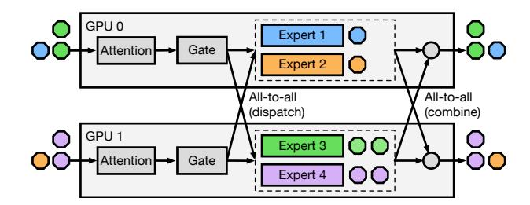

# Abstract

Sparsely-activated Mixture-of-Experts (MoE) architecture has increasingly been adopted to further scale large language models (LLMs). However, frequent failures still pose significant challenges as training scales. The cost of even a single failure is significant, as all GPUs need to idle wait until the failure is resolved, potentially losing considerable training progress as training has to restart from checkpoints. This problem is exacerbated by the growing use of spot instances on public clouds for model training, which despite offering substantial cost savings, introduce frequent preemptions—essentially failures that regularly occur throughout the training process. Existing solutions for efficient faulttolerant training either lack elasticity or rely on building resiliency into pipeline parallelism, which cannot be applied to MoE models due to the expert parallelism strategy adopted by the MoE architecture.

We present Lazarus, a system for resilient and elastic training of MoE models. Lazarus adaptively allocates expert replicas to address the inherent imbalance in expert workload and speeds up training, while a provably optimal expert placement algorithm is developed to maximize the probability of recovery upon failures. Through adaptive expert placement and a flexible token dispatcher, Lazarus can also fully utilize all available nodes after failures, leaving no GPU idle. Our evaluation shows that Lazarus outperforms existing MoE training systems by up to 5.7x under frequent node failures and 3.4x on a real spot instance trace.

### 1 Introduction

The advent of large language models (LLMs) has demonstrated ever-increasing capabilities with the rapid growth in both model sizes and training datasets. Recently, the sparselyactivated Mixture-of-Experts (MoE) models have been increasingly adopted by the community to further scale model parameters [\[14,](#page-13-0) [21,](#page-13-1) [23,](#page-13-2) [30\]](#page-13-3). Training state-of-the-art MoE

models is becoming resource-intensive. For instance, it takes over 32K H100 GPUs to train the 2T Llama 4 model [\[23\]](#page-13-2).

The likelihood and frequency of failures significantly increase as the scale and duration of training increase. Meta projects that the mean time to failure (MTTF) is as little as 14 minutes for a cluster with 128K GPUs [\[16\]](#page-13-4). Even a single failure is costly, as all GPUs are idle until the failure is resolved and failed nodes are replaced. It is reported that failures can slow the training progress by up to 43% [\[24\]](#page-13-5). In addition, most cloud providers offer preemptible (spot) instances that can be leveraged for training LLMs with minimized monetary cost [\[4,](#page-12-0) [35\]](#page-13-6), as they offer cost savings of up to 90% compared to on-demand instances. Preemptions, which are essentially failures, can happen as frequently as every 5~10 minutes [\[35\]](#page-13-6).

Existing solutions for LLM training with quick failure recovery can be categorized into two classes: checkpointing optimizations or pipeline-parallelism based elastic training. The first line of work [\[2,](#page-12-1) [38,](#page-14-0) [39\]](#page-14-1) reduces checkpointing overhead by either using CPU memory of neighboring nodes to periodically checkpoint model states, or relying on stale states which compromises correctness [\[2\]](#page-12-1). They also lack elasticity and have to wait for replacement nodes of the failed ones to recover from failure and continue training, which may not be available for hours to days until failed nodes are repaired [\[9\]](#page-13-7). Especially for training on spot instances, such new node availability cannot be taken for granted.

The second line of works builds resiliency and elasticity into pipeline parallelism by taking advantage of its configurability in stages-nodes mapping [\[4,](#page-12-0) [13,](#page-13-8) [35\]](#page-13-6). In particular, they can continue training upon failures without requiring additional nodes. However, these approaches do not apply to MoE models, as the distributed training of MoE models depends on a different parallelism strategy: expert parallelism (EP) [\[17\]](#page-13-9). EP distributes experts across multiple GPUs (and nodes) and uses all-to-all communication to dispatch input tokens to GPUs with corresponding experts.

In this paper, we present Lazarus, a system for resilient and elastic training of MoE models. Lazarus achieves highthroughput training accompanied by a high failure recovery probability without restarting from checkpoints. Upon

1

∗Yongji Wu, Wenjie Qu and Xueshen Liu are co-first authors of this work.

Figure 1: MoE architecture utilizes expert parallelism for distributed training, yet it also suffers from imbalanced workload due to the dynamic nature of gate networks.

failures, Lazarus quickly reconfigures the training job and utilizes all remaining GPUs (regardless of how many nodes fail).

Our insight is that adaptively adjusting the number of replicas (GPUs) assigned to each expert and their placement enables elastic training while improving resiliency against failures. Due to the dynamic nature of its architecture, MoE models suffer from dynamic and imbalanced workload [\[10,](#page-13-10) [27,](#page-13-11) [40\]](#page-14-2). Tokens are routed to experts based on the decisions of trainable gate networks. Some experts have more tokens routed to than others. Traditional EP partitions experts into equal-sized chunks, and each is assigned to the same number of GPUs. In contrast, Lazarus allocates more replicas to popular experts and flexibly assigns them using all available GPUs. Such flexible expert allocation not only results in performance boosts but also leads to better elasticity. As long as a single replica for each expert remains available, training can continue to progress with all remaining nodes utilized; traditional EP requires using a multiple of EP size GPUs, which can induce significant performance degradation even for minor failures.

There are three key challenges Lazarus must address. First, we need an expert allocation and placement algorithm that takes account of the imbalanced workload, to speed up expert computation while ensuring a high probability of successful recovery. Second, with our asymmetrical expert placements in the cluster, how do we efficiently dispatch tokens to GPUs with corresponding experts and balance their loads? Third, how do we quickly re-instantiate lost expert replicas and efficiently migrate the cluster to a new placement plan in response to failures?

To address these challenges, we propose a strategy for allocating expert replicas based on the load distribution, while maintaining a fault-tolerant threshold to guarantee failure recovery when a small number of nodes fail. We design a provably optimal algorithm for placing these replicas to maximize the recovery probabilities under arbitrary node failures. We develop a CUDA kernel that dispatches tokens in parallel

Figure 2: Expert loads on a 16 experts model (GPT-L in [§6.1\)](#page-7-0). The distribution varies during training and across layers.

with a flexible all-to-all that minimizes inter-GPU communication. During migration, Lazarus utilizes a greedy strategy to reduce state transfers for efficient reconfiguration.

We implement Lazarus in PyTorch. We evaluate Lazarus across MoE models of different scales with both controlled failures and spot instance traces. Our results show that Lazarus outperforms checkpointing-based DeepSpeed MoE [\[31\]](#page-13-12), a widely adopted system for training MoE models, by up to 2.3x under infrequent failures (40 mins MTBF) and 5.7x under a high failure frequency (5 mins MTBF), while our evaluation on a real spot instance trace demonstrates a performance improvement of 3.4x.

In this paper, we make the following contributions:

- To the best of our knowledge, Lazarus is the first system for resilient and elastic training of MoE models that enables both quick recovery from failures and full utilization of all available (remaining) GPUs.
- We design a provably optimal algorithm for determining expert placement that maximizes recovery probability in response to uniformly random node failures.
- We implement and evaluate Lazarus with MoE models of different scales under a variety of scenarios.

#### 2 Background and Motivation

#### 2.1 MoE Models and Expert Parallelism

Mixture-of-Experts architecture has been recently applied to scale LLMs due to its high cost-efficiency, which replaces the dense feed-forward network (FFN) in a transformer block. MoE employs multiple parallel FFNs called experts. In each MoE layer, a trainable gate network routes each token to only the top- experts. As experts are sparsely activated, MoE enables scaling model parameters without an increase of the per-token computational cost.

As the size of an MoE model is dominated by the weights of the experts, expert parallelism (EP) [\[17\]](#page-13-9) has been proposed and has become the de facto approach to train large-scale MoE models. In expert parallel training, the experts of each layer are split into equal-sized chunks and allocated across multiple GPUs similar to tensor parallelism, while the input samples are distributed along the batch dimension similar to data parallelism. The number of GPUs required to split the experts is called the EP size and such a set of GPUs forms an EP group. For instance, in [Figure 1,](#page-1-0) there are 4 experts and each GPU accommodates 2 experts, therefore it has a EP size of 2. EP can be used in conjunction with other types of parallelism like data and tensor parallelism.

As each GPU in an EP group only holds a subset of experts, all-to-all communication is used to dispatch the input tokens to the GPUs with corresponding experts that the gate network routes to. The computation of the experts are performed on the owning GPUs and the results are sent back to the original GPUs with a second all-to-all (combine).

The most distinctive feature of expert parallelism is the dynamic nature of gate networks. The distribution of tokens routed to each expert can be highly unbalanced depends on the input data. We plot the evolution of expert loads from a training trace [\[40\]](#page-14-2) in [Figure 2.](#page-1-1) We observe that the load of experts is highly skewed, with up to 87% tokens routed to 2 most popular experts. The load distribution also varies at different layers and training iterations.

The skewed expert loads in MoE training directly translates to imbalance in expert computation. GPUs holding more popular experts takes much longer time to compute due to large amount of tokens dispatched to them, while other GPUs are idling. Previous works [\[8,](#page-13-13) [10,](#page-13-10) [27,](#page-13-11) [40\]](#page-14-2) addresses this challenge by dynamically adjusting parallelism strategies on a cluster with a fixed number of GPUs. They do not apply in an elastic environment with changing device membership.

In addition to the problem of imbalanced workload, traditional EP also utilizes a multiple of EP size GPUs, which may leave some of GPUs idle upon a failure. The waste of GPUs only grows with increasing number of experts, as more GPUs are needed for a single EP group, i.e., larger EP size.

#### 2.2 Fault-Tolerant and Elastic Training

A growing research effort has been made in resilient training in recent years, due to the fact that both the frequencies and costs of failures increase as the scale and duration of training increase. It is reported during the two-months training of OPT 175B, around 100+ failures were encountered [\[41\]](#page-14-3), wasting over 178,000 GPU hours. The cost of even one failure is significant, as all the GPUs must wait idle until the failure is resolved and failed nodes are repaired, which could take hours to days depending on the nature of failures [\[9\]](#page-13-7). To minimize the GPU idling and the resulting economic loss, a training system must be designed with resiliency in terms of it can quickly recover from failures, and elasticity in terms that it can efficiently utilize currently available GPU resources to continue training. Such systems also enable one

Figure 3: System architecture of Lazarus.

to leverage preemptible instances on public clouds to train LLMs with significant cost savings [\[4,](#page-12-0) [35\]](#page-13-6).

Existing training solutions with quick failure recovery capability can be divided into two categories: checkpointing optimizations and elastic training using pipeline parallelism. Checkpointing based solutions focus on reducing the overhead in both saving checkpoints and restarting [\[2,](#page-12-1) [6,](#page-13-14) [37](#page-14-4)[–39\]](#page-14-1). In particular, in-memory based checkpointing [\[38,](#page-14-0) [39\]](#page-14-1) has been proposed to store model states in the CPU memory of other nodes in addition to persistent storage, while MoC-System [\[2\]](#page-12-1), an MoE specific checkpointing solution, compromises correctness by using stale states. However, they lack elasticity as they have to wait until replacements of failed nodes are available to resume training.

To support both elastic and fault tolerant training without the overhead of checkpointing and restarting, recent attempts [\[4,](#page-12-0) [13,](#page-13-8) [35\]](#page-13-6) have been made in building resiliency into pipeline parallelism due to its configurability. However, they fail to apply to MoE models. As the model states of a single MoE layer can exceed the GPU memory capacity, they are generally trained in conjunction with expert parallelism, requiring resiliency for expert states distributed across GPUs.

In summary, existing systems for fault-tolerant and elastic training fail to adapt to MoE models. Lazarus targets MoE training, utilizing adaptive expert allocation and placement to address expert parallelism's inelastic nature while handling the imbalanced expert load distribution caused by the dynamic gate networks.

#### 3 System Overview

Lazarus is a resilient and elastic system for training MoE models. Lazarus speeds-up training by adaptively allocating expert replicas based on the dynamic expert load distribution using all available GPUs, while our fault-tolerant expert placement strategy maximizes Lazarus's recovery probability even under simultaneous failures of multiple nodes.

The architecture of Lazarus is shown in Figure 3. Lazarus consists of three main components: a centralized controller that manages a GPU cluster, an agent process on each GPU node that spins up worker processes with Lazarus runtime. The controller runs persistently on a (CPU-only) node and it communicates with each Lazarus agent, monitors the cluster and detects node failures and replenishment. A scheduler in the controller allocates expert replicas and computes a fault-tolerant placement plan for all GPU nodes that maximizes the recovery probability (§4.1). The placement is sent to each Lazarus agent to configure the workers. Based on the placement plan, Lazarus runtime fills up each layer with corresponding experts assigned to it. Unlike vanilla expert parallelism where all experts are equally replicated, Lazarus assigns more replicas and more GPUs to the heavily loaded experts. As the expert placement becomes asymmetric, Lazarus runtime also contains a CUDA kernel based dispatcher (§4.2) to efficiently dispatch tokens to GPUs with corresponding experts and balance their loads.

Upon detection of failures, the controller recomputes an expert placement plan using all remaining nodes and minimizes the number of replicas migrated. Once Lazarus runtime receives the new plan relayed by Lazarus agent, it dynamically reconfigures the parallelism setups and retrieves missing model states from other nodes (§4.3). To handle dynamics in workloads, Lazarus agent also periodically collects the expert load distribution (routing history of gate networks) from Lazarus runtime. The load distribution is communicated to the load monitor on the controller, which then rebalances the expert allocation and placement.

#### 4 Design

