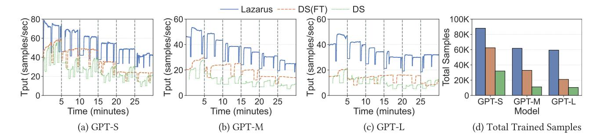
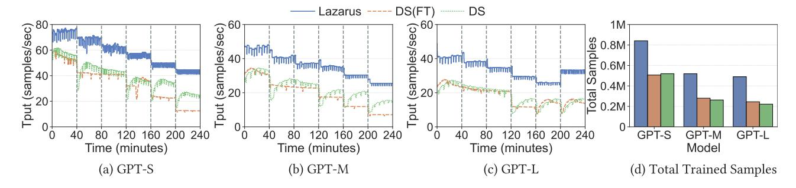
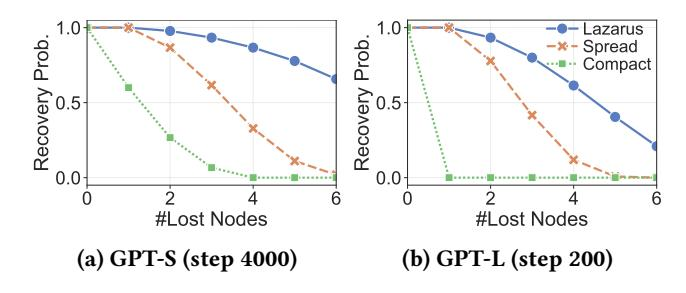
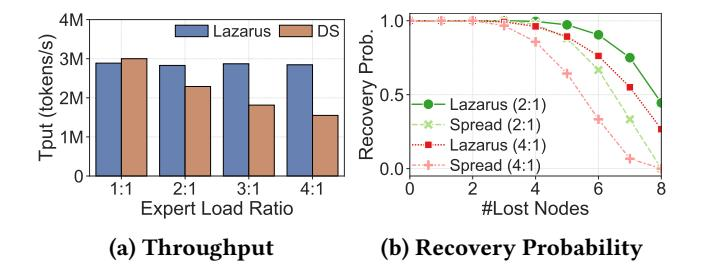

# Algorithm 1: Token dispatch algorithm.

**Input**: N: Number of GPUs; i: Current GPU rank; h:

 $R_{e,j}$ : Number of replicas for expert e

Activation of input tokens to the MoE block;

```
assigned to rank j; T_{e,j}: Number of tokens
                 routed to expert e at rank j;
    Output: h': Shuffled inputs for all-to-all dispatch; s<sub>i</sub>:
                 Number of tokens to dispatch to rank j
 1 for e \leftarrow 0 to E in parallel do
          r_e \leftarrow \sum_{i} R_{e,j} // total #replicas for expert e
          t_e \leftarrow \sum_i T_{e,i} // total #tokens routed to expert e
 3
         p_e \leftarrow t_e/r_e // #tokens each replica should handle
         for j \leftarrow 0 to N in parallel do
 5
               P_{e,j} \leftarrow c_e R_{e,j} // \text{ #tokens rank } j \text{ can process}
 6
               P_{e,j} \leftarrow P_{e,j} - \min(P_{e,j}, T_{e,j})
             // rank j's local tokens are prioritized
          D_{e,i} \leftarrow c_e R_{e,i} - P_{e,i} // locally processed #tokens
 8
         for j \leftarrow 0 to N, j \neq i in parallel do
 9
            D_{e,j} \leftarrow (T_{e,i} - D_{e,i}) \frac{P_{e,j}}{\sum_{k \neq j} P_{e,k}}
10
             // distribute remaining tokens to other ranks
11 for j \leftarrow 0 to N in parallel do
         s_i \leftarrow \sum_{e'} D_{e',j} // \text{ #tokens dispatched to rank } j
12
          for e \leftarrow 0 to E in parallel do
13
               start \leftarrow \sum_{0..j-1} s_{j'} + \sum_{0..e-1} D_{e',j}
14
               end \leftarrow \sum_{0..j-1} s_{j'} + \sum_{0..e} D_{e',j}
15
              h'[start..end] \leftarrow (\sum_{j'=0}^{j-1} D_{e,j'})-th to
16
                (\sum_{j'=0}^{j} D_{e,j'})-th tokens in h that routed to e
17 return h', s
```

<span id="page-6-7"></span><span id="page-6-6"></span><span id="page-6-5"></span><span id="page-6-4"></span><span id="page-6-1"></span>receive significantly more tokens than others, hence defeating the purpose of our adaptive expert allocation. Moreover, the padded all-to-all is no longer viable in our case where a token can be dispatched to any rank (instead of within an EP group), as padding would dominate the communication.

To address these issues, we design a flexible token dispatcher that efficiently dispatches each token to a particular GPU and balances the number of tokens routed to each GPU. With the dispatch schedule computed, Lazarus performs a flexible all-to-all without padding. Algorithm 1 shows the workflow of the token dispatcher, which is implemented in a CUDA kernel to process all experts and target ranks in parallel. The basic idea behind Algorithm 1 is that each replica of an expert should compute around the same number of tokens, and each rank should utilize its local processing "capacity" before dispatching remaining tokens to other ranks.

Before computing the dispatch schedule, an all-gather is first performed to collect how many tokens are routed to each expert from all ranks, i.e.,  $T_{e,j}$ .  $T_{e,j}$  is collected so that the token dispatcher can better balance the load to each

GPU based on the expert routing distribution of all tokens from all ranks, instead of using only locally computed tokens. In addition, since collective communication operations require synchronization of all participant ranks,  $T_{e,j}$  is also necessary in computing how many tokens a rank should receive from each of the other ranks. Since only E integers are collected from each rank, this extra all-gather imposes negligible overhead, as demonstrated in §6.5.1. The number of replicas allocated to each GPU  $R_{e,j}$  from the placement plan is also passed to the token dispatcher.

After  $T_{e,j}$  is collected, each rank i independently computes how many tokens it dispatches to each of all N ranks, for all E experts. First, for each expert e, the number of tokens each replica should process is computed in line 4 by evenly distributing all  $t_e$  tokens routed to e onto all  $r_e$  replicas. The processing capacity of each rank j can then be computed by multiplying  $p_e$  with the number of replicas of e that j is assigned (line 6). This capacity will be prioritized towards tokens computed locally on j. After the remaining capacities of all ranks are computed, rank i dispatches the remaining  $(T_{e,i} - D_{e,i})$  tokens that are beyond i's local processing capacity. The number of tokens  $D_{e,j}$  to dispatch to each rank for e is calculated based on their residual capacities (line 10).

Since the all-to-all collective operates on a continuous buffer, the token dispatcher has to reshuffle the input activations h to the MoE block, so that tokens routed to the same expert and dispatched to the same rank are grouped together. The total tokens  $s_j$  to dispatch to rank j across all experts is computed in line 12. In lines 13-16, these tokens are sorted by their routed experts and placed consecutively in h'. The reshuffled activations h' are then used in the dispatch all-to-all collective, with  $s_j$  tokens sent to each rank j. The token dispatcher also computes how many tokens to receive from each rank j in the all-to-all in a similar fashion.

At this point, Lazarus has the ability to adaptively assign expert replicas and dynamically dispatches tokens among replicas of routed experts. Next, we discuss how Lazarus efficiently migrates to a new configuration upon failures.

#### <span id="page-6-0"></span>4.3 Efficient Reconfiguration

As discussed in §4.1, if at least a single replica of each expert still remains after failures, Lazarus can recover without restarting from checkpoints. However, the remaining expert replicas' distribution could deviate from the desired allocation computed for the workload, and their placement may be prone to subsequent failures. Therefore, Lazarus must reallocate expert replicas and efficiently migrate to a new placement. Such migration is also required when Lazarus rebalances the expert allocation and when new nodes join.

The ordering of nodes in the placement plan is not enforced in the placement algorithm, as long as each node in the plan maps to a physical node in the cluster. However, when migrating from an old placement plan, such a mapping becomes relevant. It directly determines how many experts' states a node needs to retrieve from other nodes, as only newly assigned ones not in the old placement plan have to be fetched. To reduce the number of replicas to shuffle during migration, hence the communication, Lazarus applies a greedy algorithm that iteratively maps a physical node to a node in the new placement plan that the number of newly assigned experts is minimized.

After the node mapping is determined, Lazarus schedules the transfers of expert states. Each node fetches missing states for the newly assigned experts from other nodes that own them. If multiple nodes require the states of the same expert, Lazarus distributes their state transfers among all owning nodes, to minimize the overall migration time.

#### 5 Implementation

Lazarus is implemented in 4K LoC in Python and 500 LoC in CUDA, building on top of PyTorch [\[12\]](#page-13-15) (v2.3) and using components from DeepSpeed [\[32\]](#page-13-16) (v0.13).

Lazarus controller and agents. We implement the controller and agents using Python's asynchronous framework. New agents register with the controller, using a TCP socket for communication. The controller maintains a global view of node availability, where agents periodically send heartbeats for it to detect failures. Upon failures or scaling up with newly arrived nodes, the controller computes an updated expert placement plan, which is sent to each agent and relayed to the worker process that uses Lazarus runtime. The agents also periodically collect expert routing history from each worker and send it to the controller for expert rebalancing. Lazarus runtime. Based on the controller's configuration, our runtime sets up NCCL [\[26\]](#page-13-17) communication groups for expert and non-expert gradients all-reduce, as well as all-toall in expert computation. We implement data parallelism and expert parallelism with our adaptive expert placement; however, Lazarus can be extended to combine with pipeline parallelism using techniques like Oobleck [\[13\]](#page-13-8), which are orthogonal and complementary to ours. Upon failures, enqueued NCCL operations time out and the model states are not updated on the failed step, while a new configuration is received from the agent via a listener thread. Batched NCCL send/recv primitives are used to transfer states during migration. For scaling up and rebalancing, Lazarus performs reconfiguration lazily, only after the current training step is finished.

<span id="page-7-1"></span>Table 1: Configurations of models used in the evaluation.

|              | GPT-S | GPT-M | GPT-L |
|--------------|-------|-------|-------|
| # Layers     | 12    | 12    | 12    |
| Feature dim. | 768   | 1024  | 1024  |
| # Experts    | 8     | 12    | 16    |
| # Params     | 521M  | 1.3B  | 1.7B  |

#### 6 Evaluation

#### <span id="page-7-0"></span>6.1 Setups

Testbed. We have five servers in our testbed, each with 2 NVIDIA RTX 3090 GPUs and a 100 Gbps Mellanox ConnectX-5 NIC connected to a single 100 Gbps Mellanox SN2100 switch. Due to limited resources, we treat each GPU as a separate node to emulate a cluster of 10 GPUs. To store checkpoints, we deploy a NFS server on a separate machine, which is connected to the GPU servers via 10 Gbps NICs.

Baselines. As there is no existing system to support resilient and elastic training of MoE models, we compare Lazarus against a checkpoint-based baseline using DeepSpeed MoE (DS) [\[31\]](#page-13-12), a widely adopted MoE training system with both system-side and model design-side optimization. To evaluate Lazarus's adaptive expert placement algorithm and flexible token dispatcher, we also build a fault tolerant baseline based on DeepSpeed MoE, utilizing efficient reconfiguration module from Lazarus runtime. We denote this baseline as DS(FT). Similar to Lazarus, if a complete replica of all experts still exists upon failures, it reconfigures the workers (reassigns EP groups) and retrieves required model (expert) states from owning nodes.

Workloads. Based on the widely used GPT-2 architecture, we adopt three MoE models of varying sizes and number of experts, listed in [Table 1.](#page-7-1) We use a per-GPU batch size of 4 and a sequence length of 1024 following GPT-2's setup [\[5\]](#page-13-18). For all evaluations, we use Wikitext-2 dataset [\[25\]](#page-13-19), top-1 gate, and FP16 precision for training.

For reproducibility, we use the routing history trace from SmartMoE [\[40\]](#page-14-2) artifact to emulate gate networks' routing decisions. We use the loads of the top experts at each layer to construct a routing trace for each of the models we evaluate. We set the number of expert replica slots for each GPU to 6, which is the upper limit based on available GPU memory. With DS's traditional expert parallelism, GPT-M can fully utilize all slots, while GPT-S and GPT-L can only use 4, as the multiple of slots per GPU and EP size must equal to the number of experts. GPT-S and GPT-M can utilize an EP size of 2, hence DS and DS(FT) fully utilize all 10 nodes in the cluster, while with 16 experts and an EP size of 4, they can only utilize 8 nodes on GPT-L. We set the checkpoint

interval to every 50 steps for DS and every 250 steps for DS(FT), unless mentioned otherwise. We set the minimum replicas per expert ( ) to 2 for Lazarus so that recovery is guaranteed under common single node failure scenarios. Lazarus rebalances expert replica allocation every 200 steps.

## <span id="page-8-1"></span>6.2 Controlled Single Node Failures

We first evaluate the performance in a more common case where a single node fails at a time. We consider both high failure frequency and low frequency scenarios, where we randomly choose a node to fail every 5 or 40 minutes, until only half of the nodes remain. The same set of nodes is selected to fail in each run for fair comparison. The results are shown in [Figure 6](#page-9-0) and [Figure 7.](#page-9-1) The throughput is smoothed over a short time window for visibility. The fluctuation in Lazarus's throughput is caused by the reconfiguration after node failures and the periodic rebalance of expert allocations, while the fluctuation in DS and DS(FT) is caused by checkpointing, restarting and reconfiguration (only for DS(FT)). To reduce the overhead of checkpointing for DS and DS(FT) in the low failure frequency (40 minutes) setting, we increase their checkpoint intervals by 4x to 200 steps and 1000 steps, respectively. We also note that using such low checkpoint frequency would prevent DS from making any effective progress under high failure frequency (5 minutes).

From [Figure 6](#page-9-0) with a failure frequency of 5 minutes, we observe that over the 30 minutes duration of training, Lazarus finished a total of 2926 and 1996 steps, trained 2.8x and 5.7x samples on GPT-S and GPT-L, compared with DS. The performance gains significantly increase on GPT-L, as the checkpointing and restarting overhead grows with model sizes. Moreover, as in the GPT-L setting (EP size is 4), 4 nodes are required to hold a complete replica of all experts for DS and DS(FT), they can only utilize either 4 or 8 nodes, while they can utilize all 10 nodes at the start for GPT-S and GPT-M.

Lazarus also outperforms DS(FT) by 1.4x and 2.8x on GPT-S and GPT-L. On the smaller GPT-S, there are a large number of replicas for each expert (5 replicas initially), hence DS(FT) can recover in each failure. However, as the number of experts and EP size increases on GPT-L, DS(FT) has to restart from checkpoints after failures of both EP groups.

When the failure is infrequent as shown in [Figure 7,](#page-9-1) the performance difference between Lazarus and DS decreases as the overhead of checkpointing and restarting decreases. Still, Lazarus outperforms DS by 1.6x and 2.3x on GPT-S and GPT-L. As the overhead of DS decreases, DS and DS(FT) have similar performance in this case.

We also observe that Lazarus's throughput tends to monotonically decrease as the number of nodes decreases, as Lazarus can fully utilize all remaining nodes for training.

<span id="page-8-0"></span>

|                    | GPT-S    |           | GPT-L    |           |
|--------------------|----------|-----------|----------|-----------|
|                    | step 200 | step 4000 | step 200 | step 4000 |
| # Lost nodes       | 2        | 3         | 4        | 5         |
| Reconfig time (s)  | 21.3     | 34.1      | 18.2     | 19.7      |
| # Experts transfer | 11       | 52        | 160      | 55        |
| Transfer time (s)  | 2.3      | 3.0       | 7.6      | 7.8       |

Table 2: [Multi-node failures]: Recovery overhead of Lazarus under multiple node failures on sampled cases.

While for DS and DS(FT), the throughput experiences steep drops since they can only utilize a multiple of EP size nodes. We note that the throughput of Lazarus increases in the last 40 minutes in [Figure 7.](#page-9-1) This is because Lazarus no longer enforces a minimum of 2 replicas for each expert for fault tolerance, as there are not enough slots with 5 nodes left.

Lazarus still outperforms DS by a great margin, even when both of them fully utilize all 10. For instance, for GPT-M, during the first 40 minutes in [Figure 7](#page-9-1) when no node fails, Lazarus has a throughput of 45 samples/sec during effective computation (factoring out checkpoint and rebalance overheads), while DS only reaches 34 samples/sec.

From [Figure 6,](#page-9-0) we also observe that compared to DS, DS(FT) sometimes has higher throughput during effective computation. For instance, for GPT-M, DS(FT) outperforms DS by 1.6x during the 5~10 minutes window, when they all fully utilize the remaining 8 nodes. This is mainly caused by the highly imbalanced expert loads during the early periods of training, while DS(FT) progresses much faster without the overhead of checkpoint and restarting. When we increase the checkpoint intervals by 4x for both baselines in [Figure 7,](#page-9-1) together with the lower failure frequency, such divergence disappears. Instead, for GPT-S and GPT-M, DS(FT) is slower than DS during the last 80 minutes. In these two cases, DS(FT) always resumes training by reconfiguring currently used nodes that are still alive. It does not use previously dropped nodes (due to exceeding EP size of 2), while DS attempts to utilize all nodes it can when restarting.

Overall, checkpointing and restarting overhead becomes increasingly significant with larger models and higher failure frequency. Comparing with DS(FT) which shares Lazarus's efficient reconfiguration runtime, Lazarus's adaptive expert placement improves both training throughput and resiliency.

## 6.3 Controlled Multi Node Failures

Next, we study how well Lazarus handles simultaneous failures of multiple nodes. Whether Lazarus can recover from such failures depends on both the expert allocation (i.e., how

<span id="page-9-0"></span>

Figure 6: [Single node failure]: Throughput and total trained samples with a single node fails every 5 minutes. DS refers to checkpointing-based DeepSpeed MoE; DS(FT) is a fault tolerant version we build using components from Lazarus's runtime.

<span id="page-9-1"></span>

Figure 7: [Single node failure]: Throughput and total trained samples with a single node fails every 40 minutes.

<span id="page-9-2"></span>

Figure 8: [Multi-node failures]: Recovery probabilities using different expert placement strategies.

many replicas are assigned to each expert) and expert placement, as well as which concrete set of nodes fail. The allocation and placement changes as the expert load distribution varies over the duration of training, and it is also different for different layers. Hence, we evaluate Lazarus's system overhead of recovery by sampling several cases for GPT-S and GPT-L at different training steps, while we evaluate Lazarus's placement algorithm by computing the recovery probability for a model at a given training step. The recovery probability can be computed by enumerating all possible

combinations of failed nodes, since the way experts are allocated and placed only depends on the expert load at the particular step.

The recovery overhead for sampled cases is shown in Table 2, where 2 to 5 nodes are selected to fail at training step 200 and 4000. We report the total number of experts replicas that need to be transferred between nodes and the time spent on the state transfers. The weights and optimizer states of each is 63MB for GPT-S and 112MB for GPT-L. We find that the overhead of state transfers is negligible. This low overhead is mainly contributed by the fact that required states can be fetched from other nodes instead of the much slower remote storage, and Lazarus balances the point to point send/recv operations among all owning ranks of an expert's states. We also report the total reconfiguration time, from failure occurrence to training resumption, where state transfers only constitute a small portion. Throughout our entire evaluation, we find that each reconfiguration event takes 20~40 seconds. It takes 10~20 seconds for enqueued NCCL kernels to time out and 5~15 seconds for reconfiguring NCCL's communication groups. We also observe that the placement plan's computation takes less than 100ms.

To demonstrate the effectiveness of Lazarus's fault-tolerant expert placement algorithms, we compare it with two baselines: a spread placement strategy which distributes each

<span id="page-10-1"></span>

Figure 9: [Spot instance]: Throughput changes in spot instance environment.

expert's replicas across different nodes in a round-robin fashion, and a compact strategy that packs an expert's replicas on a minimum number of nodes. The recovery probabilities with respect to the number of nodes failed are illustrated in Figure 8. We find that Lazarus's placement algorithm greatly outperforms both baselines. For instance, for GPT-L at step 200, Lazarus has a 41% recovery probability with 4 node failures, compared to 12% of spread placement. We also observe that on the smaller GPT-S when expert loads are relatively more balanced at later step 4000, compact placement achieves limited recovery capability with 1 or 2 node failures. However, it completely fails to recover in any failure scenario on the larger GPT-L with 16 experts.

#### <span id="page-10-3"></span>6.4 Spot Instance Trace

We also borrow a real spot instance node availability trace from Bamboo [35] to evaluate Lazarus under both failures and scaling-up. The trace includes both preemption events and node additions. We replay a representative 80 minutes segment of the availability trace collected on AWS EC2 P3 instances. As the original trace is collected on a 32 nodes cluster, we cap the maximum number of nodes to 10 in our testbed setup. To handle rare cases where recovery is not possible due to too many nodes failing at the same time, we also apply periodic checkpointing for Lazarus. We set the checkpoint interval to every 250 steps, the same as DS(FT), for fair comparison. For node addition events, all compared methods waited for 2 minutes to accumulate sufficient nodes before scaling up, to avoid frequent reconfiguration or restarting. The results are shown in Figure 9.

Over the 80 minutes duration, Lazarus trained 2.3x and 3.4x samples on GPT-S and GPT-L, compared with DS. Lazarus outperforms DS(FT) by 1.2x and 1.8x on GPT-S and GPT-L. We also note that Lazarus's throughput changes proportionally to the number of nodes available, as Lazarus wastes no node, while DS and DS(FT) are limited by EP sizes.

Due to the overhead of checkpointing and restarting, DS trained 51% and 48% fewer samples than DS(FT). DS(FT) can always recover from failures for GPT-S and GPT-M, as

<span id="page-10-2"></span>

Figure 10: [Ablation Study]: Single layer throughput and recovery probabilities under different expert load ratios.

it evenly allocates up to 5 replicas to all experts at a cost of reduced throughput. For GPT-L, however, when there is fewer than 8 nodes, DS(FT) cannot utilize more than 4 nodes for redundancy. It has to restart from the checkpoint each time, leading to 3~5 minutes of lost progress.

We observe that only in a single preemption event when 4 nodes are lost at 34 minutes, Lazarus has to restart from checkpoint. Note that in the original trace, only a maximum of 19% nodes failed at a time.

#### 6.5 Ablation Study

<span id="page-10-0"></span>6.5.1 Impacts of Expert Load Imbalance. To study how the expert load imbalance in workloads affects both Lazarus's performance and fault resiliency, we build a single MoE layer with 8 experts and a feature dimension of 1024. We construct workloads with different expert load ratios. We show the layer forward throughput in Figure 10a. Here, a load ratio of 4:1 indicates that 4x more tokens are routed to one of the experts than if all experts are evenly routed to.

We observe that Lazarus's throughput remains constant as the load ratio changes, attributed to Lazarus's adaptive expert allocation based on expert load distribution. DS's throughput, however, dramatically decreases as the workload becomes more skewed. When the workload is perfectly balanced (1:1), Lazarus suffers a small overhead due to its token dispatcher.

<span id="page-11-0"></span>

Figure 11: [Ablation Study]: Running time breakdown of GPT-S and GPT-L on the spot instance trace.

We also evaluate the effectiveness of Lazarus's expert placement algorithm in fault tolerance as the load distribution changes. [Figure 10b](#page-10-2) shows the recovery probability of Lazarus with varying numbers of failed nodes on 2:1 and 4:1 load ratios, compared with the spread placement strategy. We observe that the recovery probability decreases with more imbalanced workload, as less popular experts are assigned fewer replicas. Still, Lazarus's placement algorithm is much more effective than spread placement, while our previous evaluation demonstrates the increased throughput is worth the effort of skewed expert allocation.

6.5.2 Running Time Breakdown. We breakdown the running time on the spot instance trace from [§6.4](#page-10-3) in [Figure 11.](#page-11-0) Both Lazarus and DS(FT) have much more time spent in effective computation, benefiting from efficient reconfiguration module in Lazarus runtime, while over half of the time is spent on checkpointing and restarting (fallbacks) for DS. The reconfiguration and rebalance overhead of Lazarus is much smaller than restarting, accepting for less than 10%. We also find that DS(FT) can recover in all cases on GPT-S, yet it suffers 27% restarting overhead on GPT-L. Despite similar effective time, Lazarus outperforms DS(FT) by 1.8x in terms of total trained samples, contributed by our adaptive expert allocation and flexible token dispatcher.

