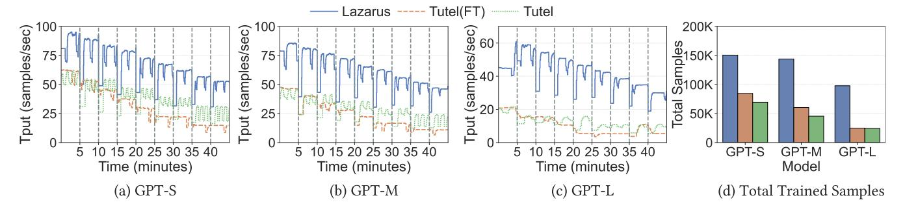
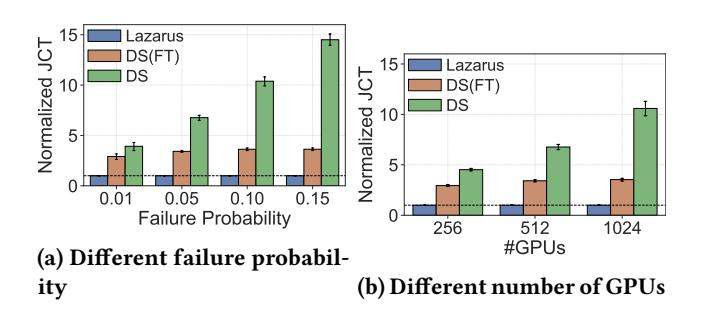

# 6.6 Comparison with Other MoE Training Systems

While many MoE training optimizations are orthogonal and can be directly applied to Lazarus to speed up training, some modify the token dispatch logic and are nontrivial to integrate. Still, Lazarus significantly improves end-to-end training performance with fault tolerance and elasticity.

Here we study how Lazarus compares to Tutel [\[10\]](#page-13-10), a MoE training system that implements state-of-the-art kernel optimizations for dispatch and combine operations under traditional expert parallelism. We also build a fault tolerant variant of Tutel using Lazarus's runtime reconfiguration module, which we denote as Tutel(FT). To demonstrate that Lazarus

adapts to different hardware setups, we set up a testbed on AWS using 16 g5.2xlarge instances. Each instance has an NVIDIA A10G GPU, while the instances are connected via a 10 Gbps TCP network. To store checkpoints, we employ AWS EFS that provides shared file systems. Due to the limited network bandwidth, we also employ the widely-used gradient accumulation technique [\[34\]](#page-13-20) with an accumulation step of 20 to avoid frequent gradient synchronization. We keep other settings the same as in [§6.2.](#page-8-1)

We report in [Figure 12](#page-12-2) the training performance under a random node failure of every 5 minutes. Lazarus outperforms Tutel(FT) and Tutel by 1.8x and 2.1x for GPT-S, and by 3.9x and 4.0x for GPT-L. We also observe that with more nodes in the cluster, Tutel(FT) can leave many unused, as it cannot reuse idle nodes that are previously dropped without restarting, same as DS(FT) in [§6.2.](#page-8-1) In the supplementary material, we provide the results under an ideal case where subsequent failed nodes are the unused ones by Tutel and Tutel(FT).

#### 6.7 Simulation

We evaluate how Lazarus scales to larger models and larger clusters via simulations. We follow Bamboo [\[35\]](#page-13-6) to setup our simulation, using a constant node preemption probability while varying new node allocation probabilities per simulation hour. We simulate the training of the DeepSeek V3 model [\[21\]](#page-13-1), where each node has 8 H200 GPUs and 8 400 Gbps NICs. We use the performance model from [\[1\]](#page-12-3). We consider a mixture of data, tensor and expert parallelism, where tensor parallelism is used within each node for non-expert components, while each GPU holds 4 expert replicas for both traditional expert parallelism and Lazarus. We sample an expert routing trace for DeepSeek-V3 using ShareGPT dataset [\[42\]](#page-14-5). We run 10 trials for each setting.

In [Figure 13a,](#page-12-4) we show the job completion time (JCT) for training 5M samples with 512 GPUs (64 nodes) under different failure probabilities, where the JCT is normalized to Lazarus. With a low failure probability of 0.01, Lazarus outperforms DS(FT) and DS by 2.9x and 3.9x, while it increases to 3.6x and 14.5x under a failure probability of 0.15. In [Fig](#page-12-4)[ure 13b,](#page-12-4) we show the JCT under a failure probability of 0.05 with different numbers of GPUs. With 256 GPUs, Lazarus speeds up over DS(FT) and DS by 2.9x and 4.5x, while with 1K GPUs, Lazarus' speed-up increases to 3.5x and 10.6x. We also observed that our expert placement algorithm in [§4.1](#page-3-0) takes less than 1 sec on a single CPU core for 1K GPUs.

## 7 Related Work

MoE training systems Extensive studies have focused on optimizing MoE training. A series of works [\[15,](#page-13-21) [18,](#page-13-22) [22,](#page-13-23) [28,](#page-13-24) [31,](#page-13-12) [33\]](#page-13-25) optimize the all-to-all communication performance.

Figure 12: [Comparison with Tutel]: Throughput and total trained samples with a single node fails every 5 minutes.

Figure 13: [Simulation]: Simulated training performance of DeepSeek V3, under different failure probabilities with 512 GPUs and with different #GPUs under 5% failure probability. Error bars represent 95% confidence intervals.

Another line of works design different MoE algorithms and architectures [3, 19, 28, 31, 44–46]. Various system optimizations have been proposed to deal with the imbalanced workload. For example, Tutel [10] and SmartMoE [40] propose dynamic parallelism switching; FasterMoE [8] and FlexMoE [27] also utilize the idea of expert replication. However, these works all focus on speeding up training on a fixed-sized cluster, while Lazarus considers an elastic environment where resiliency and quick reconfiguration is crucial. Many of these optimizations can also be integrated to Lazarus.

Fault-tolerant and elastic training. Early efforts in elastic training focus on small models trained with pure data parallelism. TorchElastic [36] restarts a job upon node membership changes. Elastically allocating resources among multiple jobs have also been explored in [7, 11, 20, 29, 43]. However, they do not work for modern LLMs which are frequently well beyond a single GPU's memory capacity. To enable resilient training of large models, many checkpointing optimization techniques have been proposed [2, 6, 37–39]. Yet, they lack elasticity and require replacement nodes to resume training. We note that Gemini [39] designs a strategy for placing checkpoints in CPU memory across machines to maximize

recovery probability. However, it assumes each GPU's check-point has the same number of replicas, hence does not apply to our expert placement problem, where different experts have different number of replicas. Systems supporting both resilient and elastic training of LLMs [4, 13, 35] are all based on pipeline parallelism, utilizing its flexibility in stage-device mapping. These works are complementary to Lazarus, where we target expert parallelism introduced in MoE.

#### 8 Conclusion

This paper presents Lazarus, the first system for resilient and elastic distributed training of MoE models. Lazarus adaptively allocates replicas based on the expert routing distribution of the workload to speed-up training. With a proven optimal expert placement strategy, Lazarus maximizes the probability of failure recovery. Upon failures, Lazarus efficiently migrates to a new expert placement plan with all remaining GPUs fully utilized. Our results show that Lazarus outperforms state-of-the-art checkpointing based MoE training systems by up to 5.7x under frequent node failures and 3.4x on a real spot instance trace. We will open source Lazarus.

#### References

-  2025. DeepSeek-V3/R1 Performance Simulator. https://github.com/ zartbot/shallowsim.
- [2] Weilin Cai, Le Qin, and Jiayi Huang. 2025. MoC-System: Efficient Fault Tolerance for Sparse Mixture-of-Experts Model Training. In Proceedings of the 30th ACM International Conference on Architectural Support for Programming Languages and Operating Systems, Volume 2. 655-671.
- [3] Zewen Chi, Li Dong, Shaohan Huang, Damai Dai, Shuming Ma, Barun Patra, Saksham Singhal, Payal Bajaj, Xia Song, Xian-Ling Mao, et al. 2022. On the representation collapse of sparse mixture of experts. Advances in Neural Information Processing Systems 35 (2022), 34600–34613.
- [4] Jiangfei Duan, Ziang Song, Xupeng Miao, Xiaoli Xi, Dahua Lin, Harry Xu, Minjia Zhang, and Zhihao Jia. 2024. Parcae: Proactive, {Liveput-Optimized} {DNN} Training on Preemptible Instances. In 21st USENIX Symposium on Networked Systems Design and Implementation (NSDI 24). 1121–1139.

- [5] William Fedus, Barret Zoph, and Noam Shazeer. 2022. Switch transformers: Scaling to trillion parameter models with simple and efficient sparsity. Journal of Machine Learning Research 23, 120 (2022), 1–39.
- [6] Swapnil Gandhi and Christos Kozyrakis. 2024. MoEtion: Efficient and Reliable Checkpointing for Mixture-of-Experts Models at Scale. arXiv preprint arXiv:2412.15411 (2024).
- [7] Diandian Gu, Yihao Zhao, Yinmin Zhong, Yifan Xiong, Zhenhua Han, Peng Cheng, Fan Yang, Gang Huang, Xin Jin, and Xuanzhe Liu. 2023. ElasticFlow: An elastic serverless training platform for distributed deep learning. In Proceedings of the 28th ACM International Conference on Architectural Support for Programming Languages and Operating Systems, Volume 2. 266–280.
- [8] Jiaao He, Jidong Zhai, Tiago Antunes, Haojie Wang, Fuwen Luo, Shangfeng Shi, and Qin Li. 2022. Fastermoe: modeling and optimizing training of large-scale dynamic pre-trained models. In Proceedings of the 27th ACM SIGPLAN Symposium on Principles and Practice of Parallel Programming. 120–134.
- [9] Tao He, Xue Li, Zhibin Wang, Kun Qian, Jingbo Xu, Wenyuan Yu, and Jingren Zhou. 2023. Unicron: Economizing self-healing llm training at scale. arXiv preprint arXiv:2401.00134 (2023).
- [10] Changho Hwang, Wei Cui, Yifan Xiong, Ziyue Yang, Ze Liu, Han Hu, Zilong Wang, Rafael Salas, Jithin Jose, Prabhat Ram, et al. 2023. Tutel: Adaptive mixture-of-experts at scale. *Proceedings of Machine Learning and Systems* 5 (2023).
- [11] Changho Hwang, Taehyun Kim, Sunghyun Kim, Jinwoo Shin, and KyoungSoo Park. 2021. Elastic resource sharing for distributed deep learning. In 18th USENIX Symposium on Networked Systems Design and Implementation (NSDI 21). 721–739.
- [12] Sagar Imambi, Kolla Bhanu Prakash, and GR Kanagachidambaresan. 2021. PyTorch. Programming with TensorFlow: Solution for Edge Computing Applications (2021), 87–104.
- [13] Insu Jang, Zhenning Yang, Zhen Zhang, Xin Jin, and Mosharaf Chowdhury. 2023. Oobleck: Resilient distributed training of large models using pipeline templates. In Proceedings of the 29th Symposium on Operating Systems Principles. 382–395.
- [14] Albert Q Jiang, Alexandre Sablayrolles, Antoine Roux, Arthur Mensch, Blanche Savary, Chris Bamford, Devendra Singh Chaplot, Diego de las Casas, Emma Bou Hanna, Florian Bressand, et al. 2024. Mixtral of experts. arXiv preprint arXiv:2401.04088 (2024).
- [15] Chenyu Jiang, Ye Tian, Zhen Jia, Shuai Zheng, Chuan Wu, and Yida Wang. 2024. Lancet: Accelerating Mixture-of-Experts Training via Whole Graph Computation-Communication Overlapping. arXiv preprint arXiv:2404.19429 (2024).
- [16] Apostolos Kokolis, Michael Kuchnik, John Hoffman, Adithya Kumar, Parth Malani, Faye Ma, Zachary DeVito, Shubho Sengupta, Kalyan Saladi, and Carole-Jean Wu. 2025. Revisiting Reliability in Large-Scale Machine Learning Research Clusters. In 2025 IEEE International Symposium on High Performance Computer Architecture (HPCA). IEEE, 1259–1274.
- [17] Dmitry Lepikhin, HyoukJoong Lee, Yuanzhong Xu, Dehao Chen, Orhan Firat, Yanping Huang, Maxim Krikun, Noam Shazeer, and Zhifeng Chen. 2020. Gshard: Scaling giant models with conditional computation and automatic sharding. arXiv preprint arXiv:2006.16668 (2020).
- [18] Jiamin Li, Yimin Jiang, Yibo Zhu, Cong Wang, and Hong Xu. 2023. Accelerating distributed {MoE} training and inference with lina. In 2023 USENIX Annual Technical Conference (USENIX ATC 23). 945–959.
- [19] Jing Li, Zhijie Sun, Xuan He, Li Zeng, Yi Lin, Entong Li, Binfan Zheng, Rongqian Zhao, and Xin Chen. 2024. Locmoe: A low-overhead moe for large language model training. arXiv preprint arXiv:2401.13920 (2024).

- [20] Jiamin Li, Hong Xu, Yibo Zhu, Zherui Liu, Chuanxiong Guo, and Cong Wang. 2022. Aryl: An elastic cluster scheduler for deep learning. arXiv preprint arXiv:2202.07896 (2022).
- [21] Aixin Liu, Bei Feng, Bing Xue, Bingxuan Wang, Bochao Wu, Chengda Lu, Chenggang Zhao, Chengqi Deng, Chenyu Zhang, Chong Ruan, et al. 2024. Deepseek-v3 technical report. arXiv preprint arXiv:2412.19437 (2024).
- [22] Juncai Liu, Jessie Hui Wang, and Yimin Jiang. 2023. Janus: A unified distributed training framework for sparse mixture-of-experts models. In Proceedings of the ACM SIGCOMM 2023 Conference. 486–498.
- [23] llama4 2024. Meta Llama 4. https://ai.meta.com/blog/llama-4-multimodal-intelligence/.
- [24] Kiwan Maeng, Shivam Bharuka, Isabel Gao, Mark Jeffrey, Vikram Saraph, Bor-Yiing Su, Caroline Trippel, Jiyan Yang, Mike Rabbat, Brandon Lucia, et al. 2021. Understanding and improving failure tolerant training for deep learning recommendation with partial recovery. Proceedings of Machine Learning and Systems 3 (2021), 637–651.
- [25] Stephen Merity, Caiming Xiong, James Bradbury, and Richard Socher. 2016. Pointer sentinel mixture models. arXiv preprint arXiv:1609.07843 (2016).
- [26] nccl 2024. The NVIDIA Collective Communication Library (NCCL). https://developer.nvidia.com/nccl.
- [27] Xiaonan Nie, Xupeng Miao, Zilong Wang, Zichao Yang, Jilong Xue, Lingxiao Ma, Gang Cao, and Bin Cui. 2023. Flexmoe: Scaling largescale sparse pre-trained model training via dynamic device placement. Proceedings of the ACM on Management of Data 1, 1 (2023), 1–19.
- [28] Xiaonan Nie, Pinxue Zhao, Xupeng Miao, Tong Zhao, and Bin Cui. 2022. HetuMoE: An efficient trillion-scale mixture-of-expert distributed training system. arXiv preprint arXiv:2203.14685 (2022).
- [29] Aurick Qiao, Sang Keun Choe, Suhas Jayaram Subramanya, Willie Neiswanger, Qirong Ho, Hao Zhang, Gregory R Ganger, and Eric P Xing. 2021. Pollux: Co-adaptive cluster scheduling for goodputoptimized deep learning. In 15th {USENIX} Symposium on Operating Systems Design and Implementation ({OSDI} 21).
- [30] qwen3 2024. Alibaba Qwen3. https://github.com/QwenLM/Qwen3.
- [31] Samyam Rajbhandari, Conglong Li, Zhewei Yao, Minjia Zhang, Reza Yazdani Aminabadi, Ammar Ahmad Awan, Jeff Rasley, and Yuxiong He. 2022. Deepspeed-moe: Advancing mixture-of-experts inference and training to power next-generation ai scale. In *International* conference on machine learning. PMLR, 18332–18346.
- [32] Jeff Rasley, Samyam Rajbhandari, Olatunji Ruwase, and Yuxiong He. 2020. Deepspeed: System optimizations enable training deep learning models with over 100 billion parameters. In Proceedings of the 26th ACM SIGKDD International Conference on Knowledge Discovery & Data Mining. 3505–3506.
- [33] Shaohuai Shi, Xinglin Pan, Qiang Wang, Chengjian Liu, Xiaozhe Ren, Zhongzhe Hu, Yu Yang, Bo Li, and Xiaowen Chu. 2024. ScheMoE: An Extensible Mixture-of-Experts Distributed Training System with Tasks Scheduling. In Proceedings of the Nineteenth European Conference on Computer Systems. 236–249.
- [34] Shaden Smith, Mostofa Patwary, Brandon Norick, Patrick LeGresley, Samyam Rajbhandari, Jared Casper, Zhun Liu, Shrimai Prabhumoye, George Zerveas, Vijay Korthikanti, et al. 2022. Using deepspeed and megatron to train megatron-turing nlg 530b, a large-scale generative language model. arXiv preprint arXiv:2201.11990 (2022).
- [35] John Thorpe, Pengzhan Zhao, Jonathan Eyolfson, Yifan Qiao, Zhihao Jia, Minjia Zhang, Ravi Netravali, and Guoqing Harry Xu. 2023. Bamboo: Making preemptible instances resilient for affordable training of large {DNNs}. In 20th USENIX Symposium on Networked Systems Design and Implementation (NSDI 23). 497–513.
- [36] torchelastic 2024. TorchElastic. https://pytorch.org/docs/stable/ distributed.elastic.html.

- [37] Borui Wan, Mingji Han, Yiyao Sheng, Yanghua Peng, Haibin Lin, Mofan Zhang, Zhichao Lai, Menghan Yu, Junda Zhang, Zuquan Song, et al. 2024. ByteCheckpoint: A Unified Checkpointing System for Large Foundation Model Development. arXiv preprint arXiv:2407.20143 (2024).
- [38] Yuxin Wang, Shaohuai Shi, Xin He, Zhenheng Tang, Xinglin Pan, Yang Zheng, Xiaoyu Wu, Amelie Chi Zhou, Bingsheng He, and Xiaowen Chu. 2023. Reliable and Efficient In-Memory Fault Tolerance of Large Language Model Pretraining. arXiv preprint arXiv:2310.12670 (2023).
- [39] Zhuang Wang, Zhen Jia, Shuai Zheng, Zhen Zhang, Xinwei Fu, TS Eugene Ng, and Yida Wang. 2023. Gemini: Fast failure recovery in distributed training with in-memory checkpoints. In Proceedings of the 29th Symposium on Operating Systems Principles. 364–381.
- [40] Mingshu Zhai, Jiaao He, Zixuan Ma, Zan Zong, Runqing Zhang, and Jidong Zhai. 2023. {SmartMoE}: Efficiently Training {Sparsely-Activated} Models through Combining Offline and Online Parallelization. In 2023 USENIX Annual Technical Conference (USENIX ATC 23). 961–975.
- [41] Susan Zhang, Stephen Roller, Naman Goyal, Mikel Artetxe, Moya Chen, Shuohui Chen, Christopher Dewan, Mona Diab, Xian Li, Xi Victoria Lin, et al. 2022. Opt: Open pre-trained transformer language models. arXiv preprint arXiv:2205.01068 (2022).
- [42] Lianmin Zheng, Wei-Lin Chiang, Ying Sheng, Siyuan Zhuang, Zhanghao Wu, Yonghao Zhuang, Zi Lin, Zhuohan Li, Dacheng Li, Eric. P Xing, Hao Zhang, Joseph E. Gonzalez, and Ion Stoica. 2023. Judging LLM-asa-judge with MT-Bench and Chatbot Arena. arXiv:2306.05685 [cs.CL]
- [43] Pengfei Zheng, Rui Pan, Tarannum Khan, Shivaram Venkataraman, and Aditya Akella. 2023. Shockwave: Fair and efficient cluster scheduling for dynamic adaptation in machine learning. In 20th USENIX Symposium on Networked Systems Design and Implementation (NSDI 23), 703–723.
- [44] Yanqi Zhou, Tao Lei, Hanxiao Liu, Nan Du, Yanping Huang, Vincent Zhao, Andrew M Dai, Quoc V Le, James Laudon, et al. 2022. Mixtureof-experts with expert choice routing. Advances in Neural Information Processing Systems 35 (2022), 7103–7114.
- [45] Barret Zoph, Irwan Bello, Sameer Kumar, Nan Du, Yanping Huang, Jeff Dean, Noam Shazeer, and William Fedus. 2022. St-moe: Designing stable and transferable sparse expert models. arXiv preprint arXiv:2202.08906 (2022).
- [46] Simiao Zuo, Xiaodong Liu, Jian Jiao, Young Jin Kim, Hany Hassan, Ruofei Zhang, Tuo Zhao, and Jianfeng Gao. 2021. Taming sparsely activated transformer with stochastic experts. arXiv preprint arXiv:2110.04260 (2021).

#### A Supplementary Material

