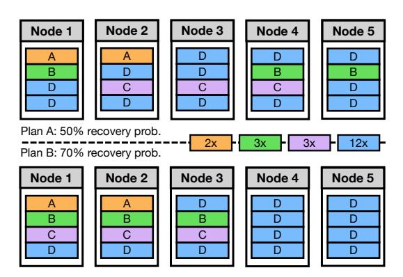
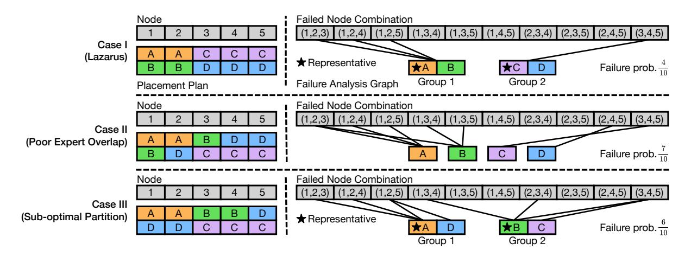

# 4.1 Adaptive Expert Allocation and Placement

Lazarus considers that each GPU can hold a certain number of replicas limited by its GPU memory, similar to traditional EP. Through assigning more replicas to popular experts, Lazarus can speed up training by giving them more computation resources. Note that we allow multiple replicas of the same expert assigned to a single GPU, which indicates more tokens (of the specific expert) can be processed by that GPU compared to assigning a single replica.

Yet, there is an inherent trade-off between speeding up computation and fault resiliency. On the one hand, if a less

Figure 4: Fault resiliency depends on how expert replicas are placed. With the same replica allocation of 4 experts and 4 replica slots per node, placement plan A and B differ in recovery probability under 3 node failures.

popular expert is assigned with only a single replica, then as long as the GPU (node) holding that replica fails, Lazarus cannot recover due to the loss of expert state. On the other hand, a balanced allocation of replicas improves fault resiliency; however, it degenerates to traditional EP and defeats the goal of addressing expert load imbalance.

Moreover, given an expert replica allocation, the placement of these replicas determines the probability of failure recovery. For instance, if all replicas of an expert are all placed on GPUs in a single node, the loss of that node would lead to an unrecoverable failure. Hence, when allocating and placing expert replicas, Lazarus should not only consider the imbalanced workload to speed up computation, but also take account of the impact on fault tolerance.

We divide the problem into two phases and separately consider allocation and placement. In the first phase, we design an expert allocation strategy that balances between the workload's expert distribution and fault tolerance. In the second phase, we design an expert placement algorithm which is theoretically optimal, maximizing the recovery probability given a fixed expert allocation. In this way, our allocation and placement plan strikes a balance between the two goals. **Expert allocation.** For ease of presentation, we show how expert replicas are allocated and placed on each node. If a node has multiple GPUs, Lazarus simply distributes the assigned replicas among all GPUs on that node, as we consider failures at the node level. We denote the number of nodes as N, the number of experts as E, the number of replicas each node can hold as c, the total number of tokens routed to expert e as  $t_e$ , the number of replicas assigned for expert e as  $r_e$ . To speed-up computation, we want the ratio of replicas assigned to each expert match the ratio of tokens routed to that expert, namely  $\frac{r_e}{\sum_{e'} r_{e'}} \approx \frac{t_e}{\sum_{e'} t_{e'}}$ . Furthermore, for better fault tolerance, we define a fault-tolerant threshold f, where Lazarus guarantees a 100% probability of failure recovery as long as fewer than f nodes fail simultaneously. Hence, each expert is assigned at least f replicas.

Assume that the experts are sorted by the number of routed tokens  $(t_e)$  in ascending order. We iteratively compute the number of replicas  $r_e$  assigned to each expert e as follows:

$$r_e = \max\{\lfloor \frac{t_e}{\sum_{e'=e}^{E} t_{e'}} \cdot (N \cdot c - \sum_{e'=1}^{e-1} r_{e'}) \rfloor, f\}$$
 (1)

Our assignment strategy ensures that  $\sum_e r_e = N \cdot c, r_e \geq f, r_e \geq r_{e-1}$ .  $\frac{r_e}{\sum_{e'} r_{e'}} \approx \frac{t_e}{\sum_{e'} t_{e'}}$  is also satisfied in most cases for training speed-up under the imbalanced workload. As  $r_e \geq f$ , Lazarus guarantees recovery under failures of a small number (< f) of nodes.

**Expert placement.** However, when the number of failed nodes  $\geq f$ , the probability of failure recovery differs between different placement plans. Figure 4 shows an example of 4 experts and 5 nodes. Assume that 3 nodes fail simultaneously. In plan A, the probability of recovery is  $\frac{5}{10}$ , as recovery is possible only if the alive nodes are (1, 2), (1, 3), (1, 4), (2, 4), (2, 5), while there are 10 possible cases. In plan B, however, the probability of recovery is much higher at  $\frac{7}{10}$ .

Placement solution for an easier case. We first consider a simpler case where  $E \leq c$ , which we can easily derive an optimal placement strategy inspired by the previous example. The strategy is that for the first  $min(r_1, N)$  nodes we place the first (least popular) expert, for the first  $min(r_2, N)$  nodes we place the second expert, and so on. For the vacant positions, we uniformly place the experts that still have replicas left. In this way, denote the set of nodes that have the e-th expert as  $S_e$ . This strategy satisfies  $S_1 \subset S_2 \cdots \subset S_E$ . Thus, the recovery probability is equal to the probability that the first expert belongs to an alive node (i.e., any of the first  $r_1$ nodes are alive). Furthermore, the first expert belonging to an alive node is a necessary condition of failure recovery. Thus, for any placement plan, the recovery probability is upper bounded by the probability of any of the first  $r_1$  nodes is alive. Since there are only  $r_1$  replicas for the first expert, it can span across at most  $r_1$  different nodes. Therefore, in the case of  $E \leq c$ , this placement strategy achieves the upper bound of the recovery probability of all placement plans, guaranteeing its optimality.

The above strategy relies on a core principle: maximize the nodes overlapped between the experts. Take the first and second expert as an example; if we overlap all the replicas of the first experts with the second expert's replicas on the same nodes, the two experts' states will be lost only when all of the first expert's replicas are lost. However, if some of the first expert's replicas are not overlapped with the second

expert's, the two experts cannot be recovered when either all of the first's replicas are lost or all of the second's are lost. Placement solution for the more difficult case. When E > c, the optimal strategy becomes more complicated. The previously introduced maximum overlap principle cannot be directly applied due to the infeasibility of overlapping all experts when E > c. To address this issue, we partition both the experts and nodes into  $\lceil \frac{E}{c} \rceil$  groups. We also modify the second principle into maximizing the overlap of experts in each group. Furthermore, we constrain the expert partitions to be consecutive, i.e.,  $1, \dots, c$  are in the first group,  $c+1, \cdots, 2c$  forms the second group, and so on. For the nodes, we divide the first  $\min\{N, \sum_{i=1}^{\lceil \frac{E}{c} \rceil} r_{c*(i-1)+1}\}$  nodes into  $\lceil \frac{E}{c} \rceil$  groups. The first group has  $r_1$  nodes, the second has  $r_{c+1}$  nodes, and so on, while the last group has  $\min\{N-\sum_{i=1}^{\lceil\frac{E}{c}\rceil-1}r_{c*(i-1)+1},r_{c*(\lceil\frac{E}{c}\rceil-1)+1}\}$  nodes. For group iin the first  $\lceil \frac{E}{c} \rceil - 1$  groups, each node contains one replica of expert c \* (i - 1) + 1, ..., c \* i. For the last group, each node contains one replica of expert  $c * (\lceil \frac{E}{c} \rceil - 1) + 1, \dots, E$ . For the vacant slots, we uniformly place the experts that still have replicas left to place. Our strategy satisfies  $S_{c*(i-1)+1} \subset$  $S_{c*(i-1)+2} \cdots \subset S_{c*i}$  for different i, which intuitively maximizes the node overlap of experts in each group. The recovery of the experts in the i-th group hence only requires one node in  $S_{c*(i-1)+1}$  to be alive, where we define the expert c \* (i - 1) + 1 as the representative of group i. The complete recovery is equivalent to that one replica of each group's representative still remains. Our maximum rank overlap (MRO) placement plan maximizes recovery probability under uniformly random node failures for any given replica number r. Concretely, we have Theorem 1. Its proof can be found in the supplementary material.

THEOREM 1. For any MRO plan T and R, given the number of replicas  $r_e$  for each expert e, T maximizes the recovery probability  $\Pr(\bigcup_{a \in A} Col_a = [E])$ , where [E] is the set of experts,  $Col_a$  is the set of replicas assigned to node a, A is a uniformly sampled set of R nodes that remain alive.

The two core insights of our method are to partition experts into different groups based on their popularity, and maximize the overlap across experts in the same group. Here, we offer some intuition for analyzing the optimality of our method.

Denote the failed node number as k; there are  $\binom{n}{k}$  different combinations of node failure cases. The failure analysis of different placement plans would be much more explicit by visualizing a graph formed this way: It is a bipartite graph, where one set has E vertices, each representing an expert. The other set has  $\binom{n}{k}$  vertices, each corresponding to a case of node failure. Each placement strategy can be analyzed by constructing such a bipartite graph: for every expert in the

Figure 5: Lazarus minimizes the failure probability by minimizing the number of vertices representing node failures that have incident edges. Here we consider 3 node failures. Comparing Case I and II, when expert overlap on nodes is not maximized, there are more unique failure patterns. Comparing Case I and III, swapping any expert also leads to more failure patterns.

placement, an edge is created between that expert and every node failure combination that renders the expert unrecoverable.

Essentially, our strategy achieves optimality by "putting all the eggs in one basket." The failure probability of a given placement strategy can be counted by the proportion of the second set of vertices (failure combinations) that have incident edges. Our strategy minimizes the number of the second sets of vertices that have incident edges. This is achieved by forcing experts to share the same failure combinations as much as possible, through maximizing the overlap between popular experts. For each non-representative expert, the set of failure combination vertices it connects to is a subset of the vertices the representative expert connects to. For different placement plans, the number of edges is the same. By letting more experts fail under a smaller set of failure cases, we reduce the number of failure nodes that have incident edges, thus improving recovery probability.

When the overlap between experts is not maximized, as in case II of Figure 5, expert *B* creates unique failure combinations (1, 3, 4), (1, 3, 5), expert *D* creates a unique failure combination (2, 4, 5). Therefore, the failure probability rises to  $\frac{7}{10}$ , compared to the optimal of  $\frac{4}{10}$ .

In addition, case III in Figure 5 offers an example of the optimality of our group partition strategy. If any swap is conducted in two expert groups, where the second expert group has a more popular representative, the total number of failed combinations connected by the two groups' representatives increases, because the new representatives are less popular than the old representatives.

We note that the expert load distribution can be different across layers, hence we compute an expert replica allocation and placement plan independently for each layer. As the load distribution also shifts during training according to the workload, Lazarus also periodically rebalances the expert allocation and updates the placement plan.

Now, we have developed the strategy to assign expert replicas to each node (GPUs). Next, we explore under such asymmetric replica placements, how Lazarus efficiently dispatches tokens to GPUs with replicas of routed experts.

#### 4.2 Flexible Token Dispatcher

In traditional expert parallelism, each token can be simply dispatched to the GPU that owns the corresponding expert, as there is only a single replica for each expert within a particular EP group. Concretely, an all-to-all is performed with all ranks (GPUs) in the EP group sending and receiving the same number of tokens, which is dynamically set to the maximum number routed to a single expert to prevent token dropping, while unused slots are padded [10, 31].

With Lazarus's adaptive expert placement, there are varying numbers of replicas assigned for each expert on different sets of GPUs. Therefore, each rank must decide which rank with the routed expert's replica to dispatch a token to. The fact that multiple replicas can be assigned to the same rank (indicating more tokens should be dispatched to it), combined with the difference in expert routing on different ranks, a challenge emerges — how can we efficiently dispatch the tokens to all GPUs with the routed experts while balancing the load? If tokens are poorly dispatched, some ranks could

