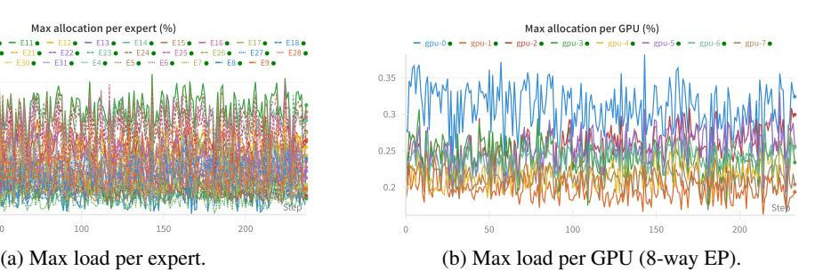

# 1 INTRODUCTION

Mixture-of-Experts (MoE) layers have increasingly become indispensable components in large language models (LLMs) due to their ability to scale model size and sparsity while keeping compute usage per token (activated parameters) constant [\(Liu et al., 2024;](#page-11-0) [Agarwal et al., 2025;](#page-11-1) [Yang et al.,](#page-12-0) [2025;](#page-12-0) [Team et al., 2025\)](#page-12-1). An MoE module consists of a *router* that selects the top-k experts to route each token to, and a set of feed-forward experts that process the routed tokens. During pre-training, an MoE layer is often externally load-balanced so that statistically diverse batches of tokens are routed evenly to all experts. This is either enforced with an auxiliary loss [\(Fedus et al., 2022\)](#page-11-2) or stochastic bias terms [\(Liu et al., 2024\)](#page-11-0). Expert parallelism (EP) has become the default infrastructure setup for MoE model training and inference [\(Singh et al., 2023;](#page-12-2) [Zheng et al., 2024\)](#page-12-3). It spreads the expert weights across multiple (GPU) devices. Under EP, tokens from different devices are *dispatched* to devices that host the experts they are routed to via an all-to-all communication (All-to-All) [\(Shoeybi](#page-12-4) [et al., 2019\)](#page-12-4). Then, each device performs the feed-forward operation with its local expert weights. The tokens' output are then routed, or *combined*, back to their original devices with another All-to-All (see Fig. [2\)](#page-1-0).

EP is designed with an assumption that load per GPU is always approximately balanced. However, in practice, that is rarely the case. Well-trained MoE models are shown to exhibit consistent imbalanced expert routing [\(Liu et al., 2024;](#page-11-0) [Agarwal et al., 2025\)](#page-11-1), and arguably for a good reason – as MoE layer training converges, some experts may become specialized to a certain domain or task, while others become generalized across a broad range of knowledge. During domain- or task-specific post-training or inference, only experts relevant to the tasks at hand are mostly activated while others stay dormant. So imbalanced routing, except for expert collapse, is a natural and desirable behavior for MoE models [\(Qiu et al., 2025\)](#page-11-3). During post-training or inference, parameter-altering load balancing, like auxiliary losses, is discouraged or not allowed to preserve the integrity of the pre-trained MoE routing behaviors [\(Huang et al., 2024;](#page-11-4) [Hu et al., 2025\)](#page-11-5). Standard EP, as such, is not designed to handle this phenomenon efficiently. Under worst-case imbalanced scenarios, EP may concentrate an overwhelming number of tokens from all devices to a few overloaded devices. This may cause high computational latency or even out-of-memory (OOM) failures if a GPU cannot store or process the excess tokens. Naive mitigation methods, such as lowering the batch size reduce throughput and increase latency. Advanced strategies like using redundant experts [\(Liu et al., 2024\)](#page-11-0), meanwhile, increase memory consumption, is only applicable for inference and still fails in the worst cases.

To tackle this problem, we propose Least-Loaded Expert Parallelism (LLEP), a novel EP algorithm that dynamically routes excess tokens, along with their corresponding expert weights, from overloaded devices to underloaded devices. Conceptually, when the globally assigned load on an expert group on a GPU exceeds a certain threshold, LLEP will only assign tokens to that GPU up to the capacity threshold, and then transfer the remaining tokens as well as the corresponding expert weights to the least-loaded devices for them to "share" the excess workload. LLEP is designed to distributed workloads and memory usage across devices such that all devices complete their tasks roughly at the same time with minimal latency, while maintaining minimal peak memory usage per GPU. Our load balancing algorithm is also designed to be conscious not only about compute load, but also about per-GPU memory allocations and cross-GPU communication overhead. Specifically, an excess tokens transfer is only triggered when the cost of transferring the tokens is less than the cost of

processing them locally. Moreover, LLEP comes with backward-pass support, which allows it to be applied dynamically at every iteration of the training loop as well as inference. Importantly, LLEP is an **exact** MoE computation algorithm. Unlike other methods (Qiu et al., 2025; Hu et al., 2025), it does not alter the models' behaviors for the sake of efficiency.

LLEP demonstrates significant speedup and peak-memory reduction over standard EP. As shown in Figure 1a, it achieves up to  $4.6\times$  speedup under extremely imbalanced scenarios, while maintaining a similar throughput as standard EP when the routing is balanced. Regarding peak memory usage per GPU, LLEP maintains a relatively stable peak-memory consumption across all scenarios, while standard EP's memory usage grows dramatically with imbalance, up to  $4\times$ , which will cause OOM crashes if any GPU does not have enough reserve. As such, LLEP is able to handle large models with fewer GPUs while maintaining high throughput. In end-to-end testing with full pre-trained models, LLEP achieves up to  $1.4\times$  and  $1.9\times$  speedups for gpt-oss-20b and gpt-oss-120b respectively. We conduct a comprehensive theoretical and empirical analysis to provide insights into the cost dynamics of MoEs and expert parallelism, and discuss the trade-offs and design knobs for hardware-specific configuration tuning for best performance.

#### <span id="page-2-1"></span>2 BACKGROUND

#### <span id="page-2-0"></span>2.1 MIXTURE-OF-EXPERTS

Since the pioneering work of Lepikhin et al. (2020), MoE models have become the de-facto standard for horizontally scaling LLMs, with DeepSeek-V3 (Liu et al., 2024), gpt-oss (Agarwal et al., 2025), Kimi-K2 (Team et al., 2025) as notable examples. The MoE feed-forward layer enables models to learn extensive knowledge across different expert weight matrices, while allowing individually tokens to be processed by a sparse subset of experts, thus improving efficiency and scalability. While concrete implementations vary, MoE architectures rely on the core idea of a *router* layer, which selects the top-K experts to route each token. Tokens are subsequently processed by each activated expert, which is typically constructed as a feed-forward (FFN) layer. Formally, given a token x's hidden representation  $u \in \mathbb{R}^D$ , the MoE module has N experts  $\{\text{FFN}_0, \text{FFN}_1, \dots, \text{FFN}_{N-1}\}$  and a router layer Router that selects the top-K experts to route x to. For brevity, we define  $\text{FFN}_i(u) = u^T W_i$  where  $W_i \in \mathbb{R}^{D \times H}$  is the weight matrix of expert i, and  $W_r \in \mathbb{R}^{D \times N}$  is the weight matrix of the router layer. Then, the MoE output h is

$$\boldsymbol{h} = \sum_{i=0}^{N-1} g_i \text{FFN}_i(\boldsymbol{u}), \quad \text{where} \quad g_i = \begin{cases} s_i, & \text{if } s_i \in \text{top-}K(\{s_j \mid 0 \le j \le N-1\}, K) \\ 0, & \text{otherwise} \end{cases}$$
 (1)

$$s_i = \operatorname{softmax}_i(\boldsymbol{u}^T \boldsymbol{W}_r). \tag{2}$$

Above,  $g_i$  is the gating affinity score for expert i, and only top-k highest-scoring experts are selected to contribute to the output.

**Implementation.** The number of GEneral Matrix Multiplications (GEMMs) required to process one token scales with the number of activated experts. Naive implementations (e.g., looping through each expert sequentially per token) can be extremely inefficient. A simple approach to improving performance is efficiently forming per-expert token batches via re-indexing. Assume that for a batch of tokens  $\boldsymbol{B} \in \mathbb{R}^{B \times D}$ ,  $G \leq N$  experts are activated, i.e., receive routed tokens. Without loss of generality, assume these G activated experts are experts  $0, \ldots, G-1$ . Then, we can form a re-indexed  $\boldsymbol{B}' = [\boldsymbol{B}_0, \boldsymbol{B}_1, \ldots, \boldsymbol{B}_{G-1}]$ , where  $\boldsymbol{B}_i \in \mathbb{R}^{B_i \times D}$  consists of all tokens routed to expert i. As an example, if  $\boldsymbol{B}$  consists of four tokens  $\boldsymbol{B} = [\boldsymbol{a}, \boldsymbol{b}, \boldsymbol{c}, \boldsymbol{d}]$  routed to experts [2, 6, 2, 1], then we can form  $\boldsymbol{B}' = [\boldsymbol{d}, \boldsymbol{a}, \boldsymbol{c}, \boldsymbol{b}]$  with  $\boldsymbol{B}_1 = [\boldsymbol{d}], \boldsymbol{B}_2 = [\boldsymbol{a}, \boldsymbol{c}]$ , and  $\boldsymbol{B}_6 = [\boldsymbol{b}]$ . Under this re-indexing approach, each MoE layer computes G GEMM operations  $\boldsymbol{B}_i \boldsymbol{W}_i$  for experts  $i = 0, 1, \ldots, G-1$ .

#### 2.2 EXPERT PARALLELISM

To train large MoE models across multiple GPUs, expert parallelism (EP) is generally preferred over tensor or pipeline parallelism (Shoeybi et al., 2019), as it enables more efficient utilization of memory and communication bandwidth. In EP, experts are distributed across GPUs, with each device hosting only a local subset of experts. During computation, input tokens are first processed by a router layer

<span id="page-3-0"></span>**Algorithm 1** Highly Efficient Expert Parallelism dispatch\_combine: operation per device p (zero-indexed), EP world size P, number of experts per device M=N/P

```
Input: K-repeated input tokens \mathcal{B}_p \in \mathbb{R}^{B_p \times K \times D}, router weights \mathcal{G}_p \in \mathbb{R}^{B_p \times K}, router indices
\mathcal{I}_p \in \mathbb{Z}^{B_p \times K}, local expert weights \mathbf{W}_i \in \mathbb{R}^{D \times H} for i = pM, pM + 1, \dots, (p+1)M - 1
// Perform dispatch: route tokens and weights to devices that host the experts they are routed to
\bar{\mathcal{I}}_p \leftarrow \text{sort}(\text{flatten}(\mathcal{I}_p, \text{dims}=[B_p, K]))
\bar{\mathcal{B}}_p \leftarrow \text{index\_select(flatten}(\mathcal{B}_p, \text{dims=}[B_p, K]), \bar{\mathcal{I}}_p)
\bar{\mathcal{G}}_p \leftarrow \text{index\_select(flatten}(\mathcal{G}_p, \text{dims=}[B_p, K]), \bar{\mathcal{I}}_p)
\begin{aligned} &\{\boldsymbol{B}_i|i\in \mathrm{unique}(\bar{\mathcal{I}}_p)\} \leftarrow \mathrm{slice}(\bar{\mathcal{B}}_p) \\ &\{\boldsymbol{G}_i|i\in \mathrm{unique}(\bar{\mathcal{I}}_p)\} \leftarrow \mathrm{slice}(\bar{\mathcal{G}}_p) \end{aligned}
 \{\hat{\boldsymbol{B}}_i|i\in[pM,(p+1)M-1]\}\leftarrow \text{All-to-All}(\{\boldsymbol{B}_i\})
 \{\hat{\boldsymbol{G}}_i|i\in[pM,(p+1)M-1]\}\leftarrow \text{All-to-All}(\{\boldsymbol{G}_i\})
// compute Grouped-GEMMs for local experts
 \{\hat{\boldsymbol{H}}_i = \hat{\boldsymbol{G}}_i \odot \hat{\boldsymbol{B}}_i \boldsymbol{W}_i | i \in [pM, (p+1)M) - 1]\}
// Perform combine: route outputs to where they originally came from
 \{\boldsymbol{H}_i\} \leftarrow \text{All-to-All-reverse}(\{\boldsymbol{H}_i\})
// reverse the sorting and reindexing
\mathcal{H}_p \leftarrow \operatorname{concat}(\{\boldsymbol{H}_i\})
\mathcal{H}_p \leftarrow \text{reverse\_sort}(\bar{\mathcal{H}}_p, \bar{\mathcal{I}}_p) \text{de}
\mathcal{H}_p \leftarrow \text{reshape}(\mathcal{H}_p, (B_p, K, H))
\mathcal{H}_p' \leftarrow \operatorname{sum}(\mathcal{H}_p, \operatorname{dim}=\hat{K})
Output: \mathcal{H}'_n
```

to produce global routing indices and corresponding routing weights (affinity scores). The resulting (input, indices, weight) tuples are then sorted and re-indexed, and subsequently dispatched to the GPUs that host the selected experts, as determined by the routing indices.

The routing process is typically conducted using the *dispatch-combine* procedure. Alg. 1 formalizes a highly-efficient per-device implementation of this procedure, while Fig. 2a provides a visual illustration of EP under an imbalanced routing scenario. Specifically, during *dispatch*, each device sends its local input tokens to foreign experts' devices and receives foreign tokens assigned to its local experts. This data exchange paradigm is called an *All-to-All* communication operation (Sewell et al., 2024; Punniyamurthy et al., 2024). After expert FFN computation is completed, outputs are aggregated in the *combine* stage. Here, all expert outputs are sent back to their originating devices via another All-to-All operation. Beyond standard NCCL-based collectives, EP can be implemented more efficiently at the kernel level using specialized libraries such as DeepEP (Liu et al., 2024) and Triton-Distributed (Zheng et al., 2025).

#### 3 Analysis

#### 3.1 Imbalanced Routing

Even large and high-performing MoE models (Liu et al., 2024; Team, 2025) have been shown to experience imbalance expert routing, where tokens are routed to a small subset of experts. We investigate the specific dynamics of token-routing by running gpt-oss-20b (Agarwal et al., 2025), which has 32 experts, through many batches of data, under 8-way EP (each GPU hosts 4 experts). To keep the data distribution familiar, we feed the model with conversation data where the questions come from DeepScaleR (Luo et al., 2025) and response chain-of-thoughts are generated from gpt-oss-20b itself. In Fig. 3a, we observe that tokens are consistently routed to certain expert positions, with position E11 dominating. This means that at least one 11th expert of the 24 MoE layers consistently receives dominant load across data batches. Despite that, the GPU that E11 is located on, gpu-2, does not have the highest load; gpu-0, hosting experts E0-E3, has the highest load among all GPUs. This implies that certain GPU devices may handle an overwhelming number of tokens under extremely imbalanced routing. Interestingly, while E11 typically takes on the most tokens, certain batches result in more tokens routed to other experts. That is, the degree of imbalance changes on a per-batch basis.

<span id="page-4-0"></span>



Figure 3: Expert routing imbalances across all layers of gpt-oss-20b across batches of a math dataset. (a) E11 has up to 20% load vs. ∼3% balanced. (b) GPU 0 has 30-35% vs. ∼12.5% balanced. Note that the load numbers do not add up to 100% because values are maximums across all layers.

Are imbalanced MoE models actually bad? It may be tempting to attribute imbalanced MoE routing to pre-training deficiencies, like skewed data or poorly designed load-balancing losses, e.g., [Zhou et al.](#page-12-8) [\(2022\)](#page-12-8); [Shazeer et al.](#page-12-9) [\(2017\)](#page-12-9). It is true that if not carefully trained, MoE models can exhibit "expert collapse", where only a small subset of experts is ever activated, producing sub-optimal or weak models. However, as we showed previously, even state-of-the-art MoE models exhibit some degree of imbalanced routing, albeit to a much milder degree than extreme expert collapse.

Rather than aiming for perfectly balanced routing, we consider mild imbalance a natural property of a well-trained MoE model. After undergoing large-scale pre-training, subsets of experts often specialize in particular knowledge domains, tasks, or capabilities [\(Qiu et al., 2025;](#page-11-3) [Hu et al., 2025;](#page-11-5) [Song et al.,](#page-12-10) [2025\)](#page-12-10). Consequently, when an MoE model is further fine-tuned or evaluated on a specific domain, such as mathematics, experts specialized for that domain are activated more frequently. This leads to imbalanced routing. At the same time, some experts may evolve into broadly applicable, domainagnostic "shared" experts that consistently handle generic linguistic patterns, such as grammar, across tasks. This phenomenon has also been observed and embraced in prior work [\(Liu et al., 2024\)](#page-11-0). From this perspective, aggressively enforcing balanced routing, e.g., by altering model behavior through auxiliary load-balancing losses [\(Fedus et al., 2022\)](#page-11-2) or moving-average routing biases [\(Liu et al.,](#page-11-0) [2024\)](#page-11-0), risks disrupting these learned specialization patterns within particular experts. Instead of correcting imbalance at the model level, we instead embrace it, proposing a *system-level* mechanism for both training and inference for maximizing throughput under imbalanced routing. This respects the inherent specialization among experts while mitigating inefficiencies that arise with imbalance.

Several approaches have been proposed to mitigate routing imbalance under EP. A naive solution is to reduce the batch size, but this severely degrades throughput. Another strategy employs chained gradient checkpointing to process tokens in smaller chunks; however, this approach remains inefficient and is still constrained by a hard memory ceiling. For inference, [Liu et al.](#page-11-0) [\(2024\)](#page-11-0) propose an EP Load Balancer (EPLB) that replicates heavily loaded experts across devices based on time-delayed routing statistics. While effective in some settings, this method incurs additional memory overhead, is not applicable to fine-tuning; further, this can still result in out-of-memory (OOM) failures under extreme routing imbalance. In contrast, [Huang et al.](#page-11-4) [\(2024\)](#page-11-4) suggests reserving additional memory for excess experts, which likewise incurs CPU and GPU memory overhead.

