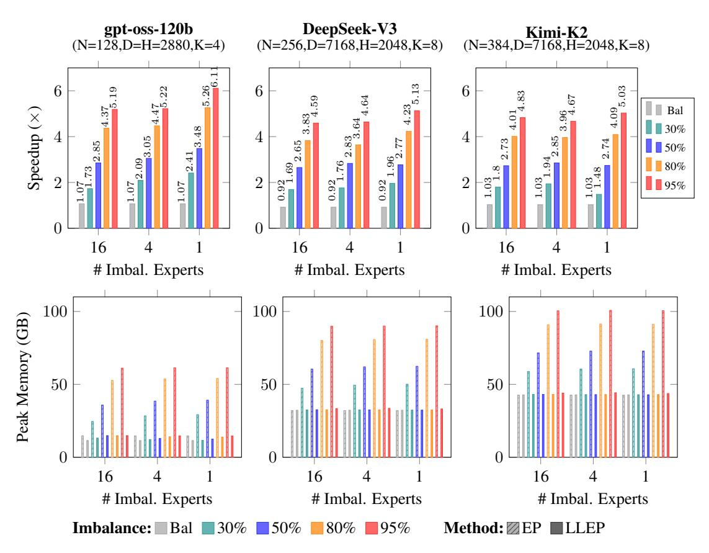

# 5 EXPERIMENTS

We show the advantages of LLEP under two settings: Controlled experiments, where we precisely simulate imbalanced loads across multiple popular MoE configurations, and end-to-end training, where we train a MoE model with SFT, comparing against standard EP. We conclude with an ablation study, characterizing various hyperparameters in LLEP.

## 5.1 SPEED AND MEMORY PROFILES

We analyze the speed and memory profiles of different popular MoE layers of different sizes and configurations, namely those used in gpt-oss-120b [\(Agarwal et al., 2025\)](#page-11-1), DeepSeek-V3 [\(Liu et al.,](#page-11-0) [2024\)](#page-11-0) and Kimi-K2 [\(Team et al., 2025\)](#page-12-1). Unlike the simple case stated in § [2,](#page-2-1) each MoE expert is a SwigGLU [\(Shazeer, 2020\)](#page-12-11) feed-forward module that use three weight matrices instead of one. We benchmark the forward pass speedups and peak memory consumption per GPU across P = 8 H200 GPUs. The batch size per GPU (B) is 32K for gpt-oss and 16K for DeepSeek-V3 and Kimi-K2. We simulate across different balanced and imbalanced routing scenarios, from 30% to 95% of tokens evenly concentrated into 1, 4 or 16 experts. For LLEP, we use λ = 1.3, α = 1, m = 1024.

<span id="page-8-0"></span>**Algorithm 4** LLEP dispatch\_combine: operation per device p (zero-indexed), EP world size P, number of experts per device M=N/P

```
Input: \mathcal{B}_p \in \mathbb{R}^{B_p \times K \times D}, \mathcal{G}_p \in \mathbb{R}^{B_p \times K}, \mathcal{I}_p \in \mathbb{Z}^{B_p \times K}, W_i \in \mathbb{R}^{D \times H} for i = pM, pM + pM
1,\ldots,(p+1)M-1
l \leftarrow \text{sum of loads of global experts across all GPUs}
if \max(l)/\text{mean}(l) < \lambda then
    Call standard EP Alg. 1
     Output: \mathcal{H}'_{p} from standard EP
\bar{\mathcal{I}}_p \leftarrow \text{sort}(\text{flatten}(\mathcal{I}_p, \text{dims}=[B_p, K]))
\bar{\mathcal{B}}_p \leftarrow \text{index\_select(flatten}(\mathcal{B}_p, \text{dims}=[B_p, K]), \bar{\mathcal{I}}_p)
\bar{\mathcal{G}}_p \leftarrow \text{index\_select(flatten}(\mathcal{G}_p, \text{dims=}[B_p, K]), \bar{\mathcal{I}}_p)
// construct routing plan and weight transfer plan
\mathcal{A}, \mathcal{W} \leftarrow \text{LLA}(\boldsymbol{l}, M)
\{B_i|i\in[0,...,P]\}\leftarrow \text{build chunks of }\mathcal{B}_p \text{ from }\mathcal{A}
\{G_i|i\in[0,...,P]\}\leftarrow \text{build chunks of }\bar{\mathcal{G}_p} \text{ from } \mathcal{A}
// S is expert IDs of foreign experts assigned to this device
\{\hat{\boldsymbol{B}}_i|i\in[pM,(p+1)M-1]\cup S\}\leftarrow \text{All-to-All}(\{\boldsymbol{B}_i\})
\{\boldsymbol{G}_i|i\in[pM,(p+1)M-1]\cup S\}\leftarrow \text{All-to-All}(\{\boldsymbol{G}_i\})
\{W_i | j \in S\} \leftarrow P2P Transfer weights from other GPUs to this GPU
// compute Grouped-GEMMs for native and foreign experts
\{\boldsymbol{H}_i = \boldsymbol{G}_i \odot \boldsymbol{B}_i \boldsymbol{W}_i | i \in [pM, (p+1)M - 1] \cup S\}
// Perform combine: route outputs to where they originally came from
\{\boldsymbol{H}_i\} \leftarrow \text{All-to-All-reverse}(\{\boldsymbol{H}_i\})
// reverse the sorting and reindexing
\mathcal{H}_p \leftarrow \operatorname{concat}(\{\boldsymbol{H}_i\})
\mathcal{H}_p \leftarrow \text{reverse\_sort}(\bar{\mathcal{H}}_p, \bar{\mathcal{I}}_p)
\mathcal{H}_p \leftarrow \text{reshape}(\mathcal{H}_p, (B_p, K, H))
\mathcal{H}'_p \leftarrow \operatorname{sum}(\mathcal{H}_p, \operatorname{dim}=K)
Output: \mathcal{H}'_n
```

Fig. 4 summarizes the benchmarking results. As shown in the speedup row, across different configurations, LLEP outperforms standard EP across all imbalance scenarios, achieving greater speedup under more imbalanced routing, up to  $6.11\times$  for the most extreme case (95% into 1 expert). Meanwhile, LLEP maintains EP's efficiency in perfectly balanced case, thanks to the adaptive ratio  $\lambda$ . In the peak memory row, LLEP maintains consistently and stably low memory consumption across all imbalance scenarios, with memory saving of up to  $5\times$ , allowing us to increase the throughput (batch size) without running into out-of-memory (OOM) failure.

#### 5.2 END-TO-END FULL MODEL SPEED PROFILES IN THE WILD

To measure the effectiveness of LLEP in the **wild**, instead of just simulating imbalances, we conduct end-to-end forward-pass throughput comparisons with real pre-trained gpt-oss-20b and gpt-oss-120b (Agarwal et al., 2025) on samples from the Megatron-Math dataset (Du et al., 2025), where the responses were generated by gpt-oss-120b itself. The results are reported in Fig. 1c. Full model throughput is impacted by other irrelevant factors and fixed overheads, such as the attention layers. Thus, the speedup of the MoE layers is always greater than the reported numbers for the full model throughput. As shown, LLEP achieves up to  $2.2 \times$  and  $1.88 \times$  speedups for gpt-oss-20b and gpt-oss-120b respectively. Our method achieves better scaling efficiency with greater relative speedups the more GPUs are used. LLEP demonstrates its superiority because the pre-trained models exhibit imbalanced routing inherently even on in-domain data.

Fig. 5 shows the downstream performance (accuracy on AIME'25) vs. wall-clock time for EP and LLEP, when training gpt-oss-20b (low effort) on **full** parameters, using Zero-3 and CPU offloading for gradients and optimizer states. The training process requires more expensive and non-negotiable, but irrelevant, overheads, including on-CPU computations of gradients and parameter updates as well

<span id="page-9-0"></span>

Figure 4: Performance comparison of LLEP vs. standard EP across three MoE architectures. Top row: Speedup (×, higher is better) of LLEP over standard EP. Gray bars show the balanced baseline (≈1×). Colored bars indicate imbalance levels (percentage of tokens routed to that many experts). Higher concentration yields greater speedup, up to 6.1× for GPT-OSS-120B. Bottom row: Peak memory usage per GPU (GB, lower is better). Hatched bars represent standard EP; solid bars represent LLEP. EP memory grows dramatically with imbalance (up to 100GB for Kimi-K2), while LLEP maintains near-constant memory across all scenarios.

<span id="page-9-1"></span>

Figure 5: Performance (accuracy on AIME'25) vs. wall-time for EP and LLEP when training gptoss-20b (low effort) on full parameters using Zero-3 and CPU offloading for gradients and optimizer states. CPU operations and checkpoint saving introduce non-negotiable overheads. Despite additional overhead, training converges 1.25x faster with LLEP as compared to EP.

as checkpoint saving at each step. As such, LLEP achieves 1.25× speedup over EP while achieving comparable accuracy.

<span id="page-10-0"></span>

Figure 6: Speedup of LLEP over standard EP with 4 imbalanced experts. (a) Speedup as a function of batch size. (b) Speedup as a function of α; lower α yields higher speedups.

<span id="page-10-1"></span>

Figure 7: Speedup of LLEP over standard EP with 4 imbalanced experts. (a) Speedup as a function of λ. (b) Speedup scales with hidden size.

## 5.3 ABLATION STUDY

We provide further insights into LLEP by ablating various factors and hyper-parameters.

Batch size B. Fig. [6a](#page-10-0) shows that LLEP achieves greater speedups the more tokens we pack into the batch, across various imbalance scenarios. The reason is that large batch sizes saturate the capacity of each individual GPU and overwhelm any overhead introduced by the LLA algorithm (Alg. [2\)](#page-5-1), leading to a linear relationship between batch size and processing time. This means that the least collective processing time (max<sup>i</sup> [time-of-GPU i]) is achieved when compute workloads are evenly distributed across all GPUs. The All-to-All data transfers of large batches also overshadow any associated weight transfer.

Factor α Fig. [6b](#page-10-0) shows the speedup curves across different α values. We observe that higher α leads the lower speedup, meaning allowing more per-GPU capacity than the balanced baseline before LLA spilling may result in inefficiency. This means that at large-enough batch sizes, LLEP prefers workloads to be balanced despite possibly higher communication costs.

Adaptive ratio λ Fig. [7a](#page-10-1) shows how the adaptive ratio λ impacts speedup. Specifically, when the batch size is low (B = 8K), we observe higher λ is beneficial when the imbalance degree is low (15-20%). In other words, it is better to revert to standard EP when the routing distribution is balanced enough that the overhead costs of LLEP's weight transfers surpassed the benefits of even computation.

Hidden size D and H Fig. [7b](#page-10-1) demonstrates that LLEP shines as we scale up the model's hidden sizes, despite the fact that its spilling weight transfers cost more. The reason for this scaling effect is that as the hidden size increases, the compute efficiency of each GEMM improves compared to the data communication costs. In addition, similar to scaling batch sizes, large hidden sizes also saturate the GPU capacity. This causes the benefits of the compute workloads being perfectly balanced to overshadow any inconvenient weight transfer overhead.

