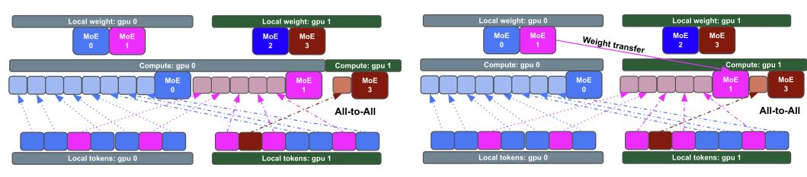

# ABSTRACT

Mixture-of-Experts (MoE) models are typically pre-trained with explicit loadbalancing constraints to ensure statistically balanced expert routing. Despite this, we observe that even well-trained MoE models exhibit significantly imbalanced routing. This behavior is arguably natural—and even desirable—as imbalanced routing allows models to concentrate domain-specific knowledge within a subset of experts. Expert parallelism (EP) is designed to scale MoE models by distributing experts across multiple devices, but with a less-discussed assumption of balanced routing. Under extreme imbalance, EP can funnel a disproportionate number of tokens to a small number of experts, leading to compute- and memory-bound failures on overloaded devices during post-training or inference, where explicit load balancing is often inapplicable. We propose Least-Loaded Expert Parallelism (LLEP), a novel EP algorithm that dynamically reroutes excess tokens and associated expert parameters from overloaded devices to underutilized ones. This ensures that all devices complete their workloads within the minimum collective latency while respecting memory constraints. Across different model scales, LLEP achieves up to 5× speedup and 4× reduction in peak memory usage compared to standard EP. This enables faster and higher-throughput post-training and inference, with ∼1.9× faster for gpt-oss-120b. We support our method with extensive theoretical analysis and comprehensive empirical evaluations, including ablation studies. These results illuminate key trade-offs and enable a principled framework for hardware-specific hyperparameter tuning to achieve optimal performance.

Figure 1: LLEP vs. standard expert parallelism (EP). (a) & (b) show the speedup and peak memory usage per GPU of an MoE layer (128 experts, 4 active experts, hidden size of 2048) under perfectly balanced case and various imbalance scenarios: 30%, 50%, 80%, or 95% of tokens concentrated into 16, 4, 1 imbalanced experts. LLEP is faster than EP by 5× under extreme imbalance scenarios, while keeping memory usage stable and avoiding out-of-memory risk. (c) Realistic full-model throughput: up to 2.2× for gpt-oss-20b and 1.9× for gpt-oss-120b.

(a) Standard EP: Experts are distributed across devices, but imbalanced routing leads to overloaded devices (gpu 0) and underutilized ones (gpu 1).

(b) LLEP: Dynamically redistributes excess tokens and corresponding expert weights from overloaded devices to underloaded devices for balanced execution.

Figure 2: Comparison of standard Expert Parallelism and LLEP.

