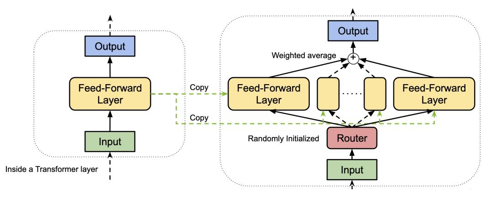
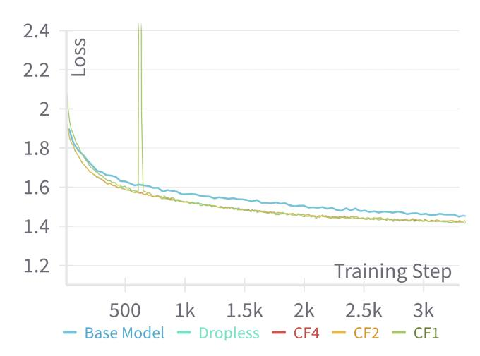
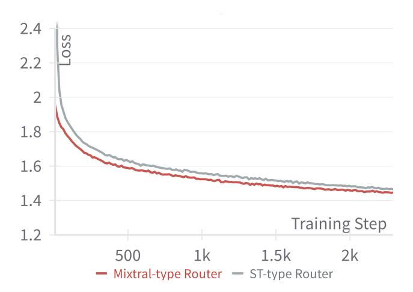

# Llama 3 Meets MoE: Efficient Upcycling

Aditya Vavre1∗ Ethan He2† Dennis Liu2 Zijie Yan2 June Yang2 Nima Tajbakhsh2 Ashwath Aithal2 1Univeristy of Texas at Austin 2NVIDIA

### Abstract

Scaling large language models (LLMs) significantly improves performance but comes with prohibitive computational costs. Mixture-of-Experts (MoE) models offer an efficient alternative, increasing capacity without a proportional rise in compute requirements. However, training MoE models from scratch poses challenges like overfitting and routing instability. We present an efficient training recipe leveraging pre-trained dense checkpoints, training an 8-Expert Top-2 MoE model from Llama 3-8B with less than 1% of typical pre-training compute. Our approach enhances downstream performance on academic benchmarks, achieving a 2% improvement in 0-shot accuracy on MMLU, while reaching a Model FLOPs Utilization (MFU) of 46.8% during training using our framework. We also integrate online upcycling in NeMo[3](#page-0-0) for seamless use of pre-trained weights, enabling cost-effective development of high-capacity MoE models.

### 1 Introduction

Transformers [\[29\]](#page-8-0) have rapidly become the foundational architecture for a wide range of tasks in natural language processing [\[2,](#page-6-0) [7,](#page-6-1) [24,](#page-8-1) [23\]](#page-7-0) and computer vision [\[8,](#page-6-2) [6,](#page-6-3) [32\]](#page-8-2), revolutionizing these fields with their scalability and remarkable effectiveness. This has driven a dramatic increase in model complexity, with modern implementations featuring billions of parameters, far exceeding earlier architectures [\[4,](#page-6-4) [24,](#page-8-1) [28\]](#page-8-3). Such growth has been underpinned by established scaling laws, which show that the cross-entropy loss follows a power-law relationship with model size, dataset size, and compute resources allocated for training [\[14\]](#page-7-1). This relationship allows us to determine the optimal allocation of a fixed compute budget. Despite these advantages, scaling large language models (LLMs) to billions or trillions of parameters is not without challenges. For instance, GPT-4 required 55M GPU hours to train the model on 25,000 A100 GPUs amounting to more than 50M dollars in training expenditure. These challenges have fueled interest in approaches like Mixture-of-Experts (MoE) architectures, which aim to enhance model capacity without proportionally increasing computational costs [\[26,](#page-8-4) [9\]](#page-6-5). However, training MoE models from scratch remains a complex endeavor. It can be time consuming and costly with potential issues such as over-fitting, routing instability and expert collapse [\[13,](#page-7-2) [26\]](#page-8-4). Moreover, MoE models often need a larger and more diverse dataset for effective training. By providing an efficient recipe and enabling the use of pre-trained checkpoints to initialize MoE models, developers can achieve higher-performing models with relatively modest compute budgets.

Our contribution is summarized as follows:

1. We train a 8-Expert Top-2 (E8T2) MoE model starting from the Llama 3-8B model on an academic dataset blend. We propose a training framework and release a recipe for efficiently training MoE models with <1% of the pre-training compute.

∗Work done as part of internship at NVIDIA

†Corresponding author: yihuih@nvidia.com

3 https://github.com/NVIDIA/NeMo

Table 1: Comparison of total model parameters, activated model parameters and FLOPs during a forward pass of a base Llama 3-8B and Llama 3-E8T2 model. BS refers to batch size.

| Model        | Total params | Active params | FLOPs (BS=1) |
|--------------|--------------|---------------|--------------|
| Llama 3-8B   | 8B           | 8B            | 4.7e14       |
| Llama 3-E8T2 | 34.4B        | 11.8B         | 7.5e14       |

- 2. We show improvement in downstream task performance on commonsense reasoning and knowledge benchmarks such as MMLU.
- 3. We conducted two ablation experiments to validate our selection of the capacity factor and routing algorithm for training.
- 4. We implement online upcycling in NeMo allowing for the use of pre-trained model weights to initialize and train MoE models.

#### **Background** 2

Mixture of Experts (MoE) is an ensemble learning technique that scales model capacity without significantly increasing training or inference costs. In MoE models, the MLP layers in a transformer block are typically replaced with several "experts"  $E_1, \dots E_N$  that have distinct learnable parameters. A small gating network G called the "router" controls which set of experts receive a particular token.

Let G(x) and  $E_i(x)$  denote the output of the router and the  $i^{th}$  expert on an input x respectively. The output y of the MoE is given by:

$$y = \sum_{i=1}^{N} G(x)_i E_i(x) \tag{1}$$

Several routing algorithms have been developed for example, Top-k [26] and Expert Choice [34]. In the sparse setting, only a subset of experts (k) is activated which is much smaller than the number of total experts (N) to save compute [26]. This is done through a Noisy Top-k Gating as shown below:

$$G(x) = Softmax(KeepTopK(H(x), k))$$
(2)

$$H(x)_i = (x \cdot W_g)_i + StandardNormal() \cdot Softplus((x \cdot W_{noise})_i)$$
(3)

$$H(x)_{i} = (x \cdot W_{g})_{i} + StandardNormal() \cdot Softplus((x \cdot W_{noise})_{i})$$

$$KeepTopK(v, k)_{i} = \begin{cases} v_{i}, & \text{if } v_{i} \text{ is in the top } k \text{ elements of } v \\ -\infty, & \text{otherwise} \end{cases}$$

$$(4)$$

 $W_q$  denotes the weight matrix of the router. The amount of noise per component is controlled by a second trainable weight matrix  $W_{noise}$ , which helps with load balancing [26]. To further ensure efficient training, the average token load per expert is regulated by a capacity factor (CF) [9].

expert capacity = 
$$\frac{\text{tokens per batch}}{N} \times \text{CF}$$

Overflowing tokens assigned to experts are excluded from computation and directly routed to the layer's output. The CF controls trade-off between the performance of the MoE model and its accuracy. Increasing the CF increases the quality but increases communication costs and memory of activations [9]. To further optimize MoE training, expert parallelism (EP) is employed. In EP, different experts are placed on different devices, and executed in parallel. This allows us to increase the number of experts (and hence the number of parameters) by proportionally increasing the number of devices in the training cluster [26].

MoEs can dramatically increase the number of parameters without a proportional increase in computational cost. Table 1 shows that an 8-Expert Top-2 (E8T2) MoE model, despite being approximately  $4\times$  larger in size, utilizes only about  $1.6\times$  the total FLOPs of its non-MoE counterpart during a forward pass. However, training MoE models from scratch can still pose a problem due to data hungry and instability issues during training [15]. Sparse Upcycling[15] is a way to reuse the sunk training costs of a dense language model by initializing a sparsely activated MoE model from a dense checkpoint.

Figure 1: Our upcycling method. The feedforward layer is copied over N times to initialize the experts in the MoE model and the router is randomly initialized.

### 3 Method

### 3.1 Upcycling Technique

The upcycling method is illustrated in [Figure 1.](#page-2-0) We follow a similar approach to [\[15\]](#page-7-3) and [\[10\]](#page-6-6). We assume we have access to a dense checkpoint of a pre-trained language model. We convert a subset of the feed-forward layers in the dense model to MoE layers. To upcycle a feed-forward layer to a N Expert Top-k MoE layer, we simply copy the weights of the feed-forward layer N times to initialize the experts i.e., each expert is a copy of the original feed-forward layer. Additionally, we add a router which is initialized with random weights. All of the remaining weights including the embedding layer are simply copied from the dense checkpoint.

Upcycling can be challenging to implement in a distributed training setting when the dense checkpoint contains a large number of parameters, as is typical with large language models (LLMs). This is because upcycling significantly increases the total parameter count, and each device typically holds a full copy of the shared model parameters and gradients, which can cause memory requirements to exceed the capacity of each node. To address this issue, we implement online upcycling in NeMo, enabling users to upcycle by supplying a dense checkpoint and a parallel training configuration. For efficient implementation, the dense checkpoint is sharded based on the specified parallel training configuration, and weights are upcycled independently on each device, avoiding additional computation and eliminating the need for cross-device weight copying. We make our implementation available in NeMo[4](#page-2-1) .

#### 3.2 Training Framework

To efficiently train the MoE models at scale, we leveraged 5-D hybrid parallelisms with Megatron-Core[5](#page-2-2) , which supports Tensor Parallelism(TP; [\[27,](#page-8-6) [16\]](#page-7-4)), Expert Parallelism(EP; [\[9,](#page-6-5) [17\]](#page-7-5)), Pipeline Parallelism(PP; [\[12\]](#page-7-6)), Context Parallelism(CP; [\[19\]](#page-7-7)) and Data Parallelism(DP; [\[25,](#page-8-7) [33\]](#page-8-8)) for distributed training with thousands of GPUs. TP shards the tensors of each layer to difference devices. EP splits experts in the MoE layer into multiple devices. PP cuts the transformer layers into multiple stages. CP separates the input sequence into multiple segments, reducing the memory footprint for long-sequence training. And we use DP with ZeRO-1 to scales model training further by replicates model weights and shard optimizers states across DP ranks.

To further improve training efficiency, we introduced MoE Parallel Folding, a heterogeneous hybrid parallel strategy that decouples the Attention and MoE components of the Transformer. The core idea is to decouple the parallel mapping of the Attention and MoE layers to potentially enhance performance. For the Attention layer, we establish 4-dimensional parallel mappings comprising TPxCPxDPxPP. For the MoE layer, we create another 4-dimensional parallel group consisting of

4 https://github.com/NVIDIA/NeMo

5 https://github.com/NVIDIA/Megatron-LM

Table 2: Training performance for different configurations. CF indicates the capacity factor for each expert. The last row indicates training without dropping tokens.

| GPUs | CF  | TP | CP | Expert-TP | EP | PP | VP | TFLOPS/GPU | MFU   |
|------|-----|----|----|-----------|----|----|----|------------|-------|
| 128  | 1   | 1  | 2  | 1         | 8  | 4  | 8  | 462.8      | 46.8% |
| 128  | 2   | 2  | 2  | 1         | 8  | 4  | 8  | 387.5      | 39.2% |
| 128  | 4   | 2  | 2  | 1         | 8  | 4  | 8  | 389.7      | 39.4% |
| 128  | N/A | 2  | 2  | 1         | 8  | 4  | 8  | 391.8      | 39.6% |

Expert-TPxEPxExpert-DPxPP. This allows for setting arbitrary and separate TP, EP, CP, DP sizes for the MoE and Attention components. With MoE Parallel Folding, the communication-intensive parallelism from the Attention and MoE layer can be folded together and fit into the high-bandwidth NVLink domain as much as possible, which greatly reduces the communication overhead. For example, we can set TP2CP2 for the attention layer and TP1EP8 for the MoE layer; then the TP and CP group the in attention layer can be folded into the EP group within a single node with 8 GPUs.

By tuning of parallelism mappings, we can achieve 39.2-46.8% Model FLOPs Utilization(MFU) for different configurations in [Table 2.](#page-3-0) Training with capacity factor 1 has better MFU than dropless training, since they can prevent the load imbalance issue and have less memory footprint to enable smaller model parallelism. There are some tuning practices to find the best configurations for MoE model training:

- 1. TP and EP involve significant communication overhead at each layer, making it advantageous to keep them within the NVLink domain to minimize latency. For MoE layers specifically, EP generally outperforms TP in terms of performance.
- 2. In Megatron-Core, there are two types of token dispatchers; the AllGather-based token dispatcher and the AllToAll-based token dispatcher. Usually, the latter is more efficient for MoE models with smaller routing TopK values, such as 1-4.
- 3. In long-context LLM training, CP can be utilized to reduce memory usage and improve efficiency by overlapping communication and computation. This approach is particularly effective with Grouped-Query Attention (GQA), which reduces communication overhead due to the smaller message size of KV features.
- 4. Scaling across nodes with PP and DP is advantageous. Introducing Virtual Pipeline Parallelism (VPP) further enhances performance by reducing the pipeline bubble size.
- 5. Enabling recomputation for MoE layers during the early training stage helps mitigate out-of-memory issues caused by severe load imbalances.

## 4 Experiments

### 4.1 Training Dataset

The training data for the upcycling experiments consists of two sources. The first is the RedPajama V2 pretraining data which is deduplicated and filtered. We then divide the data into 3 buckets based on the n-gram perplexity following CCNet pipeline [\[31\]](#page-8-9). We only use the bucket with the least perplexity for training, which contains about 0.89T tokens. The second training data source is academic data, a blend of various open-source academic benchmark datasets, comprising approximately 2.7 billion tokens [\[22\]](#page-7-8). We use a blend of two sources in a 7:3 ratio.

#### 4.2 Experimental Setup

In this section we describe the experimental setup. We begin all upcycling experiments from the Llama 3-8B pretrained checkpoint. We upcycle Llama 3-8B model weights to create an 8-Expert Top-2 (E8T2) MoE model using the technique described in [section 3.](#page-2-3) We use a CF of 4, 8-way expert parallelism, 2-way tensor parallelism, 4-way pipeline parallelism, 8-way virtual pipeline parallelism and data parallelism to train the model. We train the model on 100B tokens starting from a learning rate of 3e-5 decayed to 3e-7 using a cosine annealing scheduler with 100 warmup steps. The training was performed on 512 H100 GPUs using 16-bit floating point (bfloat 16) precision.

Table 3: Normalized accuracy of Llama 3-8B Base Model vs upcycled Llama 3-8B 8 Expert Top-2 MoE model on downstream tasks. All reported numbers are 0-shot performance unless specified in brackets.

| Model           |       |       | MMLU(5) MMLU TruthfulQA PIQA |       | SciQ  |       |       |       | LogiQA BoolQ OBQA Average |
|-----------------|-------|-------|------------------------------|-------|-------|-------|-------|-------|---------------------------|
| Llama 3-8B      | 65.20 | 62.10 | 44.01                        | 80.47 | 93.90 | 29.80 | 81.16 | 45.00 | 62.71                     |
| Llama 3-8B E8T2 | 64.00 | 64.10 | 44.22                        | 78.62 | 97.00 | 30.11 | 88.23 | 44.80 | 63.89                     |

Table 4: Model Flops Utilization (MFU) and MMLU accuracy of Llama 3-8B base model continued training (CT) vs upcycled Llama 3-8B E8T2 model with different capacity factors (CF). Dropless refers to an infinite CF.

| Training Strategy | MFU(%) | MMLU(5) | MMLU |
|-------------------|--------|---------|------|
| Base Model CT     | 52.4   | 62.4    | 62.9 |
| Dropless          | 39.6   | 63.3    | 63.7 |
| CF 4              | 39.4   | 63.5    | 63.8 |
| CF 2              | 39.2   | 64.0    | 63.9 |
| CF 1              | 46.8   | 63.7    | 63.3 |

### 5 Results and Analysis

In this section we describe the results of Llama 3-8B base and our upcycled Llama 3-8B E8T2 model on some common academic benchmarks. In line with several prior works, we use lmevaluation-harness to evaluate and report normalized accuracy on the following tasks: 5-shot and 0-shot MMLU [\[11\]](#page-6-7), 0-shot TruthfulQA [\[18\]](#page-7-9), PIQA [\[1\]](#page-6-8), SciQ [\[30\]](#page-8-10), LogiQA [\[20\]](#page-7-10), BoolQ [\[5\]](#page-6-9) and OpenBookQA [\[21\]](#page-7-11). The results are summarized in [Table 3.](#page-4-0) We see an improvement of 2% on MMLU 0-shot score and ∼1.2% overall improvement over the base Llama 3-8B model.

Notably, our upcycling process on 100B tokens consumed 11K GPU hours, compared to an estimated 1.6 million GPU hours required to train the MoE model from scratch on the entire Llama 3 training dataset on 512 H100 GPUs. Upcycling massively reduces the training costs by recycling the previously invested GPU hours, enabling users to obtain models with better downstream performance. In the following sections, we discuss our choice of capacity factor and the routing algorithm used during training.

#### 5.1 Choice of Capacity Factor

We compare the trade-off between performance and accuracy using different capacity factors to train the MoE model. [Table 4](#page-4-1) compares the performance measured in model flops utilization (MFU) and accuracy on MMLU for varying capacity factors. We train using the same blend of data for 27B tokens. The loss curve is shown in [Figure 2.](#page-5-0) We compare different CF settings against the base model CT in which the base Llama 3-8B model is trained without upcycling to a MoE model. We also compare the MFU and accuracy of a MoE model trained without a capacity factor, using a "token-dropless" approach where no overflowing tokens are dropped. As expected, the base model CT has the highest MFU followed by training with a CF of 1. However, a significant improvement in MMLU accuracy over the base model CT is observed with a CF of 2 and 4. The poor accuracy of the token-dropless approach can be explained by a lack of regularization that is introduced implicitly by the CF. For the best trade-off between accuracy and performance, we chose a CF of 4 for our main training configuration.

#### 5.2 Choice of Router Algorithm

We compare the effects of the order in which the Softmax and KeepTopK operators are applied within the gating network. The Mixtral [\[13\]](#page-7-2) architecture applies the KeepTopK operator first, followed by Softmax, to ensure that the MoE model's initial forward pass matches the dense model's output.

Figure 2: Training loss of Llama 3-8B base model continued training (CT) vs upcycled Llama 3-8B E8T2 model with different capacity factors (CF).

Figure 3: Training loss curve of Mixtral vs ST router types.

However, this approach sacrifices the information contained in the absolute magnitudes of the router outputs due to the Softmax operation. To address this, the order can be reversed—applying Softmax before KeepTopK, as in [\[3\]](#page-6-10)—which we refer to as the ST-type router. However, in this reversed configuration, when 1 < k < N, the MoE model's initial output will no longer match the dense model, potentially leading to training instability and loss of learned representations. This discrepancy may be mitigated with a few training steps, allowing the model to adjust to this change. [Figure 3](#page-5-1) compares the training loss curves of Mixtral-type router and the ST-type router. We can see that the Mixtral-type router starts from a comparatively lower loss and converges faster than the ST-type router. Hence we stick to using the Mixtral-type router in our main training configuration.

### 6 Conclusion

In this work, we addressed the challenges and costs associated with scaling large language models (LLMs) by developing an efficient approach to train Mixture-of-Experts (MoE) models. By leveraging pre-trained dense checkpoints to initialize an 8-Expert Top-2 MoE model based on the Llama 3-8B architecture, we demonstrated that high-performing models can be achieved with less than 1% of the typical pre-training compute. Our experiments validate our choices in capacity factor and routing algorithm, showcasing improved performance on downstream tasks, such as commonsense reasoning and knowledge benchmarks like MMLU. Furthermore, our implementation of online upcycling

within the NeMo framework facilitates the effective reuse of pre-trained weights, making MoE model training more accessible to the research community.

### References

- [1] Yonatan Bisk, Rowan Zellers, Ronan Le Bras, Jianfeng Gao, and Yejin Choi. Piqa: Reasoning about physical commonsense in natural language. In *Thirty-Fourth AAAI Conference on Artificial Intelligence*, 2020.
- [2] Tom Brown, Benjamin Mann, Nick Ryder, Melanie Subbiah, Jared D Kaplan, Prafulla Dhariwal, Arvind Neelakantan, Pranav Shyam, Girish Sastry, Amanda Askell, Sandhini Agarwal, Ariel Herbert-Voss, Gretchen Krueger, Tom Henighan, Rewon Child, Aditya Ramesh, Daniel Ziegler, Jeffrey Wu, Clemens Winter, Chris Hesse, Mark Chen, Eric Sigler, Mateusz Litwin, Scott Gray, Benjamin Chess, Jack Clark, Christopher Berner, Sam McCandlish, Alec Radford, Ilya Sutskever, and Dario Amodei. Language models are few-shot learners. In H. Larochelle, M. Ranzato, R. Hadsell, M.F. Balcan, and H. Lin, editors, *Advances in Neural Information Processing Systems*, volume 33, pages 1877–1901. Curran Associates, Inc., 2020.
- [3] Tianlong Chen, Zhenyu Zhang, Ajay Kumar Jaiswal, Shiwei Liu, and Zhangyang Wang. Sparse moe as the new dropout: Scaling dense and self-slimmable transformers. In *ICLR*, 2023.
- [4] Aakanksha Chowdhery, Sharan Narang, Jacob Devlin, Maarten Bosma, Gaurav Mishra, Adam Roberts, Paul Barham, Hyung Won Chung, Charles Sutton, Sebastian Gehrmann, Parker Schuh, Kensen Shi, Sashank Tsvyashchenko, Joshua Maynez, Abhishek Rao, Parker Barnes, Yi Tay, Noam Shazeer, Vinodkumar Prabhakaran, Emily Reif, Nan Du, Ben Hutchinson, Reiner Pope, James Bradbury, Jacob Austin, Michael Isard, Guy Gur-Ari, Pengcheng Yin, Toju Duke, Anselm Levskaya, Sanjay Ghemawat, Sunipa Dev, Henryk Michalewski, Xavier Garcia, Vedant Misra, Kevin Robinson, Liam Fedus, Denny Zhou, Daphne Ippolito, David Luan, Hyeontaek Lim, Barret Zoph, Alexander Spiridonov, Ryan Sepassi, David Dohan, Shivani Agrawal, Mark Omernick, Andrew M. Dai, Thanumalayan Sankaranarayana Pillai, Marie Pellat, Aitor Lewkowycz, Erica Moreira, Rewon Child, Oleksandr Polozov, Katherine Lee, Zongwei Zhou, Xuezhi Wang, Brennan Saeta, Mark Diaz, Orhan Firat, Michele Catasta, Jason Wei, Kathy Meier-Hellstern, Douglas Eck, Jeff Dean, Slav Petrov, and Noah Fiedel. Palm: scaling language modeling with pathways. *J. Mach. Learn. Res.*, 24(1), March 2024.
- [5] Christopher Clark, Kenton Lee, Ming-Wei Chang, Tom Kwiatkowski, Michael Collins, and Kristina Toutanova. Boolq: Exploring the surprising difficulty of natural yes/no questions, 2019.
- [6] Timothée Darcet, Maxime Oquab, Julien Mairal, and Piotr Bojanowski. Vision transformers need registers. In *The Twelfth International Conference on Learning Representations*, 2024.
- [7] Jacob Devlin, Ming-Wei Chang, Kenton Lee, and Kristina Toutanova. BERT: pre-training of deep bidirectional transformers for language understanding. *CoRR*, abs/1810.04805, 2018.
- [8] Alexey Dosovitskiy, Lucas Beyer, Alexander Kolesnikov, Dirk Weissenborn, Xiaohua Zhai, Thomas Unterthiner, Mostafa Dehghani, Matthias Minderer, Georg Heigold, Sylvain Gelly, Jakob Uszkoreit, and Neil Houlsby. An image is worth 16x16 words: Transformers for image recognition at scale. In *International Conference on Learning Representations*, 2021.
- [9] William Fedus, Barret Zoph, and Noam M. Shazeer. Switch transformers: Scaling to trillion parameter models with simple and efficient sparsity. *ArXiv*, abs/2101.03961, 2021.
- [10] Ethan He, Abhinav Khattar, Ryan Prenger, Vijay Korthikanti, Zijie Yan, Tong Liu, Shiqing Fan, Ashwath Aithal, Mohammad Shoeybi, and Bryan Catanzaro. Upcycling large language models into mixture of experts, 2024.
- [11] Dan Hendrycks, Collin Burns, Steven Basart, Andy Zou, Mantas Mazeika, Dawn Song, and Jacob Steinhardt. Measuring massive multitask language understanding. *Proceedings of the International Conference on Learning Representations (ICLR)*, 2021.

- [12] Yanping Huang, Yonglong Cheng, Dehao Chen, HyoukJoong Lee, Jiquan Ngiam, Quoc V. Le, and Z. Chen. Gpipe: Efficient training of giant neural networks using pipeline parallelism. In *Neural Information Processing Systems*, 2018.
- [13] Albert Q. Jiang, Alexandre Sablayrolles, Antoine Roux, Arthur Mensch, Blanche Savary, Chris Bamford, Devendra Singh Chaplot, Diego de las Casas, Emma Bou Hanna, Florian Bressand, Gianna Lengyel, Guillaume Bour, Guillaume Lample, Lélio Renard Lavaud, Lucile Saulnier, Marie-Anne Lachaux, Pierre Stock, Sandeep Subramanian, Sophia Yang, Szymon Antoniak, Teven Le Scao, Théophile Gervet, Thibaut Lavril, Thomas Wang, Timothée Lacroix, and William El Sayed. Mixtral of experts, 2024.
- [14] Jared Kaplan, Sam McCandlish, Tom Henighan, Tom B. Brown, Benjamin Chess, Rewon Child, Scott Gray, Alec Radford, Jeffrey Wu, and Dario Amodei. Scaling laws for neural language models, 2020.
- [15] Aran Komatsuzaki, Joan Puigcerver, James Lee-Thorp, Carlos Riquelme Ruiz, Basil Mustafa, Joshua Ainslie, Yi Tay, Mostafa Dehghani, and Neil Houlsby. Sparse upcycling: Training mixture-of-experts from dense checkpoints. In *The Eleventh International Conference on Learning Representations*, 2023.
- [16] Vijay Anand Korthikanti, Jared Casper, Sangkug Lym, Lawrence C. McAfee, Michael Andersch, Mohammad Shoeybi, and Bryan Catanzaro. Reducing activation recomputation in large transformer models. *ArXiv*, abs/2205.05198, 2022.
- [17] Dmitry Lepikhin, HyoukJoong Lee, Yuanzhong Xu, Dehao Chen, Orhan Firat, Yanping Huang, Maxim Krikun, Noam M. Shazeer, and Z. Chen. Gshard: Scaling giant models with conditional computation and automatic sharding. *ArXiv*, abs/2006.16668, 2020.
- [18] Stephanie Lin, Jacob Hilton, and Owain Evans. TruthfulQA: Measuring how models mimic human falsehoods. In *Proceedings of the 60th Annual Meeting of the Association for Computational Linguistics (Volume 1: Long Papers)*, pages 3214–3252, Dublin, Ireland, May 2022. Association for Computational Linguistics.
- [19] Hao Liu, Matei Zaharia, and Pieter Abbeel. Ring attention with blockwise transformers for near-infinite context. *ArXiv*, abs/2310.01889, 2023.
- [20] Jian Liu, Leyang Cui, Hanmeng Liu, Dandan Huang, Yile Wang, and Yue Zhang. Logiqa: A challenge dataset for machine reading comprehension with logical reasoning. In Christian Bessiere, editor, *Proceedings of the Twenty-Ninth International Joint Conference on Artificial Intelligence, IJCAI-20*, pages 3622–3628. International Joint Conferences on Artificial Intelligence Organization, 7 2020. Main track.
- [21] Todor Mihaylov, Peter Clark, Tushar Khot, and Ashish Sabharwal. Can a suit of armor conduct electricity? a new dataset for open book question answering, 2018.
- [22] Nvidia, :, Bo Adler, Niket Agarwal, Ashwath Aithal, Dong H. Anh, Pallab Bhattacharya, Annika Brundyn, Jared Casper, Bryan Catanzaro, Sharon Clay, Jonathan Cohen, Sirshak Das, Ayush Dattagupta, Olivier Delalleau, Leon Derczynski, Yi Dong, Daniel Egert, Ellie Evans, Aleksander Ficek, Denys Fridman, Shaona Ghosh, Boris Ginsburg, Igor Gitman, Tomasz Grzegorzek, Robert Hero, Jining Huang, Vibhu Jawa, Joseph Jennings, Aastha Jhunjhunwala, John Kamalu, Sadaf Khan, Oleksii Kuchaiev, Patrick LeGresley, Hui Li, Jiwei Liu, Zihan Liu, Eileen Long, Ameya Sunil Mahabaleshwarkar, Somshubra Majumdar, James Maki, Miguel Martinez, Maer Rodrigues de Melo, Ivan Moshkov, Deepak Narayanan, Sean Narenthiran, Jesus Navarro, Phong Nguyen, Osvald Nitski, Vahid Noroozi, Guruprasad Nutheti, Christopher Parisien, Jupinder Parmar, Mostofa Patwary, Krzysztof Pawelec, Wei Ping, Shrimai Prabhumoye, Rajarshi Roy, Trisha Saar, Vasanth Rao Naik Sabavat, Sanjeev Satheesh, Jane Polak Scowcroft, Jason Sewall, Pavel Shamis, Gerald Shen, Mohammad Shoeybi, Dave Sizer, Misha Smelyanskiy, Felipe Soares, Makesh Narsimhan Sreedhar, Dan Su, Sandeep Subramanian, Shengyang Sun, Shubham Toshniwal, Hao Wang, Zhilin Wang, Jiaxuan You, Jiaqi Zeng, Jimmy Zhang, Jing Zhang, Vivienne Zhang, Yian Zhang, and Chen Zhu. Nemotron-4 340b technical report, 2024.
- [23] Alec Radford, Karthik Narasimhan, Tim Salimans, Ilya Sutskever, et al. Improving language understanding by generative pre-training. 2018.

- [24] Colin Raffel, Noam Shazeer, Adam Roberts, Katherine Lee, Sharan Narang, Michael Matena, Yanqi Zhou, Wei Li, and Peter J. Liu. Exploring the limits of transfer learning with a unified text-to-text transformer. *Journal of Machine Learning Research*, 21(140):1–67, 2020.
- [25] Samyam Rajbhandari, Jeff Rasley, Olatunji Ruwase, and Yuxiong He. Zero: Memory optimizations toward training trillion parameter models. *SC20: International Conference for High Performance Computing, Networking, Storage and Analysis*, pages 1–16, 2019.
- [26] Noam Shazeer, \*Azalia Mirhoseini, \*Krzysztof Maziarz, Andy Davis, Quoc Le, Geoffrey Hinton, and Jeff Dean. Outrageously large neural networks: The sparsely-gated mixture-ofexperts layer. In *International Conference on Learning Representations*, 2017.
- [27] Mohammad Shoeybi, Mostofa Patwary, Raul Puri, Patrick LeGresley, Jared Casper, and Bryan Catanzaro. Megatron-lm: Training multi-billion parameter language models using model parallelism. *ArXiv*, abs/1909.08053, 2019.
- [28] Mohammad Shoeybi, Mostofa Patwary, Raul Puri, Patrick LeGresley, Jared Casper, and Bryan Catanzaro. Megatron-lm: Training multi-billion parameter language models using model parallelism, 2020.
- [29] Ashish Vaswani, Noam Shazeer, Niki Parmar, Jakob Uszkoreit, Llion Jones, Aidan N Gomez, Ł ukasz Kaiser, and Illia Polosukhin. Attention is all you need. In I. Guyon, U. Von Luxburg, S. Bengio, H. Wallach, R. Fergus, S. Vishwanathan, and R. Garnett, editors, *Advances in Neural Information Processing Systems*, volume 30. Curran Associates, Inc., 2017.
- [30] Johannes Welbl, Nelson F. Liu, and Matt Gardner. Crowdsourcing multiple choice science questions. In Leon Derczynski, Wei Xu, Alan Ritter, and Tim Baldwin, editors, *Proceedings of the 3rd Workshop on Noisy User-generated Text*, pages 94–106, Copenhagen, Denmark, September 2017. Association for Computational Linguistics.
- [31] Guillaume Wenzek, Marie-Anne Lachaux, Alexis Conneau, Vishrav Chaudhary, Francisco Guzmán, Armand Joulin, and Edouard Grave. CCNet: Extracting high quality monolingual datasets from web crawl data. In Nicoletta Calzolari, Frédéric Béchet, Philippe Blache, Khalid Choukri, Christopher Cieri, Thierry Declerck, Sara Goggi, Hitoshi Isahara, Bente Maegaard, Joseph Mariani, Hélène Mazo, Asuncion Moreno, Jan Odijk, and Stelios Piperidis, editors, *Proceedings of the Twelfth Language Resources and Evaluation Conference*, pages 4003–4012, Marseille, France, May 2020. European Language Resources Association.
- [32] Xiaohua Zhai, Alexander Kolesnikov, Neil Houlsby, and Lucas Beyer. Scaling vision transformers. In *Proceedings of the IEEE/CVF Conference on Computer Vision and Pattern Recognition (CVPR)*, pages 12104–12113, June 2022.
- [33] Yanli Zhao, Andrew Gu, Rohan Varma, Liangchen Luo, Chien chin Huang, Min Xu, Less Wright, Hamid Shojanazeri, Myle Ott, Sam Shleifer, Alban Desmaison, Can Balioglu, Bernard Nguyen, Geeta Chauhan, Yuchen Hao, and Shen Li. Pytorch fsdp: Experiences on scaling fully sharded data parallel. *Proc. VLDB Endow.*, 16:3848–3860, 2023.
- [34] Yanqi Zhou, Tao Lei, Hanxiao Liu, Nan Du, Yanping Huang, Vincent Y Zhao, Andrew M. Dai, Zhifeng Chen, Quoc V Le, and James Laudon. Mixture-of-experts with expert choice routing. In Alice H. Oh, Alekh Agarwal, Danielle Belgrave, and Kyunghyun Cho, editors, *Advances in Neural Information Processing Systems*, 2022.