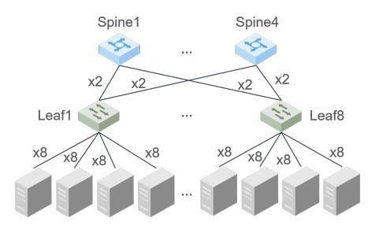
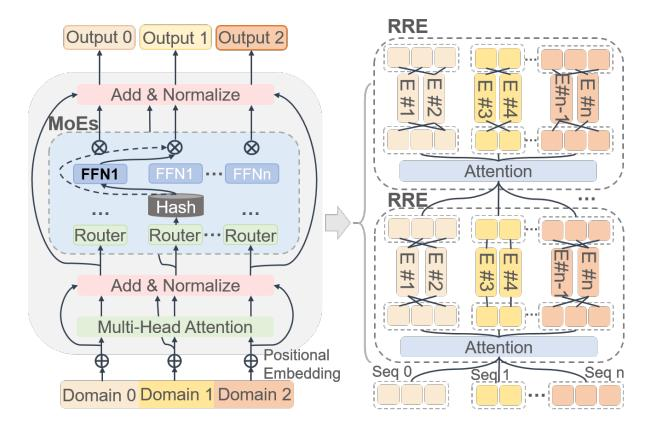

# 2 Related Work

MoE. MoE is a strategy for model designing, combining with several expert networks, to enhance the model capacity and efficiency. The concept of MoE was first proposed in 1991 and became the prototype of the existing MoE structure [\[Jacobs](#page-10-2) *et al.*, 1991]. Sparsely-gated MoE [\[Shazeer](#page-10-5) *et al.*[, 2016\]](#page-10-5) was proposed to expand the model capacity adequately under the same arithmetic power, and the gating is designed to allow TopK experts to be activated in an iteration. GShard [\[Lepikhin](#page-10-12) *et al.*, 2020] was the first work to migrate the MoE to Transformer, using the expert capacity to limit the tokens processed by each expert to a certain range. In addition, the auxiliary loss is proposed in GShard's random routing to deal with the winner-take-all drawback of MoE. Regarding expert capacity, the work of pMoE [\[Chowdhury](#page-9-2) *et al.*[, 2023\]](#page-9-2) has proved for the first time that each expert can be fully trained even when dealing with samples much smaller

Figure 1: The networking scheme applied in the Ascend cluster.

than the number of tokens, but has a threshold. Switch Transformer [Fedus *et al.*[, 2022\]](#page-10-6) selects only the top expert to maximize MoE's sparsity and proposes a corresponding auxiliary loss to achieve load balance. Facebook AI Research implements the Hash FFN layer [Roller *et al.*[, 2021\]](#page-10-13) with the balanced hash function, and the distribution of the experts' load is close to the ideal state. Taking into consideration both convergence and accuracy, StableMoE [Dai *et al.*[, 2022\]](#page-9-3) adopts a two-stage training procedure. In the first stage, the imbalance of assignment and the cross-entropy of routing features are adopted as loss penalty terms, and the model directly learns with the routing strategy in the second stage. X-MoE [Chi *et al.*[, 2022\]](#page-9-4) rewrites the score function between the token and the expert by reducing dimensionality. Task-MoE [\[Kudugunta](#page-10-14) *et al.*, 2021] describes task-based routing at multiple granularities: token level, sentence level, and task level. HetuMoE [Nie *et al.*[, 2022\]](#page-10-9) proposes the hierarchical AlltoAll strategy, which combines hierarchical networks and aggregated information to improve transmission efficiency.

Ascend Architecture. The pivot architecture of the Ascend mainly consists of multilevel on-chip memory, load/storage units, and instruction management units [Liao *et al.*[, 2021\]](#page-10-11). System-on-Chip (Soc) adopts the Mesh Network-on-Chip (NoC) [\[Kumar](#page-10-15) *et al.*, 2022] architecture to provide a unified and scalable communication network, realizing a high bandwidth of 256GB/s [Li *et al.*[, 2022b\]](#page-10-16). In Ascend 910A server, every eight NPUs are divided into two groups on the board. The intra-group connection is based on the Huawei Cache Coherence System (HCCS) [Xia *et al.*[, 2021\]](#page-11-4). The Ascend 910A chip delivers 320 Tera FLOPS at semi-precision (FP16) and 640 Tera OPS at integer precision (INT8). Our cluster is built based on a two-tier Fat-tree networking scheme on the single plane, with each Leaf switch connecting to 4 NPU servers (model Atlas 800 9000), as in Figure [1.](#page-1-0) The algorithm bandwidth of each communication operator in Huawei Collective Communication Library (HCCL) is displayed in Figure [2.](#page-2-0)

PanGu Series Model. The fields of PanGu series large models are mainly divided into NLP, computer vision, multimodality, graph network, and scientific computing [Mi *[et al.](#page-10-17)*, [2022;](#page-10-17) Shen *et al.*[, 2023;](#page-10-18) Bi *et al.*[, 2023\]](#page-9-5). Thereinto, the models in the field of NLP focus primarily on text generation and semantic understanding. The most representative NLP model in the PanGu series is the PanGu-α [Zeng *et al.*[, 2021\]](#page-11-3), which is an LLM in the Chinese domain with up to 200 billion parameters. It also applies the auto-parallel framework based

Figure 2: The algorithm bandwidth of each communication operator in HCCL under 64N, 128N, and 256N, respectively.

Figure 3: The architecture of sparse Transformer layers in PanGu-Σ.

on the MindSpore [Tong *et al.*[, 2021\]](#page-10-19). PanGu-π [\[Wang](#page-11-5) *et al.*, [2023\]](#page-11-5) mitigates feature collapse in the Transformer architecture by introducing more nonlinearities in the feed-forward networks (FFN) and MSA modules. Utilizing the intrinsic parameters of PanGu-α, PanGu-Σ [Ren *et al.*[, 2023\]](#page-10-10) is extended to a sparse model containing 1.085 trillion parameters by the conception of MoE.

