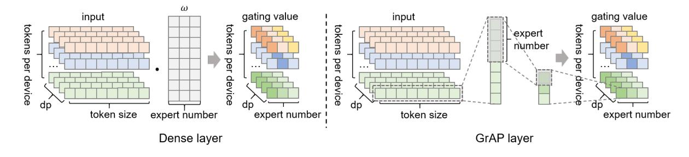
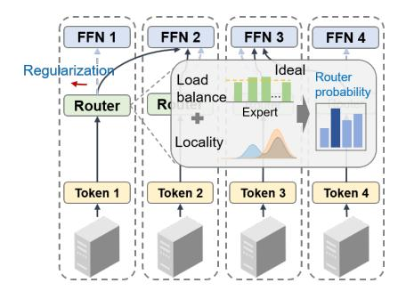
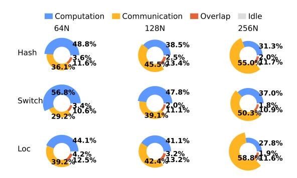
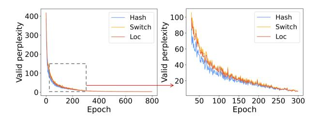

# 3.1 PanGu-Σ

The PanGu-Σ architecture consists of both dense and sparse Transformer encoder layers, stacked Transformer decoder layers modeled in the autoregressive language, and a query layer. The sparse Transformer layer of PanGu-Σ, with several conditionally activated feedforward sublayers, incorporates the MoE principle, as displayed in Figure [3.](#page-2-1) The RRE module is responsible for routing the token to the appropriate expert. It contains two levels of routing: in the first level, the experts are grouped by domains, and the token is assigned to one of the groups. In the second level, the token is routed to a particular expert of this group homogeneously. The second level of routing can be viewed as random hash routing, which does not contain learnable parameters.

### 3.2 MoE With Local Routing Strategy

#### MoE in Encoder Layers of Transformers

Similar to the classic MoE skeleton applied to Transformer structures such as GShard, the MoE layer in our model mainly consists of a MSA layer, a gating network, a routing module, and several expert FFNs. The output of the MoE layer can be depicted as follows:

$$y_m = \sum_{i=1}^n \mathcal{R}_{m,E_i} \cdot W_{E_i,\text{out}} \cdot \text{GeLU}(W_{E_i,\text{in}} \cdot x_m)$$
 (1)

Assume that the MoE layer contains n experts, Rm,Ei denotes the expert score acquired by the gating network when expert i provides the largest gating value. The expert network of expert i consists of two linear transformations with a Gaussian Error Linear Unit (GeLU) activation, which is the product of input and the standard Gaussian cumulative distribution function. Thereinto, the gating function G is the critical component of router R. Typically, it is designed to be a dense layer extracting the feature of input tensor:

$$i^* = \underset{i \in [n]}{\arg \max} (\operatorname{softmax}(\mathcal{G}_{m, E_i}))$$
 (2)

$$\mathcal{R}_{m,E_i} = \mathbb{1}\{i = i^*\}(\operatorname{softmax}(\mathcal{G}_{m,E_i}))$$
 (3)

where i ∗ is the index of the most appropriate expert, and Gm,Ei = ReLU(ωi ·xm +ϵi). The token would be sent to the Top-1 expert with the largest expert score screened by Softmax. To reduce the parameter scale and the computational overhead, the gating value is obtained via the GrAP layer instead of the dense layer [Li *et al.*[, 2022a\]](#page-10-20). The feature extraction with the GrAP layer is delineated in Figure [4.](#page-3-0) It can be regarded as the dense layer with the fixed weight ωi :

$$\omega_i = \frac{n}{d} (\omega_{i,j} = \mathbb{1} \{ i \frac{d}{n} \le j < (i+1) \frac{d}{n} \}, 0 \le j < d )$$
 (4)

where d denotes the dimension of activation. Notably, the gating weights of the GrAP layer are orthogonal. From a perspective of semantic, irrelevant tokens are inclined to be routed to experts of different domains, which is conducive to convergence and accuracy [Guo *et al.*[, 2020\]](#page-10-21). Besides, the GrAP layer has greater computation efficiency.

### Localized Bias Weighting Loss

A general observation on the original two-level routing strategy of PanGu-Σ reveals that the router is devoid of the learning process. Although meeting load balance requirements, it lacks interpretability for distinguishing experts by domain. LocMoE rewrites the second level of RRE, consisting of two parts: auxiliary loss and locality loss. The auxiliary loss is first proposed in the sparsely-gated MoE [\[Shazeer](#page-10-5) *et al.*, [2016\]](#page-10-5) and is also applied in Switch Transformer [\[Fedus](#page-10-6) *et al.*[, 2022\]](#page-10-6):

$$L_{\text{aux}} = \alpha n \sum_{i=1}^{n} f_i P_i$$

$$f_i = \frac{1}{T} \sum_{x \in \beta} \mathbb{1} \{ \arg \max p(x) = i \}, P_i = \frac{1}{T} \sum_{x \in \beta} p_i(x)$$
(5)

where n denotes the number of experts, β denotes the batch containing T tokens. fi denotes the proportion of tokens assigned to expert i, and Pi denotes the average probability that the router chooses expert i. The auxiliary loss has substantiated that it can cause the balance of routing, as the loss would

Figure 4: Difference between feature extraction via the dense layer and the GrAP layer.

Figure 5: The action principle of locality loss.

achieve its minimum under a uniform distribution. The hyperparameter  $\alpha$  is set to 0.01, which refers to the value in the previous work [Fedus *et al.*, 2022].

The second part is locality loss, in line with the expectation that tokens are more likely to be assigned to local experts under the premise of load balance. The loss function can be measured by the difference between the current distribution and the fully localized distribution. The current distribution reflects the assignment distribution of all experts in the current batch, and the difference can be described using Kullback-Leibler (KL) divergence:

$$L_{\text{loc}} = \mu \text{KL}(D_{\text{c}}||D_{\text{l}}) = -\mu \int D_{\text{c}}(x) \ln[\frac{D_{\text{l}}(x)}{D_{\text{c}}(x)}] dx$$
 (6)

where  $D_c$  denotes the current distribution and  $D_l$  denotes the fully localized distribution, and  $\mu$  is the hyperparameter. The locality, along with the auxiliary loss, acts as the soft constraint that impels the tokens in the same domain to be trained by local experts, as shown in Figure 5. The blue dashed arrows are the contribution of the locality loss, and the final assignment of tokens considers the synthetic effect of gating value, auxiliary loss, and locality loss. The task loss is the sum of the above loss items and cross-entropy:

$$L_{\text{task}} = L_{\text{aux}} + L_{\text{loc}} + L_{\text{cross}}$$
where 
$$L_{\text{cross}} = -\sum_{t=1}^{T} \log \frac{\exp(c_t^*)}{\sum_{i=1}^{N} \exp(c_{t,i})}$$
(7)

### **Critical Value of Expert Capacity**

The introduction of expert capacity aims to avoid the training block caused by the assignment imbalance of tokens. In

general, an empirical expert capacity factor  $c_{\rm f}$  is set to limit the scale of the expert capacity:  $ec = \lceil \frac{b_{\rm g}*c_{\rm f}}{ep*n} \rceil$ .  $b_{\rm s}, c_{\rm f}, ep$ , and n denote the batch size, the capacity factor, the degree of expert parallelism, and the number of experts, respectively. The computational workload of experts can be equalized in this way. However, the work of pMoE reveals that the sample size each expert needs to process has its lower bound [Chowdhury et al., 2023], which can provably reduce the training costs. Inspired by the work on pMoE, we migrated the assumptions of data distribution in MoE from CV to the NLP domain, in conjunction with the network structure, while further discovering some significant conclusions:

**Assumption 1.** The magnitudes of gating weight  $\|\omega\|$  are equivalent for all experts.

**Lemma 1** (Minimum Angle of Expert). The top-1 router is essentially the mechanism to select the expert  $i^*$  with the minimum angle  $\theta_{i^*,j}$  to the gating weight  $\omega_i$ .

**Assumption 2.** Suppose all tokens with size of d uniformly distributed on the unit sphere, that is,  $||x_m|| = 1$ .

**Lemma 2** (Equivalent Probability for Assignment). Suppose  $i_j$  denotes the expert to which the token j is routed. On account of the spherical symmetry, the probabilities for  $i_j = i'$  are equivalent for all experts under the conditions of orthogonal gating weights (brought from the GrAP layer). That is,  $P\{i_j = i'\} = \frac{1}{n}$ .

**Assumption 3.** Assume that if  $\delta_{i,j} \geq \delta$ , the token j should be assigned to the expert i, where  $\delta_{i,j} = \cos(\theta_{i,j})$ 

**Lemma 3** (Assignment Probability for Unit Vector). *For the uniformly distributed unit vector j, the probability it should be assigned to the expert i is:* 

$$p_{\delta} = 1 - I_{\delta^{2}}(\frac{1}{2}, \frac{d-1}{2})$$
where  $I_{x}(a, b) = \frac{1}{B(a, b)} \int_{0}^{x} t^{a-1} (1-t)^{b-1} dt$ , (8)
$$0 \le x \le 1, a > 0, b > 0$$

As for the activation size, for large d, when  $\delta=\Theta(\frac{1}{\sqrt{d}}), p_\delta{\approx}0.3$ . When  $\delta$  is larger than  $\frac{1}{\sqrt{d}}, p_\delta$  declines to 0 rapidly.

**Theorem 1** (Lower Bound of Expert Capacity). From Lemma 3, assume that  $p_i$  denotes the probability of the token

Figure 6: The correlation between expert capacity and the angle between token and gating weight.

routed to the expert i is class-discriminative, thus,  $p_i \le n[1 - I_{\delta^2}(\frac{1}{2}, \frac{d-1}{2})]$ . The lower bound of the expert capacity can be described as:

$$\begin{split} ec_{\min} &= \frac{1}{p_i} \ge \frac{1}{n[1 - I_{\delta^2}(\frac{1}{2}, \frac{d-1}{2})]} \\ \text{for large } d, \\ ec_{\min} &\ge \frac{1}{n \cdot \operatorname{erfc}(\sqrt{\frac{\delta^2 d}{2 - \delta^2}})} > \frac{1}{n} \exp(\frac{\delta^2 d}{2 - \delta^2}), \end{split} \tag{9}$$

where erfc is the complementary error function. Figure 6 portrays the schematic diagram of our discovery, which describes the correlation between the expert capacity and the minimum angle of experts. The expert capacity correlates negatively with the minimum angle between token and gating weight, and it grows exponentially with the decrease of the angle  $\theta$ .

#### Group-Wise All-to-All and Communication Overlap

Since the All-to-All is an aggregate communication operator, other operations would be performed until the data is completely transmitted, leading to low hardware utilization efficiency. Our model applies the group-wise exchange algorithm embedded in MindSpore to split and rearrange the All-to-All operations. In the tensor parallel (TP) domain, each device is responsible for a portion of the All-to-All data transmission in its respective expert parallel (EP) domain. Then, the All-Gather operation is conducted to synchronize tokens on all devices in the TP domain. The communication volume is diverted to the TP domain with high-speed bandwidth, which reduces the overall All-to-All communication time. In addition, FFN computation and communication are sliced and overlapped to mask the delay caused by communication, eventually reducing the time of communication.

#### 4 Experiment Results and Analysis

We conduct experiments on the Ascend cluster groups (see environment configuration in Appendix C) to verify the effect of LocMoE. The existing classical MoEs, such as HashMoE and SwitchMoE, are implemented in PanGu- $\Sigma$  and made contrasts. The average training time with these MoEs under 64N is displayed in Figure 7. It can be seen that LocMoE has an

Figure 7: The average time consumption of steps in each epoch with multiple MoEs under 64N.

Figure 8: The histograms of cosine similarities between tokens routed to two experts.

average speedup of  $1.15 \times$  to  $1.29 \times$  compared to HashMoE and SwithMoE, respectively.

### 4.1 Analysis for Expert Capacity

To verify our proof on Lemma 1, the angle between tokens, as well as the angle between the token and the gating weight, are explored, shown in Figure 8 and 9, respectively. Figure 8 at row i and conlumn j plots the distribution of cosine similarities between every pair of tokens routed to the expert i and j, respectively. Specifically, the diagonal ones denote the distributions of tokens from the same expert. It can be seen that the tokens routed to the same expert are more alike, with the cosine similarity closer to 1.

Then, we select a representative expert to discuss the phenomenon further. Figure 9 illustrates the frequency of cosine similarity between tokens and gating weights. The orange bar stands for the cosine distribution of the angle between the token and the gating weight, which corresponds to the expert where the token is routed. The blue bar denotes the distribution of the cosine similarity between the above tokens and another expert. Obviously, most tokens close to the specific expert are indeed routed to it, and the distribution has wide differences with other experts. From our experiments, the  $\delta$  in Formula 8 is about 0.03.

Figure 9: The histograms of cosine similarities between angles between token and the gating weight.

Figure 10: The composition of training time in each epoch under our cluster groups.

### 4.2 Ablation Analysis

The ablation study is built around aspects including the proportion of computation and communication time, load equalization, and astringency. Moreover, in order to prove that the modifications do not affect the model accuracy, the results for inference are also evaluated for verification.

### Proportion of Computation and Communication

We record the total elapsed time per epoch as well as the time consumption for computation, communication, overlapping, and idle with MoEs under different cluster configurations, as shown in Figure [10.](#page-5-1) Under the model configuration in this paper, each epoch contains 8 steps, and there are 16 experts in total. Following the analysis of the average time consumption per step, LocMoE has both minimal computation overhead and communication overhead under 64N and 128N. However, under 256N, although LocMoE still has the lowest computation costs, its performance does not surpass the HashMoE. The reason is that load balance is more critical than locality when some devices may not have experts. Due to some of the aforementioned engineering optimizations, the propotion of elapsed computation time of LocMoE slightly fluctuates when the amount of devices increases. Meanwhile, the proportion of communication also rises, and the degree of overlapping becomes deeper.

The overall time consumption proportions are shown in Figure [11,](#page-5-2) and the impact of our innovations on these operations can be visually detected. LocMoE always has a relatively smaller time proportion of computation and a higher overlapping proportion compared to SwitchMoE. The actual computation time of LocMoE approaches or is a bit lower than HashMoE, which has no extra computation for token

Figure 11: The time consumption ratio with different MoEs under our cluster groups.

features. When the resource increases, the time proportions of communication for these MoEs all reflect an increasing trend. Specifically, from 64N to 128N, the increasing communication proportion in LocMoE is not as tangible as Hash-MoE and SwitchMoE. It is shown that the communication time of LocMoE is markedly elevated under 256N with 32 nodes as was expected. The phenomenon indicates that Loc-MoE is more appropriate for cases whose number of experts is larger than that of nodes. The locality would lose efficacy when the local expert does not exist. Overall, LocMoE offers more notable enhancements in computation.

#### Distribution of Expert Assignment

Taking the cluster of 64N as an instance, Figure [12](#page-6-0) portrays the distribution of expert assignments in different MoEs during the training process. Since HashMoE adopts an absolute balance strategy, the allocation of tokens is quite balanced at initialization. However, SwitchMoE and LocMoE initialize from the allocation to a single expert. To avoid misinterpretation, the analysis begins at epoch 200. The vertical axis indicates the number of tokens assigned to each communication group, and the horizontal axis indicates the index of experts. There are 16 experts in our experiments, and the index range is from 0 to 15. The cumulative number of tokens routed to expert i can be observed along the specific vertical axis corresponding to the expert. Each occurrence of a non-zero value means a new token being assigned to this expert. Successive color bars indicate that shuffled tokens are continuously assigned to the same experts, thus causing imbalances to arise. As can be seen from the figure, the rigid constraints in Hash-MoE ensure that its assignment is even. However, almost no token is routed to experts with an index of 9 to 15 in the subfigure of SwitchMoE. It results in nearly 40% of the experts' invalidation; to make matters worse, the phenomena of "winner-take-all" is pronounced in expert number 5 and expert number 6. LocMoE, due to the localized bootstrapping, can allocate the token to these experts evenly during the training process, indicating that the dual constraints of auxiliary and locality loss can steadily enhance resource utilization.

#### Astringency and Accuracy

The astringency is measured by the valid perplexity throughout the process, and the comparison of the convergence speed under different MoEs is depicted in Figure [13.](#page-6-1) The overall

Figure 12: The allocation of tokens with different routing strategies.

Figure 13: The valid perplexity throughout the training stage of multiple MoEs.

convergence speed of LocMoE is between that of HashMoE and SwitchMoE in the early stage, and they have an analogical tendency of convergence after a certain amount of epochs.

HashMoE exhibits better convergence performance due to the fixed and uniformly assignment of RRE. This phenomenon may be perverse because the unlearned routers make it hard to distinguish experts and converge rapidly. The reason for such a situation may be the relatively small angle between tokens in corpora. Concretely, from Appendix B, the dataset contains the fine-grained classification of materials in a specific domain, and the similarities between these items are inherently high. Thus, the composition of the dataset needs to be ameliorated. As for LocMoE, more experts participate in the early training process due to locality. Compared to SwitchMoE, whose routing probability relies only on the token feature, it may promote astringency using LocMoE.

The performance on multiple NLP tasks (see Appendix E) compared with the original PanGu-Σ is illustrated in Figure [14.](#page-6-2) All models are pre-trained with the corpora introduced in Appendix B from scratch. The LocMoE and the baseline (original PanGu-Σ) are both more adept at the query type, while they have difficulties with tasks of the fault tree. The samples of query type are displayed in Appendix F. Due to the enhancement of discrimination for experts and tokens, the comprehension and expressive ability of semantics in various tasks is generally improved.

Figure 14: The scores of inference tasks compared with the baseline.

