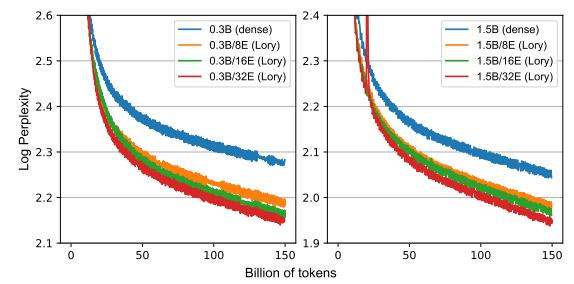

# 3 Our Approach: C Lory

Lory is an approach for pre-training fully differentiable MoE language models (Figure 1). The core technique that enables Lory to be fully differentiable is expert merging (Muqeeth et al., 2023, see details in Section 2.2). To make it computationally feasible, we propose a causal segment routing method that merges experts only once per segment, effectively reducing the number of merging operations (Section 3.1). We also propose a data batching strategy that groups semantically similar texts, which is crucial for the effective training of the segment-level router (Section 3.2).

**Notations.** We denote an input sequence of L tokens as  $X = (x_1, x_2, ..., x_L)$ . Considering a segment size T, we divide the input sequence into  $N = \lceil L/T \rceil$  segments, denoted as

 $S_1, S_2, \ldots, S_N$ . We use R to denote the routing network (parameterized as a linear layer), which computes the weights for expert merging. Let  $h_x$  represent the hidden representation of the token x. The parameters of the i-th expert FFN are denoted by  $\theta_i$ .

#### 3.1 Efficient Expert Merging via Causal Segment Routing

**Challenges.** An intuitive way to reduce the computational cost is to use segment-level routing instead of token-level routing, which can reduce the number of merging operations from L to N. However, simply using the current segment to compute the routing weights can cause information leakage.

**Training design.** We propose *causal segment routing* to effectively route information across segments in an autoregressive manner.2 This method merges FFNs in an MoE layer based on the previous segment's information and uses it to process the current segment. Specifically, given a training instance X that consists of L tokens (e.g., L=4096), we split the training instance into N segments, each containing T (e.g., T=256) consecutive tokens. For the k-th segment  $S_k$ , where k>1, we compute the average of the hidden representations of its preceding segment  $S_{k-1}$ , denoted as  $\bar{h}_{k-1}$ . Using the average hidden representation allows the model to adapt to prompts of varying lengths during inference.  $\bar{h}_{k-1}$  is then utilized to determine the routing weights, resulting in a merged expert  $\bar{\theta}$ :

$$\bar{h}_{k-1} = \frac{1}{T} \sum_{x \in S_{k-1}} h_x, \quad e_i = \text{Softmax}(R(\bar{h}_{k-1})), \quad \bar{\theta} = \sum_i e_i \cdot \theta_i.$$
 (3)

We then use the merged expert  $\bar{\theta}$  to process all the tokens in the current segment  $S_k$ , i.e.,  $o_x = \text{FFN}(h_x; \bar{\theta}), \forall x \in S_k$ . This approach ensures that the routing decisions made by the model are based exclusively on data from preceding positions. For the first segment  $S_1$ , the representation of the segment itself is used to compute the merging weights for its own FFN. To prevent information leakage, we implement a stop-gradient operation on  $R(\bar{h}_1)$ . As demonstrated in Appendix B, merging experts at the segment level incurs minimal overhead compared to the training of dense models.

**Prompt-only routing during inference.** During inference, we begin with a given prompt and make a single routing decision per layer based on the average hidden representations of the prompt. This routing decision determines a merged FFN, which is used consistently throughout the entire generation process. It is important to note that this inference process is as simple and computationally efficient as that of dense models.3

#### 3.2 Similarity-based Data Batching

The standard practice of pre-training LMs is to randomly concatenate documents to construct training instances with a fixed length. This approach can lead to under-specialized experts because tokens within adjacent segments may come from very different and irrelevant documents.

To mitigate this issue, we employ a similarity-based data batching technique inspired by Shi et al. (2024), which sequentially concatenates similar documents to construct training instances. This method encourages high similarity between adjacent segments, enabling the experts to specialize in different domains or topics.

We use Contriever (Izacard et al., 2022) to measure document similarity and apply a greedy search algorithm to concatenate similar documents to form batches (see Appendix C).

&lt;sup>2Pseudocode of the *causal segment routing* strategy can be found in Appendix A.

&lt;sup>3In Appendix G.2, we compare the prompt-only routing strategy to using the causal segment routing strategy that faithfully follows the training design, and find they do not lead to significant differences. We also discuss the potential of converting Lory to sparsely MoE models for memory-efficient inference.

Although our data batching technique is similar to that of Shi et al. (2024), our goal is different. While they focus on enhancing language models' reasoning across document boundaries, we find this approach particularly effective for fostering expert specialization during MoE model training.

## 4 Experiments

In this section, we evaluate Lory by training a series of language models from scratch. We first describe the experimental setups (Section 4.1) and then present the results (Section 4.2).

## 4.1 Setups

**Models.** We evaluate our approach by training decoder-only Transformer models which consist of 0.3B and 1.5B active parameters. For each FFN layer in the Transformer model, we replace it with MoE layers with  $E \in \{8, 16, 32\}$  experts with exactly the same architecture. Appendix D shows the configuration of model architectures as well as the total parameter count. We follow LLaMA (Touvron et al., 2023a) and use SwiGLU (Shazeer, 2020) as the activation function in FFNs. We use the same tokenizer as the LLaMA models (Touvron et al., 2023a;b). All models are trained with a 4096-token context window. In the causal segment routing strategy, we set the length of each segment to be T = 256.

**Training details.** We employ the AdamW optimizer (Loshchilov & Hutter, 2019) with  $\beta_1=0.9$  and  $\beta_2=0.95$  and use a learning rate of 2e-4 with a cosine learning rate scheduler. All models with a batch size of 1 million tokens. We employ the data parallelism with the ZeRO optimization (Rajbhandari et al., 2020) for distributed training. At the beginning of training, we train a parameter-matched dense model and duplicate the FFN layers as initialization of the MoE model. In our experiments, we use the first 5% training steps as the warmup to initialize the MoE weights. We find that without warmup training, there may be more experts under-utilized (see Appendix G.3 for an ablation study). We also apply a linear warmup to the learning rate scheduler for the first 5% training steps. We train our models with up to 64 A100 GPUs.

**Training datasets.** We randomly sample a subset (150 billion tokens) of the Commoncrawl dataset (Wenzek et al., 2019) for training. Using the similarity-based data batching method from Shi et al. (2024), we construct all training instances (see Appendix C for details).

**Evaluation datasets.** We evaluate all the models on language modeling tasks by measuring the perplexity of trained models on held-out evaluation datasets sampled from arXiv, Books, Wikipedia, C4 (Raffel et al., 2020), and Python code (a Python subset of Github). Each evaluation dataset contains 1K samples, each of which consists of 4096 tokens.

We also evaluate models in downstream tasks with in-context learning (Brown et al., 2020), including common sense reasoning: BoolQ (Clark et al., 2019), PIQA (Bisk et al., 2020), SIQA (Sap et al., 2019), HellaSwag (Zellers et al., 2019), WinoGrand (Sakaguchi et al., 2020); reading comprehension: RACE (Lai et al., 2017), ARC (Clark et al., 2018)); closed-book QA: Natural Questions (Kwiatkowski et al., 2019), TriviaQA (Joshi et al., 2017); and text classification: AGNews (Zhang et al., 2015), SST-2 Socher et al. (2013), Amazon and Yelp (Zhang et al., 2015), FEVER (Thorne et al., 2018), MRPC (Dolan & Brockett, 2005). For text classification tasks, we follow the evaluation setup of Min et al. (2022); for the rest of tasks, we follow the same setup as Touvron et al. (2023b).

&lt;sup>4Here, "active parameters" refers to the size of the model after merging at each MoE layer.

&lt;sup>5In Appendix E, we additionally conduct experiments on a 7B dense model and a 7B/4E MoE model *without* using similarity-based data batching. Due to the limited computing resources, we are not able to train 7B models on the similarity-based batched dataset.

| arXiv | Books                                         | Wiki                                                                             | C4                                                                                                            | Python                                                                                                                                           |
|-------|-----------------------------------------------|----------------------------------------------------------------------------------|---------------------------------------------------------------------------------------------------------------|--------------------------------------------------------------------------------------------------------------------------------------------------|
| 8.4   | 18.0                                          | 10.3                                                                             | 13.8                                                                                                          | 15.2                                                                                                                                             |
| 7.4   | 16.0                                          | 9.2                                                                              | 13.3                                                                                                          | 12.5                                                                                                                                             |
| 7.2   | 15.7                                          | 9.1                                                                              | 13.1                                                                                                          | 12.2                                                                                                                                             |
| 7.2   | 15.5                                          | 8.9                                                                              | 13.0                                                                                                          | 11.7                                                                                                                                             |
| 6.6   | 13.6                                          | 7.8                                                                              | 10.7                                                                                                          | 10.4                                                                                                                                             |
| 6.2   | 12.8                                          | 7.6                                                                              | 10.6                                                                                                          | 10.1                                                                                                                                             |
| 6.0   | 12.4                                          | 7.1                                                                              | 10.6                                                                                                          | 8.9                                                                                                                                              |
| 5.8   | 12.3                                          | 7.1                                                                              | 10.4                                                                                                          | 8.7                                                                                                                                              |
|       | 8.4 7.4 7.2 7.2 6.6 6.2 6.0 | 8.4 18.0 7.4 16.0 7.2 15.7 7.2 15.5 6.6 13.6 6.2 12.8 6.0 12.4 | 8.4 18.0 10.3 7.4 16.0 9.2 7.2 15.7 9.1 7.2 15.5 8.9 6.6 13.6 7.8 6.2 12.8 7.6 6.0 12.4 7.1 | 8.4 18.0 10.3 13.8 7.4 16.0 9.2 13.3 7.2 15.7 9.1 13.1 7.2 15.5 8.9 13.0 6.6 13.6 7.8 10.7 6.2 12.8 7.6 10.6 6.0 12.4 7.1 10.6 |

Figure 2: Left: training curves (log perplexity) of models with different sizes and experts. Right: Perplexity of trained models on different evaluation sets (arXiv, Books, Wikipedia, C4, and Python). We include the detailed model configurations and sizes in Appendix D.

|           | Commonsense Reasoning |          |        |           |                 | Rea    | iding Comp | prehensio   | n     |
|-----------|-----------------------|----------|--------|-----------|-----------------|--------|------------|-------------|-------|
| Model     | PIQA                  | SIQA     | BoolQ  | HellaSwag | WinoGrande      | RACE-m | RACE-h     | ARC-e       | ARC-c |
| 0.3B      | 65.8                  | 42.7     | 44.6   | 34.6      | 51.2            | 41.7   | 30.9       | 51.5        | 21.3  |
| 0.3B/8E   | 67.5                  | 41.2     | 41.2   | 34.8      | 54.4            | 43.1   | 31.4       | 52.4        | 22.1  |
| 0.3B/16E  | 67.2                  | 44.1     | 56.6   | 34.9      | 54.1            | 43.9   | 31.1       | 54.8        | 24.9  |
| 0.3B/32E  | 68.2                  | 43.0     | 58.0   | 34.7      | 53.4            | 42.7   | 32.0       | <b>57.4</b> | 26.3  |
| 1.5B      | 71.2                  | 45.0     | 54.0   | 43.9      | 60.9            | 50.1   | 36.7       | 65.0        | 31.0  |
| 1.5B/8E   | 72.1                  | 45.2     | 62.0   | 43.6      | 63.7            | 51.2   | 36.5       | 66.3        | 32.5  |
| 1.5B/16E  | 71.3                  | 45.0     | 56.0   | 43.7      | 61.5            | 51.7   | 37.3       | 66.3        | 32.7  |
| 1.5B/32E  | 72.1                  | 47.1     | 59.9   | 43.8      | 61.9            | 51.5   | 32.4       | 66.7        | 32.7  |
|           | Closed                | -book QA |        |           | Text Classifica | ation  |            |             | Avg   |
| Model     | NQ                    | TQA      | AGNews | Amazon    | SST-2           | Yelp   | Fever      | MRPC        | 11.5  |
| 0.3B      | 4.7                   | 8.8      | 30.3   | 53.6      | 54.6            | 66.0   | 47.6       | 62.0        | 41.8  |
| 0.3B/8E   | 5.3                   | 9.0      | 38.4   | 52.3      | 54.6            | 62.6   | 56.6       | 59.0        | 42.7  |
| 0.3B/16E  | 6.0                   | 10.2     | 36.3   | 75.6      | 53.3            | 64.0   | 57.0       | 65.0        | 45.8  |
| 0.3B/32E  | 5.3                   | 10.2     | 47.3   | 64.0      | 55.3            | 73.3   | 55.7       | 56.0        | 46.0  |
| 1.5B      | 7.6                   | 23.8     | 64.0   | 65.3      | 80.0            | 58.6   | 59.0       | 66.7        | 51.9  |
| 1.5B/8E   | 7.3                   | 24.2     | 65.0   | 94.0      | 80.0            | 88.3   | 57.0       | 64.0        | 56.1  |
| 1 FD /1/E | 70                    | 25.6     | (1 (   | 70.0      | 04.6            | 00.6   | EE 0       | (0 (        | EE 1  |

Table 1: We compare the Lory MoE models with the parameter-matched dense models on downstream tasks, including commonsense reasoning, reading comprehension, closed-book QA, and text classification.

84.6

85.0

93.6

95.3

57.3

56.3

63.6

55.1

56.5

78.3

94.7

#### 4.2 Main Results

7.3

1.5B/16E

1.5B/32E

25.6

61.6

62.3

Training efficiency and convergence. Figure 2 (left) shows the training loss curves of the dense model and our MoE models with different model sizes. First, we find that with the same amount of training tokens, our models clearly achieve better training loss compared to the dense model baseline. For the 0.3B and 1.5B models, our models with 32 experts achieve the same level of loss with fewer than half of the training tokens. This indicates that our approach achieves much better performance with the same training compute (see analysis of additional FLOPs from MoE layers in Appendix B). We also observe that when using more experts, we are able to gain more improvement.

Language modeling. We evaluated the models on language modeling tasks and found that our MoE models consistently outperformed the dense baseline, significantly reducing perplexity across all domains. For instance, the 0.3B/32E model improved perplexity by 13.9% on Books compared to the 0.3B dense model. Notably, improvements were most pronounced in test domains distinct from the training data (e.g., Python), indicating strong expert specialization, which is further explored in Section 5.4).

**Downstream tasks.** Table 1 shows the model performance on downstream tasks. We observe significant performance across all tasks. For example, our 0.3B/32E model achieves an

average performance improvement of +3.7% in common sense reasoning, +3.3% in reading comprehension, +1.5% in reading comprehension, and +11.1% in text classification.

