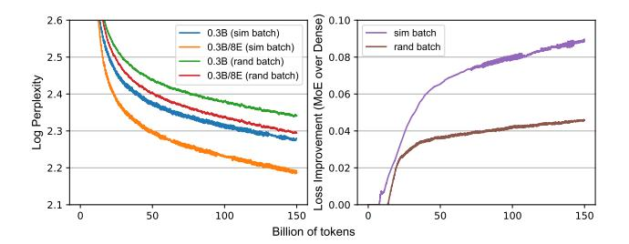
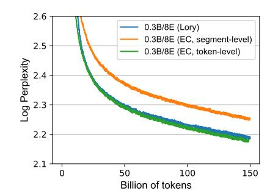
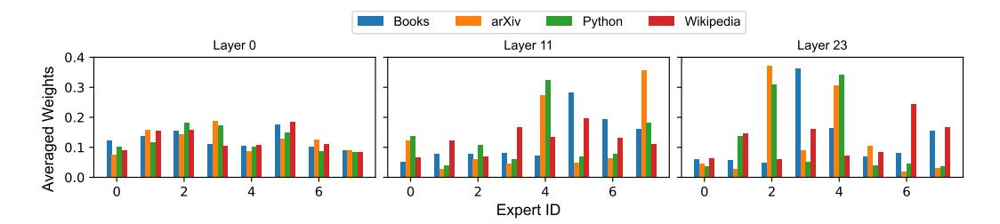

# 5 Analysis and Ablation Studies

In this section, we conduct ablation studies and analysis to understand the significance of each component of our approach. In Appendix G, we provide additional insights, demonstrating that (1) during the inference of downstream tasks, whether the entire input prompt is routed once or each segment is routed individually does not result in substantial differences in the tasks we evaluated; and (2) warmup training is crucial for achieving high expert utilization, particularly when training MoE models with a large number of experts.

#### 5.1 Importance of Causal Segment Routing

We compare our causal segment routing strategy with an alternative *prefix routing* strategy for training. In prefix routing, expert merging is performed only once for each sequence based on the first segment. The merged FFN is then used to process the rest of the sequence without further updates. Figure 3 shows that using only a prefix for routing leads to much worse performance compared to causal segment routing. These results highlight the importance of using every segment to provide strong training signals for routers.

**Figure 3:** Training curves of causal segment routing and prefix routing. The latter is a straightforward segment-level routing strategy that uses the first segment to route the entire input.

**Figure 4:** Left: Training curves of similarity-based data batching (*sim batch*) or the standard random batching (*rand batch*). Right: Training loss difference between Lory and a dense model when using different batching strategies. Lory leads to a larger loss improvement over the dense model when using similarity-based data batching.

#### 5.2 Importance of Similarity-based Data Batching

To investigate the importance of similarity-based data batching, we compare the performance improvement of MoE models over dense models with and without this batching method. Figure 4 (left) shows the training loss of dense (0.3B) and MoE models with eight experts (0.3B/8E) using similarity-batched (sim batch) and randomly-batched (rand batch) data. MoE models consistently outperform dense models in both setups. However, the loss improvement (i.e., the difference in loss between dense and MoE models) is much larger with similarity-based batching, and this effect is amplified with more training data (Figure 4 (right)). These results strongly support the importance of similarity-based batching for effectively training our MoE model.

#### 5.3 Comparison to Existing MoE Models

We compare our approach with Expert Choice (EC) (Zhou et al., 2022), a state-of-theart MoE method that ensures balanced load during training by having each expert select top-k inputs according to the routing weights. During inference, we route each token into top-k experts to avoid to leverage global information for routing.

We consider two variants of EC MoE models, both with a capacity factor of 1 to match the computation of our MoE models. First, we train a sparse EC MoE model using our segment routing strategy, where each expert selects top segments and processes all tokens within those segments. This variant allows us to directly compare our expert-merging strategy with the expert choice method while using the same segment-level routing approach. Second, we consider the original EC setting with token-level routing to provide an end-to-end comparison with stateof-the-art MoE models using the same amount of training computation. Figure 5 shows the training loss curves. We observe that Lory (blue curve) significantly outperforms segment-level EC (orange curve) with the same routing setting, suggesting that a fully differentiable architecture is more effective than a sparse MoE when using the same routing

**Figure 5:** Comparison with the state-ofthe-art MoE training technique Expert Choice (EC) with a segment-level or token-level routing. For both EC models, we use the capacity factor of 1 with the same amount of FLOPs as our training method for the fair comparison.

strategy. Comparing Lory with the token-level EC model (green curve), we find that Lory achieves competitive results despite using segment-level routing and not requiring any advanced training techniques. These results highlight the significant potential of Lory.

Table 2 shows model perplexity on held-out evaluation sets. The token-level EC model outperforms ours on C4, likely due to its similarity to the training set (Commoncrawl). However, on arXiv, Books, and Wikipedia, EC performs similarly or slightly worse. Notably, our model excels on the Python evaluation (12.5 vs. 13.6 perplexity), suggesting segment-level routing can be particularly effective for out-of-domain data (i.e., Python in CommonCrawl). Our analysis in Section 5.4 shows that segment-level routing models are indeed able to learn experts that are specialized in specific domains (e.g., Python code), potentially helping models achieve high performance in less frequent domains.

| Model                   | arXiv      | Books       | Wiki | C4          | Python                |
|-------------------------|------------|-------------|------|-------------|-----------------------|
| 0.3B/8E (Lory)          | <b>7.4</b> | <b>16.0</b> | 9.2  | 13.3        | <b>12.5</b> 14.1 13.6 |
| 0.3B/8E (EC, seg-level) | 7.9        | 17.6        | 10.5 | 14.1        |                       |
| 0.3B/8E (EC, tok-level) | 7.5        | 17.0        | 9.2  | <b>12.8</b> |                       |

**Table 2:** Perplexity of our trained MoE model and EC models on evaluation sets. We instantiate EC methods with our segment-level routing and the original token-level routing.

#### 5.4 Expert Utilization and Specialization

**Utilization:** How many experts are actively utilized? One potential issue of training MoE models is the models may collapse to dense models because most experts are under-utilized (e.g., some experts have never been activated). In Appendix G.1, we show although without using any auxiliary loss on load balancing, Lory is able to achieve high expert utilization, preventing the MoE models from collapsing to dense models.

**Specialization:** What do experts learn? In order to study the expert specialization, we investigate the averaged routing weights at different layers of the 0.3B/8E model, on different domains (Books, arXiv, Python, and Wikipedia). Figure 6 shows the routing weights at layer 0, 11, and 23 (the first, middle, and last layer) of the 0.3B/8E model.6 First, we find that there exists clear domain-level expert specialization in our trained MoE models, even though no additional domain-level supervision is used during training. For instance, expert 7 at layer 11 is specialized to process inputs in the arXiv domain. We also observe that routing weights on arXiv and Python code are more similar compared to Books and Wikipedia, likely because LaTex code and Python code are dissimilar to natural language.

&lt;sup>6In Appendix F, we show the averaged routing weights at all layers of the 0.3B/8E model.

**Figure 6:** Averaged routing weights at layer {0, 11, 23} of the 0.3B/8E model on different domains (Books, arXiv, Python, Wikipedia). We observe that the experts in our MoE models learn domain-level specialization, especially at middle and higher layers.

Second, experts at the middle or high layers are more specialized in specific domains, while the routing weights at lower layers are similar and flat across domains.

It is worth noting that our learned experts behave differently from those of prior token-level MoE models, where shallow token-level specialization is observed. For example, some experts are specialized for a specific type of word (e.g., punctuations, articles), and few deep semantic features are captured by the learned routers (Jiang et al., 2024; Lewis et al., 2021; Zoph et al., 2022; Shazeer et al., 2017; Xue et al., 2024). Our models learn domain-level specialization, which we attribute to the segment-level routing strategy used during training. This strategy allows routers to capture global semantic features beyond the token level. The complementary nature of features captured by segment/sentence-level and token-level routing strategies suggests the possibility of combining them to build even stronger models, and we leave it for future work.

