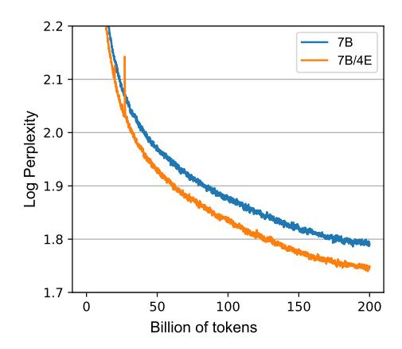

# D Model Configurations

In our experiments, we employ Lory to train decoder-only models which consists of effective parameters of 0.3B and 1.5B. For each FFN layer in the Transformer model, we replace it with MoE layers with E ( $E \in \{8, 16, 32\}$ ) experts with exactly the same architecture. Table 4 shows the configurations of model architectures.

## E Experiments on 7B models

**Experimental Setups.** We conduct experiments on a 7B architecture. Table 5 shows the configuration of the model architectures. We train a dense 7B model and a 7B/4E MoE model. For the 7B models, we follow LLaMA2 (Touvron et al., 2023b) and use a combination of several corpora as the training set. We down-sample the full training set to a subset of 200B tokens for 7B models. Due to limited resources, we only conduct experiments on randomly batched training data for 7B models and do not apply the similarity-based batching method.

| Model       | $n_{\mathrm{params}}$ | N  | D    | $n_{\mathrm{head}}$ |
|-------------|-----------------------|----|------|---------------------|
| 7B 7B/4E | 7B 19.7B           | 32 | 4096 | 32                  |

**Table 5:** Model architectures and sizes used in our 7B experiments. For MoE models, we replace each FFN layers with a MoE layer. N: number of layers; D: hidden dimension of the model;  $n_{\text{head}}$ : number of attention heads.

| Model                                   | PIQA                | SIQA                | BoolQ            | HellaSwag        |
|-----------------------------------------|---------------------|---------------------|------------------|------------------|
| 1.5B/8E (prompt)                        | 72.1                | 45.2                | <b>62.0</b> 60.2 | 43.6             |
| 1.5B/8E (segment)                       | 72.1                | <b>45.6</b>         |                  | <b>43.9</b>      |
| 1.5B/16E (prompt) 1.5B/16E (segment) | 71.3 <b>72.9</b> | 45.0 <b>45.4</b> | <b>56.0</b> 55.2 | <b>43.7</b> 43.6 |
| Model                                   | Wino                | NQ                  | TQA              | Avg              |
| 1.5B/8E (prompt)                        | <b>63.7</b> 61.8    | 7.3                 | 24.2             | <b>45.4</b>      |
| 1.5B/8E (segment)                       |                     | 7.3                 | <b>24.4</b>      | 45.1             |
| 1.5B/16E (prompt)                       | 61.5                | 7.3                 | <b>25.6</b> 25.5 | 44.4             |
| 1.5B/16E (segment)                      | <b>62.4</b>         | <b>7.6</b>          |                  | <b>44.</b> 7     |

**Table 6:** Downstream performance of using different inference methods. We study two routing strategy for inference. *prompt*: we make the routing decision once on the entire input prompt; *segment*: we re-route and get new merged FFNs every segment.

Language Modeling Results. We show the training loss curves in Figure 8 and the perplexity on held-out evaluation sets in Table 7. We find that compared to the 0.3B and 1.5B models (see Section 4), the improvement of the 7B/4E model is less significant. We think it is because (1) the similarity-based batching method is not applied in this case, making the experts under-utilized; (2) we only use four experts in the MoE model. We leave the experiments with the similarity-based batching method on MoE models with more experts as future work.

**Figure 8:** Training curves (log perplexity) of the 7B dense model and the 7B/4E MoE model. Note that when training the 7B/4E model, we do not apply the similarity-based batching method.

#### Performance on Downstream Tasks.

Table 8 shows the performance of the models on downstream tasks. We find that although the similarity-based batching method is not used when training the 7B/4E model, it still achieves clearly better results on various tasks compared to the dense 7B model. This further suggests the effectiveness of our causal routing strategy.

| Model                     | arXiv | Books | Wiki | C4  | Python |
|---------------------------|-------|-------|------|-----|--------|
| 7B                        | 2.3   | 9.1   | 5.9  | 8.0 | 2.3    |
| $7\mathrm{B}/4\mathrm{E}$ | 2.2   | 8.7   | 5.7  | 7.7 | 2.2    |

**Table 7:** Perplexity of trained models on different evaluation sets (arXiv, Books, Wikipedia, C4, and Python). Note that when training the 7B/4E model, we do not apply the similarity-based batching method.

| Commonsense Reasoning |                     |                     |                     |                     | Rea                 | ding Com            | orehensio           | n                   |                     |
|-----------------------|---------------------|---------------------|---------------------|---------------------|---------------------|---------------------|---------------------|---------------------|---------------------|
| Model                 | PIQA                | SIQA                | BoolQ               | HellaSwag           | WinoGrande          | RACE-m              | RACE-h              | ARC-e               | ARC-c               |
| 7B 7B/4E           | 76.9 77.7        | <b>50.2</b> 50.1    | 65.2 <b>67.6</b> | 52.6 <b>54.8</b> | 66.2 <b>67.3</b> | 55.3 <b>57.0</b> | 40.5 <b>41.3</b> | 73.0 <b>73.5</b> | 38.5 <b>39.6</b> |
|                       | Closed-             | book QA             |                     |                     | Text Classifica     | ation               |                     |                     | Avg                 |
| Model                 | NQ                  | TQA                 | AGNews              | Amazon              | SST-2               | Yelp                | Fever               | MRPC                | 1118                |
| 7B 7B/4E           | 17.3 <b>18.8</b> | 42.5 <b>44.5</b> | 80.6 <b>81.7</b> | 94.3 <b>95.7</b> | 92.7 <b>93.1</b> | <b>98.3</b> 96.7 | 53.7 <b>57.7</b> | 67.0 <b>69.7</b> | 62.5 <b>63.9</b> |

**Table 8:** We compare the 7B/4E MoE models trained with our routing strategy (without using the similarity-based batching method) with the parameter-matched dense models on downstream tasks, including commonsense reasoning, reading comprehension, closed-book QA, and text classification.

## F Expert Specialization: Full Results of Routing Weights

Figure 11 shows the routing weights at all layers of the 0.3B/8E model. It clearly shows that our MoE models are able to learn domain-level specialization.

