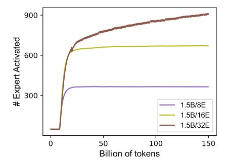
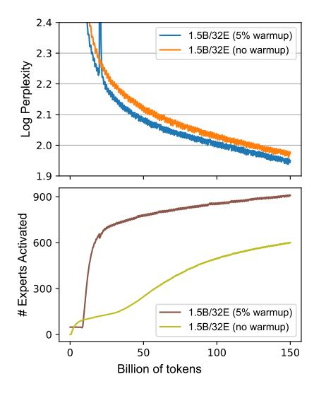
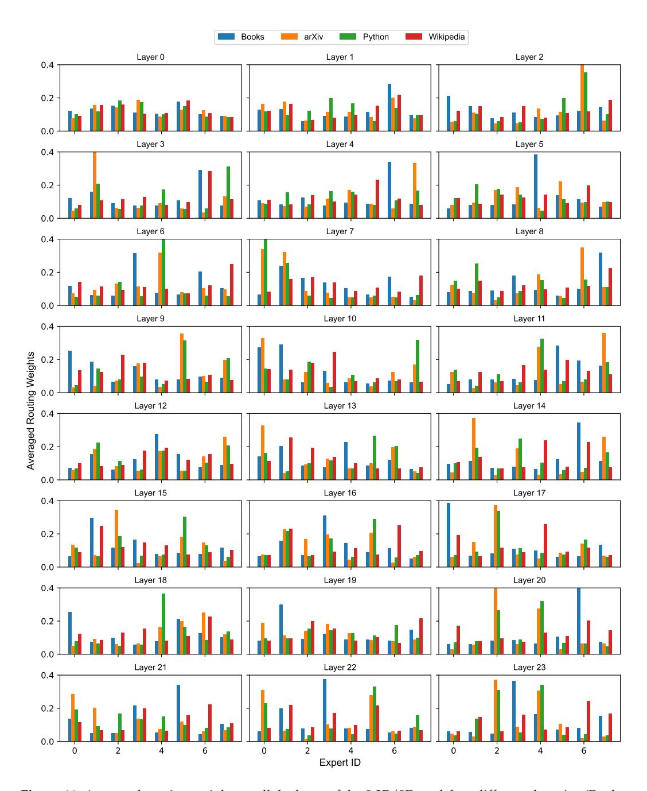

# G More Analysis and Ablation Studies

**Figure 9:** We show how many experts are actively utilized at least once every 10 training steps. We define an expert is activated if the weight is larger than  $\frac{2}{E}$ , where E denotes the number of experts at each MoE layer. Our models have 48 layers; therefore, the 1.5B/8E, 1.5B/16E, 1.5B/32E models have 384, 768, 1536 experts in total, respectively.

#### **G.1** Expert Utilization

Here, we investigate the expert utilization of our MoE models. We define an expert that is activated for a given input if the routing weight is larger than  $\frac{2}{E}$  (e.g., larger than 25% if there are 8 experts each layer). In Figure 9, we plot the number of experts that are activated at least once among 10 training steps (consisting of 10M tokens and 40K segments) when training 1.5B MoE models. We see that after the warmup phase at the beginning, the expert utilization quickly increases. 1.5B/8E and 1.5B/16E models have quickly utilized most of the experts; while the expert utilization of the 1.5B/32E model continues to increase until the end of the training and it is able to activate about 900 experts among 1536 experts at the end of training. This indicates that our approach is able to prevent the MoE models from

| Model                                   | PIQA                | SIQA                | BoolQ            | HellaSwag        |
|-----------------------------------------|---------------------|---------------------|------------------|------------------|
| 1.5B/8E (prompt)                        | 72.1                | 45.2                | <b>62.0</b> 60.2 | 43.6             |
| 1.5B/8E (segment)                       | 72.1                | <b>45.6</b>         |                  | <b>43.9</b>      |
| 1.5B/16E (prompt) 1.5B/16E (segment) | 71.3 <b>72.9</b> | 45.0 <b>45.4</b> | <b>56.0</b> 55.2 | <b>43.7</b> 43.6 |
| Model                                   | Wino                | NQ                  | TQA              | Avg              |
| 1.5B/8E (prompt)                        | <b>63.7</b> 61.8    | 7.3                 | 24.2             | <b>45.4</b>      |
| 1.5B/8E (segment)                       |                     | 7.3                 | <b>24.4</b>      | 45.1             |
| 1.5B/16E (prompt)                       | 61.5                | 7.3                 | <b>25.6</b> 25.5 | 44.4             |
| 1.5B/16E (segment)                      | <b>62.4</b>         | <b>7.6</b>          |                  | <b>44.</b> 7     |

**Table 9:** Downstream performance of using different inference methods. We study two routing strategy for inference. *prompt*: we make the routing decision once on the entire input prompt; *segment*: we re-route and get new merged FFNs every segment.

collapsing to dense models and achieves high expert utilization. However, when training with a large number of experts, achieving high expert utilization is more challenging.

#### **G.2** Inference Methods

Comparison to segment-level routing during inference. During inference of downstream tasks, by default, we take the task input prompt as the input of the routers in each layer and make the routing decision once. This inference method enables the decoding process to be simple and achieves low latency, since after encoding and routing the input, we do not need to use the routers again – the rest generation can be run in a (merged) dense model. As such an inference method introduces a train-test discrepancy, we study the method that routes every segment as we do during training. As shown in Table 9, routing the input once or routing each segment does not make substantial differences in the downstream tasks we evaluate. Due to simplicity and efficiency, we use the entire prompt as the routing input and perform routing only once.

**Figure 10:** Training curves and expert utilization of employing a warmup phrase or not. We find without a warmup phrase, training leads to a worse MoE model (top) and worse expert utilization (bottom).

**Converting to sparse models for efficient inference.** In our MoE models, we merge FFN experts for each segment. This can lead to a large memory usage during inference when the model processes a large inference batch, because the parameters of a merged FFN per

batch are cached in the GPU memory. One possibility to alleviate this issue is to finetune the trained models with a hard-decision routing mechanism (e.g., top-k routing) after the pre-training stage. This method transitions the models with soft routers to ones with hard routers, significantly reducing the memory usage during inference. We leave further investigation on this direction as future work.

### **G.3 Warmup Training**

At the beginning of training (i.e., the first 5% training steps), we train a dense LM with the same configuration before training the MoE model. We initialize the MoE layers by duplicating the FFN layers of the warmup trained model. We find that this warmup phase is crucial for achieving high expert utilization especially when there is a large number of experts. Figure [10](#page-18-2) visualizes the training loss curves and expert utilization of the 1.5B/32E model (with or without warmup training). As shown in the figure, without the warm-up phrase, the model achieves worse performance and much fewer experts are utilized.

**Figure 11:** Averaged routing weights at all the layer of the 0.3B/8E model on different domains (Books, arXiv, Python, Wikipedia). We observe that the experts in our MoE models learn clear domain-level specialization.