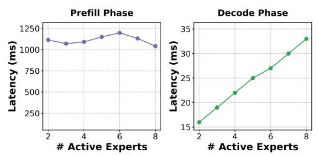

### LYNX: Enabling Efficient MoE Inference Through Dynamic Batch-Aware Expert Selection

Vima Gupta Georgia Institute of Technology

Jae Hyung Ju Georgia Institute of Technology

Kartik Sinha Georgia Institute of Technology

Ada Gavrilovska Georgia Institute of Technology

### Anand Iyer Georgia Institute of Technology

### Abstract

Modern foundational models overwhelmingly adopt Mixtureof-Experts (MoE) architectures, prized for their selective parameter activation that decouples parameter count from computational cost. However, MoEs face a fundamental tension in serving: batching, critical for throughput, forces the activation of many experts, negating MoEs' sparsity benefits and making decode firmly memory-bandwidth-bound. We present LYNX, the first system—to the best of our knowledge—that alleviates the memory bandwidth bottleneck in MoE inference in a workload-agnostic fashion. LYNX leverages a key property of MoE training: load-balancing losses introduce batch-level expert activation skews and redundancy, which it exploits by remapping low-affinity token-to-expert assignments within each batch using a novel *AffinityBinning* technique that reduces the total experts invoked. We evaluate LYNX on stateof-the-art models from four families across eight benchmarks spanning code generation, mathematics, reasoning, and vision tasks, where it achieves up to 1.30× lower latency compared to the baselines. These improvements don't come at a loss: LYNX frequently *improves* accuracy (on average) and incurs only less than 1% drop in the worst case, while being complementary to existing techniques.

## 1 Introduction

Mixture-of-Experts (MoE) has become the de facto architecture in modern foundational models, powering state-of-the-art offerings from families such as Qwen [\[60,](#page-15-0) [61\]](#page-15-1), Llama [\[44\]](#page-14-0), Mixtral [\[31\]](#page-13-0), and DeepSeek [\[13,](#page-13-1) [50\]](#page-14-1). MoEs replace dense feed-forward layers with multiple specialized sub-networks, or *experts*, and a learned routing network that directs each input token to a small subset of these experts [\[28,](#page-13-2) [36,](#page-14-2) [52\]](#page-14-3). This *selective activation* decouples parameter count from computational cost, enabling models to scale to hundreds of billions of parameters while activating only a small fraction per input. For instance, Qwen2-57B-A14B-Instruct activates just 14 of its 57 billion parameters per token [\[61\]](#page-15-1). Thus, MoEs offer the compelling promise of inference cost proportional not to total model size, but to the far smaller activated footprint.

Realizing this promise in practice, however, requires navigating a fundamental tension between latency and throughput inherent to production serving. Processing requests one at a time would respect per-request latency but leaves GPU utilization dismal; batching requests together amortizes fixed costs and improves throughput, but accumulates latency. This tension is not merely theoretical: providers today charge 4–6×

more for low-latency "priority" APIs compared to throughputoriented serving [\[6,](#page-12-0) [47\]](#page-14-4), a pricing premium that reflects the real cost of reserving capacity for small, latency-constrained batches. Consequently, production deployments must settle on a per-GPU batch size that is neither too small to amortize infrastructure costs, nor too large to violate latency SLOs.

This tension manifests disproportionately for MoEs compared to dense models. Because the router independently selects a different expert subset for each token, the set of experts that must be loaded from GPU high-bandwidth memory (HBM) at each layer grows with the composition of the batch, as well as its size. At the moderate batch sizes imposed by latency SLOs, this dynamic, data-dependent memory access pattern keeps MoE decode firmly memory-bandwidth-bound: latency scales directly with the number of distinct experts activated across the batch ([§2\)](#page-1-0). Worse, even moderate batches suffice to activate nearly all experts: in Qwen2-57B-A14B-Instruct, where each token selects 8 of 64 experts, a batch of just 8 diverse requests is enough to saturate the entire expert pool [\[61\]](#page-15-1). At that point, MoEs offer no sparsity benefit whatsoever: they activate as many or more parameters as a dense model of equivalent capacity[1](#page-0-0) , while additionally bearing the cost of dynamic expert movement in the critical path of every decode iteration.

The natural approach to this is to reduce the volume of data movement—either by shrinking expert size or by reducing the number of experts fetched. Existing techniques pursue both directions through pruning, quantization, and expert clustering [\[10,](#page-12-1) [14,](#page-13-3) [24,](#page-13-4) [27,](#page-13-5) [35,](#page-14-5) [38,](#page-14-6) [42,](#page-14-7) [62\]](#page-15-2), and are effective for workloads they are calibrated for. However, they share two fundamental limitations. First, they depend on extensive offline calibration that assumes expert redundancy at the workload level—an assumption that is increasingly fragile as modern MoE models grow more expressive and their serving workloads more diverse ([§2\)](#page-1-0). Second, they permanently alter the model: experts are discarded, merged, or compressed at compile time and cannot be recovered at serving time, making them inflexible to workload changes. More recent dynamic approaches utilize calibration-based signals to reduce experts on a per-token level [\[10,](#page-12-1) [23,](#page-13-6) [27,](#page-13-5) [42\]](#page-14-7), but since each token still independently selects from the full expert pool, batch-level expert utilization remains high as batch size grows. Neither class of techniques resolves the fundamental tension: the bottleneck lives at the batch level, and neither operates there.

1

1An MoE with E experts each with P parameters generally underperform a dense model with E × P parameters.[\[22\]](#page-13-7),[§2](#page-1-0)

In this paper, we present LYNX, the first system—to the best of our knowledge—that alleviates the memory bandwidth bottleneck in MoE inference in a workload-agnostic fashion. LYNX requires no calibration data, makes no permanent changes to the model, and operates entirely from signals already available at runtime. Its key insight stems from a crucial property of MoE training: load-balancing losses encourage routers to distribute tokens broadly across experts, even when confidence in secondary selections is low [18, 22]. While this forced diversification is essential during training, LYNX observes that it creates redundancy during inference at the batch level, where it manifests as skewed expert activations at each layer in every forward pass (§2).

LYNX exploits this redundancy through a set of principles guided by three observations we uncover through exhaustive analysis across multiple model families (§3). First, the router's output confidence scores reliably identify which token-to-expert mappings are potentially redundant and safe to reassign. Second, the sorted order of the router's expert selections provides a direct signal for accuracy impact: topranked experts disproportionately determine output quality, while lower-ranked selections among the top-k exhibit high redundancy. Third, expert sensitivity differs drastically between the prefill and decode phases, with prefill demanding strict expert fidelity and decode showing remarkable resilience to reassignment. Armed with these principles, LYNX remaps low-affinity token-to-expert assignments within a batch onto experts the batch is already activating, reducing the total number of experts invoked at a batch level. Crucially, LYNX does this without discarding any experts permanently, and without changing the number of experts each token activates preserving the top-k activation semantics of the model2.

Making remapping practical requires solving a non-trivial coupled optimization in the critical path of inference: the question of whether a given expert can be dropped depends on whether every token in the batch that relies on it can be safely redirected elsewhere, making per-token and batchlevel decisions inherently interdependent. LYNX solves this using its novel AffinityBinning technique. AffinityBinning discretizes each token's router confidence scores into bins whose width and count are determined solely by the model's sparsity ratio3, not by the workload or the task. This makes LYNX self-calibrating: it adapts automatically to any MoE architecture without profiling or tuning, while the batch-sizeadaptive scoring naturally adjusts expert retention pressure to the competition among tokens in each forward pass. LYNX implements AffinityBinning across three lightweight components: the confidence analyzer identifies tokens whose expert assignments are amenable to remapping; the adaptive expert scorer jointly determines, across all tokens in the batch, which

experts can be eliminated and which must be retained; and the *expert remapper* redirects low-affinity assignments to the surviving expert set.

We implement LYNX on vLLM [33], with the three components realized as fused CUDA kernels that intercept the router output at every layer with negligible overhead even in the critical path (§4). We evaluate LYNX on state-of-the-art models from four families, namely Owen, DeepSeek, Mixtral, and Llama, across six benchmarks spanning code generation, mathematics, reasoning and vision tasks. LYNX achieves up to 1.30× lower latency while being within 1% accuracy loss across all benchmarks. Strikingly, LYNX frequently improves accuracy over the baseline—a consequence of remapping lowconfidence expert assignments that were forced by trainingtime load-balancing constraints rather than genuine tokenexpert affinity. LYNX is complementary to, not competing with, existing MoE optimizations: applied atop state-of-theart offloading and quantization techniques, it boosts their performance by up to 31% and 10%, respectively. Since LYNX relies solely on signals intrinsic to any MoE model, it generalizes across architectures without modification. As GPU compute continues to outpace memory bandwidth growth and the arithmetic intensity gap that makes MoE decode memorybound widen, we believe that LYNX's techniques will become increasingly critical to realizing the efficiency promise of MoE architectures on future hardware.

### 2 Motivation & Challenges

We begin with an overview of MoE architecture and how batching breaks the promise of MoEs, establishing why decode is fundamentally memory-bandwidth-bound (§2.1). We then highlight a key property of MoE training that creates exploitable redundancy at the batch level during inference (§2.2). Finally, we describe the challenges in realizing these benefits in practice, which motivate LYNX's design (§2.3).

#### 2.1 Problem: Batching Breaks the MoE Promise

MoE architecture is a variant of dense LLM architecture, which replaces the dense feed-forward layers in each decoder block with N specialized sub-networks (*experts*) and a learned router. For each input token, the router computes logits  $z_i$ , applies softmax to produce a probability distribution  $p_i = e^{z_i}/\sum_{j=1}^N e^{z_j}$  over all N experts, and selects the top-k experts per token for computation. This fraction of experts activated per token, k/N, is a model architectural property known as the *sparsity ratio*. Representative values are 0.25 for Mixtral-8x7B [31] (k=2, N=8), 0.125 for Qwen-2 [61] (k=8, N=64), and 0.03 for DeepSeek-V3 [13] (k=8, N=256). While finding the optimal sparsity ratio remains an active area of research [1, 15, 46], recent model families [44, 50] have trended towards lower k/N by increase N while holding k fixed.

**MoE serving:** MoEs promise the accuracy of a large dense model while incurring only the inference cost of a small dense

&lt;sup>2Since MoEs are trained to always use top-k, changing the k dynamically may not be accommodated by the model without post-training. [65]

&lt;sup>3Ratio of how many (k) experts are activated to the total (N).

(a) Model accuracy (b) SLO-compliant region (c) Expert diversity (Qwen3-30B)

Figure 1. Performance and accuracy of dense models (Owen3-4B and Owen3-32B) and MoE (Owen3-30B-A3B): (a) MoE achieves accuracy of a 32B dense model with just 3B active parameters per input. (b) MoE performance degrades from being similar to 4B model to convering to 32B dense model as batch size increases. (c) Root cause is the increase in activated parameters at larger batches.

Max batch size

model with parameter count proportional to the MoE's perinput acitve parameters. We evaluate this claim by comparing Qwen3-30B-A3B (MoE) against Qwen3-4B (small dense model) and Qwen3-32B (large dense model) on a real-world trace, ShareGPT [5], on an H200 at different batch sizes.

(Dense) (MoE) (Dense)

At a batch size of 1, the MoE model keeps this promise: its decode latency matches the small dense model (Figure 1b, left arrow), while achieving 8.8% higher average accuracy across tasks [60]. However, at higher batch sizes (Figure 1b(b), right arrow), MoEs break this promise. Their latency approaches that of the large dense model, while the MoE average accuracy trails behind that of the large model's accuracy by 3.6%.

Batching and SLOs: To study the impact of batching, we analyze the p99 latencies across different batch sizes in Figure 1b. The MoE model is consistently slower than the small dense model by  $1.7 \times$  to  $3 \times$  at p99 latency as batch size increases. Since each token independently selects its top-k experts, the number of activated experts grows with batch size, as confirmed by the linear correlation that we observe in Figure 1c between batch size and the number of activated experts. Thus, while batching incurs only computational overhead in dense models, MoEs additionally incur data movement cost from activating more experts [2, 15], paying a much steeper cost.

Production services rely on request batching to sustain throughput [33, 63], but latency SLO constraints restrict the maximum batch size [67]. In line with prior work and deployed API services [47], we use two SLOs: 50 ms (20 tokens/s/user) and 25 ms (40 tokens/s/user), representing agents and chatbots [39, 72]. We find that MoE data movement is difficult to overlap with the dynamic and fine-grained expert computation because expert activation patterns are irregular and input-dependent [71]. To meet the 25 ms SLO, 42% of the median decode iteration is spent fetching activated expert weights from HBM, creating a hard upper bound on achievable user throughput.

Prefill Vs Decode: MoEs process input in two phases, prefill and decode, where decode dominates serving costs at  $2-8\times$ 

Batch size

Figure 2. Left: Prefill latency doesn't vary with active experts (compute-bound). Right: Decode latency scales linearly with the number of active experts (memory bandwidth bound)

the expense of input tokens [6, 47]. Each forward pass during auto-regressive decode consists of attention and expert layers. Attention operator latency grows linearly with batch size and quadratically with sequence length, motivating a rich body of optimization work on both kernels and model architectures [11, 13, 53, 68, 73]. While prior works on expert computation optimizations have similarly focused on compute-intensive training workloads [20, 70], expert computation during inference has a different computational profile.

The arithmetic intensity of expert computation during inference is proportional to  $\frac{n \cdot k}{N}$ , where *n* is the number of tokens in the batch, k is the number of tokens activated per input and N is the total number of experts. Figure 2 showcases the arithmetic intensity discrepancy between the prefill and decode phase of inference. We run Mixtral-8x7B-v0.1 [31] on the ShareGPT dataset with 2 A100s and track the inference phase, activated experts and corresponding latency of the batch. We observe that prefill batches have high and constant latency even as the activated expert count varies, owing to compute-boundedness due to large number of tokens. Decode phase remains memory-bandwidth bound, owing to one token generated per request per iteration.

Observation 1: During the memory-bound decode phase, selective parameter activation is at odds with batching under tight latency SLOs: decode latency scales with the total number of experts activated across the batch, not per input.

Figure 3. Comparison of expert activation patterns at: (Left) aggregate dataset-level - uniform; (Right) batch-level - skewed (for Mixtral-8x7B (upper) and Qwen2 (lower)) for batch size=16.

