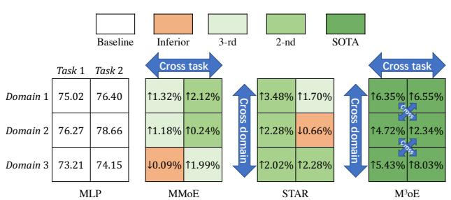
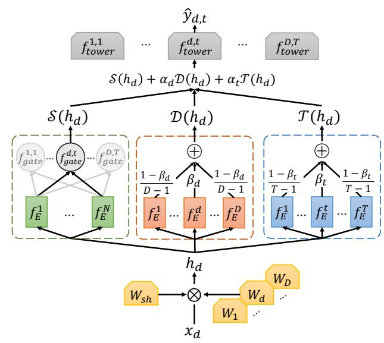

# 1 INTRODUCTION

With the rapid growth of web services and user-generated data, recommendation services have devoted increasing attention to a more precise understanding of user preferences and content recommendation [\[7,](#page-9-1) [8,](#page-9-2) [23,](#page-9-3) [28\]](#page-9-4). As a result of this trend, the research on the

Permission to make digital or hard copies of all or part of this work for personal or classroom use is granted without fee provided that copies are not made or distributed for profit or commercial advantage and that copies bear this notice and the full citation on the first page. Copyrights for components of this work owned by others than the author(s) must be honored. Abstracting with credit is permitted. To copy otherwise, or republish, to post on servers or to redistribute to lists, requires prior specific permission and/or a fee. Request permissions from permissions@acm.org.

SIGIR'24, July 14–18, 2024, Washington, WDC

adaptability is further enhanced by applying AutoML technique, which allows dynamic structure optimization. To the best of the authors' knowledge, our M3oE is the first effort to solve multi-domain multi-task recommendation self-adaptively. Extensive experiments on two benchmark datasets against diverse baselines demonstrate M3oE's superior performance. The implementation code is available to ensure reproducibility[1](#page-0-0) .

∗Zijian Zhang is also with the Key Laboratory of Symbolic Computation and Knowledge Engineering of Ministry of Education, Jilin University.

†This work is done during Zijian's internship at Kuaishou Technology.

‡Corresponding authors.

© 2024 Copyright held by the owner/author(s). Publication rights licensed to ACM. ACM ISBN 979-8-4007-0431-4/24/07

<https://doi.org/10.1145/3626772.3657686>

1<https://github.com/Applied-Machine-Learning-Lab/M3oE>

recommender system has gradually moved towards increasingly complex but more practical scenarios like multi-domain [\[5,](#page-9-5) [9,](#page-9-6) [14–](#page-9-7) [16,](#page-9-8) [25\]](#page-9-9) and multi-task [\[1,](#page-9-10) [20,](#page-9-11) [21,](#page-9-12) [26\]](#page-9-13) problems. The multi-domain recommendation problem assumes that users may exhibit similar tastes and behaviors across domains or platforms, indicating the feasibility of auxiliary information transfer [\[37\]](#page-9-14). For example, a user Mike watched Sci-Fi movies on TV, and is now browsing movies on the tablet. Then knowing Mike's movie-watching history on TV would help figure out the preferences of Sci-Fi, and benefit the recommendation on the tablet domain. The same effects also exist in reverse. In the multi-task scenario, users may interact or consume each recommended item in various ways, which brings multiple perspectives to describe a user's preference [\[22\]](#page-9-15). For instance, in a video-sharing platform, users can watch, like, and save videos. In reality, different signals may not always be positively related, e.g., a user watched a video does not necessarily mean that the user likes or will save the video. A more considerate recommender should be able to model and employ these complicated relations between tasks during inference.

In this context, recommender system designs have recently witnessed significant progress in both scenarios. On one hand, the key question in the multi-domain recommendation scenario is how to accurately extract relevant information and efficiently transfer between different domains. For example, DDTCDR [\[14\]](#page-9-7) designs a latent orthogonal mapping to transfer embedding between two domains. STAR [\[25\]](#page-9-9) leverages factorized domain-shared and domainspecific adaptive networks with a star topology to address the domain characteristics and their commonalities. By introducing relevant knowledge from different domains, Multi-Domain Recommendation (MDR) can leverage the beneficial insights to enhance the user personalization modeling in each domain [\[17,](#page-9-16) [27,](#page-9-17) [30,](#page-9-18) [32,](#page-9-19) [36\]](#page-9-20). On the other hand, the multi-task recommendation scenario set up learning tasks for each of the feedback signals (e.g., click-through rate prediction, like rate prediction, and save rate prediction), and the key challenge is how to balance different tasks and collaboratively improve the overall performance. For example, Shared Bottom [\[1\]](#page-9-10) utilizes a shared bottom layer to extract cross-task information. MMoE [\[21\]](#page-9-12) designs common expert networks and task-specific towers for multi-task modeling. By learning user engagement from diverse aspects, Multi-Task Recommendation (MTR) can exploit the shared information between tasks and benefit from a more comprehensive understanding of user behavior [\[12,](#page-9-21) [21,](#page-9-12) [22\]](#page-9-15). Though the tasks may also negatively influence each other like the seesaw phenomenon [\[26,](#page-9-13) [35\]](#page-9-22) and so do the domains [\[2,](#page-9-23) [25\]](#page-9-9), in general, collaborate multiple learning tasks or incorporating information from multiple domains provides a more complete view of user-item interactions and helps improves the generality of recommendation.

Despite the progress of existing MDR and MTR methods, the actual recommendation environment nowadays is usually multidomain and multi-task at the same time [\[38\]](#page-9-24). This involves domaintask interplay that brings new challenges for information transfer and objective balancing. However, limited work except [\[38\]](#page-9-24) explored the combination between MDR and MTR and there is still a gap before reaching a comprehensive Multi-Domain Multi-Task (MDMT) solution. In our empirical study, we observe that merely including an MDR or MTR solution only achieves sub-optimal or imbalanced performance. As an intuitive illustration of this phe-

Figure 1: Multi-domain multi-task AUC comparisons on MovieLens. We report the relative improvement of MMoE, STAR, and our M3oE, compared with single-domain singletask MLP baseline. The different colors indicate different performance ranks in the same domain and task.

nomenon, Figure [1](#page-1-0) shows the ranking performance (i.e., AUC) of representative methods of different types of existing solutions: MLP as single-domain single-task solution, MMoE [\[21\]](#page-9-12) as MTR solution for each domain, and STAR [\[25\]](#page-9-9) as MDR solution for each task. Though MMoE and STAR improve the overall performance over the single-domain single-task baseline, they may get worse in some special cases, as indicated by orange grids. Besides, neither MMoE nor STAR is consistently better than the other for any single domaintask pair, indicating their sub-optimality in all domains and tasks. In general, we find it really hard for an MDR or MTR solution to generalize well in the MDMT setting.

In analogy to the domain seesaw [\[2,](#page-9-23) [25\]](#page-9-9) and task seesaw [\[26,](#page-9-13) [35\]](#page-9-22) phenomena, we address this new challenge as MDMT seesaw and further describe it in two aspects:

- The same multi-domain information transfer method may not generalize to different tasks; and
- The same multi-task optimization balancing strategy may not generalize to different domains.

Again, using the video-sharing platform as an example: the domain seesaw addresses how to transfer a user' preferences from TV to tablet domain, and the task seesaw addresses how to balance user's behavior of watching and liking. In contrast, the MDMT seesaw addresses problems like how to transfer a user's preference of watching on TV to augment user's preference of liking on tablet. We argue that the key to this problem lies in how well we generalize the multi-domain multi-task knowledge transfer and integration mechanism, which has been long neglected in existing works.

In this paper, we propose a novel framework M3oE to jointly model multi-domain information extraction and multi-task inferences as a solution to the aforementioned MDMT seesaw challenge. Specifically, it consists of a domain representation extraction layer that implements feature-level multi-domain knowledge transfer, a sophisticated multi-view expert learning layer that extracts and integrates information for specific domains and tasks, and an MDMT objective prediction layer that generates the separate output for each domain-task pair. To better extract transferable information across domains for all tasks, we employ three essential types of experts in the middle expert learning layer to leverage shared common interests, domain-aspect user preferences, and task-aspect user preferences, respectively. As we will discuss in Figure [3,](#page-7-0) this disentangled design helps capture different views of the input. With this multi-view knowledge extracted, we use a flexible two-level

fusion module to control the information aggregation for each domain and task: while the first level controls the integration between domains and between tasks, the second level controls the integration between shared experts, domain experts, and task experts. Furthermore, to pursue the generality for different datasets and recommendation environments, we leverage AutoML to optimize the fusion weights adaptively. Empirically, our proposed M³oE can effectively engage cross-domain cross-task knowledge transfer and integration. As the illustrative example in Figure 1, M³oE (rightmost) achieves consistent improvement over separate MLP, multi-domain, and multi-task baselines. We summarize our main contributions as follows:

- We identify the MDMT seesaw problem in a practical recommendation environment and point out the insufficient generality of sole multi-domain or multi-task solutions.
- To the best of our knowledge, our proposed framework M3oE\nis the first general framework to solve MDMT recommendation
  self-adaptively.
- Extensive experiments on two benchmark datasets demonstrate the superior performance of M³oE against state-of-the-art and indepth analysis support its efficacy on knowledge disentanglement and integration.

#### 2 METHODOLOGY

#### 2.1 Problem Definition

Multi-Domain Multi-Task Recommendation. Let  $\mathcal U$  and Irepresent the user set and item set. And the MDMT recommendation problem aims to find a solution that simultaneously optimizes T recommendation tasks on D domains. We assume that all users, items, and tasks may overlap across domains, but each sample is observed in a certain domain (e.g., a user interacts with an item either on TV or tablet, not both). As a result, for a sample in domain  $d \in \{1, ..., D\}$ , we define a comprehensive feature input  $x_d$  that consists of user, item, and context information. Similarly, each sample also observes target labels in T tasks under domain d and there is no label in other domains. In our setting, we consider X-through rate prediction task (e.g., click-through rate) for all tasks and each target label is a binary signal in 1,0 that defines whether the user provides positive feedback (e.g., a click) or not. Then, our research goal is to learn a X-through rate prediction function  $\hat{y}_{d,t} = f^{d,t}(x_d)$ for each task  $t \in \{1, ..., T\}$  and domain  $d \in \{1, ..., D\}$ .

#### 2.2 Framework Overview

As illustrated in Figure 2, we construct a general multi-domain multi-task framework, consisting of the domain representation extraction layer, multi-view expert learning layer, and MDMT objective prediction layer, from bottom to top. In the multi-view expert learning layer, we design the shared expert module, domain expert module, and task expert module, to address the common information learning, domain-aspect user preferences, and task-aspect user preferences, respectively. To achieve the model adaptivity, we assign a two-level fusion mechanism with automatically updated fusion weights. After attaining the comprehensive representation, we infer the user preference for each objective individually. The flexible model architecture and automatic fusion-weights optimization

Figure 2: Framework of  $M^3$  oE, focusing on domain d and task t for clarity. Within the multi-view layer, there are three modules arranged from left to right: shared expert module S, domain expert module D, and task expert module T.

of our  ${\rm M}^3{\rm oE}$  enable it to seamlessly adapt to various multi-domain and multi-task settings.

#### 2.3 Domain Representation Extraction Layer

To unify the multi-domain representation and enhance the knowledge transfer, we introduce a domain-specific and common information integration structure for the input features. Specifically, we incorporate fully connected layers to align attribute semantics and learn the representation of multiple domains [25]. In this approach, we assign a domain-specific weight matrix  $\mathbf{W}_d$  to handle domain-specific characteristics and utilize a shared weight matrix  $\mathbf{W}_{sh}$  that processes data from all domains to capture shared patterns. To effectively combine the shared and domain-specific pattern, we perform an element-wise multiplication  $\widehat{\mathbf{W}}_d = \mathbf{W}_d \otimes \mathbf{W}_{sh}$ , followed by the input vector processing. The domain representation extraction operation  $f_{DR}$  on domain data  $\mathbf{x}_d$  can be formulated as follows,

$$f_{\rm DR}(\mathbf{x}_d) = \widehat{\mathbf{W}}_d \mathbf{x}_d + \mathbf{b}_d + \mathbf{b}_{\rm sh} \tag{1}$$

where  $b_d$  and  $b_{sh}$  are the domain-specific and common bias.

After capturing domain common and distinct information, we perform a linear operation parameterized by a weight matrix  $W_c$  and a bias  $b_c$  to map the representation of different domains into the same embedding space. To mitigate the introduction of noisy information from other domains and regulate the unified representation space, we also include a multi-layer neural network  $f_{\rm DA}$  that engages domain-agnostic mapping. Then, given the sample input  $x_d$  of domain d, we extract its domain representation  $h_d$  as follows,

$$\boldsymbol{h}_d = \boldsymbol{W}_c f_{\mathrm{DR}}(\boldsymbol{x}_d) + \boldsymbol{b}_c + f_{\mathrm{DA}}(\boldsymbol{x}_d)$$
 (2)

Note that  $W_{\rm sh}$ ,  $W_c$ , and  $f_{\rm DA}$  learn the patterns from all domains. This would help generate basic features in a unified representation space for later information extraction modules.

