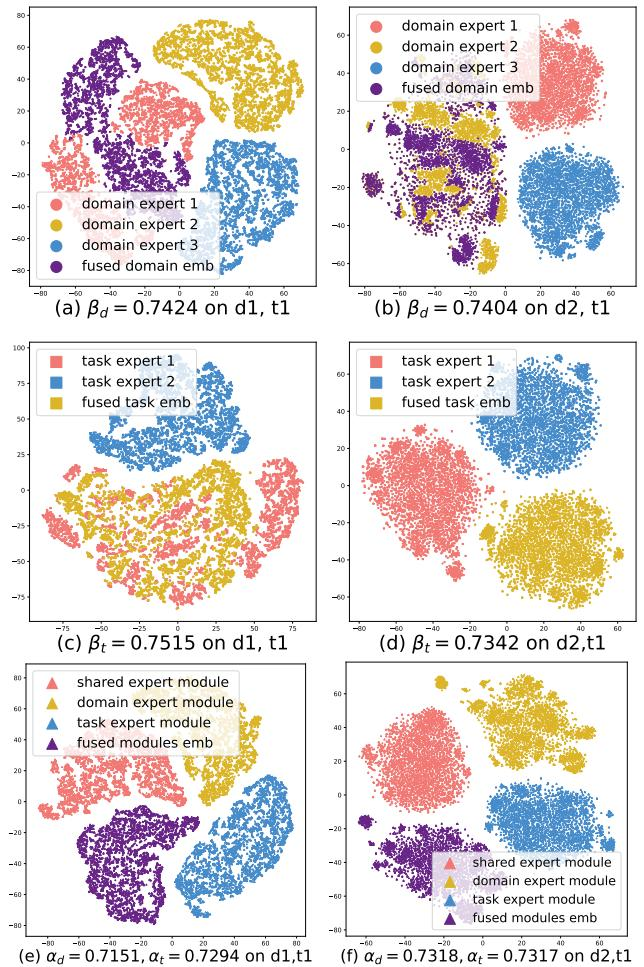

# 3.5 Visualization

To provide an overview of the effectiveness of M3oE in multidomain multi-task learning, we visualize the disentangled embeddings and fused embeddings. Figure [3](#page-7-0) (a) and (b) show the embeddings learned by the domain expert module on MovieLens and KuaiRand-Pure, respectively, so do (c) and (d) by the task expert module and (e) and (f) by the multi-view expert learning layer. Both domain expert modules yield fused domain embeddings with a similar distribution with domain embedding (domain 1 in (a) and domain 2 in (b)), which means the domain-specific expert plays the dominant role in the knowledge fusion. In terms of the task expert module, domain 2 of KuaiRand-Pure attains fused embedding with

Figure 3: T-SNE results on MovieLens domain 1 task 1 (left column) and KuaiRand-Pure domain 2 task 1 (right column).

Table 3: Components analysis with averaged AUC on all domains and tasks. Results are the average of 5 individual runs.

| Dataset                | MovieLens | KuaiRand-Pure |
|------------------------|-----------|---------------|
| w/o AutoML             | 76.37     | 65.41         |
| Concat modules         | 76.89     | 66.08         |
| Fully gated modules    | 76.92     | 65.87         |
| w/o domain module      | 76.89     | 65.86         |
| w/o task module        | 76.85     | 65.92         |
| w/o domain&task module | 76.80     | 65.80         |
| M 3 oE      | 77.02     | 66.37         |

optimal  $\beta_t$  independent of its components. This indicates different task experts hold different views on the same domain embedding, and the model attains a balanced distribution among multiple experts, which accords with our expectations. Similar phenomena occur on the fused modules embedding of both datasets, where none of the module outputs can replace the fused embedding.

