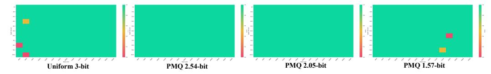

# 5 CONCLUSION

MoE represents a promising framework of sparse models for natural language understanding through scaling up the model capacity. However, the memory demands and redundancy among experts pose significant challenges for their practical implementation. In this work, we propose MC, a mixture compression strategy based on the imbalance of significance among experts. This method co-designs the *Pre-Loading Mixed-Precision Quantization (PMQ)* and *Online Dynamic Pruning (ODP)* approach, allowing MoE models to be compressed to an ultra-low bit-width while maintaining exceptional memory and parameter efficiency, as well as knowledgeable performance. And our mixed-precision strategy is orthogonal to various quantization techniques. Comprehensive experiments validate the effectiveness of our mixture compression, revealing that highly compressed MoE-LLMs can even outperform equal-size full-precision dense LLMs, thereby improving the feasibility of MoE compression. Future work will focus on adapting this strategy for multimodal applications and optimizing it for specific hardware platforms.

### ACKNOWLEDGMENTS

This work has been supported in part by Hong Kong Research Grant Council - Early Career Scheme (Grant No. 27209621), General Research Fund Scheme (Grant No. 17202422, 17212923), Themebased Research (Grant No. T45-701/22-R), the Innovation and Technology Fund (Mainland-Hong Kong Joint Funding Scheme, MHP/053/21), and the Shenzhen-Hong Kong-Macau Technology Research Program (SGDX20210823103537034). This research is also supported in part by National Key R&D Program of China (2022ZD0115502), National Natural Science Foundation of China (NO. 62461160308, U23B2010), "Pioneer" and "Leading Goose" R&D Program of Zhejiang (No. 2024C01161).

### REFERENCES

- Hicham Badri and Appu Shaji. Towards 1-bit machine learning models, March 2024. URL [https:](https://mobiusml.github.io/1bit_blog/) [//mobiusml.github.io/1bit\\_blog/](https://mobiusml.github.io/1bit_blog/).
- Yushi Bai, Xin Lv, Jiajie Zhang, Hongchang Lyu, Jiankai Tang, Zhidian Huang, Zhengxiao Du, Xiao Liu, Aohan Zeng, Lei Hou, et al. Longbench: A bilingual, multitask benchmark for long context understanding. *arXiv preprint arXiv:2308.14508*, 2023.
- Tom B Brown. Language models are few-shot learners. *arXiv preprint arXiv:2005.14165*, 2020.
- Yupeng Chang, Xu Wang, Jindong Wang, Yuan Wu, Linyi Yang, Kaijie Zhu, Hao Chen, Xiaoyuan Yi, Cunxiang Wang, Yidong Wang, et al. A survey on evaluation of large language models. *ACM Transactions on Intelligent Systems and Technology*, 15(3):1–45, 2024.
- Mark Chen, Jerry Tworek, Heewoo Jun, Qiming Yuan, Henrique Ponde De Oliveira Pinto, Jared Kaplan, Harri Edwards, Yuri Burda, Nicholas Joseph, Greg Brockman, et al. Evaluating large language models trained on code. *arXiv preprint arXiv:2107.03374*, 2021.
- Mengzhao Chen, Wenqi Shao, Peng Xu, Jiahao Wang, Peng Gao, Kaipeng Zhang, Yu Qiao, and Ping Luo. Efficientqat: Efficient quantization-aware training for large language models. *arXiv preprint arXiv:2407.11062*, 2024.
- Zewen Chi, Li Dong, Shaohan Huang, Damai Dai, Shuming Ma, Barun Patra, Saksham Singhal, Payal Bajaj, Xia Song, Xian-Ling Mao, et al. On the representation collapse of sparse mixture of experts. *Advances in Neural Information Processing Systems*, 35:34600–34613, 2022.
- Karl Cobbe, Vineet Kosaraju, Mohammad Bavarian, Mark Chen, Heewoo Jun, Lukasz Kaiser, Matthias Plappert, Jerry Tworek, Jacob Hilton, Reiichiro Nakano, et al. Training verifiers to solve math word problems. *arXiv preprint arXiv:2110.14168*, 2021.
- Damai Dai, Chengqi Deng, Chenggang Zhao, RX Xu, Huazuo Gao, Deli Chen, Jiashi Li, Wangding Zeng, Xingkai Yu, Y Wu, et al. Deepseekmoe: Towards ultimate expert specialization in mixtureof-experts language models. *arXiv preprint arXiv:2401.06066*, 2024.
- Tim Dettmers, Mike Lewis, Younes Belkada, and Luke Zettlemoyer. Gpt3. int8 (): 8-bit matrix multiplication for transformers at scale. *NeurIPS*, 35:30318–30332, 2022.
- Tim Dettmers, Ruslan Svirschevski, Vage Egiazarian, Denis Kuznedelev, Elias Frantar, Saleh Ashkboos, Alexander Borzunov, Torsten Hoefler, and Dan Alistarh. Spqr: A sparse-quantized representation for near-lossless llm weight compression. *arXiv preprint arXiv:2306.03078*, 2023.
- Zhen Dong, Zhewei Yao, Daiyaan Arfeen, Amir Gholami, Michael W Mahoney, and Kurt Keutzer. Hawq-v2: Hessian aware trace-weighted quantization of neural networks. *NeurIPS*, 33:18518– 18529, 2020.
- Vage Egiazarian, Andrei Panferov, Denis Kuznedelev, Elias Frantar, Artem Babenko, and Dan Alistarh. Extreme compression of large language models via additive quantization. *arXiv preprint arXiv:2401.06118*, 2024.
- Elias Frantar and Dan Alistarh. Sparsegpt: Massive language models can be accurately pruned in one-shot. In *International Conference on Machine Learning*, pp. 10323–10337. PMLR, 2023.

- Elias Frantar, Saleh Ashkboos, Torsten Hoefler, and Dan Alistarh. Gptq: Accurate post-training quantization for generative pre-trained transformers. *arXiv preprint arXiv:2210.17323*, 2022.
- Trevor Gale, Deepak Narayanan, Cliff Young, and Matei Zaharia. Megablocks: Efficient sparse training with mixture-of-experts. *Proceedings of Machine Learning and Systems*, 5:288–304, 2023.
- L Gao, J Tow, B Abbasi, S Biderman, S Black, A DiPofi, C Foster, L Golding, J Hsu, A Le Noac'h, et al. A framework for few-shot language model evaluation. *URL https://zenodo. org/records/10256836*, 7, 2013.
- Daya Guo, Dejian Yang, Haowei Zhang, Junxiao Song, Ruoyu Zhang, Runxin Xu, Qihao Zhu, Shirong Ma, Peiyi Wang, Xiao Bi, et al. Deepseek-r1: Incentivizing reasoning capability in llms via reinforcement learning. *arXiv preprint arXiv:2501.12948*, 2025.
- Han Guo, Philip Greengard, Eric P Xing, and Yoon Kim. Lq-lora: Low-rank plus quantized matrix decomposition for efficient language model finetuning. *arXiv preprint arXiv:2311.12023*, 2023.
- Zhiyu Guo, Hidetaka Kamigaito, and Taro Watanabe. Attention score is not all you need for token importance indicator in kv cache reduction: Value also matters. *arXiv preprint arXiv:2406.12335*, 2024.
- Yihui He, Xiangyu Zhang, and Jian Sun. Channel pruning for accelerating very deep neural networks. In *Proceedings of the IEEE international conference on computer vision*, pp. 1389–1397, 2017.
- Dan Hendrycks, Collin Burns, Saurav Kadavath, Akul Arora, Steven Basart, Eric Tang, Dawn Song, and Jacob Steinhardt. Measuring mathematical problem solving with the math dataset. *arXiv preprint arXiv:2103.03874*, 2021.
- Haiyang Huang, Newsha Ardalani, Anna Sun, Liu Ke, Hsien-Hsin S Lee, Anjali Sridhar, Shruti Bhosale, Carole-Jean Wu, and Benjamin Lee. Towards moe deployment: Mitigating inefficiencies in mixture-of-expert (moe) inference. *arXiv preprint arXiv:2303.06182*, 2023.
- Wei Huang, Yangdong Liu, Haotong Qin, Ying Li, Shiming Zhang, Xianglong Liu, Michele Magno, and Xiaojuan Qi. Billm: Pushing the limit of post-training quantization for llms. *arXiv preprint arXiv:2402.04291*, 2024a.
- Wei Huang, Xudong Ma, Haotong Qin, Xingyu Zheng, Chengtao Lv, Hong Chen, Jie Luo, Xiaojuan Qi, Xianglong Liu, and Michele Magno. How good are low-bit quantized llama3 models? an empirical study. *arXiv preprint arXiv:2404.14047*, 2024b.
- Wei Huang, Haotong Qin, Yangdong Liu, Yawei Li, Xianglong Liu, Luca Benini, Michele Magno, and Xiaojuan Qi. Slim-llm: Salience-driven mixed-precision quantization for large language models. *arXiv preprint arXiv:2405.14917*, 2024c.
- Itay Hubara, Brian Chmiel, Moshe Island, Ron Banner, Joseph Naor, and Daniel Soudry. Accelerated sparse neural training: A provable and efficient method to find n: m transposable masks. *NeurIPS*, 34:21099–21111, 2021.
- Albert Q Jiang, Alexandre Sablayrolles, Antoine Roux, Arthur Mensch, Blanche Savary, Chris Bamford, Devendra Singh Chaplot, Diego de las Casas, Emma Bou Hanna, Florian Bressand, et al. Mixtral of experts. *arXiv preprint arXiv:2401.04088*, 2024.
- Renren Jin, Jiangcun Du, Wuwei Huang, Wei Liu, Jian Luan, Bin Wang, and Deyi Xiong. A comprehensive evaluation of quantization strategies for large language models. *arXiv preprint arXiv:2402.16775*, 2024.
- Young Jin Kim, Ammar Ahmad Awan, Alexandre Muzio, Andres Felipe Cruz Salinas, Liyang Lu, Amr Hendy, Samyam Rajbhandari, Yuxiong He, and Hany Hassan Awadalla. Scalable and efficient moe training for multitask multilingual models. *arXiv preprint arXiv:2109.10465*, 2021.
- Yeskendir Koishekenov, Alexandre Berard, and Vassilina Nikoulina. Memory-efficient nllb-200: Language-specific expert pruning of a massively multilingual machine translation model. *arXiv preprint arXiv:2212.09811*, 2022.

- Woosuk Kwon, Sehoon Kim, Michael W Mahoney, Joseph Hassoun, Kurt Keutzer, and Amir Gholami. A fast post-training pruning framework for transformers. *NeurIPS*, 35:24101–24116, 2022.
- Pingzhi Li, Xiaolong Jin, Yu Cheng, and Tianlong Chen. Examining post-training quantization for mixture-of-experts: A benchmark. *arXiv preprint arXiv:2406.08155*, 2024.
- Baohao Liao and Christof Monz. Apiq: Finetuning of 2-bit quantized large language model. *arXiv preprint arXiv:2402.05147*, 2024.
- Ji Lin, Jiaming Tang, Haotian Tang, Shang Yang, Wei-Ming Chen, Wei-Chen Wang, Guangxuan Xiao, Xingyu Dang, Chuang Gan, and Song Han. Awq: Activation-aware weight quantization for on-device llm compression and acceleration. *Proceedings of Machine Learning and Systems*, 6: 87–100, 2024.
- Enshu Liu, Junyi Zhu, Zinan Lin, Xuefei Ning, Matthew B Blaschko, Shengen Yan, Guohao Dai, Huazhong Yang, and Yu Wang. Efficient expert pruning for sparse mixture-of-experts language models: Enhancing performance and reducing inference costs. *arXiv preprint arXiv:2407.00945*, 2024.
- Peiyu Liu, Zikang Liu, Ze-Feng Gao, Dawei Gao, Wayne Xin Zhao, Yaliang Li, Bolin Ding, and Ji-Rong Wen. Do emergent abilities exist in quantized large language models: An empirical study. *arXiv preprint arXiv:2307.08072*, 2023a.
- Zechun Liu, Barlas Oguz, Changsheng Zhao, Ernie Chang, Pierre Stock, Yashar Mehdad, Yangyang Shi, Raghuraman Krishnamoorthi, and Vikas Chandra. Llm-qat: Data-free quantization aware training for large language models. *arXiv preprint arXiv:2305.17888*, 2023b.
- Xudong Lu, Qi Liu, Yuhui Xu, Aojun Zhou, Siyuan Huang, Bo Zhang, Junchi Yan, and Hongsheng Li. Not all experts are equal: Efficient expert pruning and skipping for mixture-of-experts large language models. *arXiv preprint arXiv:2402.14800*, 2024.
- Niklas Muennighoff, Luca Soldaini, Dirk Groeneveld, Kyle Lo, Jacob Morrison, Sewon Min, Weijia Shi, Pete Walsh, Oyvind Tafjord, Nathan Lambert, et al. Olmoe: Open mixture-of-experts language models. *arXiv preprint arXiv:2409.02060*, 2024.
- Aniruddha Nrusimha, Mayank Mishra, Naigang Wang, Dan Alistarh, Rameswar Panda, and Yoon Kim. Mitigating the impact of outlier channels for language model quantization with activation regularization. *arXiv preprint arXiv:2404.03605*, 2024.
- Colin Raffel, Noam Shazeer, Adam Roberts, Katherine Lee, Sharan Narang, Michael Matena, Yanqi Zhou, Wei Li, and Peter J Liu. Exploring the limits of transfer learning with a unified text-to-text transformer. *Journal of machine learning research*, 21(140):1–67, 2020.
- Mohammad Rastegari, Vicente Ordonez, Joseph Redmon, and Ali Farhadi. Xnor-net: Imagenet classification using binary convolutional neural networks. In *European conference on computer vision*, pp. 525–542. Springer, 2016.
- Yuzhang Shang, Zhihang Yuan, Qiang Wu, and Zhen Dong. Pb-llm: Partially binarized large language models. *arXiv preprint arXiv:2310.00034*, 2023.
- Wenqi Shao, Mengzhao Chen, Zhaoyang Zhang, Peng Xu, Lirui Zhao, Zhiqian Li, Kaipeng Zhang, Peng Gao, Yu Qiao, and Ping Luo. Omniquant: Omnidirectionally calibrated quantization for large language models. *arXiv preprint arXiv:2308.13137*, 2023.
- Noam Shazeer, Azalia Mirhoseini, Krzysztof Maziarz, Andy Davis, Quoc Le, Geoffrey Hinton, and Jeff Dean. Outrageously large neural networks: The sparsely-gated mixture-of-experts layer. *arXiv preprint arXiv:1701.06538*, 2017.
- Mingjie Sun, Zhuang Liu, Anna Bair, and J Zico Kolter. A simple and effective pruning approach for large language models. *arXiv preprint arXiv:2306.11695*, 2023.
- Albert Tseng, Jerry Chee, Qingyao Sun, Volodymyr Kuleshov, and Christopher De Sa. Quip#: Even better llm quantization with hadamard incoherence and lattice codebooks. *arXiv preprint arXiv:2402.04396*, 2024.

- Guangxuan Xiao, Ji Lin, Mickael Seznec, Hao Wu, Julien Demouth, and Song Han. Smoothquant: Accurate and efficient post-training quantization for large language models. In *International Conference on Machine Learning*, pp. 38087–38099. PMLR, 2023.
- Longfei Yun, Yonghao Zhuang, Yao Fu, Eric P Xing, and Hao Zhang. Toward inference-optimal mixture-of-expert large language models. *arXiv preprint arXiv:2404.02852*, 2024.
- Zhenyu Zhang, Ying Sheng, Tianyi Zhou, Tianlong Chen, Lianmin Zheng, Ruisi Cai, Zhao Song, Yuandong Tian, Christopher Re, Clark Barrett, et al. H2o: Heavy-hitter oracle for efficient ´ generative inference of large language models. *Advances in Neural Information Processing Systems*, 36:34661–34710, 2023.
- Zhenyu Zhang, Ying Sheng, Tianyi Zhou, Tianlong Chen, Lianmin Zheng, Ruisi Cai, Zhao Song, Yuandong Tian, Christopher Re, Clark Barrett, et al. H2o: Heavy-hitter oracle for efficient ´ generative inference of large language models. *NeurIPS*, 36, 2024.
- Wayne Xin Zhao, Kun Zhou, Junyi Li, Tianyi Tang, Xiaolei Wang, Yupeng Hou, Yingqian Min, Beichen Zhang, Junjie Zhang, Zican Dong, et al. A survey of large language models. *arXiv preprint arXiv:2303.18223*, 2023.
- Zixuan Zhou, Xuefei Ning, Ke Hong, Tianyu Fu, Jiaming Xu, Shiyao Li, Yuming Lou, Luning Wang, Zhihang Yuan, Xiuhong Li, et al. A survey on efficient inference for large language models. *arXiv preprint arXiv:2404.14294*, 2024.
- Xunyu Zhu, Jian Li, Yong Liu, Can Ma, and Weiping Wang. A survey on model compression for large language models. *arXiv preprint arXiv:2308.07633*, 2023.

### A APPENDIX

### A.1 MORE QUANTIZED RESULTS OF PMQ

This section expands on the comparative results of the Hessian and *PMQ* mixed precision metrics across different bit-width settings. Tab. [5](#page-14-2) serves as an extension of Tab. [2,](#page-7-3) specifically providing a detailed comparison of the evaluation results across eight zero-shot datasets using the Hessian metric employed by HAWQ V2 [\(Dong et al.,](#page-10-7) [2020\)](#page-10-7) in the 1.57 to 2.54-bit range. Within the target bit-width interval, *PMQ* outperforms Hessian in all ranges, achieving better bit-width allocation results by 0.3% to 8.6%. Notably, at the ultra-low bit-width of 1.57-bit, *PMQ* achieves a comprehensive score of 54.49%, while Hessian reaches only 45.91%.

Table 5: Performance of quantized Mixtral 8 × 7b on eight zero-shot benchmarks. "HellaS." is the short format of "HellaSwag" and "Wino." denotes "Winogrande".

| Method  | Bits  | PIQA  | ARC-e | ARC-c | BoolQ | HellaS. | Wino. | MathQA | MMLU  | Avg.% ↑ |
|---------|-------|-------|-------|-------|-------|---------|-------|--------|-------|---------|
|         | 16.00 | 85.20 | 84.01 | 57.17 | 85.35 | 81.48   | 75.93 | 39.29  | 67.88 | 71.29   |
|         | 2.54  | 80.21 | 76.38 | 51.20 | 81.11 | 78.05   | 72.97 | 35.27  | 56.21 | 67.18   |
|         | 2.42  | 78.81 | 73.97 | 47.58 | 81.04 | 77.72   | 72.77 | 33.01  | 52.16 | 64.23   |
|         | 2.30  | 79.21 | 72.41 | 46.70 | 79.15 | 76.38   | 71.25 | 31.97  | 50.60 | 63.47   |
|         | 2.20  | 78.46 | 72.98 | 46.66 | 77.29 | 75.31   | 70.22 | 31.84  | 45.29 | 62.25   |
| Hessian | 2.05  | 75.32 | 67.26 | 45.01 | 70.29 | 71.90   | 69.11 | 31.07  | 40.85 | 58.85   |
|         | 1.94  | 75.41 | 64.02 | 43.19 | 67.75 | 69.18   | 68.27 | 28.58  | 36.99 | 56.67   |
|         | 1.81  | 71.96 | 60.81 | 37.72 | 68.27 | 63.29   | 65.46 | 26.27  | 32.58 | 53.30   |
|         | 1.69  | 69.88 | 60.37 | 35.64 | 70.06 | 59.60   | 58.43 | 26.05  | 32.11 | 51.39   |
|         | 1.57  | 65.26 | 52.12 | 21.84 | 68.21 | 52.91   | 50.32 | 24.99  | 31.58 | 45.91   |
|         | 2.54  | 80.52 | 77.10 | 51.28 | 82.54 | 79.03   | 73.95 | 39.18  | 56.37 | 67.50   |
|         | 2.42  | 80.36 | 75.76 | 50.17 | 80.00 | 78.13   | 73.09 | 34.97  | 53.22 | 65.71   |
|         | 2.30  | 83.11 | 73.59 | 47.78 | 80.83 | 76.48   | 73.14 | 33.84  | 52.54 | 64.91   |
|         | 2.20  | 79.05 | 73.70 | 47.87 | 74.56 | 76.63   | 72.77 | 34.24  | 47.73 | 63.29   |
| PMQ     | 2.05  | 79.16 | 73.06 | 48.38 | 80.58 | 74.95   | 71.27 | 31.79  | 46.80 | 63.25   |
|         | 1.94  | 76.88 | 68.48 | 45.48 | 75.23 | 72.05   | 72.61 | 31.16  | 40.93 | 60.35   |
|         | 1.81  | 76.93 | 66.67 | 43.60 | 75.50 | 70.50   | 69.85 | 28.68  | 40.71 | 59.06   |
|         | 1.69  | 75.41 | 64.14 | 40.61 | 68.96 | 67.01   | 68.03 | 28.04  | 37.14 | 56.17   |
|         | 1.57  | 72.42 | 62.46 | 37.88 | 73.55 | 63.17   | 66.38 | 26.80  | 32.25 | 54.49   |

Additionally, in Tab. [6,](#page-15-1) we extend the comparison of Hessian and *PMQ*'s few-shot performance across different bit widths presented in Tab. [3.](#page-8-1) At 1.69-bit, *PMQ* achieves a score of 38.35% on the MMLU (five-shot) benchmark, while maintaining a model size that is 16% smaller than the 2-bit model under uniform quantization, with an accuracy improvement of 4.5%. More importantly, we observe that *PMQ* at 2.54-bit compresses the model size by 84% compared to the 16-bit model, yet the few-shot performance is only 9.4% lower, highlighting the substantial advantages of mixed compression for MoE models. In comparison to Hessian at the same bit-width, *PMQ* demonstrates great overall improved accuracy. BSP, on the other hand, exhibits poor performance in the few-shot evaluations, which is even lower than 2-bit uniform quantization. In Tab. [7,](#page-15-2) we also compare these precision allocating metrics on WikiText2 dataset; *PMQ* shows a clearer advantage, particularly at 1.57-bit, where it achieves a PPL of 8.50, representing a significant improvement over the 2-bit uniform quantization, while the Hessian at 1.57-bit achieves only 14.20.

### A.2 ONE-BIT WEIGHT SAVING AND DEQUANTIZATION

This paper presents MC, which explores static compression strategies and dynamic pruning method for MoE-LLMs in the ultra-low bit-width range, with selected static bit-width of 1-bit, 2-bit, and 3-bit. We observe that both 2-bit and 3-bit can be addressed using conventional linear quantizers, a method commonly utilized in most studies [\(Frantar et al.,](#page-11-3) [2022;](#page-11-3) [Shao et al.,](#page-12-4) [2023;](#page-12-4) [Huang et al.,](#page-11-5) [2024c;](#page-11-5) [Lin](#page-12-7) [et al.,](#page-12-7) [2024\)](#page-12-7). In contrast, the quantization of 1-bit weights involves totally different calculations; we first provide the binarization formula for the weights:

$$\mathbf{B} = \operatorname{sign}(\mathbf{W}) \tag{7}$$

Table 6: Comparison of different mixed-precision strategies on few-shot performance (MMLU five-shot  $\uparrow$ ) for Mixtral  $8 \times 7b$ .

Table 7: Comparison of different mixed-precision strategies on PPL performance (Wiki-Text2 PPL  $\downarrow$ ) for Mixtral  $8 \times 7b$ .

| Method  | Bits  | Accuracy % ↑                                        |
|---------|-------|-----------------------------------------------------|
|         | 16.00 | 70.60                                               |
| Uni     | 2.00  | $34.05_{28.4\% \downarrow}$                         |
| BSP     | 2.54  | $31.57_{30.9\% \perp}$                              |
|         | 2.54  | $58.22_{4.2\% \downarrow}$                          |
|         | 2.42  | $54.09_{8.3\% \downarrow}$                          |
|         | 2.30  | $51.37_{11.1\%\downarrow}$                          |
|         | 2.20  | $47.01_{15.4\% \downarrow}$                         |
| Hessian | 2.05  | $43.51_{18.9\%\downarrow}$                          |
|         | 1.94  | $38.62_{23.8\% \downarrow}$                         |
|         | 1.81  | $33.87_{28.9\% \downarrow}$                         |
|         | 1.69  | $33.04_{29.4\% \downarrow}$                         |
|         | 1.57  | $31.96_{30.49\%\downarrow}$                         |
|         | 2.54  | <b>61.19</b> 1.3%<math>\downarrow</math> |
|         | 2.42  | $58.30_{4.2\%}$                                     |
|         | 2.30  | <b>55.08</b> 7.4%↓                       |
|         | 2.20  | $50.70_{11.8\% \downarrow}$                         |
| PMQ     | 2.05  | <b>49.84</b> 12.6% $\downarrow$          |
|         | 1.94  | <b>45.98</b> 16.5%↓                      |
|         | 1.81  | <b>41.67</b> 20.8% $\downarrow$          |
|         | 1.69  | $38.35_{24.0\% \downarrow}$                         |
|         | 1.57  | $33.44_{29.0\% \downarrow}$                         |

| Method  | Bits  | $PPL \downarrow$ |
|---------|-------|------------------|
| -       | 16.00 | 3.84             |
| Uni     | 2.00  | 16.38            |
| BSP     | 2.54  | 13.61            |
|         | 2.54  | 5.41             |
|         | 2.42  | 5.81             |
|         | 2.30  | 5.86             |
|         | 2.20  | 6.58             |
| Hessian | 1.05  | 6.65             |
|         | 1.97  | 7.88             |
|         | 1.81  | 8.45             |
|         | 1.69  | 10.18            |
|         | 1.57  | 14.20            |
|         | 2.54  | 5.09             |
|         | 2.42  | 5.25             |
|         | 2.30  | 5.45             |
|         | 2.20  | 5.72             |
| PMQ     | 2.05  | 5.91             |
|         | 1.94  | 6.49             |
|         | 1.81  | 6.81             |
|         | 1.69  | 7.78             |
|         | 1.57  | 8.50             |
|         |       |                  |

$$sign(x) = \begin{cases} 1 & \text{if } x \ge 0, \\ -1 & \text{others.} \end{cases}$$
 (8)

where  $\mathbf{W} \in \mathbb{R}^{d \times m}$  is the full precision weight and  $\mathbf{B} \in \{-1, +1\}^{d \times m}$  denotes the binarized matrix. Due to the elements range of  $\mathbf{B}$  being  $\pm 1$ , we can not directly save the one-bit value into compact memory. Hence, we propose a simple transformation for  $\mathbf{B}$ :

$$\widetilde{\mathbf{B}} = \frac{\operatorname{sign}(\mathbf{W}) + 1}{2} \tag{9}$$

where  $\mathbf{B} \in \{0,1\}^{d \times m}$ . In this case, we can really use 1-bit memory to storage each element. During the inference stage, we need to dequantize the binary weight and operate the matrix multiplication of each input vector follows:

$$s \cdot \mathbf{xB} = s(\sum_{j:\widetilde{\mathbf{B}}_{ij}=1}^{d} \mathbf{x}_j - \sum_{j:\widetilde{\mathbf{B}}_{ij}=0}^{d} \mathbf{x}_j), \text{ for } i = 1, 2, ...m$$
(10)

where  $\mathbf{x} \in \mathbb{R}^{1 \times d}$  denotes one set of input vector (token), and s represents the scaling factor of each binary matrix, which is calculated from  $s = \frac{\|\mathbf{W}\|_{\ell_1}}{d \times m}$  (Rastegari et al., 2016). In this binarized weight format, we can achieve computation without minimal multiplication operation. As shown in Eq. (10), the original computation requires dm multiplications and (d-1)m additions, resulting in a MACs consumption of dm and a computational complexity of  $O(m^2)$ . In contrast, binary matrix operations require only m multiplications and (d-1)m additions, leading to a MACs consumption of just m and a computational complexity of O(m).

### A.3 RESULTS OF DIFFERENT QUANTIZATION TECHNIQUES

As detailed in Sec. 3.2 of the main text, PMQ focuses primarily on leveraging the significance differences between experts to construct an optimal mixed-precision bit-width allocation. After determining the optimal allocation, it can be combined with various quantization techniques. In this study, to efficiently validate the effect of mixed compression, we employ GPTQ (Frantar et al., 2022), an efficient training-free post-training quantization (PTQ) strategy, which completes mixed-precision quantization on the Mixtral  $8 \times 7b$  model in just 90 minutes.

Figure 9: Needle in a Haystack evaluation. Green squares indicates a high retrieval success rate, the Y-axis represents the distance to the retrieved target.

Table 8: Performance of quantized Mixtral 8 × 7b on eight zero-shot benchmarks on GPTQ [\(Frantar](#page-11-3) [et al.,](#page-11-3) [2022\)](#page-11-3) and Omniquant [\(Shao et al.,](#page-12-4) [2023\)](#page-12-4). w denotes "with".

| Method                 |       |       |       |       |       |       |       | Bits PIQA ARC-e ARC-c BoolQ HellaS. Wino. MathQA MMLU Avg.% ↑ |       |       |
|------------------------|-------|-------|-------|-------|-------|-------|-------|---------------------------------------------------------------|-------|-------|
|                        | 16.00 | 85.20 | 84.01 | 57.17 | 85.35 | 81.48 | 75.93 | 39.29                                                         | 67.88 | 71.29 |
| PMQ                    | 2.54  | 80.52 | 77.10 | 51.28 | 82.54 | 79.03 | 73.95 | 39.18                                                         | 56.37 | 67.50 |
| w GPTQ                 | 2.05  | 79.16 | 73.06 | 48.38 | 80.58 | 74.95 | 71.27 | 31.79                                                         | 46.80 | 63.25 |
| (Frantar et al., 2022) | 1.57  | 72.42 | 62.46 | 37.88 | 73.55 | 63.17 | 66.38 | 26.80                                                         | 32.25 | 54.49 |
| PMQ                    | 2.54  | 81.63 | 78.66 | 52.91 | 82.54 | 80.17 | 74.51 | 39.20                                                         | 59.83 | 68.80 |
| w Omniquant            | 2.05  | 79.77 | 74.24 | 48.65 | 81.09 | 75.76 | 72.48 | 33.01                                                         | 47.15 | 64.01 |
| (Shao et al., 2023)    | 1.57  | 73.33 | 65.28 | 38.54 | 74.06 | 66.61 | 66.59 | 26.74                                                         | 35.20 | 55.79 |

In this section, we replace GPTQ with another advanced quantization method, Omniquant [\(Shao et al.,](#page-12-4) [2023\)](#page-12-4), which uses a learnable weight clipping (LWC) for quantization calibration. For calibration, 256 sequences from the C4 dataset are selected for gradient optimization. Omniquant requires approximately 480 minutes to quantize the Mixtral 8 × 7b model (see Tab. [8\)](#page-16-0), but it outperforms GPTQ across eight zero-shot benchmarks, owing to its precise search for quantizer factors via LWC. This further demonstrates the flexibility of our *PMQ* framework.

### A.4 QUANTIZATION RESULTS ON CHALLENGING BENCHMARKS

In this section, we expand our mixed-precision benchmarks on more challenging datasets in Tab. [9,](#page-17-1) considering the importance of performance testing on more complex long text or reasoning tasks [\(Cobbe et al.,](#page-10-11) [2021;](#page-10-11) [Bai et al.,](#page-10-12) [2023;](#page-10-12) [Chen et al.,](#page-10-13) [2021\)](#page-10-13). We have observed that in challenging tasks like GSM8K, HumanEval, and long-context Needle-in-a-haystack, the performance drop of model compression becomes more pronounced. This phenomenon holds true in other MoE LLM compression methods [\(Frantar et al.,](#page-11-3) [2022;](#page-11-3) [Huang et al.,](#page-11-5) [2024c;](#page-11-5) [Shao et al.,](#page-12-4) [2023;](#page-12-4) [Lu et al.,](#page-12-2) [2024\)](#page-12-2) as well. However, our *PMQ* method, compared to the latest method like BSP [\(Li et al.,](#page-12-1) [2024\)](#page-12-1) and HAWQ [\(Dong et al.,](#page-10-7) [2020\)](#page-10-7) with Hessian-based approaches for MoE LLM, is still able to maintain state-of-the-art performance. Fig. [9](#page-16-1) shows the NIAH results in different sequences.

Recent studies on quantization performance losses [\(Jin et al.,](#page-11-16) [2024;](#page-11-16) [Liu et al.,](#page-12-16) [2023a\)](#page-12-16) were also explored, revealing that ARC-C and GSM8K primarily involves inference issues, categorized as chain-of-thought (CoT), while MMLU can be classified as in-context learning (ICL). CoT tasks, due to their intricate reasoning demands, pose significant challenges to various LLM types. Given that many open-source MoE LLMs and dense LLMs do not exhibit strong inference capabilities during pre-training, we anticipate larger performance losses when reducing model bit-width to ultra-low scenarios. The results in Tab. [2](#page-7-3) and Tab. [9](#page-17-1) also indicate that there is the huge potential for future exploration of MoE LLM compression on complex tasks.

### A.5 DETAILED RESULTS ON BIT-WIDTH ALLOCATION

In this section, we further visualize the different bit-width allocation results of *PMQ* on Mixtral 8 × 7b model, as shown in Fig. [10.](#page-20-0) The results clearly show that the importance of MoE expert varies with different position. It can be seen that at lower bits-width, our algorithm only selects a small part of the position for protection, which greatly improves calculation efficiency. With the increasing of the bit-width, the important positions from lower bit-width are leavening unchanged which further proves the effectiveness of the proposed method.

Table 9: Comparison of different mixed-precision quantization methods on challenging benchmarks. NIAH denotes the task in Needle-in-a-haystack, which is a more challenging task for evaluating long-context ability.

| Method  | Bits   | GSM8K↑ | HumanEval (pass@10)↑ | NIAH↑  |
|---------|--------|--------|----------------------|--------|
|         | 16.00  | 58.30  | 59.15                | 100.00 |
| Uniform | 3.00   | 38.13  | 29.88                | 98.48  |
| Uniform | 2.00   | 0.00   | 0.00                 | 0.00   |
| BSP     | 2.54   | 4.25   | 3.21                 | 42.21  |
| Hessian | 2.54   | 33.59  | 25.49                | 100.00 |
| Hessian | 2.05   | 17.24  | 7.84                 | 93.45  |
| PMQ     | 2.54   | 37.67  | 29.34                | 100.00 |
| PMQ+ODP | - 2.54 | 35.25  | 27.58                | 100.00 |
| PMQ     | - 2.05 | 19.97  | 11.83                | 100.00 |
| PMQ+ODP | 2.05   | 18.04  | 10.02                | 99.26  |

#### A.6 ABLATION ANALYSIS ON HYPER-PARAMETERS OF EXPERT SIGNIFICANCE WEIGHT

In this section, we conduct experiments based on different hyperparameter settings for the expert significance factor weights, *i.e.*,  $\alpha$  and  $\beta$  in Eq. 4. We evaluate these factors with values of 1, 1.5, and 2 to differentiate their relative significance on Mixtral  $8\times7B$  (2 bit). Since quantization error is a critical evaluation metric, we fix its weight  $\gamma$  at 2 and vary the weights of the expert significance factors accordingly. The experimental results, shown in Tab. 10, indicate that the overall accuracy remains stable, but exhibits a slight decline when the combined value of  $\alpha$  and  $\beta$  exceeds the quantization error weight.

Table 10: Ablation analysis on Mixtral 7×8B model, evaluating different settings for the weights of the two significance factors,  $\alpha$  and  $\beta$  (Eq. 4), with the quantization error weight fixed at 2, using the WikiText2 dataset.

| $\alpha = 1$ |      |      |      | $\alpha = 1.5$ | 5    | $\alpha = 2$ |      |      |      |
|--------------|------|------|------|----------------|------|--------------|------|------|------|
| $\beta$      | 1    | 1.5  | 2    | 1              | 1.5  | 2            | 1    | 1.5  | 2    |
| PPL          | 5.92 | 5.92 | 5.91 | 5.92           | 5.91 | 5.96         | 5.91 | 5.96 | 5.95 |

### A.7 COMPARISON OF DIFFERENT TOKEN-DEPENDENT PRUNING METRIC

Regarding the dynamic pruning of experts, we note that most existing pruning methods for LLMs or other neural networks focus on static weight pruning (Sun et al., 2023; Zhang et al., 2023), and cannot dynamically prune experts during inference based on tokens. Dynamic pruning during inference remains under-explored, with only one recent post-training MoE LLM dynamic pruning work (Lu et al., 2024) proposing a gating-score-based strategy for dynamic pruning. This work has already compared with Wanda (Sun et al., 2023) method, a highly effective static pruning method, and concluded that static pruning methods result in significant performance degradation when applied to dynamic MoE LLM experts. We incorporated additional metrics for dynamic expert pruning to expand the scope of our experiments. Specifically, we perform token-dependent expert pruning on token kurtosis, token var, and token mean, where 30% of tokens will be pruned from *top-2* to *top-1* (Tab. 11).

#### A.8 ABLATION OF DYNAMIC EXPERT PRUNING THRESHOLD

We follow the setting from recent dynamic MoE pruning work (Lu et al., 2024), selecting it as the median value of  $\frac{w_1}{w_0}$ , which also theoretically and empirically demonstrates that this choice of

Table 11: Comparison of different token-dependent dynamic expert pruning strategies on Mixtral  $8 \times 7$ b. Avg.CP denotes the average compressed parameters ratio for each token. NIAH denotes the task in Needle-in-a-haystack, which is a more challenging task for evaluating long-context ability.

| Method         | $\mu(w_1/w_0)$ | Avg.CP | WikiText2↓ | LM-Eval%↑ | GSM8K↑ | HumanEval(pass@10)↑ | NIAH↑ |
|----------------|----------------|--------|------------|-----------|--------|---------------------|-------|
| Token kurtosis | 0.3            | 15.62% | 7.16       | 57.22     | 14.05  | 6.54                | 93.16 |
| Token variance | 0.3            | 15.62% | 6.69       | 60.02     | 17.33  | 7.92                | 95.37 |
| Token mean     | 0.3            | 15.62% | 6.82       | 59.27     | 17.76  | 6.02                | 95.65 |
| ODP            | -              | 14.88% | 6.22       | 63.25     | 18.04  | 10.02               | 99.26 |

threshold is a comprehensive optimal setting. In this section, we provide a more comprehensive ablation on threshold  $\mu$  in Eq. 5. As demonstrated in Table 12, utilizing a manual threshold of 0.4, the PPL performance stands at 6.29 with a mere 12.00% of experts pruned. In contrast, our proposed method, referred to as *ODP*, achieves a PPL of 6.22 and prunes 14.88% of the experts. This not only showcases superior accuracy but also highlights enhanced efficiency.

Table 12: Ablation of different threshold hyperparameter.

| $\mu(w_1/w_0)$                   | PPL (WikiText2)↓ | Avg. Pruning Params. |
|----------------------------------|------------------|----------------------|
| 0.4                              | 6.29             | 12.00%               |
| 0.5                              | 6.49             | 16.51%               |
| 0.6                              | 6.64             | 19.25%               |
| 0.7                              | 6.89             | 22.43%               |
| Median                           | 6.48             | 15.18%               |
| <b>ODP</b> (Median + Protection) | 6.22             | 14.88%               |

#### A.9 COMPUTATION ANALYSIS OF ONLINE DYNAMIC PRUNING

During the ODP phase, compared to the significant reduction in the number of tokens and experts leading to large-scale matrix multiplications, the computational cost of token importance calculation can be negligible. Specifically, in Mixtral  $8 \times 7b$ , where the typical input token matrix size is  $R^{n \times m}$ , the token importance calculation involves three steps: summing attention weights, computing the  $\ell_1$  norm, and performing top-k calculations. The overall floating-point operations per second (FLOPs) calculation amounts to  $n^2 + n + mn + nlogn$ . In the ODP inference phase, after dynamic pruning, an average of 15% of tokens in a MoE layer will reduce an experts inference (see Tab. 12). The FLOPs for these 15% of tokens within an expert (an expert with 3 linear layers, the size is  $R^{m \times m_1}$ ,  $R^{m_1 \times m_1}$ ,  $R^{m_1 \times m_1}$ ) are  $0.15n \times (m \times m_1 \times 2 + m_1^2 \times 2 + m_1 \times m \times 2)$ , where  $m_1$  is typically much larger than n and m in Mixtral  $8 \times 7b$ . Therefore, the computational cost of importance calculation is usually low. As demonstrated in Tab. 4, when PMQ is combined with ODP, it further enhances computational efficiency. This indicates that the efficiency gain from experts' dynamic pruning outweighs the computational cost of token importance calculation.

Table 13: End-to-end latency comparison between FP16 and MC on Mixtral  $8 \times 7b$  under different [batch, input token length]. Each cell is the latency for one token generation speed (second).

|             | Hardware        | [1,512] | [1,1024] | [1,2048] | [1,4096] | [8,2048] | [8,4096] | [16,2048] | [16,4096] |
|-------------|-----------------|---------|----------|----------|----------|----------|----------|-----------|-----------|
| FP16        | 2×A100          | 0.029   | 0.038    | 0.043    | 0.057    | 0.009    | 0.011    | 0.007     | 0.010     |
| MC 2.54-bit | $1 \times A100$ | 0.015   | 0.018    | 0.019    | 0.025    | 0.004    | 0.005    | 0.004     | 0.004     |
| Speedup(%)  | -               | 48.3    | 52.7     | 56.2     | 56.1     | 55.4     | 54.3     | 47.6      | 60.1      |

In Tab.13 and Tab.14, we present the actual speed enhancements of deployment achieved by our MC method on various hardware platforms. The speed enhancements in MC, as detailed in Tab. 13, originate from static compression during the *PMQ* phase and adaptations of the CUDA kernel (based on HQQ) along with *ODP*. Across varying batch sizes and input sequence lengths, our speedup

Table 14: Latency comparison of MoE and dense LLM under different hardware platform.

| Model                       | Hardware | Loading Memory | Peak GPU Memory | LM-Eval%↑ | Token/s |
|-----------------------------|----------|----------------|-----------------|-----------|---------|
| Mixtral 8×7b                | 2×A100   | 96.8 GB        | 112.6 GB        | 71.29     | 23      |
| Mixtral 8×7b                | 1×3090   | OOM            | OOM             | -         | -       |
| LLaMA2-13b                  | 1×A100   | 26.0 GB        | 33.4 GB         | 65.19     | 46      |
| LLaMA2-13b                  | 1×3090   | OOM            | OOM             | -         | -       |
| Mixtral 8×7b MC 2.54-bit | 1×A100   | 16.2 GB        | 20.7 GB         | 66.94     | 38      |
| Mixtral 8×7b MC 2.54-bit | 1×3090   | 16.2 GB        | 20.7 GB         | 66.90     | 52      |

ranges from 40% to 60%. The performance boost from model weight compression remains consistent regardless of input sequence length and batch size. However, with a fixed batch size, we notice a more pronounced speed advantage for our MC-MoE as the sequence length increases, attributed to the increased efficiency demonstrated by *ODP*. As batch size increases, both the FP16 models and compressed models experience an overall increase in throughput, leading to accelerated average token generation speeds. In Tab. [14,](#page-19-0) with MC-MoE on the RTX 3090 GPU, extreme compression allows for an average speed of 52 token/s, which is very cost-effective. In this scenario, compressed MoE LLM outperforms dense LLM in memory, accuracy, and speed.

Figure 10: Visualization on different bit-width allocation. Color refers to the bit size.