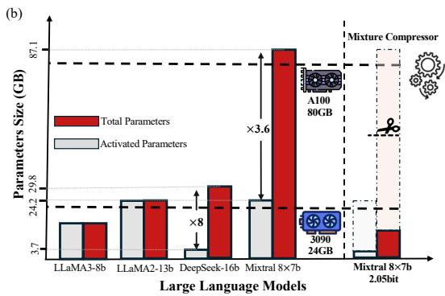

# MIXTURE COMPRESSOR FOR MIXTURE-OF-EXPERTS LLMS GAINS MORE

Wei Huang∗ 1 , Yue Liao∗ 2 4, Jianhui Liu1 , Ruifei He1 , Haoru Tan1 Shiming Zhang† 1 , Hongsheng Li2 4, Si Liu† 3 , Xiaojuan Qi† 1

1The University of Hong Kong 2The Chinese University of Hong Kong 3Beihang University 4Centre for Perceptual and Interactive Intelligence, Hong Kong

### ABSTRACT

Mixture-of-Experts large language models (MoE-LLMs) marks a significant step forward of language models, however, they encounter two critical challenges in practice: 1) expert parameters lead to considerable memory consumption and loading latency; and 2) the current activated experts are redundant, as many tokens may only require a single expert. Motivated by these issues, we investigate the MoE-LLMs and make two key observations: a) different experts exhibit varying behaviors on activation reconstruction error, routing scores, and activated frequencies, highlighting their differing importance, and b) not all tokens are equally important– only a small subset is critical. Building on these insights, we propose MC, a training-free Mixture-Compressor for MoE-LLMs, which leverages the significance of both experts and tokens to achieve an extreme compression. First, to mitigate storage and loading overheads, we introduce *Pre-Loading Mixed-Precision Quantization (PMQ)*, which formulates the adaptive bit-width allocation as a Linear Programming (LP) problem, where the objective function balances multi-factors reflecting the importance of each expert. Additionally, we develop *Online Dynamic Pruning (ODP)*, which identifies important tokens to retain and dynamically select activated experts for other tokens during inference to optimize efficiency while maintaining performance. Our MC integrates static quantization and dynamic pruning to collaboratively achieve extreme compression for MoE-LLMs with less accuracy loss, ensuring an optimal trade-off between performance and efficiency. Extensive experiments confirm the effectiveness of our approach. For instance, at 2.54 bits, MC compresses 76.6% of the model, with only a 3.8% average accuracy loss in eight commonsense benchmarks. During dynamic inference, we further reduce activated parameters by 15%, with a performance drop of less than 0.6%. Remarkably, MC even surpasses floating-point 13b dense LLMs with significantly smaller parameter sizes, suggesting that mixture compression in MoE-LLMs has the potential to outperform both comparable and larger dense LLMs. Our code is available at [https://github.com/Aaronhuang-778/MC-MoE.](https://github.com/Aaronhuang-778/MC-MoE)

## 1 INTRODUCTION

Mixture-of-Experts large language models (MoE-LLMs) [\(Muennighoff et al.,](#page-12-0) [2024;](#page-12-0) [Jiang et al.,](#page-11-0) [2024;](#page-11-0) [Dai et al.,](#page-10-0) [2024\)](#page-10-0) provide an efficient model-scaling mechanism by utilizing a sparse architecture, in which only a subset of experts is activated by router. This selective activation boosts computational efficiency and scalability by assigning experts dynamically based on the specific needs of each input. Despite reducing the number of active experts to improve inference efficiency, MoE models still face significant deployment challenges. All experts must be loaded into memory simultaneously, and typically at least two experts are activated during inference, resulting in considerable memory and computational overhead. Even an NVIDIA A100-80GB GPU cannot accommodate typical MoE models like Mixtral 8×7b [\(Jiang et al.,](#page-11-0) [2024\)](#page-11-0) (Fig. [1\(](#page-1-0)b)). The proposed challenges hinder the deployment of LLM with limited hardware resources which further promotes study on MoE-LLM compression for better deploying model-scaling paradigm.

∗Equal Contribution. † Corresponding Author

Figure 1: (a) MMLU (5-shot↑) accuracy across different open-source LLMs with various activated parameters (dot-lines denote the quantized models, solid-lines are 16-bit models). To align quantized models' parameter size with 16-bit models, we define 16bits as one parameter (e.g. 8×2-bit elements represent one parameter). (b) Comparison of total parameter size and inference activated parameter size on few open-source LLMs and compressed Mixtral 8×7b.

The primary goal of compressing MoE-LLMs is to reduce the size of expert parameters, as they dominate the memory usage [\(Li et al.,](#page-12-1) [2024\)](#page-12-1). For instance, in models like Mixtral 8 × 7b, the number of expert parameters is 33 times greater than that of the attention modules. On the other hand, recent studies [\(Chi et al.,](#page-10-1) [2022;](#page-10-1) [Lu et al.,](#page-12-2) [2024\)](#page-12-2) have shown that due to the training strategies of MoE, not all experts are equally important, which indicates that both the static experts during the pre-loading phase and the dynamic experts during online inference need to be compressed. Previous expert compression methods have typically focused on compressing a single phase, such as quantizing expert weights during the pre-loading stage [\(Li et al.,](#page-12-1) [2024\)](#page-12-1) or pruning experts during the inference stage [\(Lu et al.,](#page-12-2) [2024;](#page-12-2) [Koishekenov et al.,](#page-11-1) [2022;](#page-11-1) [Kim et al.,](#page-11-2) [2021\)](#page-11-2). Furthermore, vanilla uniform bit-width quantization and expert pruning based solely on routing scores struggle to maintain performance at extremely high compression ratios. Therefore, in this work, we are the first to explore extreme training-free mixture compression for MoE-LLMs, efficiently combining static expert quantization with dynamic expert pruning using a combination of expert importance metrics to achieve ultra-lightweight MoE-LLMs without significantly sacrificing performance.

To this end, we propose the MC, *i.e.*, Mixture-Compressor for MoE LLMs, exploring the combined benefits of expert quantization and pruning. MC consists of two phases: *Pre-Loading Mixed-Precision Quantization (PMQ)* and *Online Dynamic Pruning (ODP)*, as shown in Fig. [1\(](#page-1-0)a). In the pre-loading phase, we focus on extreme compression of the stored experts through low-bit quantization. Our empirical study reveals imbalances in activation reconstruction error, routing weights, and frequencies of activated expert (Sec. [3.2.1](#page-4-0) and Fig. [3\)](#page-4-1), which inspires the allocation of different bit-widths to each expert. However, relying solely on the routing frequencies or scores is insufficient to accurately determine the optimal bit-width, as the two distributions may not be consistent but rather the opposite [\(Li et al.,](#page-12-1) [2024\)](#page-12-1). Therefore, we developed a weighted evaluation function that considers both the frequency and scores of expert activations, as well as the associated quantization loss at different bit-widths. This function is then minimized within a Linear Programming (LP) model to determine the optimal quantization configuration. Utilizing a training-free Post-training Quantization (PTQ) approach, GPTQ [\(Frantar et al.,](#page-11-3) [2022\)](#page-11-3), *PMQ* achieves high-performance compression at extremely low bit-widths (1.5-bit∼2.5-bit), and our mixed-precision strategy is compatible with other advanced quantization techniques [\(Tseng et al.,](#page-12-3) [2024;](#page-12-3) [Chen et al.,](#page-10-2) [2024;](#page-10-2) [Shao et al.,](#page-12-4) [2023;](#page-12-4) [Egiazarian et al.,](#page-10-3) [2024;](#page-10-3) [Liao & Monz,](#page-12-5) [2024\)](#page-12-5). As for inference phase, *ODP* dynamically prunes low-confidence experts for each token based on the routing weights. Our pruning strategy follows two key principles: first, experts with significantly lower routing scores are categorized as "low confidence" and can be pruned [\(Lu et al.,](#page-12-2) [2024\)](#page-12-2). Second, to prevent attention degradation that solely relies on routing weights, we protect important tokens by considering both attention scores and feature magnitudes. Experiments show that protecting only 2% of the important tokens effectively mitigates pruning loss while maintaining nearly the same compression ratio.

The proposed mixture compression of low bit-width experts improves performance compared to uniform quantized experts or other mixed-precision strategies, even surpassing float-point (FP) models with the same number of activated parameters. Moreover, when compressing Mixtral 8 × 7b to around 8b (2.54-bit), its activated parameters amounted to only 2b, while even outperforming 16-bit LLaMA2-13b by around 8% on the MMLU (5-shot), as shown in Fig. [1\(](#page-1-0)a). Mixture compression exploits the disparities between MoE experts, for the first time enabling surpassing of smaller FP models of equivalent size under extreme compression without training. This achievement underscores the significant compression potential and practical utility of sparse MoE-LLMs.

